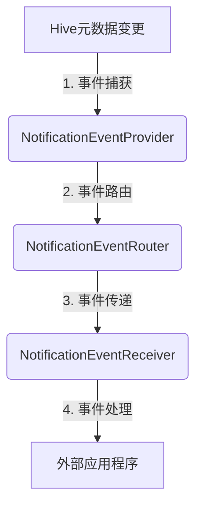

# HCatalog Notification机制原理与代码实例讲解

## 1.背景介绍

在大数据生态系统中,Apache Hive作为一种数据仓库工具,广泛应用于构建数据分析应用程序。随着数据量的不断增长,对于数据处理效率和实时性的需求也与日俱增。HCatalog作为Hive的一个重要组件,为数据提供元数据服务,并支持数据通知机制,从而实现了数据的实时处理和高效访问。

HCatalog Notification机制是HCatalog的一个核心功能,它允许客户端监听Hive元数据的变化,并在发生更改时接收通知。这种机制使得外部应用程序能够及时地获取Hive元数据的更新,从而实现了数据处理的实时性和高效性。

## 2.核心概念与联系

### 2.1 HCatalog

HCatalog是Apache Hive的一个重要组件,它提供了一个统一的元数据服务层,用于管理Hive中的表和分区。HCatalog允许不同的数据处理系统(如MapReduce、Pig、Hive等)共享相同的元数据,从而实现了数据的一致性和可重用性。

### 2.2 Notification事件

在HCatalog中,Notification事件是指对Hive元数据进行的任何更改操作,如创建表、删除表、添加分区等。这些事件会被HCatalog捕获并记录下来,供订阅者进行监听和处理。

### 2.3 Notification机制

HCatalog Notification机制是一种发布-订阅模式,它允许客户端订阅感兴趣的Notification事件。当发生相应的事件时,HCatalog会将事件信息推送给订阅者,订阅者可以根据事件信息执行相应的操作。

该机制主要包括以下几个核心组件:

1. **NotificationEventReceiver**: 用于接收和处理Notification事件。
2. **NotificationEventProvider**: 负责发布Notification事件。
3. **NotificationEventRouter**: 将事件路由到相应的订阅者。
4. **NotificationEventPollable**: 允许客户端主动轮询事件。

### 2.4 Notification事件类型

HCatalog支持以下几种Notification事件类型:

- `CREATE_DATABASE`
- `DROP_DATABASE`
- `CREATE_TABLE`
- `DROP_TABLE`
- `ADD_PARTITION`
- `DROP_PARTITION`
- `ALTER_PARTITION`
- `ALTER_TABLE`

## 3.核心算法原理具体操作步骤

HCatalog Notification机制的核心算法原理包括以下几个主要步骤:

1. **事件捕获**

   HCatalog会监听Hive元数据的变化,当发生相关事件(如创建表、删除分区等)时,会将事件信息记录下来。

2. **事件路由**

   捕获到的事件会被发送到NotificationEventRouter组件,该组件会根据事件类型和订阅信息将事件路由到相应的订阅者。

3. **事件传递**

   NotificationEventRouter会将事件信息推送给订阅了该事件的NotificationEventReceiver。

4. **事件处理**

   NotificationEventReceiver接收到事件信息后,会执行相应的处理逻辑,如更新缓存、触发下游操作等。

以下是HCatalog Notification机制的工作流程图:



## 4.数学模型和公式详细讲解举例说明

在HCatalog Notification机制中,没有直接涉及复杂的数学模型和公式。但是,为了更好地理解该机制的工作原理,我们可以使用一些简单的数学概念和公式来描述其中的一些关键点。

### 4.1 事件路由算法

假设我们有一个事件集合$E$,其中包含$n$个事件$e_1, e_2, \ldots, e_n$。每个事件$e_i$都有一个对应的事件类型$t_i$。另外,我们有一个订阅者集合$S$,其中包含$m$个订阅者$s_1, s_2, \ldots, s_m$。每个订阅者$s_j$都订阅了一个事件类型集合$T_j$。

我们的目标是将每个事件$e_i$路由到所有订阅了该事件类型$t_i$的订阅者。这个过程可以用以下公式表示:

$$
R(e_i) = \{s_j | t_i \in T_j, j = 1, 2, \ldots, m\}
$$

其中,$R(e_i)$表示订阅了事件$e_i$的订阅者集合。

例如,假设我们有三个事件$e_1, e_2, e_3$,分别对应事件类型$t_1, t_2, t_3$。另外,我们有两个订阅者$s_1, s_2$,其中$s_1$订阅了$t_1$和$t_2$,而$s_2$订阅了$t_2$和$t_3$。那么,事件路由结果如下:

- $R(e_1) = \{s_1\}$
- $R(e_2) = \{s_1, s_2\}$
- $R(e_3) = \{s_2\}$

### 4.2 事件处理时间

假设一个订阅者$s_j$需要处理$k$个事件$e_1, e_2, \ldots, e_k$,每个事件$e_i$的处理时间为$t_i$。那么,订阅者$s_j$处理所有事件所需的总时间$T_j$可以表示为:

$$
T_j = \sum_{i=1}^{k} t_i
$$

如果我们知道每个事件的处理时间分布,就可以估计订阅者处理所有事件所需的时间范围和平均时间。

## 5.项目实践: 代码实例和详细解释说明

在本节中,我们将通过一个简单的Java示例来演示如何使用HCatalog Notification机制。

### 5.1 准备工作

首先,我们需要在项目中添加HCatalog的依赖库。以Maven为例,在`pom.xml`文件中添加以下依赖项:

```xml
<dependency>
    <groupId>org.apache.hive.hcatalog</groupId>
    <artifactId>hive-hcatalog-core</artifactId>
    <version>3.1.2</version>
</dependency>
```

### 5.2 创建NotificationEventReceiver

下面是一个简单的`NotificationEventReceiver`实现,它会打印出接收到的事件信息:

```java
import org.apache.hadoop.hive.metastore.api.NotificationEventResponse;
import org.apache.hive.hcatalog.listener.NotificationEventReceiver;

public class MyNotificationEventReceiver implements NotificationEventReceiver {

    @Override
    public void onEvents(NotificationEventResponse events) {
        // 打印事件信息
        System.out.println("Received events: " + events.getEvents());
    }
}
```

### 5.3 订阅Notification事件

接下来,我们需要创建一个`HiveMetaStoreClient`实例,并使用它来订阅感兴趣的Notification事件。以下代码演示了如何订阅`CREATE_TABLE`和`DROP_TABLE`事件:

```java
import org.apache.hadoop.hive.conf.HiveConf;
import org.apache.hadoop.hive.metastore.HiveMetaStoreClient;
import org.apache.hadoop.hive.metastore.api.NotificationEventResponse;
import org.apache.thrift.TException;

import java.util.Arrays;

public class NotificationExample {

    public static void main(String[] args) throws TException {
        // 创建HiveMetaStoreClient实例
        HiveConf conf = new HiveConf();
        HiveMetaStoreClient client = new HiveMetaStoreClient(conf);

        // 创建NotificationEventReceiver实例
        MyNotificationEventReceiver receiver = new MyNotificationEventReceiver();

        // 订阅CREATE_TABLE和DROP_TABLE事件
        long lastEventId = client.getCurrentNotificationEventId().getEventId();
        NotificationEventResponse events = client.getNextNotification(lastEventId, Integer.MAX_VALUE, Arrays.asList("CREATE_TABLE", "DROP_TABLE"));

        // 处理事件
        receiver.onEvents(events);

        // 关闭HiveMetaStoreClient
        client.close();
    }
}
```

在上面的示例中,我们首先创建了一个`HiveMetaStoreClient`实例,然后创建了一个`MyNotificationEventReceiver`实例。接下来,我们使用`getNextNotification`方法订阅了`CREATE_TABLE`和`DROP_TABLE`事件。当有新事件发生时,`MyNotificationEventReceiver`的`onEvents`方法会被调用,并打印出事件信息。

### 5.4 事件轮询

除了订阅事件之外,HCatalog Notification机制还支持主动轮询事件。下面是一个示例代码,演示了如何使用`NotificationEventPollable`接口来轮询事件:

```java
import org.apache.hadoop.hive.conf.HiveConf;
import org.apache.hadoop.hive.metastore.HiveMetaStoreClient;
import org.apache.hadoop.hive.metastore.api.NotificationEventResponse;
import org.apache.thrift.TException;

import java.util.Arrays;

public class NotificationPollingExample {

    public static void main(String[] args) throws TException {
        // 创建HiveMetaStoreClient实例
        HiveConf conf = new HiveConf();
        HiveMetaStoreClient client = new HiveMetaStoreClient(conf);

        // 创建NotificationEventReceiver实例
        MyNotificationEventReceiver receiver = new MyNotificationEventReceiver();

        // 轮询CREATE_TABLE和DROP_TABLE事件
        long lastEventId = client.getCurrentNotificationEventId().getEventId();
        while (true) {
            NotificationEventResponse events = client.getNextNotification(lastEventId, Integer.MAX_VALUE, Arrays.asList("CREATE_TABLE", "DROP_TABLE"));
            if (events.getEvents().size() > 0) {
                receiver.onEvents(events);
                lastEventId = events.getEvents().get(events.getEvents().size() - 1).getEventId();
            }
            // 等待一段时间后继续轮询
            Thread.sleep(5000);
        }
    }
}
```

在这个示例中,我们使用了一个无限循环来不断地轮询`CREATE_TABLE`和`DROP_TABLE`事件。每次轮询后,如果有新事件发生,我们就会处理这些事件,并更新`lastEventId`变量以跟踪最新的事件ID。在每次轮询之间,我们会等待5秒钟。

## 6.实际应用场景

HCatalog Notification机制在大数据生态系统中有着广泛的应用场景,以下是一些典型的应用案例:

### 6.1 元数据缓存更新

在大数据应用程序中,通常需要缓存Hive元数据以提高查询性能。当元数据发生变化时,应用程序需要及时更新缓存,以确保缓存数据的一致性。HCatalog Notification机制可以用于监听元数据变更事件,并触发缓存更新操作。

### 6.2 数据湖治理

在数据湖架构中,数据治理是一个重要的环节。HCatalog Notification机制可以用于监控数据湖中的元数据变更,从而实现数据治理策略的自动化执行,如数据质量检查、数据生命周期管理等。

### 6.3 实时数据处理

对于一些实时数据处理场景,如实时数据仓库、流式处理等,需要及时获取数据变更信息,以便触发相应的数据处理流程。HCatalog Notification机制可以用于监听数据变更事件,并触发相应的实时数据处理任务。

### 6.4 数据备份和恢复

在大数据环境中,定期备份元数据和数据是一项重要的任务。HCatalog Notification机制可以用于监听元数据变更事件,从而触发增量备份操作,提高备份效率和数据一致性。

## 7.工具和资源推荐

在使用HCatalog Notification机制时,以下工具和资源可能会对您有所帮助:

### 7.1 Apache Hive

Apache Hive是一个基于Hadoop的数据仓库工具,它提供了SQL接口来查询和管理存储在Hadoop分布式文件系统(HDFS)中的数据。HCatalog是Hive的一个重要组件,因此熟悉Hive的使用对于理解HCatalog Notification机制非常有帮助。

### 7.2 HCatalog命令行工具

HCatalog提供了一个命令行工具,可以用于管理Hive元数据和执行各种操作。通过该工具,您可以方便地创建、删除和修改表和分区,以及查看Notification事件信息。

### 7.3 HCatalog Java API

HCatalog提供了一个Java API,允许您在Java应用程序中访问和操作Hive元数据。通过这个API,您可以订阅和处理Notification