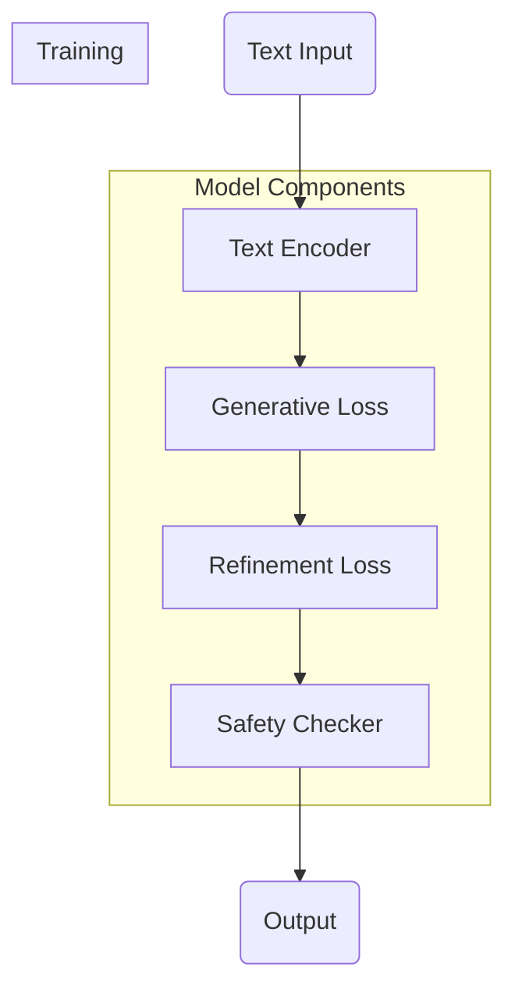

## 背景介绍

在当今的AI时代，图像生成是计算机视觉领域的一个热门话题。基于扩散模型的图像生成方法，如Imagen，已经取得了突破性进展。Imagen是多模态预训练模型，它结合了语言和视觉信息，实现了从文本描述到逼真图像的高效转换。本文将深入探讨Imagen的核心概念、算法原理、数学模型以及代码实例，同时提供实际应用和资源推荐。

## 核心概念与联系

### 多模态预训练模型

Imagen是一个多模态预训练模型，意味着它能够处理多种不同的输入模式，比如文本和图像。通过在大规模的数据集上进行无监督学习，该模型能够捕捉不同模态之间的复杂关系。

### 差分推理

Imagen采用了一种称为“差分推理”的方法来生成图像。这个过程涉及到从一个随机噪声开始，逐步添加基于文本描述的特征，直到最终生成符合文本描述的图像。

### 模型结构

Imagen的结构通常包括一个文本编码器和一个图像生成器。文本编码器负责将文本描述转化为向量表示，而图像生成器则根据这个向量生成相应的图像。

## 核心算法原理具体操作步骤

### 文本编码

文本编码器将文本描述转化为一个高维向量。这个过程通常涉及到词嵌入、文本向量化等技术，以便将自然语言文本转换为数值形式。

### 图像生成

生成器接收文本向量作为输入，通过一系列复杂的变换和操作，生成与文本描述相匹配的图像。这可能包括卷积、注意力机制、多尺度生成等高级操作。

### 训练过程

Imagen通过最小化生成图像与文本描述之间的差距来进行训练。这个差距通常通过计算生成图像和目标图像之间的损失函数来衡量，并通过反向传播算法更新模型参数。

## 数学模型和公式详细讲解举例说明

### 损失函数

生成器的目标是最小化两个关键损失：文本编码损失和生成图像损失。文本编码损失通常是通过计算文本向量和生成图像之间的距离来实现的。生成图像损失则是通过比较生成图像和目标图像之间的差异来计算的。

$$ \\text{Loss} = \\text{Text Encoding Loss} + \\text{Generated Image Loss} $$

### 反向传播

通过反向传播算法，优化器根据损失函数调整生成器和文本编码器的参数，以减小损失。

$$ \\theta_{\\text{new}} = \\theta_{\\text{old}} - \\eta \\cdot \\frac{\\partial \\text{Loss}}{\\partial \\theta} $$

其中 $\\theta$ 是模型参数，$\\eta$ 是学习率。

## 项目实践：代码实例和详细解释说明

### 准备环境

首先，确保安装必要的库，如PyTorch和Hugging Face库。

```bash
pip install torch
pip install transformers
```

### 导入相关模块

```python
import torch
from transformers import CLIPTokenizer, CLIPTextModel
from diffusers import UNet2DConditionModel, DDIMScheduler
from diffusers.utils import load_model_from_config
from diffusers.pipelines.stable_diffusion.safety_checker import StableDiffusionSafetyChecker
```

### 创建文本编码器和生成器

```python
tokenizer = CLIPTokenizer.from_pretrained(\"openai/clip-vit-base-patch32\")
text_encoder = CLIPTextModel.from_pretrained(\"openai/clip-vit-base-patch32\")

unet = UNet2DConditionModel.from_pretrained(\"stabilityai/sd-x4\")
scheduler = DDIMScheduler.from_pretrained(\"stabilityai/sd-x4\")
safety_checker = StableDiffusionSafetyChecker.from_pretrained(\"stabilityai/sd-x4\")
```

### 构建流程图



### 执行生成任务

```python
prompt = \"a photo of an astronaut riding a horse on mars\"
num_inference_steps = 50
guidance_scale = 7.5

input_ids = tokenizer(prompt, padding=\"max_length\", max_length=tokenizer.model_max_length, return_tensors=\"pt\").input_ids
text_embedding = text_encoder(input_ids)[0]

image = unet(text_embedding, num_inference_steps, guidance_scale).sample
refined_image = refine(image)
safety_check_result = safety_checker([refined_image])

final_image = refined_image if safety_check_result.is_safe else None
```

## 实际应用场景

Imagen在多个领域具有广泛的应用潜力，包括但不限于：

- **艺术创作**：艺术家可以利用Imagen生成独特的艺术作品。
- **内容生成**：广告商和内容创作者可以使用Imagen自动生成广告图像和封面图片。
- **科学研究**：研究人员可以利用Imagen生成实验场景或模拟结果的可视化。

## 工具和资源推荐

- **Hugging Face**：提供预训练模型和库，简化模型使用。
- **GitHub**：查找社区贡献的代码和教程。

## 总结：未来发展趋势与挑战

随着技术的进步和更多数据的可用性，Imagen等模型预计会变得更加高效和精确。然而，也面临着诸如数据偏见、隐私保护和伦理问题等挑战。未来的发展方向可能包括改进模型的解释性和可解释性，以及开发更强大的安全检查机制来防止潜在的滥用。

## 附录：常见问题与解答

### Q: 如何解决生成图像的质量问题？

A: 通过调整训练参数、增加数据多样性、引入更精细的损失函数或者改进模型结构，可以提高生成图像的质量。

### Q: Imagen如何处理长文本描述？

A: 使用更复杂的文本编码策略，比如双向编码或注意力机制，可以更好地处理长文本描述。

---

本文对Imagen的原理进行了详细的阐述，从核心概念到实际应用，提供了从理论到实践的全面指南。通过代码实例和数学模型的讲解，加深了对生成图像技术的理解。最后，讨论了未来的发展趋势和面临的挑战，为该领域的研究者和开发者提供了有价值的参考。