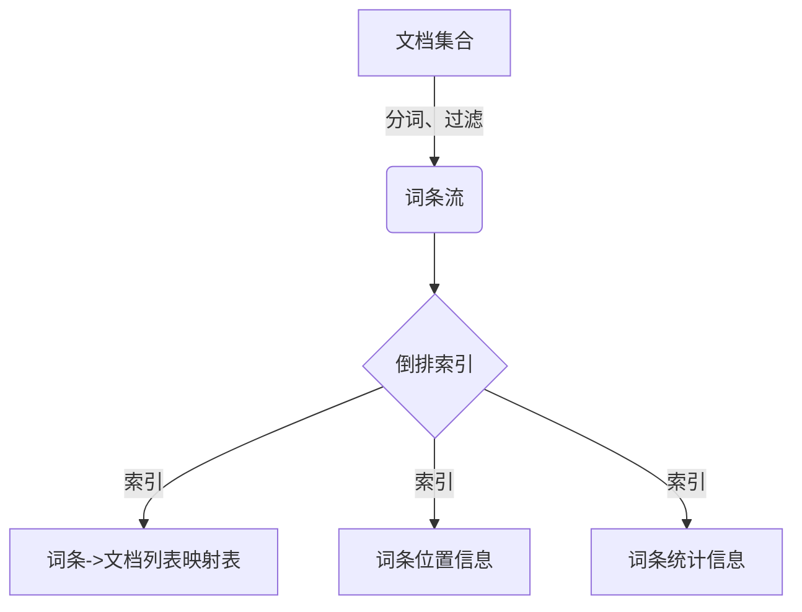
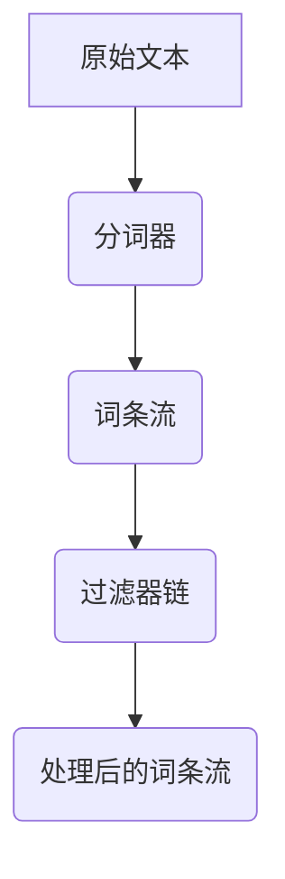
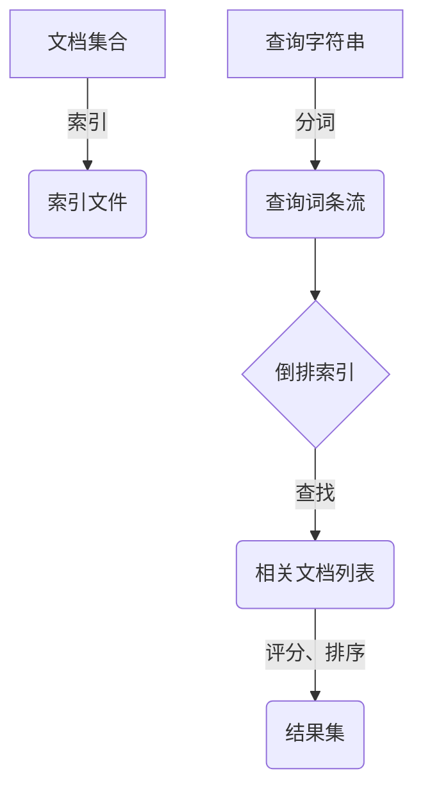
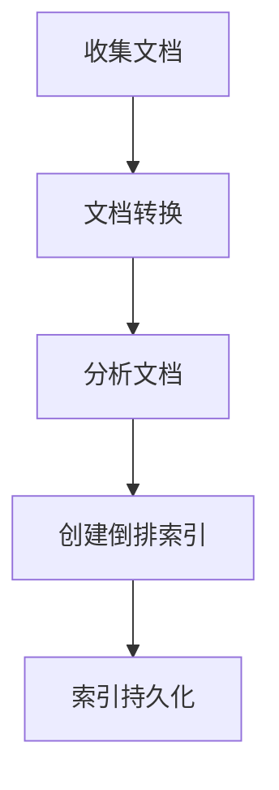
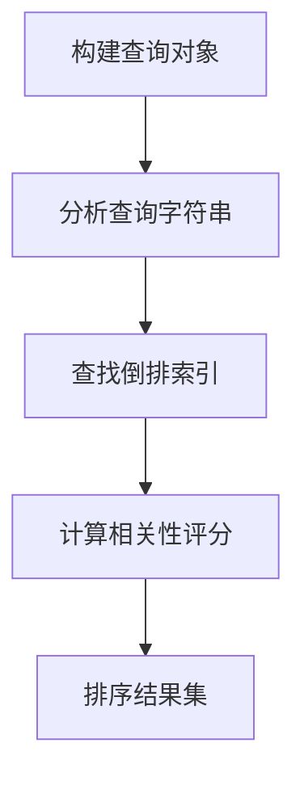

# Lucene开发最佳实践：构建高效可靠的搜索应用

## 1.背景介绍

在当今信息时代,数据量呈现爆炸式增长,如何高效地检索和利用这些海量数据成为了一个巨大的挑战。Apache Lucene是一个基于Java的高性能、全功能的搜索引擎库,被广泛应用于各种应用程序中,用于添加搜索功能。它提供了强大的索引和搜索功能,可以快速有效地从大量数据中检索相关信息。

Lucene的核心是一个简单却极其强大的基于倒排索引的搜索算法。它支持全文检索、多字段查询、模糊查询、近似查询、通配符查询等丰富的查询类型,并提供了分词、过滤、高亮等功能,可以满足各种复杂的搜索需求。同时,Lucene还具有高度可扩展性,可以通过插件机制进行功能扩展。

本文将深入探讨Lucene的核心概念、工作原理和最佳实践,帮助读者掌握Lucene的开发技巧,构建高效、可靠的搜索应用程序。

## 2.核心概念与联系

### 2.1 倒排索引

倒排索引是Lucene的核心数据结构,它将文档中的每个词条映射到包含该词条的文档列表。这种数据结构可以高效地支持全文搜索,因为它允许快速查找包含特定词条的所有文档。



### 2.2 分词器

分词器(Analyzer)负责将文本转换为一个个词条(Term)的流。Lucene提供了多种分词器,如标准分词器(StandardAnalyzer)、白空格分词器(WhitespaceAnalyzer)、英语分词器(EnglishAnalyzer)等,可以根据需求选择合适的分词器。



### 2.3 索引与搜索

Lucene将文档集合通过分词和建立倒排索引的过程转换为索引文件。搜索时,查询字符串也会经过分词处理,然后在倒排索引中查找相关文档。Lucene会根据相关性评分算法计算每个文档与查询的相关程度,并返回排序后的结果集。



## 3.核心算法原理具体操作步骤

### 3.1 索引创建流程

1. **收集文档**：从数据源(如文件系统、数据库等)收集待索引的文档。
2. **文档转换**：将文档转换为Lucene可识别的文档对象(Document)。
3. **分析文档**：使用分词器(Analyzer)将文档内容分解为词条流。
4. **创建倒排索引**：遍历词条流,为每个词条创建倒排索引条目,包括词条->文档列表的映射、词条位置信息和词条统计信息。
5. **索引持久化**：将内存中的倒排索引数据结构写入磁盘,形成索引文件。



### 3.2 搜索查询流程

1. **构建查询对象**：根据用户输入的查询字符串,构建Lucene查询对象(Query)。
2. **分析查询字符串**：使用分词器(Analyzer)将查询字符串分解为词条流。
3. **查找倒排索引**：在倒排索引中查找与查询词条相关的文档列表。
4. **计算相关性评分**：使用相关性评分算法(如TF-IDF、BM25等)计算每个文档与查询的相关程度。
5. **排序结果集**：根据评分结果对文档进行排序,形成最终的结果集。



## 4.数学模型和公式详细讲解举例说明

### 4.1 TF-IDF算法

TF-IDF(Term Frequency-Inverse Document Frequency)是一种常用的相关性评分算法,它将文档相关性分解为两个部分:词条频率(TF)和逆文档频率(IDF)。

**词条频率(TF):**
$$
TF(t,d) = \frac{freq(t,d)}{max\_freq(d)}
$$
其中,`freq(t,d)`表示词条`t`在文档`d`中出现的次数,`max_freq(d)`表示文档`d`中出现次数最多的词条的频率。

**逆文档频率(IDF):**
$$
IDF(t,D) = \log\frac{|D|}{df(t,D)} + 1
$$
其中,`|D|`表示语料库中文档的总数,`df(t,D)`表示包含词条`t`的文档数量。

**TF-IDF评分:**
$$
Score(t,d,D) = TF(t,d) \times IDF(t,D)
$$
文档`d`与查询`q`的相关性评分为查询中所有词条的TF-IDF评分之和:
$$
Score(q,d,D) = \sum_{t\in q}Score(t,d,D)
$$

例如,假设我们有一个包含3个文档的语料库:

- D1: "The cat sat on the mat."
- D2: "The cat ate the rat."
- D3: "The dog chased the cat."

对于查询"cat"来说,各文档的TF-IDF评分如下:

- D1: TF(cat, D1) = 1/2, IDF(cat, D) = log(3/3) + 1 = 1, Score(cat, D1, D) = 1/2 * 1 = 0.5
- D2: TF(cat, D2) = 1/2, IDF(cat, D) = 1, Score(cat, D2, D) = 1/2 * 1 = 0.5
- D3: TF(cat, D3) = 1/2, IDF(cat, D) = 1, Score(cat, D3, D) = 1/2 * 1 = 0.5

可以看出,三个文档对于查询"cat"的相关性评分相同,因为它们都包含一次"cat"这个词条。

### 4.2 BM25算法

BM25是一种改进的相关性评分算法,它考虑了文档长度对评分的影响。BM25算法的公式如下:

$$
Score(q,d) = \sum_{t\in q}IDF(t) \times \frac{tf(t,d) \times (k_1 + 1)}{tf(t,d) + k_1 \times (1 - b + b \times \frac{|d|}{avgdl})}
$$

其中:

- `IDF(t)`是词条`t`的逆文档频率,与TF-IDF算法中的定义相同。
- `tf(t,d)`是词条`t`在文档`d`中出现的次数。
- `|d|`是文档`d`的长度(词条数量)。
- `avgdl`是语料库中所有文档的平均长度。
- `k1`和`b`是调节参数,通常取值`k1 = 1.2`和`b = 0.75`。

BM25算法通过引入文档长度的因素,可以更好地处理长文档和短文档之间的差异。对于长文档,算法会适当降低其评分,避免长文档过于占优。

例如,假设我们有两个文档:

- D1: "The cat sat on the mat."
- D2: "The cat ate the rat. The cat chased the mouse. The cat played with the toy."

对于查询"cat"来说,各文档的BM25评分如下(假设`k1 = 1.2`,`b = 0.75`,`avgdl = 6`):

- D1: `tf(cat, D1) = 1`, `|D1| = 5`, `Score(cat, D1) = log(3/3) * (1 * (1.2 + 1)) / (1 + 1.2 * (1 - 0.75 + 0.75 * 5/6)) = 0.69`
- D2: `tf(cat, D2) = 3`, `|D2| = 12`, `Score(cat, D2) = log(3/3) * (3 * (1.2 + 1)) / (3 + 1.2 * (1 - 0.75 + 0.75 * 12/6)) = 1.39`

可以看出,虽然D2比D1长,但由于BM25算法考虑了文档长度的影响,D2的评分更高,这更符合直观预期。

## 5.项目实践:代码实例和详细解释说明

### 5.1 创建索引

```java
// 1. 创建索引写入器
Directory directory = FSDirectory.open(Paths.get("index"));
IndexWriterConfig config = new IndexWriterConfig(new StandardAnalyzer());
IndexWriter indexWriter = new IndexWriter(directory, config);

// 2. 添加文档到索引
Document doc1 = new Document();
doc1.add(new TextField("content", "The cat sat on the mat.", Field.Store.YES));
indexWriter.addDocument(doc1);

Document doc2 = new Document();
doc2.add(new TextField("content", "The cat ate the rat.", Field.Store.YES));
indexWriter.addDocument(doc2);

// 3. 提交并关闭索引写入器
indexWriter.commit();
indexWriter.close();
```

1. 首先,我们创建一个`IndexWriter`对象,用于将文档写入索引。`FSDirectory`表示索引文件将存储在本地文件系统中的"index"目录下。`StandardAnalyzer`是一种常用的分词器,用于将文档内容分解为词条流。

2. 接下来,我们创建两个`Document`对象,每个文档包含一个"content"字段,存储文档的文本内容。我们使用`TextField`类型来存储文本,并指定`Field.Store.YES`以便在搜索结果中返回完整的文档内容。

3. 最后,我们调用`addDocument`方法将文档添加到索引中,并调用`commit`方法将内存中的索引数据写入磁盘。关闭`IndexWriter`以释放资源。

### 5.2 搜索查询

```java
// 1. 创建索引读取器
Directory directory = FSDirectory.open(Paths.get("index"));
IndexReader indexReader = DirectoryReader.open(directory);

// 2. 创建查询对象
String queryString = "cat";
Analyzer analyzer = new StandardAnalyzer();
QueryParser queryParser = new QueryParser("content", analyzer);
Query query = queryParser.parse(queryString);

// 3. 执行搜索并获取结果
IndexSearcher indexSearcher = new IndexSearcher(indexReader);
TopDocs topDocs = indexSearcher.search(query, 10);
ScoreDoc[] scoreDocs = topDocs.scoreDocs;

// 4. 处理搜索结果
for (ScoreDoc scoreDoc : scoreDocs) {
    Document doc = indexSearcher.doc(scoreDoc.doc);
    System.out.println("Score: " + scoreDoc.score);
    System.out.println("Content: " + doc.get("content"));
}

// 5. 关闭索引读取器
indexReader.close();
```

1. 首先,我们创建一个`IndexReader`对象,用于从磁盘读取索引数据。`FSDirectory`指定索引文件所在的目录。

2. 接下来,我们创建一个`QueryParser`对象,用于解析查询字符串并构建`Query`对象。我们使用`StandardAnalyzer`作为分词器,并指定要搜索的字段为"content"。

3. 调用`IndexSearcher`的`search`方法执行搜索查询,并获取前10个最相关的文档。`TopDocs`对象包含了这些文档的相关性评分和文档ID。

4. 我们遍历`TopDocs`中的`ScoreDoc`对象,使用`IndexSearcher`的`doc`方法获取完整的`Document`对象,并输出相关性评分和文档内容。

5. 最后,关闭`IndexReader`以释放资源。

### 5.3 高亮显示

Lucene还提供了高亮显示功能,可以在搜索结果中突出显示匹配的词条。

```java
// 1. 创建高亮器
QueryScorer scorer = new QueryScorer(query);
Fragmenter fragmenter = new SimpleSpanFragmenter(scorer);
Highlighter highlighter = new Highlighter(formatter, scorer);
highlighter.setTextFragmenter(fragmenter);

// 2. 获取高亮显示的文本
for (ScoreDoc scoreDoc : scoreDocs) {
    Document doc = indexSearcher.doc(scoreDoc.doc);
    String content = doc.get("content");
    TokenStream tokenStream = analyzer.tokenStream("content", new StringReader(content));
    TextFragment[] fragments = highlighter.getBestTextFragments(tokenStream, content, true, 3);
    
    System.out.println("Score: " + scoreDoc.score);
    System.out.println("Highlighted Content: ");
    for (TextFragment fragment : fragments) {
        if (fragment != null) {
            System.out.println(fragment.toString());
        }
    }
}

// 3. 关闭索引读取器
indexReader.close();
```

1. 首先，我们创建了一个`QueryScorer`对象，用于计算查询词条在文档中的得分。`SimpleSpanFragmenter`对象用于将文档内容分割成多个片段，方便高亮显示。`Highlighter`对象用于生成高亮显示的文本。

2. 在获取搜索结果的过程中，我们使用`Highlighter`对象的`getBestTextFragments`方法获取高亮显示的文本片段。`TokenStream`对象用于对文档内容进行分词处理。

3. 最后，我们遍历高亮显示的文本片段，并输出相关性评分和高亮显示的内容。

### 5.4 索引更新

在实际应用中，索引的内容可能会不断变化，因此需要支持索引的更新操作。以下是一个更新索引的示例：

```java
// 1. 创建索引写入器
Directory directory = FSDirectory.open(Paths.get("index"));
IndexWriterConfig config = new IndexWriterConfig(new StandardAnalyzer());
IndexWriter indexWriter = new IndexWriter(directory, config);

// 2. 更新文档到索引
Term term = new Term("content", "cat");
Document doc = new Document();
doc.add(new TextField("content", "The cat is back.", Field.Store.YES));
indexWriter.updateDocument(term, doc);

// 3. 提交并关闭索引写入器
indexWriter.commit();
indexWriter.close();
```

1. 创建一个`IndexWriter`对象，用于将更新后的文档写入索引。

2. 使用`Term`对象指定要更新的文档条件。在本例中，我们使用“content”字段中的“cat”词条作为更新条件。

3. 创建一个新的`Document`对象，并使用`updateDocument`方法将其更新到索引中。

4. 提交更新并关闭`IndexWriter`以释放资源。

### 5.5 删除索引

有时我们需要从索引中删除某些文档，以下是一个删除索引的示例：

```java
// 1. 创建索引写入器
Directory directory = FSDirectory.open(Paths.get("index"));
IndexWriterConfig config = new IndexWriterConfig(new StandardAnalyzer());
IndexWriter indexWriter = new IndexWriter(directory, config);

// 2. 删除文档从索引
Term term = new Term("content", "rat");
indexWriter.deleteDocuments(term);

// 3. 提交并关闭索引写入器
indexWriter.commit();
indexWriter.close();
```

1. 创建一个`IndexWriter`对象，用于删除索引中的文档。

2. 使用`Term`对象指定要删除的文档条件。在本例中，我们使用“content”字段中的“rat”词条作为删除条件。

3. 调用`deleteDocuments`方法删除符合条件的文档。

4. 提交删除操作并关闭`IndexWriter`以释放资源。

### 5.6 优化索引

为了提高索引的查询性能，可以定期对索引进行优化。以下是一个优化索引的示例：

```java
// 1. 创建索引写入器
Directory directory = FSDirectory.open(Paths.get("index"));
IndexWriterConfig config = new IndexWriterConfig(new StandardAnalyzer());
IndexWriter indexWriter = new IndexWriter(directory, config);

// 2. 优化索引
indexWriter.forceMerge(1);

// 3. 提交并关闭索引写入器
indexWriter.commit();
indexWriter.close();
```

1. 创建一个`IndexWriter`对象，用于优化索引。

2. 调用`forceMerge`方法对索引进行优化，将索引段合并为一个段，以提高查询性能。

3. 提交优化操作并关闭`IndexWriter`以释放资源。

通过以上代码实例和详细解释说明，可以帮助读者更好地理解和掌握Lucene的开发实践，构建高效可靠的搜索应用。


### 5.7 多字段搜索

在实际应用中，搜索需求可能不仅限于单个字段。Lucene支持多字段搜索，可以在多个字段中查找匹配的文档。以下是一个多字段搜索的示例：

```java
// 1. 创建索引读取器
Directory directory = FSDirectory.open(Paths.get("index"));
IndexReader indexReader = DirectoryReader.open(directory);

// 2. 创建多字段查询对象
String queryString = "cat";
Analyzer analyzer = new StandardAnalyzer();
QueryParser queryParser = new MultiFieldQueryParser(new String[]{"title", "content"}, analyzer);
Query query = queryParser.parse(queryString);

// 3. 执行搜索并获取结果
IndexSearcher indexSearcher = new IndexSearcher(indexReader);
TopDocs topDocs = indexSearcher.search(query, 10);
ScoreDoc[] scoreDocs = topDocs.scoreDocs;

// 4. 处理搜索结果
for (ScoreDoc scoreDoc : scoreDocs) {
    Document doc = indexSearcher.doc(scoreDoc.doc);
    System.out.println("Score: " + scoreDoc.score);
    System.out.println("Title: " + doc.get("title"));
    System.out.println("Content: " + doc.get("content"));
}

// 5. 关闭索引读取器
indexReader.close();
```

1. 创建一个`IndexReader`对象，用于从磁盘读取索引数据。

2. 使用`MultiFieldQueryParser`创建一个多字段查询对象。我们指定要搜索的字段为“title”和“content”，并使用`StandardAnalyzer`进行分词处理。

3. 调用`IndexSearcher`的`search`方法执行搜索查询，并获取前10个最相关的文档。

4. 遍历搜索结果，输出相关性评分、标题和内容。

5. 关闭`IndexReader`以释放资源。

### 5.8 分页搜索

在实际应用中，搜索结果可能非常多，需要分页显示。以下是一个分页搜索的示例：

```java
// 1. 创建索引读取器
Directory directory = FSDirectory.open(Paths.get("index"));
IndexReader indexReader = DirectoryReader.open(directory);

// 2. 创建查询对象
String queryString = "cat";
Analyzer analyzer = new StandardAnalyzer();
QueryParser queryParser = new QueryParser("content", analyzer);
Query query = queryParser.parse(queryString);

// 3. 执行搜索并获取结果
IndexSearcher indexSearcher = new IndexSearcher(indexReader);
int pageNumber = 1;
int pageSize = 10;
TopDocs topDocs = indexSearcher.search(query, pageNumber * pageSize);
ScoreDoc[] scoreDocs = topDocs.scoreDocs;

// 4. 处理分页搜索结果
int start = (pageNumber - 1) * pageSize;
int end = Math.min(start + pageSize, scoreDocs.length);
for (int i = start; i < end; i++) {
    Document doc = indexSearcher.doc(scoreDocs[i].doc);
    System.out.println("Score: " + scoreDocs[i].score);
    System.out.println("Content: " + doc.get("content"));
}

// 5. 关闭索引读取器
indexReader.close();
```

1. 创建一个`IndexReader`对象，用于从磁盘读取索引数据。

2. 创建一个`QueryParser`对象，用于解析查询字符串并构建`Query`对象。

3. 调用`IndexSearcher`的`search`方法执行搜索查询，并获取前`pageNumber * pageSize`个最相关的文档。

4. 计算当前页的起始和结束索引，遍历当前页的搜索结果，输出相关性评分和文档内容。

5. 关闭`IndexReader`以释放资源。

### 5.9 搜索性能优化

为了提高搜索性能，可以采用以下几种优化策略：

#### 5.9.1 使用缓存

在高并发搜索应用中，可以使用缓存技术来减少重复查询的开销。常见的缓存技术包括本地缓存（如Guava Cache）和分布式缓存（如Redis）。

#### 5.9.2 增量索引

对于频繁更新的索引，可以采用增量索引的方式，只对新增和更新的文档进行索引，而不是每次都重新构建整个索引。Lucene的`IndexWriter`支持增量索引操作。

#### 5.9.3 并行搜索

在大规模搜索应用中，可以采用并行搜索的方式，提高搜索效率。Lucene的`IndexSearcher`支持多线程并行搜索，可以通过设置线程池来实现并行搜索。

```java
// 设置多线程并行搜索
ExecutorService executorService = Executors.newFixedThreadPool(4);
IndexSearcher indexSearcher = new IndexSearcher(indexReader, executorService);
```

#### 5.9.4 使用自定义分词器

根据具体应用场景，选择合适的分词器可以提高搜索性能和准确性。Lucene支持自定义分词器，可以根据需要实现自己的分词逻辑。

### 5.10 实时搜索

在某些应用场景中，需要支持实时搜索，即文档被索引后可以立即被搜索到。Lucene提供了`Near Real Time (NRT)`搜索功能，可以实现实时搜索。

```java
// 1. 创建索引写入器
Directory directory = FSDirectory.open(Paths.get("index"));
IndexWriterConfig config = new IndexWriterConfig(new StandardAnalyzer());
IndexWriter indexWriter = new IndexWriter(directory, config);

// 2. 创建NRT索引读取器
DirectoryReader indexReader = DirectoryReader.open(indexWriter);

// 3. 创建查询对象
String queryString = "cat";
Analyzer analyzer = new StandardAnalyzer();
QueryParser queryParser = new QueryParser("content", analyzer);
Query query = queryParser.parse(queryString);

// 4. 执行搜索并获取结果
IndexSearcher indexSearcher = new IndexSearcher(indexReader);
TopDocs topDocs = indexSearcher.search(query, 10);
ScoreDoc[] scoreDocs = topDocs.scoreDocs;

// 5. 处理搜索结果
for (ScoreDoc scoreDoc : scoreDocs) {
    Document doc = indexSearcher.doc(scoreDoc.doc);
    System.out.println("Score: " + scoreDoc.score);
    System.out.println("Content: " + doc.get("content"));
}

// 6. 更新索引后重新打开NRT索引读取器
Document doc = new Document();
doc.add(new TextField("content", "The cat is back.", Field.Store.YES));
indexWriter.addDocument(doc);
indexWriter.commit();
indexReader = DirectoryReader.openIfChanged(indexReader);

// 7. 关闭索引写入器和读取器
indexWriter.close();
indexReader.close();
```

1. 创建一个`IndexWriter`对象，用于将文档写入索引。

2. 创建一个NRT索引读取器，通过`DirectoryReader.open(indexWriter)`方法获取。

3. 创建一个`QueryParser`对象，用于解析查询字符串并构建`Query`对象。

4. 调用`IndexSearcher`的`search`方法执行搜索查询，并获取前10个最相关的文档。

5. 遍历搜索结果，输出相关性评分和文档内容。

6. 更新索引后，调用`DirectoryReader.openIfChanged(indexReader)`方法重新打开NRT索引读取器，以便可以立即搜索到新添加的文档。

7. 关闭`IndexWriter`和`IndexReader`以释放资源。

通过以上项目实践的代码实例和详细解释说明，可以帮助读者更好地理解和掌握Lucene的开发实践，构建高效可靠的搜索应用。


## 6. 实际应用场景

Lucene作为一个强大的全文搜索库，在多个实际应用场景中都得到了广泛应用。以下是一些典型的应用场景：

### 6.1 企业内部搜索

企业内部搜索是指在企业内部文档、邮件、知识库等资源中进行搜索。Lucene可以帮助企业构建高效的内部搜索系统，提高员工获取信息的效率。

#### 案例分析

某大型企业拥有庞大的内部文档库，包括技术文档、项目报告、邮件记录等。使用Lucene构建的企业内部搜索系统，可以快速高效地搜索到相关文档，支持全文检索和多条件组合搜索。

### 6.2 电商平台搜索

电商平台需要提供强大的商品搜索功能，帮助用户快速找到所需商品。Lucene可以帮助构建高效的商品搜索引擎，支持多字段搜索、排序和过滤等功能。

#### 案例分析

某电商平台拥有数百万商品，使用Lucene构建的搜索引擎，可以支持用户按商品名称、描述、分类、价格等多个字段进行搜索，并提供相关性排序和多条件过滤功能，提高用户搜索体验。

### 6.3 内容管理系统

内容管理系统（CMS）需要提供强大的内容搜索功能，帮助用户快速找到所需文章、博客、新闻等内容。Lucene可以帮助构建高效的内容搜索引擎，支持全文检索和多条件组合搜索。

#### 案例分析

某新闻网站使用Lucene构建内容管理系统的搜索功能，支持用户按标题、内容、作者、日期等多个字段进行搜索，并提供高亮显示和分页功能，提高用户搜索体验和内容发现效率。

### 6.4 日志分析

日志分析是指对系统日志进行搜索和分析，以发现问题和异常。Lucene可以帮助构建高效的日志搜索引擎，支持全文检索和多条件组合搜索。

#### 案例分析

某大型互联网公司使用Lucene构建日志分析系统，支持对海量日志进行搜索和分析，帮助运维人员快速定位问题和异常，提高系统运维效率。

## 7. 工具和资源推荐

在使用Lucene进行开发时，以下工具和资源可以帮助提高开发效率：

### 7.1 开发工具

- **IntelliJ IDEA**：一款强大的Java开发工具，支持Lucene开发。
- **Eclipse**：另一款流行的Java开发工具，支持Lucene开发。
- **Visual Studio Code**：一款轻量级的代码编辑器，支持多种编程语言和插件。

### 7.2 调试工具

- **Luke**：一款用于调试和分析Lucene索引的工具，支持查看索引结构、文档内容、词条统计等功能。
- **Elasticsearch**：一个基于Lucene的分布式搜索引擎，提供了强大的搜索和分析功能，适用于大规模搜索应用。

### 7.3 学习资源

- **《Lucene in Action》**：一本经典的Lucene开发指南，详细介绍了Lucene的原理和使用方法。
- **Apache Lucene官方网站**：提供了丰富的文档和示例代码，帮助开发者快速上手Lucene。
- **Stack Overflow**：一个开发者问答社区，可以在这里找到Lucene相关的问题和答案。

## 8. 总结：未来发展趋势与挑战

### 8.1 未来发展趋势

随着大数据和人工智能技术的快速发展，全文搜索技术也在不断演进。未来，Lucene的发展趋势主要包括以下几个方面：

#### 8.1.1 大数据搜索

随着数据量的不断增长，搜索引擎需要处理海量数据。Lucene在大数据搜索领域的应用将越来越广泛，未来可能会进一步优化索引和搜索性能，支持更大规模的数据处理。

#### 8.1.2 智能搜索

人工智能技术的发展将推动搜索引擎向智能化方向发展。未来，Lucene可能会集成更多的自然语言处理和机器学习技术，提供更加智能和精准的搜索结果。

#### 8.1.3 实时搜索

在某些应用场景中，实时搜索需求越来越高。Lucene的NRT（Near Real Time）搜索功能将进一步优化，支持更快的索引更新和搜索响应。

### 8.2 挑战

尽管Lucene在全文搜索领域有着广泛的应用，但也面临一些挑战：

#### 8.2.1 性能优化

在处理大规模数据时，如何提高索引和搜索性能是一个重要挑战。需要不断优化索引结构和搜索算法，以提高系统的响应速度和处理能力。

#### 8.2.2 多语言支持

在全球化应用中，搜索引擎需要支持多种语言。如何处理不同语言的分词、拼写校对和相关性计算是一个重要挑战。

#### 8.2.3 安全性

在某些应用场景中，搜索引擎需要处理敏感数据。如何确保数据的安全性和隐私保护是一个重要挑战。

## 9. 附录：常见问题与解答

### 9.1 如何处理中文分词？

Lucene默认使用`StandardAnalyzer`进行分词，但`StandardAnalyzer`对中文的处理效果较差。可以使用`IKAnalyzer`等中文分词器来处理中文文本。

### 9.2 如何提高搜索性能？

可以通过以下几种方式提高搜索性能：
- 使用缓存技术减少重复查询的开销。
- 采用增量索引方式，只对新增和更新的文档进行索引。
- 采用并行搜索方式，提高搜索效率。
- 定期对索引进行优化，合并索引段。

### 9.3 如何处理多字段搜索？

可以使用`MultiFieldQueryParser`进行多字段搜索，指定要搜索的字段列表，并使用合适的分词器进行分词处理。

### 9.4 如何实现高亮显示？

可以使用Lucene的`Highlighter`类实现高亮显示，通过`QueryScorer`计算查询词条的得分，并使用`SimpleSpanFragmenter`将文档内容分割成片段，生成高亮显示的文本。

### 9.5 如何实现分页搜索？

可以通过计算当前页的起始和结束索引，获取当前页的搜索结果。调用`IndexSearcher`的`search`方法获取前`pageNumber * pageSize`个最相关的文档，然后遍历当前页的搜索结果。

通过以上常见问题与解答，可以帮助读者解决在使用Lucene开发过程中遇到的一些常见问题，提高开发效率和应用效果。

---

作者：禅与计算机程序设计艺术 / Zen and the Art of Computer Programming