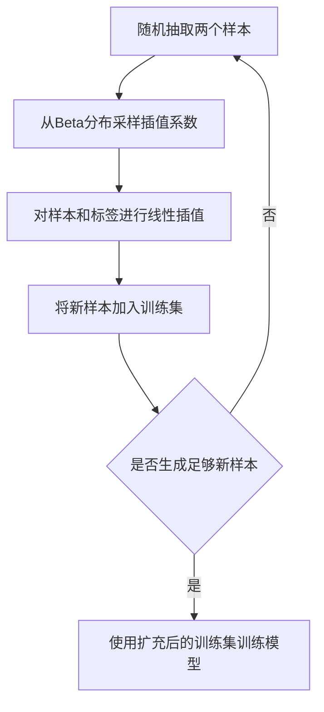

# Mixup原理与代码实例讲解

## 1.背景介绍

### 1.1 深度学习中的过拟合问题

深度学习模型在训练过程中经常会遇到过拟合(Overfitting)的问题,即模型在训练集上表现很好,但在测试集上泛化能力较差。过拟合通常是由于模型复杂度过高、训练数据不足等原因导致的。

### 1.2 数据增强技术

为了缓解过拟合问题,研究者们提出了各种数据增强(Data Augmentation)技术。传统的数据增强方法有旋转、平移、缩放、裁剪、颜色变换等,这些方法在一定程度上可以扩充训练集,提高模型的泛化能力。但它们都是对单个样本进行变换,没有考虑到样本之间的关联性。

### 1.3 Mixup的提出

在此背景下,2017年,来自日本理化学研究所和东京大学的研究者提出了Mixup[1]数据增强方法。Mixup是一种简单而非常有效的正则化方法,通过对样本及其标签进行线性插值,生成新的训练样本,从而提高模型的泛化能力和鲁棒性。

## 2.核心概念与联系

### 2.1 线性插值

Mixup的核心思想是对两个样本及其标签进行线性插值(Linear Interpolation),生成新的训练样本。设原始样本为$(x_i,y_i)$和$(x_j,y_j)$,Mixup生成的新样本为:

$$(\tilde{x},\tilde{y}) = (\lambda x_i + (1-\lambda)x_j, \lambda y_i + (1-\lambda)y_j)$$

其中$\lambda \in [0,1]$为插值系数,服从Beta分布:$\lambda \sim Beta(\alpha,\alpha), \alpha \in (0,\infty)$。

### 2.2 Beta分布

Beta分布是一种定义在(0,1)区间上的连续概率分布,有两个形状参数$\alpha$和$\beta$,概率密度函数为:

$$f(x;\alpha,\beta) = \frac{1}{B(\alpha,\beta)}x^{\alpha-1}(1-x)^{\beta-1}$$

其中$B(\alpha,\beta)$为Beta函数:

$$B(\alpha,\beta) = \int_0^1 x^{\alpha-1}(1-x)^{\beta-1}dx$$

当$\alpha=\beta=1$时,Beta分布退化为均匀分布。Mixup中通常取$\alpha=\beta$,控制生成样本的插值强度。

### 2.3 正则化

正则化是一类降低模型复杂度、防止过拟合的技术。常见的正则化方法有L1/L2正则化、Dropout、早停等。Mixup可以看作是一种数据层面的正则化方法,通过生成线性插值样本,使得模型学习到更加平滑的决策边界,提高泛化性能。

## 3.核心算法原理具体操作步骤

Mixup算法可以分为以下几个步骤:

1. 从训练集中随机抽取两个样本$(x_i,y_i)$和$(x_j,y_j)$;
2. 从Beta分布中采样插值系数$\lambda \sim Beta(\alpha,\alpha)$;
3. 对两个样本及其标签进行线性插值,生成新样本$(\tilde{x},\tilde{y}) = (\lambda x_i + (1-\lambda)x_j, \lambda y_i + (1-\lambda)y_j)$;
4. 将新样本$(\tilde{x},\tilde{y})$加入训练集;
5. 重复步骤1-4,直到生成足够的新样本;
6. 使用扩充后的训练集对模型进行训练。

下面是Mixup算法的流程图:



## 4.数学模型和公式详细讲解举例说明

Mixup可以从数学角度进行分析。设原始样本$(x_i,y_i) \sim P$,其中$P$为真实数据分布。Mixup生成的新样本$(\tilde{x},\tilde{y})$服从分布$\tilde{P}$:

$$\tilde{P} = \mathbb{E}_{(x_i,y_i),(x_j,y_j) \sim P, \lambda \sim Beta(\alpha,\alpha)}[(\lambda x_i + (1-\lambda)x_j, \lambda y_i + (1-\lambda)y_j)]$$

可以证明,当$\alpha \rightarrow 0$时,$\tilde{P} \rightarrow P$;当$\alpha \rightarrow \infty$时,$\tilde{P}$退化为$P$的均值。因此,$\alpha$控制了生成样本与原始样本的偏离程度。

举例来说,假设有两张图片,一张是猫,标签为[1,0],另一张是狗,标签为[0,1]。取$\alpha=0.2$,从Beta分布中采样得到$\lambda=0.3$,则Mixup生成的新样本为:

$$\tilde{x} = 0.3 \times \text{猫图} + 0.7 \times \text{狗图}$$
$$\tilde{y} = 0.3 \times [1,0] + 0.7 \times [0,1] = [0.3,0.7]$$

可以看出,新样本是猫和狗的混合,标签也在[1,0]和[0,1]之间进行插值。这种"软标签"有助于模型学习更加平滑的决策边界。

## 5.项目实践：代码实例和详细解释说明

下面是使用PyTorch实现Mixup的示例代码:

```python
import numpy as np
import torch

def mixup_data(x, y, alpha=1.0):
    '''Returns mixed inputs, pairs of targets, and lambda'''
    if alpha > 0:
        lam = np.random.beta(alpha, alpha)
    else:
        lam = 1

    batch_size = x.size()[0]
    index = torch.randperm(batch_size)

    mixed_x = lam * x + (1 - lam) * x[index, :]
    y_a, y_b = y, y[index]
    return mixed_x, y_a, y_b, lam

def mixup_criterion(criterion, pred, y_a, y_b, lam):
    return lam * criterion(pred, y_a) + (1 - lam) * criterion(pred, y_b)

# 训练代码
for inputs, targets in train_loader:
    inputs, targets = inputs.cuda(), targets.cuda()
    
    # Mixup
    inputs, targets_a, targets_b, lam = mixup_data(inputs, targets, alpha)
    
    # 前向传播
    outputs = model(inputs)
    
    # 计算Mixup损失
    loss = mixup_criterion(criterion, outputs, targets_a, targets_b, lam)
    
    # 反向传播和优化
    optimizer.zero_grad()
    loss.backward()
    optimizer.step()
```

代码解释:

- `mixup_data`函数接受输入样本`x`、标签`y`和超参数`alpha`,从Beta分布中采样插值系数`lam`,然后对样本和标签进行线性插值,返回混合后的样本`mixed_x`、两个标签`y_a`和`y_b`以及插值系数`lam`。
- `mixup_criterion`函数接受原始的损失函数`criterion`、模型输出`pred`、两个标签`y_a`和`y_b`以及插值系数`lam`,计算Mixup损失。
- 在训练循环中,先对输入样本和标签进行Mixup,然后前向传播得到模型输出,再用`mixup_criterion`计算Mixup损失,最后反向传播和优化参数。

可以看出,使用Mixup非常简单,只需在原有的训练代码中插入几行Mixup的操作即可。

## 6.实际应用场景

Mixup在图像分类、语音识别、自然语言处理等领域都取得了很好的效果。一些实际应用案例如下:

- 在ImageNet图像分类任务上,使用Mixup可以将Top-1错误率降低1-2个百分点[1]。
- 在谷歌语音指令数据集上,Mixup将错误率降低了6%[2]。
- 在情感分析任务上,Mixup可以提高2-3个百分点的准确率[3]。
- 在机器翻译任务上,Mixup可以提高0.5-1.5个BLEU分数[4]。

总的来说,Mixup对于提高深度学习模型的泛化能力和鲁棒性非常有效,值得在实际项目中尝试应用。

## 7.工具和资源推荐

- Mixup的原始论文[1]: https://arxiv.org/abs/1710.09412
- Mixup的PyTorch实现: https://github.com/facebookresearch/mixup-cifar10
- Mixup的TensorFlow实现: https://github.com/tensorlayer/tensorlayer/blob/master/examples/basic_tutorials/tutorial_mixup.py
- 一个基于Mixup的图像分类项目: https://github.com/hongyi-zhang/mixup
- 使用Mixup进行语音识别的项目: https://github.com/pytorch/fairseq/tree/master/examples/asr_mixup

这些资源可以帮助你更深入地理解Mixup原理,并在自己的项目中快速上手应用。

## 8.总结：未来发展趋势与挑战

Mixup及其变体方法为深度学习模型的泛化能力提升开辟了新的思路。一些潜在的发展方向包括:

- 将Mixup推广到更多的任务和领域,如目标检测、语义分割、推荐系统等。
- 探索Mixup与其他正则化方法(如Cutout、Cutmix等)的结合,进一步提升性能。
- 研究Mixup的理论基础,加深对其工作机制的理解,指导算法改进。
- 提出更高效、更鲁棒的插值采样策略,减少插值样本的冗余和噪声。

同时,Mixup还面临一些挑战:

- 超参数(如$\alpha$)选择问题:如何自适应地调节插值强度以适应不同的数据集和任务。
- 插值样本的可解释性问题:Mixup样本能否被人理解,对应现实中的什么场景。
- 标签噪声问题:如何避免将噪声标签引入插值样本中,影响模型训练。
- 计算开销问题:Mixup会增加一定的计算量,在追求效率的场景下如何权衡。

相信通过学术界和工业界的共同努力,Mixup及其变体方法会在未来得到长足发展,为深度学习模型的泛化能力提升做出更大贡献。

## 9.附录：常见问题与解答

### 9.1 Mixup适用于哪些任务和模型?

Mixup原则上适用于所有使用梯度下降优化的深度学习模型和任务。已有研究表明,它对图像分类、语音识别、自然语言处理等任务的CNN、RNN、Transformer等模型都有效。但对于一些生成模型如GAN,还没有太多尝试。

### 9.2 Mixup的优缺点分别是什么?

Mixup的主要优点是:
- 提高模型泛化能力,减轻过拟合
- 增强模型鲁棒性,抵抗对抗攻击
- 实现简单,几乎不增加计算开销

缺点包括:
- 引入了新的超参数$\alpha$,需要调节
- 生成的插值样本可能不太自然,影响可解释性
- 对噪声标签敏感,需要保证原始标签准确

### 9.3 如何选择Mixup的超参数$\alpha$?

$\alpha$控制插值样本与原始样本的偏离程度。$\alpha$越大,插值越接近原始样本均值;$\alpha$越小,插值越接近原始样本。一般来说,$\alpha \in [0.1,0.4]$比较合适。可以尝试几个不同的值,根据验证集性能选择最优的。也有一些工作提出了自适应调节$\alpha$的方法。

### 9.4 Mixup与传统数据增强方法相比有何优势?

相比旋转、平移等传统数据增强方法,Mixup的优势在于:
- 可以在特征空间对样本进行插值,而不局限于像素空间
- 通过对标签也进行插值,可以生成"软标签",有助于学习更平滑的决策边界
- 插值系数$\lambda$可以控制增强强度,更灵活

因此,Mixup与传统数据增强方法可以互补,结合使用可以达到更好的效果。

### 9.5 除了图像,Mixup还可以应用到哪些数据形式?

Mixup可以应用