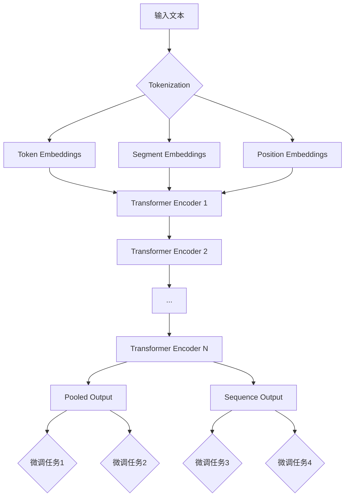

# Python深度学习实践：解析BERT如何改善文本理解

## 1. 背景介绍

### 1.1 自然语言处理的发展历程
#### 1.1.1 早期的词袋模型和n-gram模型
#### 1.1.2 词向量的诞生：word2vec和GloVe
#### 1.1.3 循环神经网络和卷积神经网络在NLP中的应用

### 1.2 Transformer模型的崛起
#### 1.2.1 Transformer的核心思想：自注意力机制
#### 1.2.2 GPT和BERT的横空出世

### 1.3 BERT的革命性意义
#### 1.3.1 预训练+微调范式的确立
#### 1.3.2 海量无监督语料的有效利用
#### 1.3.3 多任务学习的新高度

## 2. 核心概念与联系

### 2.1 BERT的网络结构
#### 2.1.1 Transformer Encoder层的堆叠
#### 2.1.2 输入表示：Token Embeddings, Segment Embeddings, Position Embeddings
#### 2.1.3 输出表示：Pooled Output和Sequence Output

### 2.2 BERT的预训练任务 
#### 2.2.1 Masked Language Model(MLM)
#### 2.2.2 Next Sentence Prediction(NSP)
#### 2.2.3 预训练任务的意义

### 2.3 BERT的微调方法
#### 2.3.1 特定任务的输入输出设计
#### 2.3.2 微调的超参数选择
#### 2.3.3 多任务微调

## 3. 核心算法原理具体操作步骤

### 3.1 BERT的输入处理
#### 3.1.1 文本序列的Tokenization
#### 3.1.2 WordPiece分词
#### 3.1.3 构建输入表示

### 3.2 Transformer Encoder的计算过程
#### 3.2.1 自注意力计算
#### 3.2.2 前馈神经网络
#### 3.2.3 残差连接和Layer Normalization

### 3.3 预训练任务的实现细节
#### 3.3.1 动态Masking
#### 3.3.2 NSP任务的正负样本构建
#### 3.3.3 预训练的优化策略

### 3.4 微调阶段的训练过程
#### 3.4.1 数据准备与Embedding
#### 3.4.2 单塔和双塔结构
#### 3.4.3 微调的损失函数设计

## 4. 数学模型和公式详细讲解举例说明

### 4.1 Scaled Dot-Product Attention
$$Attention(Q,K,V) = softmax(\frac{QK^T}{\sqrt{d_k}})V$$
其中，$Q$是查询矩阵，$K$是键矩阵，$V$是值矩阵，$d_k$是$K$的维度。

### 4.2 Multi-Head Attention
$$MultiHead(Q,K,V) = Concat(head_1,...,head_h)W^O$$
$$head_i = Attention(QW^Q_i, KW^K_i, VW^V_i)$$
其中，$W^Q_i$, $W^K_i$, $W^V_i$, $W^O$是可学习的权重矩阵。

### 4.3 Masked Language Model
$$p(w_t|w_{1:t-1},w_{t+1:T}) = softmax(H_tW_e + b_e)$$
其中，$w_t$是被Mask的单词，$H_t$是$w_t$对应的隐藏层输出，$W_e$和$b_e$是MLM任务的输出Embedding矩阵和偏置。

### 4.4 Next Sentence Prediction
$$p(IsNext|S_1,S_2) = sigmoid(H^{pooled}W_{nsp} + b_{nsp})$$
其中，$H^{pooled}$是$[CLS]$标记对应的Pooled Output，$W_{nsp}$和$b_{nsp}$是NSP任务的权重和偏置。

## 5. 项目实践：代码实例和详细解释说明

### 5.1 使用Hugging Face的Transformers库加载BERT模型
```python
from transformers import BertTokenizer, BertModel

tokenizer = BertTokenizer.from_pretrained('bert-base-uncased')
model = BertModel.from_pretrained('bert-base-uncased')
```

### 5.2 对文本进行Tokenization和Embedding
```python
text = "Hello, how are you? I am fine, thank you!"
encoded_input = tokenizer(text, return_tensors='pt')
output = model(**encoded_input)
```

### 5.3 提取Pooled Output和Sequence Output
```python
pooled_output = output.pooler_output
sequence_output = output.last_hidden_state
```

### 5.4 微调BERT模型进行文本分类
```python
from transformers import BertForSequenceClassification

model = BertForSequenceClassification.from_pretrained('bert-base-uncased', num_labels=2)
outputs = model(**encoded_input, labels=labels)
loss = outputs.loss
logits = outputs.logits
```

## 6. 实际应用场景

### 6.1 情感分析
利用BERT对文本的情感极性进行分类，如正面、负面、中性等。

### 6.2 命名实体识别
识别文本中的人名、地名、组织机构名等命名实体。

### 6.3 问答系统
基于BERT构建问答系统，从给定文本中寻找问题的答案。

### 6.4 文本相似度计算
通过BERT的Pooled Output或Sequence Output计算两段文本的语义相似度。

## 7. 工具和资源推荐

### 7.1 Hugging Face的Transformers库
提供了BERT等主流NLP模型的预训练权重和便捷的调用接口。

### 7.2 Google Research的BERT论文和代码
BERT的原始论文和官方实现代码。

### 7.3 中文BERT预训练模型
哈工大讯飞联合实验室发布的RoBERTa-wwm-ext等中文预训练模型。

### 7.4 FastBERT
滴滴发布的一个基于知识蒸馏的BERT模型加速方案。

## 8. 总结：未来发展趋势与挑战

### 8.1 模型的轻量化与速度优化
通过知识蒸馏、模型剪枝、量化等技术压缩和加速BERT。

### 8.2 更强大的预训练任务
设计更有效的预训练任务，如Span Masking, Sentence Ordering等。

### 8.3 融合知识图谱的BERT
将知识图谱等结构化知识引入BERT的预训练和微调过程。

### 8.4 更多语言和领域的预训练模型
针对不同语言和领域发布更多预训练模型，提升垂直领域的性能。

## 9. 附录：常见问题与解答

### 9.1 BERT和GPT的区别是什么？
BERT是双向的Transformer Encoder，而GPT是单向的Transformer Decoder。BERT有MLM和NSP两个预训练任务，GPT只有单向语言模型任务。

### 9.2 BERT的最大输入长度是多少？
BERT-base模型的最大输入长度是512个token，BERT-large是1024。

### 9.3 哪些任务适合用BERT来做？
BERT适合大多数NLP任务，如分类、序列标注、阅读理解等。对于生成任务，如对话、摘要等，更推荐使用GPT等生成式模型。

### 9.4 在小数据集上微调BERT有哪些技巧？
可以使用数据增强、半监督学习、对抗训练等方法，也可以在下游任务上继续预训练BERT。

### 9.5 BERT的训练需要什么硬件条件？
训练BERT对GPU内存要求较高，建议使用16GB及以上的显卡。如果条件不允许，可以使用梯度累积、混合精度训练、模型并行等方法。

以下是BERT的核心概念原理架构图（使用Mermaid绘制）：



作者：禅与计算机程序设计艺术 / Zen and the Art of Computer Programming