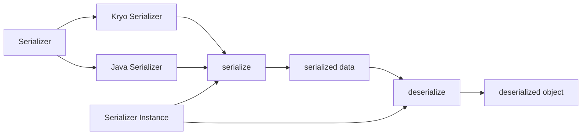

# Spark Serializer原理与代码实例讲解

## 1. 背景介绍

### 1.1 序列化的重要性

在分布式计算系统中,序列化扮演着至关重要的角色。它是将对象转换为字节流以便通过网络传输或持久化存储的过程。Spark作为一个分布式计算框架,大量使用序列化来优化数据传输和存储。

### 1.2 Spark中的序列化

Spark为了最小化数据传输的开销,提供了高效的序列化机制。Spark使用自己的序列化框架Kryo,同时也支持Java序列化。Spark中的许多组件,如RDD、广播变量、混洗数据等,都依赖于序列化。

### 1.3 本文的目的

本文将深入探讨Spark Serializer的原理,阐述其核心概念和算法,并通过代码实例和数学模型来加深理解。同时,我们也会讨论Spark Serializer在实际应用中的场景和挑战。

## 2. 核心概念与联系

### 2.1 序列化接口

Spark定义了序列化接口`org.apache.spark.serializer.Serializer`,所有的序列化器都需要实现这个接口。该接口主要有两个方法:
- `newInstance()`: 创建一个序列化器实例
- `serialize()`：将对象序列化为字节流

### 2.2 Kryo序列化器

Kryo是Spark默认的序列化器。它速度快,序列化后的数据更小。Spark对Kryo进行了优化,使其能高效地序列化Spark中的数据类型。Kryo序列化器在`org.apache.spark.serializer.KryoSerializer`中实现。

### 2.3 Java序列化器  

除了Kryo,Spark还支持使用Java序列化。虽然Java序列化较慢且序列化后数据较大,但对于某些无法用Kryo序列化的类,它提供了一种备选方案。Java序列化器在`org.apache.spark.serializer.JavaSerializer`中实现。

### 2.4 序列化与反序列化

序列化将对象转换为字节流,而反序列化则是相反的过程。在Spark中,当数据需要通过网络传输或写入磁盘时进行序列化,当数据需要在内存中使用时进行反序列化。

### 2.5 序列化标识

为了正确地反序列化,每个序列化后的数据都关联一个序列化标识。它记录了序列化该数据时使用的序列化器信息。Spark使用`org.apache.spark.serializer.SerializerInstance`来表示序列化标识。

下图展示了Spark Serializer的核心概念之间的关系:



## 3. 核心算法原理具体操作步骤

### 3.1 Kryo序列化算法

Kryo序列化过程可分为以下几个步骤:

1. 将对象图转换为线性结构
2. 为每个对象分配一个整数标识符
3. 写入对象的类信息
4. 递归地写入对象的字段值

反序列化过程则相反:

1. 读取类信息
2. 创建对象实例
3. 递归地填充对象的字段值
4. 将整数标识符映射回对象引用

### 3.2 对象引用处理

Kryo使用对象引用来处理对象图中的循环引用和重复引用。具体步骤如下:

1. 为每个对象分配一个整数标识符
2. 如果一个对象之前已被序列化,只写入它的标识符
3. 反序列化时,用标识符查找对象引用

这种方法能有效地减小序列化后的数据大小。  

### 3.3 类信息处理

对于每个要序列化的对象,Kryo需要写入它的类信息,以便能够在反序列化时正确还原对象。处理步骤如下:

1. 如果该类已被注册,写入类的注册号
2. 否则,写入类的全名
3. 反序列化时,用注册号或类名查找类信息

Kryo支持预先注册常用的类,以提高性能并减小序列化后的数据大小。

## 4. 数学模型和公式详细讲解举例说明

设对象图 $G=(V,E)$,其中 $V$ 是对象节点集合, $E$ 是对象之间引用关系的有向边集合。Kryo序列化可以看作是找到 $G$ 的一个线性表示 $L(G)$ 的过程。

假设 $|V|=n$,用 $v_i$ 表示第 $i$ 个对象, $id(v_i)$ 表示 $v_i$ 的整数标识符。如果 $v_i$ 引用 $v_j$,则 $(v_i,v_j)\in E$。

Kryo的对象引用处理可以用以下公式表示:

$$
L(v_i)=
\begin{cases}
id(v_i)  & (v_i,v_j)\in E \wedge v_j \text{ 已被序列化}\\
(id(v_i), S(v_i)) & \text{其他情况}
\end{cases}
$$

其中, $S(v_i)$ 表示 $v_i$ 的实际序列化数据。

举例说明:

```
class A {
  B b;
}
class B {
  A a;
}

A a1 = new A();
B b1 = new B();
a1.b = b1;
b1.a = a1;
```

在这个例子中, $V=\{a1,b1\}$, $E=\{(a1,b1),(b1,a1)\}$。假设 $id(a1)=1$, $id(b1)=2$。

序列化 $a1$ 的过程:

1. 写入 $id(a1)$,即 1
2. 写入 $a1$ 的类信息
3. 写入 $a1.b$ 的引用,因为 $b1$ 还没被序列化,所以写入 $id(b1)$,即 2,然后递归序列化 $b1$

序列化 $b1$ 的过程:

1. 写入 $id(b1)$,即 2
2. 写入 $b1$ 的类信息  
3. 写入 $b1.a$ 的引用,因为 $a1$ 已被序列化,所以只写入 $id(a1)$,即 1

所以,最终的线性表示 $L(G)$ 如下:

```
1, A 类信息, 2, 2, B 类信息, 1
```

反序列化时,根据标识符和类信息还原出对象图 $G$。

## 5. 项目实践：代码实例和详细解释说明

下面通过一个简单的Scala代码实例来演示Spark Serializer的使用。

```scala
import org.apache.spark.SparkConf
import org.apache.spark.serializer.KryoSerializer

case class Person(name: String, age: Int)

object SerializerExample {
  def main(args: Array[String]): Unit = {
    val conf = new SparkConf()
      .setAppName("SerializerExample")
      .setMaster("local[2]")
      .set("spark.serializer", classOf[KryoSerializer].getName)
      .registerKryoClasses(Array(classOf[Person]))
    
    val sc = new SparkContext(conf)
    
    val people = Seq(Person("Alice", 25), Person("Bob", 30))
    val rdd = sc.parallelize(people)
    
    rdd.foreach(println)
    
    sc.stop()
  }
}
```

在这个例子中:

1. 我们创建了一个`Person`样例类,并创建了一个包含两个`Person`对象的序列。

2. 通过SparkConf配置Spark使用KryoSerializer,并预先注册`Person`类。

3. 将序列并行化为一个RDD,Spark在此过程中会使用KryoSerializer将`Person`对象序列化。

4. 在foreach操作中,Spark会将RDD中的数据反序列化为`Person`对象。

这个例子展示了Spark Serializer在RDD创建和操作过程中的应用。预先注册`Person`类可以提高序列化性能并减小数据大小。

## 6. 实际应用场景

Spark Serializer在许多实际应用场景中发挥着重要作用,例如:

1. 大规模数据处理:序列化能减小数据在节点之间传输的开销,提高Spark作业的性能。

2. 数据缓存:Spark可以将RDD缓存在内存或磁盘中,序列化能减小缓存数据的大小。

3. 混洗操作:在混洗操作中,数据需要在节点之间重新分配,高效的序列化能加速这一过程。 

4. 广播变量:Spark使用序列化来分发广播变量,减小数据传输的开销。

在实际应用中,选择合适的序列化器并优化序列化过程对于提高Spark作业的性能至关重要。

## 7. 工具和资源推荐

以下是一些有助于深入理解和应用Spark Serializer的工具和资源:

1. Spark官方文档:详细介绍了Spark Serializer的使用方法和配置选项。

2. Kryo官方文档:提供了Kryo序列化器的详细信息和高级用法。

3. Spark源码:通过阅读Spark序列化相关的源码,可以加深对其内部原理的理解。

4. Spark Summit演讲:Spark Summit上有许多关于Spark序列化优化的演讲,分享了宝贵的实践经验。

5. 性能测试工具:例如Spark Perf,可以用来测试不同序列化器的性能,帮助选择最佳的序列化方案。

充分利用这些资源,可以帮助我们更好地理解和应用Spark Serializer,优化Spark作业的性能。

## 8. 总结：未来发展趋势与挑战

Spark Serializer作为Spark性能优化的关键组件,未来还有很大的改进空间。以下是一些可能的发展趋势和挑战:

1. 自适应序列化:根据数据特点自动选择最优的序列化器和配置,减少手动调优的需求。

2. 更高效的序列化算法:研究和应用更高效的序列化算法,如基于schema的序列化,进一步提高性能。

3. 与新的存储格式集成:随着新的存储格式(如Parquet, ORC)的出现,Spark Serializer需要与之良好集成。

4. 更细粒度的序列化控制:允许用户在更细粒度上控制序列化过程,如指定字段的序列化方式等。

5. 动态类处理:改进Spark Serializer处理动态生成类和反射的能力,提高灵活性。

总之,Spark Serializer还有很大的改进空间,需要在性能、灵活性和易用性之间取得平衡。未来的发展趋势是提供更智能、更高效、更灵活的序列化机制,帮助用户轻松地优化Spark作业的性能。

## 9. 附录：常见问题与解答

1. 什么时候应该使用Kryo序列化器?

答:在大多数情况下,Kryo序列化器都是一个不错的选择,特别是对于自定义类。与Java序列化相比,Kryo更快且序列化后的数据更小。

2. 如何注册自定义类以提高Kryo序列化性能?

答:可以通过SparkConf的`registerKryoClasses`方法预先注册自定义类。这样可以避免在运行时反射获取类信息,提高序列化性能。

3. 广播变量是否总是使用序列化?

答:是的,Spark使用序列化来分发广播变量到各个节点。高效的序列化有助于减小广播变量的传输开销。

4. 如何选择最佳的序列化器?

答:可以通过性能测试来比较不同序列化器在具体使用场景下的表现。一般来说,Kryo是大多数情况下的最佳选择。但对于某些无法用Kryo高效序列化的类,Java序列化可能是更好的备选方案。

5. 是否可以自定义序列化过程?

答:可以通过实现`org.apache.spark.serializer.Serializer`接口并配置Spark使用自定义序列化器来自定义序列化过程。这对于某些特殊类型的高效序列化很有用。但大多数情况下,使用Kryo就足够了。

希望通过本文的深入讲解,读者能够全面理解Spark Serializer的原理和应用,并能在实践中灵活运用,优化Spark作业的性能。Spark Serializer作为Spark性能优化的利器,值得我们深入研究和运用。

作者：禅与计算机程序设计艺术 / Zen and the Art of Computer Programming