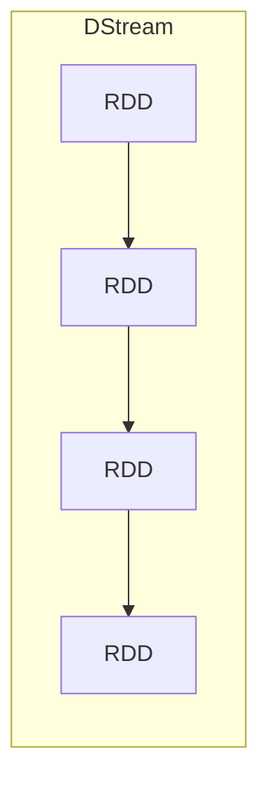
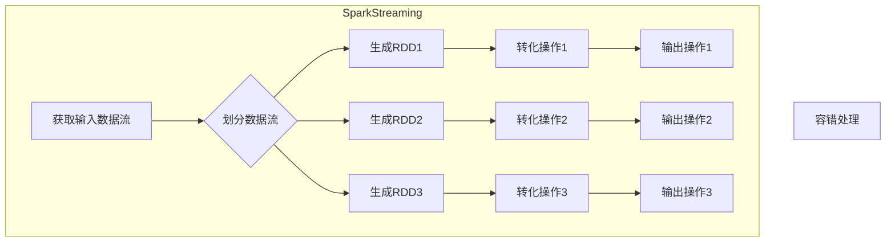

# Spark Streaming原理与代码实例讲解

## 1.背景介绍

随着大数据时代的到来,越来越多的企业需要实时处理大量的数据流,以便及时做出反应和决策。Apache Spark作为一种快速、通用的大数据处理引擎,其流式计算模块Spark Streaming为实时数据处理提供了强大的支持。

Spark Streaming可以从许多来源(如Kafka、Flume、Kinesis、HDFS等)获取输入数据流,并对数据进行高吞吐量、容错的流式处理。它将流式计算视为一系列小批量(micro-batches)的离散流,从而可以利用Spark提供的丰富的批处理APIs。这种设计使得Spark Streaming能够很好地整合批处理和流式计算,并提供了高度的可伸缩性和容错能力。

## 2.核心概念与联系

### 2.1 DStream(Discretized Stream)

DStream是Spark Streaming中最基本的抽象,它代表一个持续不断的数据流。DStream由一系列连续的RDD(Resilient Distributed Dataset)组成,每个RDD包含一段时间内的数据。



### 2.2 输入DStream

输入DStream可以从诸如Kafka、Flume等源读取数据流。Spark Streaming提供了内置的工具类,使得从常见数据源创建DStream变得很容易。

### 2.3 转化操作

与RDD类似,DStream也支持诸如map、flatMap、filter、reduceByKey等常见的转化操作。这些操作会在DStream的每个RDD上执行,从而形成一个新的DStream。

### 2.4 输出操作

经过一系列转化操作后,结果DStream可以通过输出操作将数据持久化到外部系统,如HDFS、数据库等。

## 3.核心算法原理具体操作步骤  

Spark Streaming的核心算法原理可以概括为以下几个步骤:

1. **获取输入数据流**: 从数据源(如Kafka、Flume等)获取实时数据流,并创建初始DStream。

2. **划分数据流**: 将连续的数据流划分为一系列小批量(micro-batches),每个小批量包含一段时间内的数据,形成一个DStream。

3. **生成RDD**: 对每个小批量的数据创建一个RDD,这些RDD组成了DStream。

4. **执行转化操作**: 在DStream上执行所需的转化操作(如map、flatMap、filter等),从而生成新的DStream。

5. **执行输出操作**: 将结果DStream输出到外部系统(如HDFS、数据库等)。

6. **容错处理**: Spark Streaming利用Spark的容错机制(如RDD的lineage和checkpoint),确保计算的可恢复性。



## 4.数学模型和公式详细讲解举例说明

在Spark Streaming中,数据流被划分为一系列小批量,每个小批量包含一段时间内的数据。这种设计使得Spark Streaming可以利用Spark提供的批处理APIs,从而实现高吞吐量和容错能力。

假设数据流的到达速率为 $\lambda$ 条/秒,小批量的时间间隔为 $\Delta t$ 秒,则在时间 $t$ 时,小批量中数据条数的期望值为:

$$
E[N(t)] = \lambda \Delta t
$$

��中 $N(t)$ 表示时间 $t$ 时小批量中的数据条数。

如果将小批量时间间隔 $\Delta t$ 设置得足够小,那么每个小批量中的数据量就会相对较小,从而可以更好地利用集群资源,提高整体吞吐量。但是,较小的 $\Delta t$ 也意味着更高的调度开销。因此,在实践中需要权衡小批量时间间隔的大小,以获得最佳性能。

另一个重要的指标是小批量的延迟,即从数据到达到处理完成的时间。假设小批量的处理时间为 $T_p$,则小批量的延迟为:

$$
L = \Delta t + T_p
$$

为了确保实时性,需要将延迟 $L$ 控制在一个可接受的范围内。

## 5.项目实践:代码实例和详细解释说明

以下是一个使用Spark Streaming从Kafka读取数据流、进行词频统计的完整示例:

### 5.1 导入必要的库

```scala
import org.apache.spark.streaming.{Seconds, StreamingContext}
import org.apache.spark.streaming.kafka.KafkaUtils
import org.apache.spark.SparkConf
```

### 5.2 创建SparkConf和StreamingContext

```scala
val conf = new SparkConf().setAppName("KafkaWordCount")
val ssc = new StreamingContext(conf, Seconds(2))
```

这里我们创建了一个SparkConf和StreamingContext对象。StreamingContext的批处理间隔设置为2秒。

### 5.3 从Kafka读取数据流

```scala
val kafkaParams = Map(
  "metadata.broker.list" -> "broker1:port1,broker2:port2",
  "group.id" -> "my-group"
)
val topics = Set("my-topic")
val stream = KafkaUtils.createDirectStream[String, String, StringDecoder, StringDecoder](
  ssc, kafkaParams, topics)
```

我们使用KafkaUtils提供的createDirectStream方法从Kafka读取数据流,并创建一个DStream对象stream。

### 5.4 执行词频统计

```scala
val words = stream.flatMap(_.value.split(" "))
val pairs = words.map(word => (word, 1))
val wordCounts = pairs.reduceByKey(_ + _)

wordCounts.print()
```

这里我们对stream执行了一系列转化操作:

1. flatMap将每条记录拆分为单词
2. map将每个单词映射为(word, 1)对
3. reduceByKey对每个key(单词)的值(计数)进行求和

最后,我们打印出wordCounts DStream,它会每2秒输出一次结果。

### 5.5 启动Streaming上下文

```scala
ssc.start()
ssc.awaitTermination()
```

最后,我们启动StreamingContext并等待它终止。

通过这个示例,我们可以看到如何使用Spark Streaming从Kafka读取数据流、进行转化操作,并输出结果。代码非常简洁,但是功能强大,体现了Spark Streaming的易用性和高效性。

## 6.实际应用场景

Spark Streaming可以应用于各种实时数据处理场景,例如:

1. **实时日志分析**: 从Web服务器、应用程序等获取实时日志数据,进行实时分析和监控。

2. **实时流式计算**: 对来自传感器、社交媒体等的实时数据流进行处理,提取有价值的信息。

3. **实时机器学习**: 利用Spark Streaming和Spark MLlib,在实时数据流上训练和更新机器学习模型。

4. **实时fraud检测**: 对金融交易、网络流量等实时数据进行fraud检测。

5. **实时推荐系统**: 根据用户的实时行为数据,实时更新推荐系统的模型和推荐结果。

6. **物联网(IoT)数据处理**: 处理来自各种传感器和设备的海量实时数据流。

7. **在线广告投放**: 根据用户的实时浏览数据,实时调整广告投放策略。

总的来说,Spark Streaming为各种实时数据处理场景提供了高效、可扩展的解决方案。

## 7.工具和资源推荐

1. **Apache Kafka**: 一个分布式流式处理平台,常被用作Spark Streaming的数据源。

2. **Apache Flume**: 一个分布式、可靠、高可用的日志收集系统,也可作为Spark Streaming的数据源。

3. **Apache ZooKeeper**: 一个分布式协调服务,可用于Kafka和其他分布式系统的配置管理。

4. **Apache Hadoop**: 一个分布式文件系统和计算框架,Spark Streaming可以将结果输出到HDFS。

5. **Apache Hive**: 一个基于Hadoop的数据仓库工具,可用于存储和查询Spark Streaming的处理结果。

6. **Apache Spark**: Spark Streaming所基于的核心计算引擎,提供了丰富的批处理和流式计算API。

7. **Spark Streaming编程指南**: Spark官方提供的编程指南,包含了丰富的示例和最佳实践。

8. **Spark Streaming在线训练课程**: 一些优质的在线课程,可以帮助你快速入门Spark Streaming。

9. **Spark Streaming社区**: Spark Streaming拥有活跃的社区,你可以在邮件列表、论坛等渠道寻求帮助和交流。

## 8.总结:未来发展趋势与挑战

Spark Streaming作为实时数据处理的重要工具,未来将继续在以下几个方面发展:

1. **低延迟和高吞吐量**: 进一步降低端到端延迟,提高数据吞吐量,以满足更多实时场景的需求。

2. **流式机器学习**: 加强对流式机器学习的支持,使得模型能够在实时数据流上持续训练和更新。

3. **流式SQL**: 提供类SQL的流式查询语言,降低流式计算的学习曲线。

4. **流式处理和批处理的融合**: 进一步融合流式处理和批处理,使开发者能够无缝地在两种范式之间转换。

5. **云原生支持**: 加强对云原生环境(如Kubernetes)的支持,实现更好的资源利用和弹性伸缩。

6. **安全性和隐私保护**: 加强对安全性和隐私保护的支持,满足敏感数据处理的需求。

与此同时,Spark Streaming也面临一些挑战:

1. **状态管理**: 有状态的流式计算对状态的管理和容错提出了更高的要求。

2. **反压机制**: 需要更好的反压机制,以防止下游系统被淹没。

3. **资源管理**: 在资源有限的情况下,需要更好地管理和调度资源。

4. **可观测性**: 需要提供更好的监控和可观测性,以便诊断和调试问题。

5. **生态系统集成**: 需要与更多的数据源、存储系统和其他框架进行无缝集成。

总的来说,Spark Streaming将继续发展以满足不断增长的实时数据处理需求,同时也需要解决一些关键的技术挑战。

## 9.附录:常见问题与解答

1. **Spark Streaming和Apache Storm相比有什么优缺点?**

Spark Streaming的优点包括:

- 与Spark批处理无缝集成,代码复用
- 基于RDD提供了更强大的容错机制
- 支持更丰富的数据源和输出目标
- 性能通常更好,尤其是在有状态计算时

但Storm在某些场景下也有自己的优势:

- 纯流式处理,延迟更低
- 支持事务和exactly-once语义
- 部署和管理更简单

2. **Spark Streaming如何实现容错?**

Spark Streaming利用了Spark的容错机制,主要包括:

- RDD的lineage,可以重新计算丢失的RDD
- Checkpoint,将RDD持久化以加快恢复速度
- Write Ahead Log,用于有状态计算的容错

3. **如何选择合适的批处理间隔?**

选择合适的批处理间隔需要权衡延迟和吞吐量。间隔越小,延迟越低但调度开销越大;间隔越大,延迟越高但吞吐量可能更高。通常需要根据具体场景和数据量进行测试和调优。

4. **Spark Streaming如何处理乱序数据?**

Spark Streaming本身不提供处理乱序数据的机制。但我们可以利用窗口操作,将数据流按时间窗口切分,在窗口内对乱序数据进行处理。另外,也可以使用外部工具(如Apache Flink)来预处理和重新排序数据。

5. **Spark Streaming支持什么类型的窗口操作?**

Spark Streaming支持滑动窗口