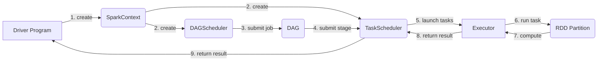

# Spark原理与代码实例讲解

## 1. 背景介绍

### 1.1 大数据处理的挑战

在当今大数据时代,数据的爆炸式增长给数据处理带来了巨大挑战。传统的数据处理方式已经无法满足海量数据的实时计算和复杂分析的需求。企业迫切需要一种高效、易用、可扩展的大数据处理平台。

### 1.2 Spark的诞生

Spark作为一个快速通用的大数据计算引擎应运而生。它由加州大学伯克利分校AMP实验室开发,于2009年开源,现已成为Apache顶级项目。Spark凭借其出色的性能、易用性和通用性,迅速成为大数据处理领域的佼佼者。

### 1.3 Spark生态系统

Spark不仅仅是一个计算引擎,更是一个庞大的生态系统。围绕Spark核心,还有一系列高层类库和工具,包括用于结构化数据处理的Spark SQL、用于流式计算的Spark Streaming、用于图计算的GraphX和用于机器学习的MLlib等。Spark生态的完善极大地丰富了其应用场景。

## 2. 核心概念与联系

### 2.1 RDD

RDD(Resilient Distributed Dataset)是Spark的核心抽象,它代表一个不可变、可分区、里面的元素可并行计算的集合。RDD可以从外部数据源创建,也可以从其他RDD转换而来。RDD支持两种操作:转换(Transformation)和动作(Action)。转换操作由一个RDD生成另一个RDD,动作操作对RDD进行求值并返回结果给Driver程序或写入外部存储系统。

### 2.2 DAG

Spark采用DAG(Directed Acyclic Graph)有向无环图来表示RDD之间的依赖关系。当执行一个Action操作时,Spark会根据RDD的血缘关系(Lineage)构建DAG图,DAG图定义了RDD的计算过程。然后Spark会把DAG图提交给DAG Scheduler进行优化和划分Stage,最后由Task Scheduler将Task分发到各个Worker节点上执行。

### 2.3 Spark运行架构

Spark采用主从(Master/Slave)架构,由一个Driver Program和若干个Worker Node组成。Driver Program是Spark程序的入口,负责创建SparkContext、提交作业、协调各个Worker Node。Worker Node负责实际的计算任务,每个Worker上有若干Executor进程,每个Executor拥有独立的内存和计算资源。Spark基于Actor模型实现了各组件间的通信。

### 2.4 Mermaid流程图

下图是Spark运行时的核心组件及其交互流程:



## 3. 核心算法原理具体操作步骤

### 3.1 RDD的创建

RDD可以通过两种方式创建:

1. 从外部数据源创建,如本地文件、HDFS、HBase等。

```scala
val rdd = sc.textFile("hdfs://path/to/file")
```

2. 从其他RDD转换而来,如map、filter、join等算子操作。

```scala
val rdd2 = rdd.filter(_.contains("Spark"))
```

### 3.2 RDD的转换操作

常见的RDD转换操作包括:

- map: 对RDD中的每个元素都执行一个函数,返回一个新的RDD。
- filter: 对RDD中的每个元素都进行判断,返回满足条件的元素组成的新RDD。
- flatMap: 与map类似,但每个元素可以映射到0到多个输出。 
- groupByKey: 对RDD中的元素按照key进行分组,返回(key, Iterable)对组成的新RDD。
- reduceByKey: 对RDD中的元素按key进行分组,并对每个组执行reduce操作。

以上只是常见操作的一小部分,Spark支持上百种RDD转换操作,可以灵活组合应对各种计算场景。

### 3.3 RDD的持久化

如果一个RDD需要被多次使用,可以使用persist或cache方法将其持久化。持久化后的RDD将会被保存在内存或磁盘中,下次使用时可以直接读取,避免重复计算。Spark支持多种持久化级别,如MEMORY_ONLY、MEMORY_AND_DISK等,可根据实际情况选择。

```scala
val rdd = sc.textFile("hdfs://path/to/file")
rdd.persist(StorageLevel.MEMORY_AND_DISK)
```

### 3.4 RDD的分区与并行度

RDD是分布式数据集,它被分成多个分区(Partition),分布在集群的各个节点上。每个分区可以在一个单独的线程中进行处理,这是Spark实现并行计算的基础。RDD的分区数决定了其并行度,可以在创建RDD时指定,也可以通过repartition或coalesce算子动态调整。一般来说,分区数应该大于等于集群的CPU核心数。

```scala
val rdd = sc.textFile("hdfs://path/to/file", 100) // 指定100个分区
val rdd2 = rdd.repartition(50) // 重新调整为50个分区
```

## 4. 数学模型和公式详细讲解举例说明

Spark中许多算法都基于统计学和线性代数的数学模型,下面以线性回归为例进行讲解。

线性回归是一种常见的监督学习算法,用于拟合连续型变量之间的线性关系。给定一组训练样本 $\{(x_1,y_1),(x_2,y_2),...,(x_n,y_n)\}$,其中 $x_i$ 是特征向量, $y_i$ 是目标值。线性回归的目标是找到一个线性模型:

$$h_\theta(x)=\theta_0+\theta_1x_1+\theta_2x_2+...+\theta_dx_d$$

使得预测值 $h_\theta(x_i)$ 与真实值 $y_i$ 的差异最小化。这里 $\theta_j$ 是模型参数,$d$ 是特征维度。

我们定义损失函数为预测值与真实值差异的平方和:

$$J(\theta)=\frac{1}{2}\sum_{i=1}^n(h_\theta(x_i)-y_i)^2$$

线性回归的目标就是找到一组参数 $\theta$,使得损失函数 $J(\theta)$ 最小化。这可以通过梯度下降法实现,不断沿损失函数的负梯度方向更新参数:

$$\theta_j:=\theta_j-\alpha\frac{\partial}{\partial\theta_j}J(\theta)$$

其中 $\alpha$ 是学习率,控制每次更新的步长。

在Spark MLlib中,线性回归的实现基于分布式梯度下降算法。训练数据被划分成多个分区,每个分区计算局部梯度,然后通过Reduce操作汇总得到全局梯度,再更新模型参数。这种并行化的梯度下降可以显著加速模型训练。

## 5. 项目实践：代码实例和详细解释说明

下面通过一个简单的词频统计示例,演示Spark RDD编程的基本流程。

```scala
// 创建SparkContext
val conf = new SparkConf().setAppName("WordCount")
val sc = new SparkContext(conf)

// 读取文本文件,创建初始RDD
val textRDD = sc.textFile("hdfs://path/to/file")

// 对每一行文本进行分词,并压平
val wordsRDD = textRDD.flatMap(_.split("\\s+"))

// 将每个单词映射为(word, 1)的形式
val pairRDD = wordsRDD.map((_, 1))

// 对单词进行分组和聚合
val wordCountRDD = pairRDD.reduceByKey(_ + _)

// 将结果打印到控制台
wordCountRDD.collect().foreach(println)

// 停止SparkContext
sc.stop()
```

这个例子的执行流程如下:

1. 通过textFile方法从HDFS读取文本文件,创建初始RDD。
2. 对每一行文本使用flatMap进行分词,将一行文本映射为多个单词,并压平成为一个新的RDD。
3. 使用map将每个单词映射为(word, 1)的形式,表示每个单词出现一次。
4. 使用reduceByKey对单词进行分组和聚合,对于同一个单词的多个计数,使用 `_ + _` 函数进行累加。
5. 使用collect将结果RDD收集到Driver端,并打印到控制台。

可以看到,使用Spark RDD API,可以用非常简洁的代码实现一个分布式的词频统计程序。Spark会自动将计算任务分发到集群的各个节点上并行执行,开发者无需关心底层的分布式计算细节。

## 6. 实际应用场景

Spark在实际生产环境中有非常广泛的应用,下面列举几个典型场景:

### 6.1 日志分析

互联网公司每天会产生海量的用户行为日志,如网页点击、搜索、购买等。使用Spark可以对这些原始日志进行清洗、转换和聚合分析,挖掘用户行为模式,优化产品设计和推荐策略。

### 6.2 实时数据处理

金融、物联网等领域经常需要对实时数据流进行处理和分析。使用Spark Streaming,可以对来自Kafka、Flume等数据源的实时数据流进行滑动窗口计算、异常检测等操作,并将结果写入数据库或发送报警。

### 6.3 机器学习

Spark MLlib提供了一整套分布式机器学习算法库,包括分类、回归、聚类、协同过滤等。基于Spark平台,可以处理超大规模的训练数据,加速模型训练和调优的过程。许多公司使用Spark构建机器学习平台,应用于广告点击率预估、个性化推荐等业务。

### 6.4 图计算

图是一种重要的数据结构,在社交网络、金融风控等领域有广泛应用。Spark GraphX是一个分布式图计算框架,提供了一组常用的图算法,如PageRank、连通分量、标签传播等。使用GraphX可以方便地进行大规模图的分析和挖掘。

## 7. 工具和资源推荐

### 7.1 开发工具

- IntelliJ IDEA: 业界公认的最好的Scala IDE,与Spark深度集成,提供语法高亮、代码提示、断点调试等功能。
- Jupyter Notebook: 基于Web的交互式开发工具,支持Scala、Python等语言,适合进行数据分析和原型开发。
- Zeppelin: 另一个基于Web的Notebook工具,专为大数据分析设计,内置了丰富的可视化功能。

### 7.2 部署工具

- Apache Ambari: Hadoop生态系统的管理平台,提供了Spark的快速部署和监控功能。
- Spark on Mesos: 将Spark部署在Mesos资源管理平台上,实现多框架的统一调度。
- Spark on Kubernetes: 将Spark部署在Kubernetes容器平台上,实现弹性伸缩和动态资源分配。

### 7.3 学习资源

- Spark官方文档: https://spark.apache.org/docs/latest/
- Spark源码: https://github.com/apache/spark
- Databricks博客: https://databricks.com/blog
- Spark Summit大会: https://databricks.com/sparkaisummit

## 8. 总结：未来发展趋势与挑战

Spark作为新一代大数据处理平台,已经得到了广泛的应用和认可。未来Spark还将在以下几个方面持续发展:

1. 更易用的API: DataFrame、Dataset等高阶API将会进一步简化大数据处理的开发过程。
2. 更智能的优化: Spark将引入更多的自适应优化技术,如根据数据特征自动调整并行度、动态资源分配等。
3. 更好的云集成: Spark将与各大公有云厂商深度合作,提供无缝的云上部署和管理体验。
4. 更广泛的应用: Spark将在图计算、深度学习等新领域拓展应用,并与行业场景进一步结合。

同时,Spark也面临着一些挑战:

1. 内存管理: 如何在保证性能的同时,提高Spark作业的内存利用率,是一个值得研究的问题。
2. 数据倾斜: 当数据分布不均衡时,会导致某些任务执行时间过长,需要更好