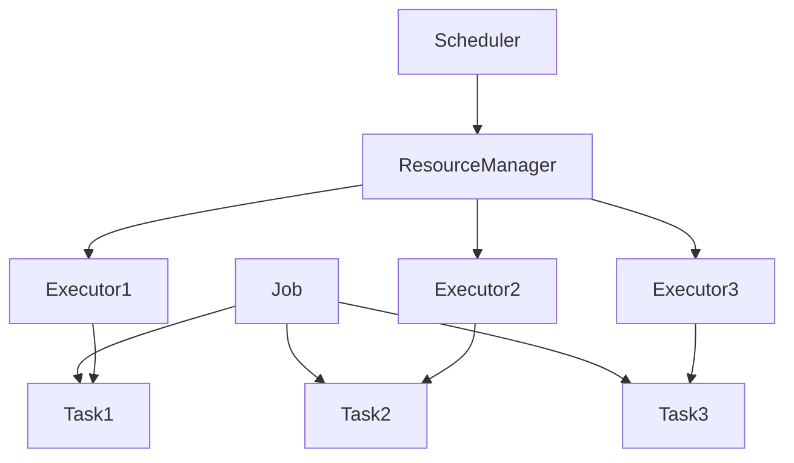

# 【AI大数据计算原理与代码实例讲解】调度器

## 1.背景介绍

在大数据和人工智能的时代,高效处理海量数据和复杂计算任务已成为关键挑战。调度器作为分布式计算系统的核心组件,在协调资源分配、任务调度和作业管理方面扮演着至关重要的角色。本文将深入探讨AI大数据计算中调度器的原理、算法、实现和应用,帮助读者全面理解这一关键技术。

### 1.1 大数据计算的挑战
#### 1.1.1 数据量急剧增长
#### 1.1.2 计算复杂度不断提高  
#### 1.1.3 实时性要求日益严苛

### 1.2 分布式计算的必要性
#### 1.2.1 突破单机性能瓶颈
#### 1.2.2 提供高可用和容错能力
#### 1.2.3 实现弹性伸缩和负载均衡

### 1.3 调度器的核心作用
#### 1.3.1 高效协调集群资源 
#### 1.3.2 智能调度任务和作业
#### 1.3.3 保障服务质量和公平性

## 2.核心概念与联系

在分布式计算系统中,调度器协调各个组件高效协同工作。让我们先明确几个核心概念:

### 2.1 作业(Job)与任务(Task)
- 作业:用户提交的完整计算单元,如一个Spark应用、一个MapReduce程序等。
- 任务:作业被拆分成的多个子任务,可在不同节点并行执行。

### 2.2 执行器(Executor)与资源(Resource) 
- 执行器:集群中真正执行计算任务的实体,通常对应一个进程或容器。
- 资源:执行器运行所需的CPU、内存等硬件资源,由资源管理器分配。

### 2.3 调度器(Scheduler)与资源管理器(Resource Manager)
- 资源管理器:掌管整个集群的硬件资源,接收调度器的资源请求并分配。
- 调度器:负责按照特定策略将任务分发到合适的执行器,并监控作业运行状态。

它们之间的关系可以用下图表示:



## 3.核心算法原理具体操作步骤

调度器的核心是其内置的调度算法,下面我们重点介绍几种主流算法:

### 3.1 FIFO调度算法
FIFO即"First-In, First-Out",按照作业提交的先后顺序依次调度。

#### 3.1.1 将作业按提交时间排序 
#### 3.1.2 依次为每个作业分配足够的执行器资源
#### 3.1.3 作业内部的任务调度由作业本身决定

### 3.2 容量调度算法
容量调度支持多个队列,每个队列可配置一定的资源量,在满足容量限制的前提下,各作业共享队列资源。

#### 3.2.1 配置多个队列及其资源容量
#### 3.2.2 作业根据配置的规则被提交到特定队列
#### 3.2.3 每个队列内采用FIFO调度
#### 3.2.4 空闲队列的资源可被其他队列使用

### 3.3 公平调度算法
公平调度以最大化资源利用率和作业间公平性为目标,动态平衡资源分配。

#### 3.3.1 每个作业关联一个权重,表示其应获得的资源份额
#### 3.3.2 集群资源被分成多个资源池
#### 3.3.3 作业根据权重比例共享资源池
#### 3.3.4 新提交的作业会被分配到资源利用率最低的资源池

## 4.数学模型和公式详细讲解举例说明

为了量化分析调度效果,我们引入几个关键指标:

### 4.1 资源利用率
资源利用率衡量集群资源的利用效率,定义为:

$资源利用率 = \frac{已使用资源量}{总资源量} \times 100\%$

例如,一个集群总共有100个CPU核心和500GB内存,当前使用了80个核心和400GB内存,则:

$CPU利用率 = \frac{80}{100} \times 100\% = 80\%$

$内存利用率 = \frac{400}{500} \times 100\% = 80\%$

### 4.2 作业响应时间
作业响应时间反映作业从提交到完成的总时长,包括排队等待时间和实际执行时间:

$作业响应时间 = 作业完成时刻 - 作业提交时刻$

### 4.3 公平性指数
公平性指数衡量不同作业获得资源的公平程度,一种常用的计算方法是Jain's Fairness Index:

$$
JFI = \frac{(\sum_{i=1}^{n} x_i)^2}{n \cdot \sum_{i=1}^{n} x_i^2}
$$

其中,$x_i$表示第$i$个作业获得的资源份额,$n$为作业总数。该指数取值范围为$[\frac{1}{n}, 1]$,越接近1表示资源分配越公平。

## 5.项目实践：代码实例和详细解释说明

下面我们以Spark的FAIR调度器为例,展示如何配置和使用公平调度:

### 5.1 配置spark-defaults.conf
在spark-defaults.conf中设置调度器类型和相关参数:
```properties
spark.scheduler.mode=FAIR
spark.scheduler.allocation.file=/path/to/fairscheduler.xml
```

### 5.2 配置fairscheduler.xml
在fairscheduler.xml中定义调度队列、权重等:
```xml
<?xml version="1.0"?>
<allocations>
  <pool name="production">
    <schedulingMode>FAIR</schedulingMode>
    <weight>1</weight>
    <minShare>2</minShare>
  </pool>
  <pool name="test">
    <schedulingMode>FIFO</schedulingMode>
    <weight>2</weight>
    <minShare>3</minShare>
  </pool>
  <defaultPool>production</defaultPool>
</allocations>
```

### 5.3 提交Spark作业
使用spark-submit提交作业时,可通过--queue参数指定提交队列:
```bash
spark-submit --master yarn --deploy-mode cluster --queue production \
  --class com.example.MyApp my-app.jar
```

### 5.4 监控作业运行状态
在Spark Web UI中可以查看作业的运行状态、资源使用情况等信息,方便调试和优化。

## 6.实际应用场景

调度器在许多实际场景中发挥着关键作用,例如:

### 6.1 电商推荐系统
- 海量用户行为数据的实时处理
- 复杂推荐算法的并行计算
- 不同业务需求的资源隔离和优先级控制

### 6.2 金融风控平台
- 交易数据的实时分析和异常检测
- 多个风控模型的并发训练和预测
- 高优先级任务的快速响应

### 6.3 智慧交通调度
- 城市范围内海量出行数据的汇总分析
- 实时路况预测和智能调度决策
- 突发事件的快速应对和资源动态分配

## 7.工具和资源推荐

- Apache Hadoop YARN: 一个通用的集群资源管理和调度平台。
- Apache Spark: 基于内存的快速大数据计算引擎,提供了多级调度机制。
- Apache Mesos: 一个通用的集群管理器,支持多种调度框架。 
- Kubernetes: 一个流行的容器编排平台,提供了声明式的任务调度能力。

同时推荐一些深入学习的资料:
- 《Hadoop权威指南》: 系统讲解了YARN的架构和原理。
- 《Spark大数据处理: 技术、应用与性能优化》: 对Spark的任务调度有详细介绍。
- 《Mesos in Action》: 通过实例讲解了Mesos的使用和内部机制。
- Kubernetes官方文档: https://kubernetes.io/docs/

## 8.总结：未来发展趋势与挑战

展望未来,大数据调度技术还有许多发展机遇和挑战:

### 8.1 智能化与自适应
- 调度决策的智能化,如引入强化学习等AI算法
- 根据系统状态和作业特征自适应调整调度策略

### 8.2 异构资源与混部
- 支持GPU、FPGA等异构硬件资源的统一调度
- 支持在线服务和离线作业的混合部署

### 8.3 云原生与服务化
- 与云原生架构和技术栈的深度融合
- 调度能力下沉为基础设施层服务

未来,大数据调度系统将变得更加智能、高效、灵活,成为人工智能时代IT基础设施中不可或缺的关键组件。让我们携手探索前行,共同推动这一领域的创新发展!

## 9.附录：常见问题与解答

### Q1: 调度器和资源管理器有什么区别?
A1: 资源管理器负责管理和分配集群硬件资源,调度器负责根据特定策略调度任务,两者通力合作,共同完成作业的执行。

### Q2: FIFO、容量、公平调度有何异同?
A2: 三种调度算法各有侧重:FIFO强调先来先服务,容量调度支持多队列资源隔离,公平调度兼顾资源利用率和作业公平性。可根据实际需求选择。

### Q3: 如何选择合适的调度器?
A3: 需要综合考虑作业特征、集群规模、优先级需求等因素。对于大规模共享集群,通常推荐使用支持多队列和权重控制的调度器,如容量或公平调度。

### Q4: 调度器如何实现任务的容错和重试?
A4: 调度器会跟踪任务的执行状态,发现失败的任务后,会自动重新调度执行。同时,现代调度器一般都支持数据本地性优化,尽量将任务调度到数据所在的节点,减少网络开销。

### Q5: 调度器的性能瓶颈在哪里?该如何优化?
A5: 调度器的性能主要取决于调度决策的时间复杂度和调度队列的并发处理能力。可以考虑优化调度算法,减少锁竞争,提高调度吞吐量。此外,还可以通过任务聚合、资源预留等方式,减少调度器的决策频率。

作者：禅与计算机程序设计艺术 / Zen and the Art of Computer Programming