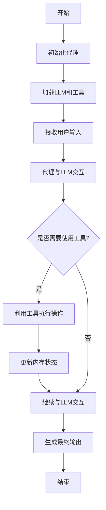

# 【LangChain编程：从入门到实践】代理的类型

## 1.背景介绍

### 1.1 什么是LangChain

LangChain是一个用于构建应用程序的框架,这些应用程序由大型语言模型(LLM)提供支持。它旨在通过提供抽象和构建模块来简化与LLM的交互。LangChain的目标是使开发人员能够轻松构建可靠的LLM应用程序。

### 1.2 代理在LangChain中的作用

在LangChain中,代理扮演着中介的角色,负责管理LLM与其他组件(如工具、数据源等)之间的交互。代理决定何时以及如何利用这些组件来完成特定的任务。它们充当了LLM和外部世界之间的桥梁,使LLM能够访问和利用各种资源。

## 2.核心概念与联系

### 2.1 代理的核心概念

代理的核心概念包括:

1. **Agents**: 代理是LangChain中的一个抽象类,它定义了与LLM交互的接口。
2. **Tools**: 工具是代理可以利用的外部资源,如数据库、API或其他服务。
3. **Memory**: 内存用于存储代理在执行任务时的中间状态和结果。

### 2.2 代理与其他LangChain组件的关系

代理与LangChain中的其他组件有着密切的联系:

1. **LLM**: 代理与LLM紧密合作,利用LLM的语言能力来理解和完成任务。
2. **Prompts**: 代理使用Prompts与LLM进行交互,传递指令和获取响应。
3. **Chains**: 代理可以作为链的一部分,与其他链组件协同工作。
4. **Indexes**: 代理可以利用索引来访问和搜索数据。

## 3.核心算法原理具体操作步骤

LangChain中代理的核心算法原理可以概括为以下几个步骤:



1. **初始化代理**: 创建代理实例,指定所使用的LLM和可用的工具集合。
2. **加载LLM和工具**: 加载指定的LLM和工具实例,为代理提供必要的资源。
3. **接收用户输入**: 代理从用户那里获取任务描述或查询。
4. **代理与LLM交互**: 代理将用户输入传递给LLM,并获取LLM的响应。
5. **判断是否需要使用工具**: 根据LLM的响应,代理决定是否需要利用工具执行某些操作。
6. **利用工具执行操作**: 如果需要,代理调用相应的工具执行操作,并获取结果。
7. **更新内存状态**: 代理将操作结果存储在内存中,以供后续使用。
8. **继续与LLM交互**: 代理将工具的输出传递给LLM,并获取新的响应。
9. **生成最终输出**: 经过一系列的交互和操作,代理最终生成任务的最终输出。
10. **结束**: 任务完成,代理结束运行。

## 4.数学模型和公式详细讲解举例说明

在LangChain中,代理的行为通常由概率模型驱动。一种常见的方法是使用马尔可夫决策过程(MDP)来建模代理与环境的交互。

在MDP中,代理的状态由以下元素组成:

- $s$: 当前状态
- $a$: 代理采取的动作
- $r$: 代理获得的即时奖励
- $s'$: 采取动作 $a$ 后的新状态
- $\pi(a|s)$: 代理在状态 $s$ 下采取动作 $a$ 的策略

代理的目标是找到一个策略 $\pi^*$,使得在遵循该策略时,代理可以获得最大的累积奖励:

$$
\pi^* = \arg\max_\pi \mathbb{E}\left[\sum_{t=0}^\infty \gamma^t r_t \right]
$$

其中 $\gamma$ 是折现因子,用于平衡即时奖励和长期奖励的权重。

为了找到最优策略,可以使用强化学习算法,如Q-Learning或策略梯度方法。这些算法通过探索不同的状态-动作对,并根据获得的奖励来更新代理的策略。

例如,在Q-Learning中,代理维护一个Q函数 $Q(s,a)$,表示在状态 $s$ 下采取动作 $a$ 后可获得的预期累积奖励。Q函数可以通过以下更新规则进行迭代更新:

$$
Q(s_t, a_t) \leftarrow Q(s_t, a_t) + \alpha \left[r_t + \gamma \max_{a'} Q(s_{t+1}, a') - Q(s_t, a_t)\right]
$$

其中 $\alpha$ 是学习率,控制更新的幅度。

通过不断探索和更新Q函数,代理最终可以找到一个近似最优的策略,使得在给定状态下,代理选择具有最大Q值的动作。

## 5.项目实践:代码实例和详细解释说明

以下是一个使用LangChain构建代理的示例代码,它演示了如何创建一个简单的代理,并与其交互:

```python
from langchain.agents import initialize_agent, Tool
from langchain.llms import OpenAI

# 定义工具
tools = [
    Tool(
        name="Wikipedia",
        func=lambda query: f"Wikipedia search result for '{query}'",
        description="A wrapper around Wikipedia to search for information"
    )
]

# 初始化代理
llm = OpenAI(temperature=0)
agent = initialize_agent(tools, llm, agent="zero-shot-react-description", verbose=True)

# 与代理交互
query = "What is the capital of France?"
result = agent.run(query)
print(result)
```

让我们逐步解释这段代码:

1. **导入必要的模块**:我们从LangChain中导入了`initialize_agent`和`Tool`类,以及OpenAI的LLM实现。

2. **定义工具**:我们定义了一个名为"Wikipedia"的工具,它是一个简单的Lambda函数,用于模拟Wikipedia的搜索功能。在实际应用中,工具可以是各种外部资源,如API、数据库或其他服务。

3. **初始化代理**:我们使用`initialize_agent`函数创建了一个代理实例。这个函数需要三个参数:可用的工具列表、LLM实例和代理的类型。在这个例子中,我们使用了"zero-shot-react-description"类型的代理,它可以根据工具的描述自动决定何时使用哪个工具。我们还设置了`verbose=True`以打印代理的思考过程。

4. **与代理交互**:我们定义了一个查询字符串"What is the capital of France?",并调用代理的`run`方法来处理这个查询。代理会与LLM交互,并根据需要利用可用的工具。

5. **输出结果**:代理的输出结果会被打印到控制台。

在这个简单的例子中,代理会识别出需要使用Wikipedia工具来回答这个问题,并输出类似于"Wikipedia search result for 'capital of France'"的结果。

当然,在实际应用中,代理可以使用更复杂的工具和LLM,以处理各种任务。LangChain提供了丰富的工具集和代理类型,开发人员可以根据需求进行定制和扩展。

## 6.实际应用场景

代理在LangChain中有广泛的应用场景,包括但不限于:

1. **问答系统**: 代理可以利用各种数据源(如知识库、文档等)回答用户的问题。
2. **任务自动化**: 代理可以协调多个工具和服务,自动执行复杂的任务流程。
3. **决策支持系统**: 代理可以分析大量数据,并为决策者提供建议和见解。
4. **个人助理**: 代理可以作为智能个人助理,帮助用户完成各种日常任务。
5. **教育和学习**: 代理可以作为智能教师或学习伙伴,提供个性化的学习体验。
6. **创意写作**: 代理可以利用LLM的创造力,协助用户进行创意写作或内容生成。

总的来说,代理在LangChain中扮演着关键角色,它们使LLM能够与外部世界进行交互,并利用各种资源完成复杂的任务。随着LangChain的不断发展,代理的应用场景将变得更加广泛和多样化。

## 7.工具和资源推荐

如果您想进一步学习和使用LangChain中的代理,以下是一些推荐的工具和资源:

1. **LangChain文档**: LangChain的官方文档(https://python.langchain.com/en/latest/index.html)提供了详细的API参考和教程,是学习和使用LangChain的绝佳资源。

2. **LangChain示例库**: LangChain维护了一个示例库(https://github.com/hwchase17/langchain-examples),包含了各种代理和其他组件的使用示例。

3. **Hugging Face Spaces**: Hugging Face Spaces(https://huggingface.co/spaces)提供了一个在线环境,您可以在其中尝试和分享LangChain应用程序。

4. **LangChain社区**: LangChain拥有一个活跃的社区,您可以在GitHub上提出问题、分享经验或贡献代码。

5. **相关书籍和课程**:虽然专门介绍LangChain的书籍和课程还很少,但您可以学习一些关于LLM、自然语言处理和人工智能的资源,以更好地理解代理的原理和应用。

6. **开源工具**: LangChain是开源的,您可以查看其源代码(https://github.com/hwchase17/langchain)以深入了解其实现细节。此外,还有一些其他开源工具(如Anthropic的Constitutional AI)也值得探索。

通过利用这些工具和资源,您可以更好地掌握LangChain中代理的使用,并开发出更加强大和智能的应用程序。

## 8.总结:未来发展趋势与挑战

代理在LangChain中扮演着关键角色,它们使LLM能够与外部世界进行交互,并利用各种资源完成复杂的任务。随着LLM技术的不断进步,代理的应用场景也将变得更加广泛和多样化。

未来,代理在LangChain中的发展趋势可能包括:

1. **更智能的决策能力**: 代理将拥有更强的推理和决策能力,能够更好地理解任务需求,并选择合适的工具和策略来完成任务。

2. **更丰富的工具集合**: 代理将能够利用更多种类的工具和资源,包括各种API、数据库、计算资源等,从而扩展其功能边界。

3. **更好的人机交互**: 代理将拥有更自然的语言交互能力,能够更好地理解人类的意图,并以更人性化的方式进行响应和解释。

4. **更强的自主学习能力**: 代理将具备自主学习和改进的能力,能够从过去的经验中学习,并不断优化自身的策略和行为。

5. **更广泛的应用领域**: 代理将被应用于更多的领域,如医疗、金融、制造业等,为这些领域带来智能化和自动化的革新。

然而,代理在LangChain中的发展也面临着一些挑战:

1. **可解释性和可控性**: 确保代理的决策过程具有透明度和可解释性,并且能够被人类有效控制和监管,是一个重要的挑战。

2. **安全性和隐私保护**: 保护代理处理的数据和信息的安全性和隐私,防止数据泄露和滥用,也是一个需要解决的问题。

3. **可靠性和鲁棒性**: 提高代理的可靠性和鲁棒性,确保其能够处理各种异常情况和边缘案例,是一个需要持续努力的目标。

4. **伦理和公平性**: 确保代理的行为符合伦理规范,不会产生偏见或歧视,是一个需要关注的重要方面。

5. **计算资源需求**: 随着代理应用的复杂性增加,对计算资源的需求也会不断增长,需