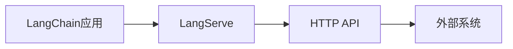

# 【LangChain编程：从入门到实践】使用LangServe提供服务

## 1. 背景介绍
### 1.1 LangChain的兴起
近年来，随着人工智能技术的飞速发展，大语言模型（LLM）在自然语言处理领域取得了令人瞩目的成就。而LangChain作为一个基于LLM的编程框架，为开发者提供了便捷的工具和接口，使得构建对话式AI应用变得更加容易。

### 1.2 LangServe的诞生
LangServe是LangChain生态系统中的一个重要组件，它允许开发者将LangChain应用封装成服务，通过HTTP API的方式对外提供。这极大地扩展了LangChain的应用场景，使其能够与其他系统进行无缝集成。

### 1.3 本文的目的
本文将深入探讨如何使用LangChain和LangServe构建强大的对话式AI应用，并提供从入门到实践的全面指南。通过阅读本文，你将掌握LangChain编程的核心概念，了解LangServe的使用方法，并学会如何将理论知识应用到实际项目中。

## 2. 核心概念与联系
### 2.1 LangChain的核心组件
- 提示模板（PromptTemplate）：定义了与LLM交互的输入格式。
- 语言模型（LanguageModel）：封装了底层的LLM，如GPT-3、BLOOM等。
- 链（Chain）：将多个组件组合在一起，形成一个完整的对话流程。
- 代理（Agent）：根据用户输入自主执行任务的智能体。

### 2.2 LangServe的作用
LangServe充当了LangChain应用与外部系统之间的桥梁。它将LangChain的强大功能封装成易于使用的HTTP API，使得其他应用能够方便地调用LangChain提供的服务。

### 2.3 LangChain与LangServe的关系


## 3. 核心算法原理具体操作步骤
### 3.1 创建提示模板
1. 定义模板字符串，使用`{变量名}`标记需要动态替换的部分。
2. 实例化`PromptTemplate`类，传入模板字符串和输入变量。

### 3.2 加载语言模型
1. 选择合适的LLM提供商，如OpenAI、Hugging Face等。
2. 配置API密钥和其他必要参数。
3. 实例化对应的`LanguageModel`子类。

### 3.3 构建链
1. 根据任务需求，选择合适的链类型，如`LLMChain`、`SequentialChain`等。
2. 将提示模板和语言模型传入链的构造函数。
3. 定义链的输入输出变量。

### 3.4 创建代理
1. 选择合适的代理类型，如`ZeroShotAgent`、`ConversationalAgent`等。
2. 配置代理的提示模板、语言模型和工具。
3. 定义代理的输入输出变量。

### 3.5 启动LangServe服务
1. 创建一个`FastAPI`应用。
2. 将LangChain组件封装成API路由处理函数。
3. 配置CORS等必要的中间件。
4. 启动服务，监听指定端口。

## 4. 数学模型和公式详细讲解举例说明
在LangChain中，一个常见的数学模型是相似度计算。它用于衡量两个文本之间的相似程度，在语义搜索、文本聚类等任务中有广泛应用。

以余弦相似度为例，其公式为：

$$\cos(\theta) = \frac{\mathbf{A} \cdot \mathbf{B}}{\|\mathbf{A}\| \|\mathbf{B}\|} = \frac{\sum_{i=1}^n A_i B_i}{\sqrt{\sum_{i=1}^n A_i^2} \sqrt{\sum_{i=1}^n B_i^2}}$$

其中，$\mathbf{A}$和$\mathbf{B}$是两个n维向量，$A_i$和$B_i$分别表示向量的第i个分量。

在实际应用中，我们通常将文本转换为向量表示，然后使用上述公式计算它们之间的余弦相似度。相似度越高，说明两个文本在语义上越接近。

## 5. 项目实践：代码实例和详细解释说明
下面是一个使用LangChain和LangServe构建问答系统的示例代码：

```python
from langchain.prompts import PromptTemplate
from langchain.llms import OpenAI
from langchain.chains import LLMChain
from fastapi import FastAPI

# 创建提示模板
template = """
请根据以下背景知识回答问题。如果无法从中得到答案，请说"不知道"。

背景知识：
{context}

问题：{question}
"""
prompt = PromptTemplate(template=template, input_variables=["context", "question"])

# 加载语言模型
llm = OpenAI(temperature=0)

# 构建链
chain = LLMChain(llm=llm, prompt=prompt)

# 创建FastAPI应用
app = FastAPI()

# 定义问答API
@app.post("/ask")
async def ask(context: str, question: str):
    result = chain.run({"context": context, "question": question})
    return {"answer": result}
```

这个示例代码的主要步骤如下：

1. 创建一个包含背景知识和问题的提示模板。
2. 加载OpenAI语言模型。
3. 使用提示模板和语言模型构建一个LLMChain。
4. 创建一个FastAPI应用，并定义一个`/ask`接口，接受背景知识和问题作为输入，返回问答结果。

通过这个示例，我们可以看到使用LangChain和LangServe构建问答系统是非常简洁和高效的。开发者只需关注提示模板的设计和链的组合，而无需过多关注底层细节。

## 6. 实际应用场景
LangChain和LangServe的组合可以应用于多种场景，包括但不限于：

- 智能客服：通过对话式交互为用户提供自动化的客户支持。
- 知识库问答：基于结构化或非结构化数据构建问答系统，帮助用户快速获取信息。
- 数据分析助手：通过自然语言交互实现数据分析和可视化。
- 代码生成：根据用户的自然语言描述自动生成代码片段。
- 文本摘要：自动提取文章的关键信息，生成简明扼要的摘要。

## 7. 工具和资源推荐
- [LangChain官方文档](https://docs.langchain.com/)：提供了详尽的API参考和使用指南。
- [LangChain GitHub仓库](https://github.com/hwchase17/langchain)：包含了LangChain的源代码和示例项目。
- [FastAPI官方文档](https://fastapi.tiangolo.com/)：FastAPI的官方文档，介绍了如何使用FastAPI构建高性能的Web API。
- [OpenAI API文档](https://beta.openai.com/docs/)：OpenAI API的官方文档，提供了使用GPT-3等语言模型的指南。
- [Hugging Face文档](https://huggingface.co/docs)：Hugging Face提供了大量预训练的语言模型，其文档介绍了如何使用这些模型。

## 8. 总结：未来发展趋势与挑战
LangChain和LangServe的出现标志着对话式AI应用开发的新时代。它们大大降低了开发门槛，使得更多的开发者能够参与到这个领域中来。

未来，我们可以期待LangChain生态系统的进一步完善，包括更多的链类型、代理类型以及与其他框架的集成。同时，随着大语言模型的不断发展，LangChain也将受益于更强大、更智能的底层模型。

然而，我们也要认识到当前的挑战。其中最主要的是如何确保生成的内容的真实性和可靠性。虽然大语言模型在很多任务上表现出色，但它们仍然存在"幻觉"的问题，即生成看似合理但实际上不正确的内容。如何在保证生成质量的同时，又不过度限制模型的创造力，是一个需要持续探索的问题。

另一个挑战是隐私和安全问题。由于LangChain应用often需要处理用户的输入数据，因此必须采取适当的措施来保护用户隐私，并防止潜在的恶意攻击。

尽管存在这些挑战，但我们相信，通过科学界和产业界的共同努力，LangChain和LangServe将不断发展和完善，为我们带来更加智能、高效、安全的对话式AI应用。

## 9. 附录：常见问题与解答
### 9.1 如何选择合适的语言模型？
选择语言模型需要考虑以下因素：
- 模型的性能：根据任务需求选择适当大小和能力的模型。
- 可用性：考虑模型的API可用性和定价。
- 定制化：某些提供商允许对模型进行微调，以适应特定领域。

### 9.2 如何处理API密钥和其他敏感信息？
在实际项目中，切忌将API密钥等敏感信息直接硬编码到源代码中。推荐的做法是：
- 使用环境变量存储敏感信息。
- 使用密钥管理服务，如AWS KMS、Google Cloud KMS等。
- 对敏感信息进行加密存储。

### 9.3 如何提高生成内容的可靠性？
提高生成内容可靠性的一些方法包括：
- 对输入数据进行预处理和过滤，确保其质量和合规性。
- 在提示模板中加入约束条件，引导模型生成符合要求的内容。
- 对生成的内容进行后处理，如过滤、校验等。
- 持续监控和评估生成内容的质量，并根据反馈优化模型和策略。

### 9.4 如何保护用户隐私和数据安全？
保护用户隐私和数据安全需要从多个方面入手：
- 遵守相关的法律法规，如GDPR、CCPA等。
- 制定并严格执行数据安全策略，包括数据的收集、存储、访问和删除。
- 对用户数据进行脱敏处理，如加密、匿名化等。
- 定期进行安全审计和渗透测试，及时发现和修复潜在的安全漏洞。
- 提高用户的隐私意识，让用户了解并控制自己的数据。

以上就是关于使用LangChain和LangServe构建对话式AI应用的入门到实践指南。相信通过本文的学习，你已经掌握了LangChain编程的核心概念和技巧，并能够将其应用到实际项目中。让我们一起探索对话式AI的无限可能吧！

作者：禅与计算机程序设计艺术 / Zen and the Art of Computer Programming