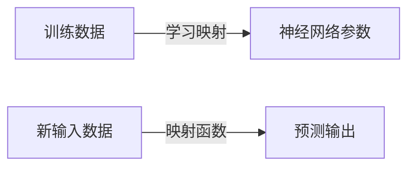

# 一切皆是映射：深度学习在农业科技中的实践

## 1. 背景介绍

### 1.1 农业科技的重要性

农业是人类赖以生存的基础产业,对于确保粮食安全、维护生态平衡和推动经济发展至关重要。然而,传统农业面临着诸多挑战,如气候变化、土地资源短缺、病虫害等。因此,将先进的科学技术应用于农业生产已成为大势所趋。

### 1.2 人工智能在农业中的作用

人工智能(AI)技术在农业领域的应用可以提高生产效率、优化资源利用、实现精准管理等。其中,深度学习作为人工智能的一个重要分支,在农业科技中扮演着越来越重要的角色。

### 1.3 深度学习在农业中的应用前景

深度学习凭借其强大的数据处理能力和模式识别能力,可以解决农业生产中的诸多复杂问题,如病虫害检测、作物生长监测、土壤分析等。随着大数据和物联网技术的发展,深度学习在农业科技中的应用前景广阔。

## 2. 核心概念与联系

### 2.1 深度学习的本质

深度学习是一种基于人工神经网络的机器学习算法,它通过对大量数据进行训练,自动学习数据特征,并用于解决各种复杂的任务,如图像识别、自然语言处理等。

### 2.2 映射的概念

在深度学习中,所有问题本质上都可以归结为一种映射关系的建立。即通过训练,找到输入数据与期望输出之间的映射函数,从而实现对新输入数据的预测或决策。


### 2.3 深度学习中的映射

深度学习模型通过对大量训练数据的学习,自动发现输入与输出之间的复杂映射关系,并将其编码到神经网络的参数中。在预测阶段,模型根据新的输入数据,通过映射函数计算出相应的输出。



### 2.4 农业问题与映射

在农业科技中,各种问题都可以转化为建立输入与输出之间的映射关系。例如,病虫害检测就是将图像数据映射到病虫种类的标签;作物生长监测是将环境数据映射到作物生长状态等。

## 3. 核心算法原理具体操作步骤  

### 3.1 神经网络基本原理

神经网络是深度学习算法的核心,它由多层神经元组成,每个神经元对输入数据进行加权求和,然后通过激活函数得到输出。网络通过反向传播算法对参数进行更新,从而学习到输入与输出之间的映射关系。


### 3.2 卷积神经网络

卷积神经网络(CNN)是处理图像数据的有效模型,它通过卷积、池化等操作自动提取图像特征,最终将图像映射到相应的类别标签。CNN广泛应用于农业中的病虫害检测、果蔬分拣等任务。


### 3.3 循环神经网络

循环神经网络(RNN)擅长处理序列数据,它通过内部状态的递归传递,捕捉数据中的时序依赖关系。在农业中,RNN可用于作物生长预测、天气预报等任务,将时间序列数据映射到未来状态。


### 3.4 生成对抗网络

生成对抗网络(GAN)由生成器和判别器组成,两者相互对抗训练,最终使生成器能够生成逼真的数据样本。在农业中,GAN可用于数据增强、图像修复等,将已有数据映射到新的数据分布。


### 3.5 强化学习

强化学习是一种基于环境交互的学习范式,智能体根据当前状态选择动作,获得奖励或惩罚,不断优化策略,最终学习到状态到动作的映射。在农业中,强化学习可应用于机器人控制、资源调度等任务。


## 4. 数学模型和公式详细讲解举例说明

### 4.1 损失函数

损失函数(Loss Function)用于衡量模型预测与真实值之间的差异,是深度学习模型训练的核心。常用的损失函数包括均方误差(MSE)、交叉熵(Cross Entropy)等。

$$
\begin{aligned}
\text{MSE} &= \frac{1}{n}\sum_{i=1}^{n}(y_i - \hat{y}_i)^2\\
\text{Cross Entropy} &= -\frac{1}{n}\sum_{i=1}^{n}[y_i\log(\hat{y}_i) + (1-y_i)\log(1-\hat{y}_i)]
\end{aligned}
$$

其中,$y_i$是真实值,$\hat{y}_i$是模型预测值,n是样本数量。

### 4.2 优化算法

优化算法用于更新模型参数,使损失函数最小化。常用的优化算法包括梯度下降(Gradient Descent)、Adam等。

$$
\theta_{t+1} = \theta_t - \eta \frac{\partial L}{\partial \theta_t}
$$

其中,$\theta_t$是当前参数,$\eta$是学习率,L是损失函数。

### 4.3 激活函数

激活函数引入非线性,使神经网络能够拟合复杂的映射关系。常用的激活函数包括Sigmoid、ReLU等。

$$
\begin{aligned}
\text{Sigmoid}(x) &= \frac{1}{1+e^{-x}}\\
\text{ReLU}(x) &= \max(0, x)
\end{aligned}
$$

### 4.4 正则化

正则化技术用于防止深度学习模型过拟合,提高其泛化能力。常用的正则化方法包括L1/L2正则化、Dropout等。

$$
L = L_0 + \lambda \Omega(\theta)
$$

其中,$L_0$是原始损失函数,$\Omega(\theta)$是正则化项(如L1范数或L2范数),$\lambda$是正则化系数。

### 4.5 评估指标

评估指标用于衡量模型的性能,不同任务使用不同的指标。常用的评估指标包括准确率(Accuracy)、精确率(Precision)、召回率(Recall)、F1分数等。

$$
\begin{aligned}
\text{Accuracy} &= \frac{TP + TN}{TP + TN + FP + FN}\\
\text{Precision} &= \frac{TP}{TP + FP}\\
\text{Recall} &= \frac{TP}{TP + FN}\\
\text{F1} &= \frac{2 \times \text{Precision} \times \text{Recall}}{\text{Precision} + \text{Recall}}
\end{aligned}
$$

其中,TP、TN、FP、FN分别表示真正例、真反例、假正例、假反例。

## 5. 项目实践：代码实例和详细解释说明

以下是一个使用PyTorch实现的简单卷积神经网络,用于农作物病虫害检测。

```python
import torch
import torch.nn as nn

# 定义卷积神经网络模型
class PlantDiseaseModel(nn.Module):
    def __init__(self):
        super(PlantDiseaseModel, self).__init__()
        self.conv1 = nn.Conv2d(3, 16, kernel_size=3, padding=1)
        self.pool = nn.MaxPool2d(2, 2)
        self.conv2 = nn.Conv2d(16, 32, kernel_size=3, padding=1)
        self.fc1 = nn.Linear(32 * 8 * 8, 64)
        self.fc2 = nn.Linear(64, 10)
        
    def forward(self, x):
        x = self.pool(nn.functional.relu(self.conv1(x)))
        x = self.pool(nn.functional.relu(self.conv2(x)))
        x = x.view(-1, 32 * 8 * 8)
        x = nn.functional.relu(self.fc1(x))
        x = self.fc2(x)
        return x

# 加载数据和预处理
# ...

# 定义损失函数和优化器
criterion = nn.CrossEntropyLoss()
optimizer = torch.optim.Adam(model.parameters(), lr=0.001)

# 训练模型
for epoch in range(10):
    for data, labels in train_loader:
        optimizer.zero_grad()
        outputs = model(data)
        loss = criterion(outputs, labels)
        loss.backward()
        optimizer.step()

# 评估模型
correct = 0
total = 0
with torch.no_grad():
    for data, labels in test_loader:
        outputs = model(data)
        _, predicted = torch.max(outputs.data, 1)
        total += labels.size(0)
        correct += (predicted == labels).sum().item()

print(f'Accuracy: {100 * correct / total:.2f}%')
```

上述代码定义了一个简单的卷积神经网络模型,包含两个卷积层、两个全连接层。在训练过程中,使用交叉熵损失函数和Adam优化器进行模型参数更新。最后,在测试集上评估模型的准确率。

该示例仅为入门级别,实际应用中需要根据具体任务调整网络结构、超参数等,并进行充分的数据预处理和模型调优。

## 6. 实际应用场景

### 6.1 病虫害检测

利用深度学习模型对农作物叶片、果实等图像进行分析,实现病虫害的自动检测和分类,为农民提供及时的防治建议,减少农作物损失。

### 6.2 作物生长监测

通过分析遥感影像、环境数据等,深度学习模型可以预测作物的生长状况、产量等,为农业决策提供依据,实现精准农业管理。

### 6.3 土壤分析

深度学习可以对土壤成分、肥力等进行分析,为施肥、种植等提供指导,提高土地利用效率。

### 6.4 农业机器人

结合计算机视觉、强化学习等技术,深度学习可以赋予农业机器人智能化操作能力,实现自动化采摘、除草等任务。

### 6.5 农产品分拣

利用深度学习对农产品进行分类、品质评估,实现自动化分拣,提高农产品质量,减少人工成本。

## 7. 工具和资源推荐

### 7.1 深度学习框架

- PyTorch: 具有简洁的接口和动态计算图,适合研究和快速原型开发。
- TensorFlow: 功能全面,支持分布式训练,适合大规模生产部署。
- Keras: 高层次的神经网络API,使用简单,易于入门。

### 7.2 数据集

- PlantVillage Dataset: 包含38种植物病害的6万多张图像。
- Agriculture-Vision: 涵盖多种农作物、土壤、农具等图像数据集。
- Crop Yield Dataset: 包含气象、土壤等数据,用于作物产量预测。

### 7.3 开源项目

- Plant-AI: 一个基于深度学习的植物病虫害检测应用程序。
- DeepPlantPhenomics: 用于植物表型分析的深度学习库。
- AgriSmart: 集成多种农业AI模型的开源平台。

### 7.4 在线课程

- Deep Learning for Computer Vision (Coursera)
- Deep Learning Specialization (Coursera)
- Deep Learning with Python and Keras (Udemy)

## 8. 总结：未来发展趋势与挑战

### 8.1 发展趋势

- 多模态融合: 将图像、文本、时序数据等多种模态数据融合,提高模型性能。
- 可解释性: 提高深度学习模型的可解释性,增加用户信任度。
- 弱监督学习: 减少对大量标注