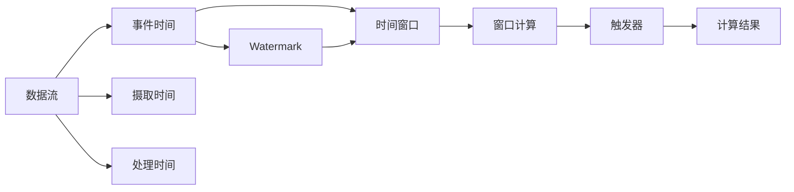

# 事件时间 原理与代码实例讲解

## 1. 背景介绍
### 1.1 事件时间的重要性
在流式数据处理中,数据通常携带时间戳信息,表示事件发生的时间。这个时间戳被称为事件时间(Event Time)。与之相对的是数据到达流处理系统的时间,即摄取时间(Ingestion Time)。事件时间在流式数据处理中至关重要,因为:
1. 事件时间代表了事件在现实世界中真正发生的时间,能够反映事件的本质属性和先后顺序。
2. 基于事件时间处理数据,可以保证结果的确定性和一致性,不受数据到达顺序和延迟的影响。
3. 事件时间使得流式数据处理系统能够支持更复杂的业务逻辑,如基于时间窗口的聚合计算、模式匹配等。

### 1.2 事件时间带来的挑战
尽管事件时间在流式数据处理中非常重要,但它也给系统设计和实现带来了挑战:
1. 数据可能无序到达,即事件时间早于之前到达的数据。系统需要能够处理乱序数据。
2. 数据可能延迟到达,即事件时间远早于摄取时间。系统需要能够处理迟到数据。
3. 不同分区的数据进度可能不一致。系统需要能够处理不同分区的 Watermark。

## 2. 核心概念与联系
### 2.1 事件时间(Event Time)
事件时间指事件在现实世界中发生的时间。在流式数据中,每个数据都应该携带事件时间戳。事件时间是事件固有的属性,与数据在系统中的处理过程无关。

### 2.2 摄取时间(Ingestion Time) 
摄取时间指数据进入流处理系统的时间,由系统自动生成。摄取时间反映了数据在系统内部的处理时间,与事件本身无关。使用摄取时间处理无法保证结果的确定性。

### 2.3 处理时间(Processing Time)
处理时间指执行操作算子时操作系统机器的本地系统时间。处理时间通常要晚于事件时间和摄取时间。

### 2.4 Watermark
Watermark 是一种衡量事件时间进展的机制。它是一个单调递增的时间戳,用于表示"在此之前的所有事件都已经到达"。Watermark 由系统定期生成和更新,可以解决数据乱序和延迟到达的问题。

### 2.5 时间窗口(Time Window)
时间窗口将流式数据按照事件时间划分为不同的窗口,每个窗口包含一个时间段内的数据。常见的时间窗口有滚动窗口(Tumbling Window)、滑动窗口(Sliding Window)和会话窗口(Session Window)。

### 2.6 触发器(Trigger)
触发器决定了何时触发窗口的计算。常见的触发器有事件时间触发器(Event Time Trigger)和处理时间触发器(Processing Time Trigger)。事件时间触发器根据 Watermark 的进展触发,保证结果的一致性;处理时间触发器根据系统时钟触发,保证结果的及时性。

### 2.7 概念之间的关系
下面是事件时间相关概念之间的关系图:


## 3. 核心算法原理具体操作步骤
### 3.1 Watermark 的生成
1. 为每个数据分区维护一个最大事件时间 MAX_EVENT_TIME。
2. 定期检查分区的最大事件时间,生成 Watermark = MAX_EVENT_TIME - 延迟阈值。
3. 将 Watermark 广播到下游算子。
4. 下游算子根据收到的多个分区的 Watermark,取其最小值作为自己的 Watermark。

### 3.2 基于事件时间的窗口计算
1. 根据事件时间将数据分配到不同的窗口。
2. 当 Watermark 到达窗口结束时间时,触发窗口的计算。
3. 对窗口内的数据执行聚合等计算。
4. 输出计算结果。
5. 清除窗口状态,释放资源。

### 3.3 处理迟到数据
1. 为窗口设置允许迟到的时间长度。
2. 当迟到数据到达时,检查其事件时间是否在窗口允许的迟到范围内。
3. 如果在允许范围内,将迟到数据加入窗口并触发增量计算。
4. 如果超出允许范围,则丢弃迟到数据。

## 4. 数学模型和公式详细讲解举例说明
### 4.1 Watermark 计算公式
假设在时间 $t$,对于数据流分区 $P_i$,其最大事件时间为 $MAX\_EVENT\_TIME(P_i)$,延迟阈值为 $D$,则分区 $P_i$ 的 Watermark 计算公式为:

$$
Watermark(P_i, t) = MAX\_EVENT\_TIME(P_i) - D
$$

例如,假设在时间 $t=10:00$,分区 $P_1$ 的最大事件时间为 $09:55$,延迟阈值为 5 分钟,则此时 $P_1$ 的 Watermark 为:

$$
Watermark(P_1, 10:00) = 09:55 - 00:05 = 09:50
$$

### 4.2 窗口计算公式
假设窗口的起始时间为 $T_s$,结束时间为 $T_e$,窗口长度为 $L$,则滚动窗口和滑动窗口的起始和结束时间计算公式为:

滚动窗口:
$$
T_s = \lfloor \frac{T}{L} \rfloor \times L
$$
$$
T_e = T_s + L
$$

滑动窗口:
$$
T_s = T - L + \delta
$$
$$
T_e = T + \delta
$$

其中,$T$ 为触发窗口计算的时间,$\delta$ 为滑动步长。

例如,假设触发时间 $T=10:00$,窗口长度 $L=30min$,则滚动窗口的起始和结束时间为:

$$
T_s = \lfloor \frac{10:00}{30min} \rfloor \times 30min = 09:30
$$
$$
T_e = 09:30 + 30min = 10:00
$$

如果是滑动窗口,滑动步长 $\delta=5min$,则滑动窗口的起始和结束时间为:

$$
T_s = 10:00 - 30min + 5min = 09:35
$$ 
$$
T_e = 10:00 + 5min = 10:05
$$

## 5. 项目实践：代码实例和详细解释说明
下面是使用 Apache Flink 处理事件时间的代码示例。该示例读取 socket 数据,按照 user 划分分区,然后按照 user 和 30 秒的滚动事件时间窗口进行单词计数。

```java
StreamExecutionEnvironment env = StreamExecutionEnvironment.getExecutionEnvironment();

// 从 socket 读取数据
DataStream<String> lines = env.socketTextStream("localhost", 9999);

// 解析数据
DataStream<Tuple2<String, Integer>> words = lines.map(new MapFunction<String, Tuple2<String, Integer>>() {
    @Override
    public Tuple2<String, Integer> map(String line) {
        String[] fields = line.split(",");
        String user = fields[0];
        String word = fields[1];
        return new Tuple2<>(user + "-" + word, 1);
    }
})
.returns(Types.TUPLE(Types.STRING, Types.INT));

// 生成 watermark
DataStream<Tuple2<String, Integer>> wordsWithWatermark = words
    .assignTimestampsAndWatermarks(
        WatermarkStrategy.<Tuple2<String, Integer>>forBoundedOutOfOrderness(Duration.ofSeconds(5))
            .withTimestampAssigner((event, timestamp) -> Long.parseLong(event.f0.split("-")[2]))
    );

// 按照 user 和窗口聚合
DataStream<Tuple3<String, String, Integer>> windowCounts = wordsWithWatermark
    .keyBy(value -> value.f0.split("-")[0])
    .window(TumblingEventTimeWindows.of(Time.seconds(30)))
    .apply(new WindowFunction<Tuple2<String, Integer>, Tuple3<String, String, Integer>, String, TimeWindow>() {
        @Override
        public void apply(String user, TimeWindow window, Iterable<Tuple2<String, Integer>> input, Collector<Tuple3<String, String, Integer>> out) {
            int count = 0;
            for (Tuple2<String, Integer> word : input) {
                count++;
            }
            out.collect(new Tuple3<>(user, window.getStart() + "~" + window.getEnd(), count));
        }
    });

// 打印结果
windowCounts.print();

env.execute("EventTime Example");
```

代码详细解释:
1. 首先创建 StreamExecutionEnvironment,作为流处理程序的入口。
2. 使用 `socketTextStream` 从 socket 读取字符串数据。
3. 使用 `map` 算子将每行数据解析成 `(user-word, 1)` 的形式。
4. 使用 `assignTimestampsAndWatermarks` 生成事件时间戳和 watermark。这里使用 `forBoundedOutOfOrderness` 设置最大允许的乱序时间为 5 秒。
5. 使用 `keyBy` 算子按照 user 对数据分区。
6. 使用 `window` 算子定义 30 秒的滚动事件时间窗口。
7. 使用 `apply` 算子执行窗口函数,计算每个 user 在每个窗口的单词数。
8. 使用 `print` 算子打印结果。
9. 最后调用 `execute` 提交作业。

## 6. 实际应用场景
事件时间在很多实际场景中都有广泛应用,例如:
1. 实时 ETL:将原始数据按照事件时间进行清洗、转换和聚合,生成结构化的数据。
2. 实时大屏监控:按照事件时间统计各种 KPI 指标,并在大屏上实时展示。
3. 实时异常检测:按照事件时间分析数据,实时发现异常行为并报警。
4. 实时个性化推荐:根据用户的实时行为,按照事件时间生成个性化推荐结果。
5. 实时风控决策:按照事件时间分析交易数据,实时判断风险并做出决策。

## 7. 工具和资源推荐
1. Apache Flink:支持丰富的事件时间语义,是流式数据处理的首选工具。官网:https://flink.apache.org/
2. Apache Beam:提供统一的编程模型,支持事件时间处理,可以运行在多种流处理引擎上。官网:https://beam.apache.org/
3. Alibaba JStorm:阿里巴巴开源的流处理引擎,支持事件时间语义。GitHub:https://github.com/alibaba/jstorm
4. 《Stream Processing with Apache Flink》:Flink 的权威指南,对事件时间有深入讲解。https://book.douban.com/subject/33426127/
5. Flink 官方文档:https://nightlies.apache.org/flink/flink-docs-release-1.14/

## 8. 总结：未来发展趋势与挑战
事件时间是流式数据处理的核心,未来仍将是研究和应用的重点。一些发展趋势和挑战包括:
1. 事件时间聚合的增量计算:随着数据量和窗口数的增加,窗口状态可能成为瓶颈。增量计算可以减少状态存储和计算开销。
2. 事件时间处理的exactly-once保证:在故障恢复时,如何保证事件时间语义下的计算只执行一次,是一个需要解决的问题。
3. 事件时间窗口的动态调整:根据数据特征和业务需求,动态调整窗口的大小和滑动步长,提高灵活性和效率。
4. 多维事件时间的处理:一些场景下,数据可能有多个时间属性,如何同时处理多个事件时间,值得研究。
5. 事件时间语义的标准化:不同的流处理系统对事件时间的支持方式略有差异,需要在社区中形成标准,方便用户使用。

## 9. 附录：常见问题与解答
1. 为什么要使用事件时间而不是摄取时间?
   答:事件时间代表了事件在现实世界中发生的真实时间,能够反映事件的本质属性。而