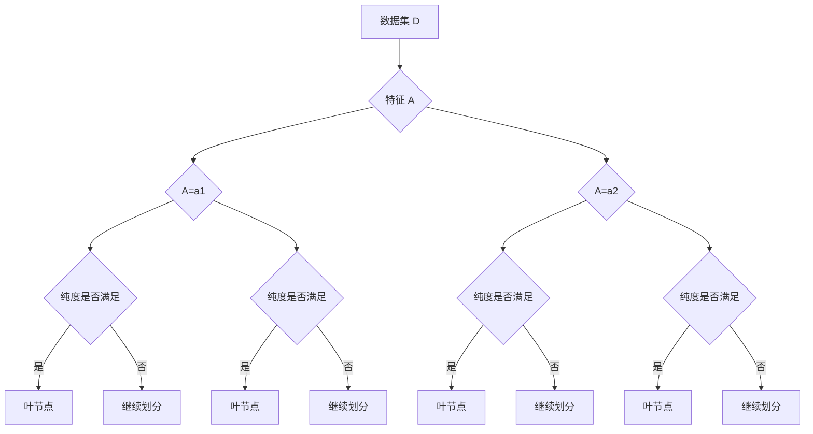

# 决策树算法:从熵增益到CART树

## 1. 背景介绍
### 1.1 决策树的起源与发展
决策树是一种基于树形结构的监督式机器学习算法,广泛应用于分类和回归任务。其起源可以追溯到20世纪60年代,由E.B.Hunt等人首次提出。此后,决策树算法不断发展,涌现出ID3、C4.5、CART等经典算法。

### 1.2 决策树的优势
决策树具有易于理解和解释、能够处理数值型和类别型数据、对缺失值不敏感等优点。相比其他机器学习模型,决策树的白盒特性使其在某些领域(如医疗诊断)更受青睐。

### 1.3 决策树的应用场景
决策树在诸多领域有着广泛应用,如:
- 金融风控:评估贷款申请人的违约风险
- 医疗诊断:根据症状预测疾病
- 营销:预测客户是否会购买某产品
- 人力资源:预测员工是否会离职

## 2. 核心概念与联系
### 2.1 熵与信息增益
- 熵:描述数据集的混乱程度,熵越大,数据越混乱。公式为:
$$
H(X) = -\sum_{i=1}^{n} p_i \log_2 p_i
$$
- 信息增益:衡量某特征对数据集分类的贡献。选择信息增益最大的特征作为分裂节点。公式为:
$$
Gain(D,A) = H(D) - \sum_{v \in A} \frac{|D^v|}{|D|} H(D^v) 
$$

### 2.2 基尼指数
另一种衡量数据混乱程度的指标,反映数据集中类别的概率。基尼指数越小,数据纯度越高。CART算法使用基尼指数选择分裂特征。公式为:
$$
Gini(D) = 1 - \sum_{k=1}^{K} p_k^2
$$

### 2.3 过拟合与剪枝
决策树容易出现过拟合,泛化能力差。剪枝是解决过拟合的重要手段,分为预剪枝和后剪枝两种。预剪枝在生成树的过程中进行,后剪枝在生成完整决策树后进行。

## 3. 核心算法原理具体操作步骤
### 3.1 ID3算法
1. 计算每个特征的信息增益
2. 选择信息增益最大的特征作为当前节点
3. 对该特征的每个取值,递归生成子树
4. 重复步骤1-3,直到所有样本属于同一类别或无可用特征

### 3.2 C4.5算法
1. 计算每个特征的信息增益比
2. 选择信息增益比最大的特征作为当前节点 
3. 对该特征的每个取值,递归生成子树
4. 重复步骤1-3,直到满足停止条件
5. 进行剪枝操作

### 3.3 CART算法
1. 对每个特征,寻找最优分裂点
2. 在所有特征中,选择基尼指数最小的分裂点
3. 递归生成子树,直到满足停止条件
4. 自底向上进行代价复杂度剪枝

## 4. 数学模型和公式详细讲解举例说明
### 4.1 熵的计算
假设有数据集D,类别为{C1,C2},各类别样本数为{20,80},则熵为:
$$
\begin{aligned}
H(D) &= -(\frac{20}{100} \log_2 \frac{20}{100} + \frac{80}{100} \log_2 \frac{80}{100}) \\
&= 0.722
\end{aligned}
$$

### 4.2 信息增益的计算
假设按特征A划分数据集D,A有两个取值{A1,A2},各取值对应的样本数为{15,5},{40,40},则A的信息增益为:
$$
\begin{aligned}
Gain(D,A) &= H(D) - (\frac{20}{100}H(D^{A1}) + \frac{80}{100}H(D^{A2})) \\  
&= 0.722 - (\frac{20}{100} \times 0.811 + \frac{80}{100} \times 1.0) \\
&= 0.118
\end{aligned}
$$

### 4.3 基尼指数的计算
假设有数据集D,类别为{C1,C2},各类别样本数为{30,70},则基尼指数为:
$$
\begin{aligned}
Gini(D) &= 1 - (\frac{30}{100})^2 - (\frac{70}{100})^2 \\
&= 0.42  
\end{aligned}
$$

## 5. 项目实践:代码实例和详细解释说明
以下使用Python的scikit-learn库实现CART决策树:

```python
from sklearn.datasets import load_iris
from sklearn.tree import DecisionTreeClassifier
from sklearn.model_selection import train_test_split

# 加载数据集
iris = load_iris()
X = iris.data
y = iris.target

# 划分训练集和测试集
X_train, X_test, y_train, y_test = train_test_split(X, y, test_size=0.3)

# 创建CART决策树
clf = DecisionTreeClassifier()

# 训练模型
clf.fit(X_train, y_train)

# 预测
y_pred = clf.predict(X_test)

# 评估模型
from sklearn.metrics import accuracy_score
print("Accuracy:", accuracy_score(y_test, y_pred))
```

代码解释:
1. 加载经典的iris数据集
2. 将数据划分为训练集和测试集
3. 创建CART决策树分类器
4. 用训练集数据训练模型
5. 用训练好的模型对测试集进行预测
6. 计算模型在测试集上的准确率

## 6. 实际应用场景
### 6.1 信用评分
利用决策树对贷款申请人的个人信息(如收入、职业、信用记录等)进行分析,预测其违约风险,从而决定是否批准贷款。

### 6.2 医学诊断
根据患者的症状、体征、化验结果等信息,使用决策树预测患者可能患有的疾病,辅助医生进行诊断。

### 6.3 客户流失预警
通过分析客户的消费行为、互动频率等数据,使用决策树预测客户流失的可能性,提前采取措施挽留客户。

## 7. 工具和资源推荐
- scikit-learn:Python机器学习库,提供了多种决策树算法的实现
- Weka:Java机器学习工具箱,包含了决策树算法及其可视化工具
- R语言rpart包:R语言中用于生成CART决策树的软件包
- 《机器学习》(周志华):经典的机器学习教材,对决策树有深入浅出的讲解
- 《数据挖掘:概念与技术》(Jiawei Han):系统介绍了数据挖掘的各种方法,包括决策树

## 8. 总结:未来发展趋势与挑战
### 8.1 未来发展趋势
- 结合其他算法:如将决策树与神经网络、boosting等算法相结合,提升性能
- 处理大数据:设计适用于海量数据的决策树算法,提高训练效率
- 在线学习:开发能够实时更新的决策树,适应动态变化的数据流
- 可解释性:进一步增强决策树的可解释性,使其在某些领域更具优势

### 8.2 面临的挑战
- 缺失值处理:如何在决策树生成过程中更好地处理缺失值
- 连续值处理:如何选择最优分裂点,使决策树的性能最大化
- 不平衡数据:如何处理类别分布不平衡的数据集
- 高维数据:如何在高维度特征空间中高效地生成决策树

## 9. 附录:常见问题与解答
### 9.1 决策树的优缺点是什么?
优点:易于理解和解释、能处理不同类型的数据、对缺失值不敏感。
缺点:容易过拟合、对特征选择敏感、不适合处理回归问题。

### 9.2 信息增益和基尼指数的区别?
信息增益衡量特征对数据集分类的贡献,基尼指数衡量数据集的纯度。ID3和C4.5使用信息增益,CART使用基尼指数。在大多数情况下,两者的效果相当。

### 9.3 预剪枝和后剪枝的区别?
预剪枝在决策树生成过程中就对树进行剪枝,后剪枝先生成完整的树再进行剪枝。预剪枝速度更快但可能欠拟合,后剪枝速度慢但更加准确。

### 9.4 决策树如何处理连续值特征?
主要有两种策略:
1. 二分法:选择一个阈值,将连续值特征转化为"大于阈值"和"小于等于阈值"两类
2. 多分法:将连续值特征划分为多个区间,每个区间对应一个取值

### 9.5 决策树的生成是否对特征缩放敏感?
决策树对特征缩放不敏感。决策树在选择最优分裂点时,不考虑特征值的大小,只考虑特征取值的类别分布情况。因此无需对数据进行标准化或归一化处理。

以上就是对决策树算法的全面介绍,从信息论的角度解释了决策树的核心概念,并详细讲解了几种经典算法。结合具体的数学公式和代码实例,使读者对决策树的原理和实现有更深刻的理解。同时,也分析了决策树的优缺点、应用场景以及面临的挑战,为进一步研究和应用决策树提供了方向。

希望这篇文章能够帮助读者掌握决策树的相关知识,在实际问题中灵活运用决策树算法,发挥其在分类和预测任务中的优势。

作者：禅与计算机程序设计艺术 / Zen and the Art of Computer Programming

