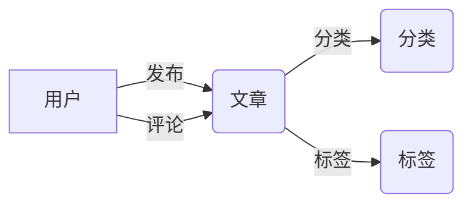

# 博客网站详细设计与具体代码实现

## 1. 背景介绍

在当今互联网时代,个人博客已经成为一种流行的表达自我、分享知识和经验的方式。越来越多的人希望拥有自己的博客网站,但是对于非技术背景的人来说,从零开始搭建一个博客系统可能是一个不小的挑战。本文将详细介绍如何从需求分析、架构设计到具体代码实现,一步步带你搭建一个完整的博客网站。

### 1.1 为什么要搭建个人博客网站

- 表达自我,记录生活点滴
- 分享知识和经验,帮助他人成长
- 提升个人品牌影响力
- 锻炼技术能力,学习新技术

### 1.2 博客网站的核心功能

- 文章管理:发布、编辑、删除、分类、标签、搜索等
- 用户管理:注册、登录、权限控制等  
- 评论互动:读者评论,博主回复等
- 页面展示:首页、列表页、详情页等
- 数据统计:文章阅读量、访问量等

## 2. 核心概念与联系

在正式开始设计和开发博客网站之前,我们需要了解一些核心概念以及它们之间的联系。

### 2.1 前后端分离架构

前后端分离是指前端(客户端)和后端(服务端)的开发可以分开进行,通过约定的接口进行数据交互。

- 前端:负责页面展示和交互,通常使用 HTML、CSS、JavaScript 等技术。
- 后端:负责业务逻辑处理和数据存储,通常使用 Java、Python、Node.js 等技术。
- API:前后端通过 HTTP 接口进行数据交互,常见的数据格式有 JSON、XML 等。

### 2.2 MVC 设计模式

MVC 是一种经典的软件设计模式,把系统划分为 Model(模型)、View(视图)、Controller(控制器)三部分。

- Model:负责业务逻辑和数据操作,与数据库交互。
- View:负责界面显示,与用户交互。
- Controller:负责接收请求,调用 Model 处理业务逻辑,返回结果给 View。

MVC 模式的优点是职责清晰、模块化程度高,有利于代码的维护和扩展。很多主流的 Web 框架都是基于 MVC 模式设计的。

### 2.3 数据库设计

博客网站需要存储大量的数据,如文章、分类、标签、用户、评论等,因此需要合理地设计数据库表结构。常见的数据库有关系型数据库(如 MySQL)和非关系型数据库(如 MongoDB)。

以下是博客系统的核心数据表设计示例:

- 文章表:存储文章的标题、内容、作者、发布时间、阅读量等信息。  
- 分类表:存储文章的分类信息,如分类名称、描述等。
- 标签表:存储文章的标签信息,如标签名称等。
- 用户表:存储用户的基本信息,如用户名、密码、邮箱、角色等。
- 评论表:存储文章的评论信息,如评论内容、评论人、评论时间等。

### 2.4 概念之间的联系

下图展示了博客系统中几个核心概念之间的联系:



用户可以发布文章,文章可以被分类和打标签,用户还可以对文章进行评论。这些概念环环相扣,构成了博客系统的核心功能。

## 3. 核心算法原理具体操作步骤

接下来我们将介绍博客系统中的一些核心算法原理,并给出具体的操作步骤。

### 3.1 文本相似度算法

在博客系统中,我们可能需要根据文章内容的相似度来推荐相关文章。常见的文本相似度算法有:

- TF-IDF 算法:统计词频-逆文档频率,用于评估一个词对于一个文档的重要程度。
- Word2Vec 算法:通过神经网络将词转换为向量,通过向量之间的距离来衡量词语的相似度。
- SimHash 算法:通过哈希求值的方式,快速计算两个文本的相似度。

以 TF-IDF 算法为例,具体步骤如下:

1. 分词:将文章内容切分成一个个词语。
2. 统计词频:统计每个词语在该文章中出现的次数。 
3. 计算逆文档频率:统计包含该词语的文档数,并取其倒数的对数。
4. 计算 TF-IDF 值:将词频和逆文档频率相乘,得到该词语对于该文档的 TF-IDF 值。
5. 生成文档向量:根据各个词语的 TF-IDF 值,生成该文档的特征向量。
6. 计算相似度:计算两个文档向量的余弦相似度,值越大表示越相似。

### 3.2 全文搜索算法

博客系统需要支持根据关键词搜索文章,常见的全文搜索算法有:

- 倒排索引:对文章内容建立词语到文档的映射关系,搜索时根据关键词快速找到包含该词的文档。
- Elasticsearch:基于 Lucene 的开源分布式搜索引擎,提供了强大的全文搜索功能。

以倒排索引为例,具体步骤如下:

1. 文档预处理:对文章内容进行分词、去停用词、提取词干等操作。
2. 创建词典:将所有词语去重后,生成一个词典。
3. 创建倒排表:对每个词语,记录包含该词的文档 ID。
4. 计算词频:对每个词语,记录它在每个文档中出现的次数。
5. 接受查询:用户输入搜索关键词,分词后得到一组词语。
6. 执行查询:在倒排表中查找每个词语,求交集得到包含所有关键词的文档,根据词频等因素对结果排序。

## 4. 数学模型和公式详细讲解举例说明

在博客系统中,有一些功能需要用到数学模型和公式。下面我们以文本相似度中的 TF-IDF 算法为例,详细讲解其中的数学原理。

### 4.1 TF-IDF 算法原理

TF-IDF(Term Frequency-Inverse Document Frequency)由两部分组成:

- TF(词频):一个词在文档中出现的频率。
- IDF(逆文档频率):一个词在所有文档中出现的频率的倒数。

TF 的计算公式为:

$$
TF(t,d) = \frac{f_{t,d}}{\sum_{t'\in d} f_{t',d}}
$$

其中,$f_{t,d}$表示词语 $t$ 在文档 $d$ 中出现的次数,$\sum_{t'\in d} f_{t',d}$表示文档 $d$ 中所有词语出现的次数之和。

IDF 的计算公式为:

$$
IDF(t,D) = \log \frac{|D|}{|\{d\in D:t\in d\}|}
$$

其中,$|D|$表示语料库中的文档总数,$|\{d\in D:t\in d\}|$表示包含词语 $t$ 的文档数。

TF-IDF 的计算公式为:

$$
TFIDF(t,d,D) = TF(t,d) \times IDF(t,D)
$$

### 4.2 举例说明

假设我们有两个文档:

- 文档1:"This is a sample document, it is used for explaining TF-IDF."
- 文档2:"This document is another example to illustrate TF-IDF algorithm."

对于词语"document",我们来计算它在文档1中的 TF-IDF 值。

首先计算 TF 值:
- 文档1中"document"出现了1次,总词数为12,所以$TF(document,文档1)=\frac{1}{12}$。

然后计算 IDF 值:  
- 语料库中共有2个文档,其中2个文档都包含"document",所以$IDF(document)=\log\frac{2}{2}=0$。

最后计算 TF-IDF 值:
- $TFIDF(document,文档1)=\frac{1}{12}\times 0=0$

可见,对于一个在所有文档中都频繁出现的词,"document",其 TF-IDF 值会很低。这恰好反映了 TF-IDF 的核心思想:如果一个词在许多文档中频繁出现,那么它对于区分文档可能不太重要。

## 5. 项目实践:代码实例和详细解释说明

下面我们将使用 Python 的 Flask 框架,演示如何实现一个简单的博客系统。

### 5.1 项目结构

```
.
├── app.py
├── templates
│   ├── index.html
│   ├── post.html
│   └── editor.html  
└── static
    ├── css
    │   └── style.css
    └── js 
        └── main.js
```

- app.py:Flask 应用主文件
- templates:HTML 模板文件
- static:静态资源文件(CSS、JS)

### 5.2 数据库设计

使用 Flask-SQLAlchemy 定义数据库模型:

```python
from flask_sqlalchemy import SQLAlchemy

db = SQLAlchemy()

class Post(db.Model):
    id = db.Column(db.Integer, primary_key=True)
    title = db.Column(db.String(100), nullable=False)
    content = db.Column(db.Text, nullable=False)
    created_at = db.Column(db.DateTime, default=datetime.utcnow)

    def __repr__(self):
        return f'<Post {self.title}>'
```

这里我们定义了一个简单的 Post 模型,包含了文章的标题、内容、创建时间等字段。

### 5.3 路由设计

在 app.py 中定义路由:

```python
@app.route('/')
def index():
    posts = Post.query.order_by(Post.created_at.desc()).all()
    return render_template('index.html', posts=posts)

@app.route('/post/<int:post_id>')
def post(post_id):
    post = Post.query.get_or_404(post_id)
    return render_template('post.html', post=post)

@app.route('/editor', methods=['GET', 'POST'])
def editor():
    if request.method == 'POST':
        title = request.form['title']
        content = request.form['content']
        post = Post(title=title, content=content)
        db.session.add(post)
        db.session.commit()
        return redirect(url_for('index'))
    return render_template('editor.html')  
```

- `/`:博客首页,展示所有文章列表
- `/post/<int:post_id>`:文章详情页,展示指定 ID 的文章内容
- `/editor`:文章编辑页,GET 请求展示表单,POST 请求处理表单提交

### 5.4 模板设计

使用 Jinja2 模板引擎渲染 HTML 页面,例如 index.html:

```html



  <h1>My Blog</h1>
  
    <div class="post">
      <h2><a href="{{ url_for('post', post_id=post.id) }}">{{ post.title }}</a></h2>
      <p>{{ post.content[:100] }}...</p>
    </div>
  

```

这里我们遍历 posts 列表,展示每篇文章的标题和摘要,标题链接到文章详情页。

### 5.5 运行应用

在 app.py 中添加启动代码:

```python
if __name__ == '__main__':
    app.run(debug=True)
```

在命令行中运行`python app.py`,然后在浏览器中访问`http://localhost:5000`,就可以看到我们的博客网站了。

## 6. 实际应用场景

个人博客系统可以应用于以下场景:

- 个人知识管理:用博客记录学习笔记、心得体会、技术总结等。
- 个人品牌建设:用博客展示自己的技能、经验、思想,提升个人影响力。
- 技术交流分享:用博客分享技术文章、教程、案例等,与同行交流切磋。
- 商业变现:通过博客积累用户,开展内容付费、广告投放、商品销售等商业活动。

除了个人博客,类似的系统还可以应用于:

- 企业官网:用于发布公司新闻、产品介绍、技术文章等。
- 资讯门户:用于发布行业新闻、热点事件、深度报道等。
- 在线教育:用于发布教学视频、课程资料、作业评价等。

## 7. 工具和资源推荐

- 前端框架: