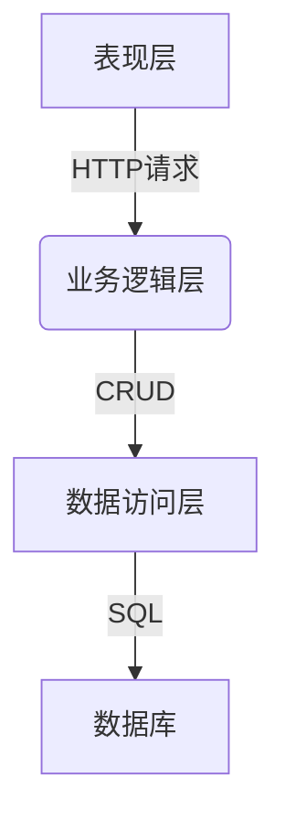
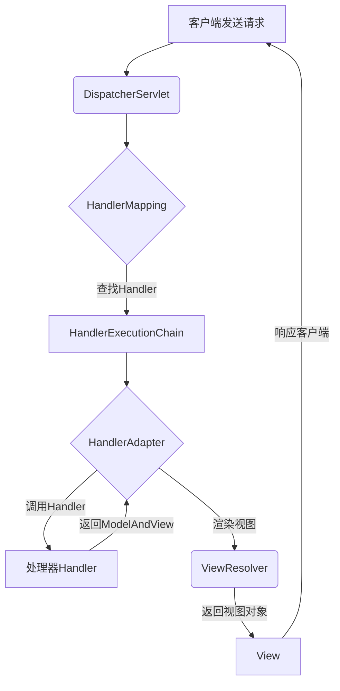
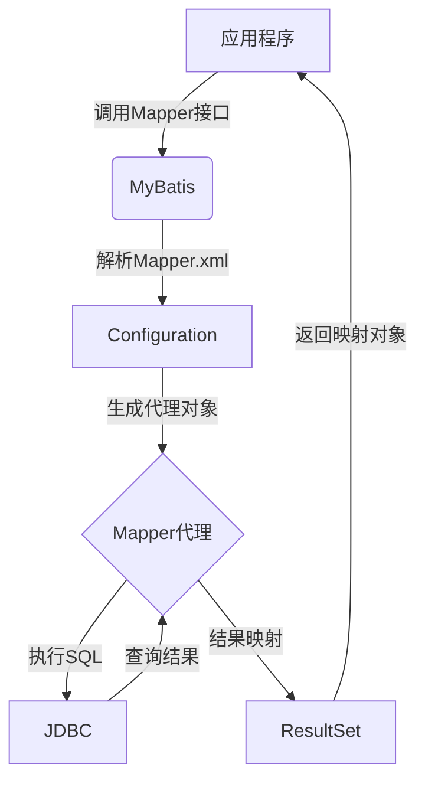

# 基于SSM的高校科研管理系统

## 1. 背景介绍

随着科研活动在高校中的日益重要,构建一个高效的科研管理系统变得越来越迫切。传统的科研管理方式已经无法满足现代高校对科研项目、经费、成果等管理的需求。因此,开发一个基于Web的、集中式的科研管理系统就显得尤为必要。

本文介绍了一种基于SSM(Spring、SpringMVC、MyBatis)框架的高校科研管理系统的设计与实现。该系统旨在提高科研管理的效率,实现项目申请、审批、经费管理、成果管理等功能,为高校的科研工作提供强有力的支持。

## 2. 核心概念与联系

### 2.1 SSM框架

SSM框架是指Spring+SpringMVC+MyBatis框架的集合,是目前JavaWeb开发中最流行的框架之一。

- Spring: 提供了面向切面编程(AOP)和控制反转(IOC)等功能,用于管理应用中的对象及其依赖关系。
- SpringMVC: 基于Spring框架,是一种Web层框架,用于构建请求驱动的Web应用程序。
- MyBatis: 一种优秀的持久层框架,用于执行SQL语句、存取数据库数据。

这三个框架相互协作,构建了一个高效、灵活的JavaWeb应用程序架构。

### 2.2 系统架构

本系统采用经典的三层架构:表现层、业务逻辑层和数据访问层。



- 表现层: 基于SpringMVC框架,接收HTTP请求,调用业务逻辑层的服务,并渲染视图。
- 业务逻辑层: 基于Spring框架,处理业务逻辑,调用数据访问层完成数据操作。
- 数据访问层: 基于MyBatis框架,执行数据库CRUD操作。

## 3. 核心算法原理具体操作步骤  

### 3.1 SpringMVC请求处理流程

SpringMVC通过一系列组件协作,实现了请求到视图的映射过程。其核心原理如下:



1. 客户端发送HTTP请求到前端控制器DispatcherServlet
2. DispatcherServlet通过HandlerMapping查找对应的Handler
3. HandlerAdapter调用具体的Handler处理请求,返回ModelAndView
4. ViewResolver解析ModelAndView,渲染具体的View视图
5. 将渲染结果响应给客户端

### 3.2 MyBatis工作原理

MyBatis通过动态代理机制,简化了JDBC编程。其核心原理如下:



1. 应用程序调用MyBatis中的Mapper接口方法
2. MyBatis解析Mapper.xml文件,构建Configuration对象
3. 通过动态代理机制,生成Mapper接口的代理对象
4. 代理对象执行JDBC操作,查询数据库
5. 将ResultSet结果集映射为Java对象,返回给应用程序

## 4. 数学模型和公式详细讲解举例说明

在科研管理系统中,经常需要进行统计分析,例如计算某位教师的科研总经费、论文总数等。这里介绍一种基于加权平均的综合评分模型。

设某教师的科研业绩包括:

- 纵向项目经费 $x_1$
- 横向项目经费 $x_2$
- 发表论文数量 $x_3$
- 获奖数量 $x_4$

我们可以为每个指标赋予不同的权重 $w_i$ ,计算加权平均分作为综合评分:

$$
\text{综合评分} = \frac{\sum_{i=1}^4 w_i x_i}{\sum_{i=1}^4 w_i}
$$

其中, $\sum_{i=1}^4 w_i = 1$

例如,若权重分别为 $w_1=0.4, w_2=0.2, w_3=0.3, w_4=0.1$,某教师的科研业绩为 $x_1=500000, x_2=200000, x_3=8, x_4=2$,则综合评分为:

$$
\begin{aligned}
\text{综合评分} &= \frac{0.4 \times 500000 + 0.2 \times 200000 + 0.3 \times 8 + 0.1 \times 2}{0.4 + 0.2 + 0.3 + 0.1} \\
               &= \frac{200000 + 40000 + 2.4 + 0.2}{1} \\
               &= 242402.6
\end{aligned}
$$

通过这种方式,可以量化教师的科研业绩,为绩效考核、职称评定等提供依据。

## 5. 项目实践:代码实例和详细解释说明

### 5.1 项目结构

```
src
├── main
│   ├── java
│   │   └── com
│   │       └── university
│   │           ├── controller
│   │           ├── dao
│   │           ├── entity
│   │           ├── service
│   │           └── util
│   └── resources
│       ├── mapper
│       ├── spring
│       └── spring-mvc.xml
├── test
└── pom.xml
```

- controller: 处理HTTP请求,调用Service层
- dao: 数据访问对象,执行数据库操作
- entity: 实体类,与数据库表对应 
- service: 业务逻辑层,调用DAO层
- util: 工具类
- mapper: MyBatis的映射文件
- spring: Spring配置文件
- spring-mvc.xml: SpringMVC配置文件

### 5.2 Controller示例

```java
@Controller
@RequestMapping("/project")
public class ProjectController {

    @Autowired
    private ProjectService projectService;

    @RequestMapping(value = "/add", method = RequestMethod.POST)
    public String addProject(@ModelAttribute("project") Project project) {
        projectService.addProject(project);
        return "redirect:/project/list";
    }

    @RequestMapping(value = "/list", method = RequestMethod.GET)
    public String listProjects(Model model) {
        List<Project> projects = projectService.listProjects();
        model.addAttribute("projects", projects);
        return "project/list";
    }
}
```

- `@Controller` 注解标识这是一个控制器类
- `@RequestMapping` 注解映射HTTP请求URL
- `@Autowired` 注解自动注入Service层对象
- `addProject` 方法处理新增项目的POST请求
- `listProjects` 方法获取所有项目列表,传递给视图

### 5.3 Service示例

```java
@Service
public class ProjectServiceImpl implements ProjectService {

    @Autowired
    private ProjectDao projectDao;

    @Override
    public void addProject(Project project) {
        projectDao.insertProject(project);
    }

    @Override
    public List<Project> listProjects() {
        return projectDao.selectAllProjects();
    }
}
```

- `@Service` 注解标识这是一个服务层类
- `@Autowired` 注解自动注入DAO层对象
- `addProject` 方法调用DAO层插入新项目
- `listProjects` 方法调用DAO层查询所有项目

### 5.4 DAO示例

```java
@Repository
public class ProjectDaoImpl implements ProjectDao {

    @Autowired
    private SqlSessionFactory sqlSessionFactory;

    @Override
    public void insertProject(Project project) {
        SqlSession session = sqlSessionFactory.openSession();
        try {
            session.insert("com.university.mapper.ProjectMapper.insertProject", project);
            session.commit();
        } finally {
            session.close();
        }
    }

    @Override
    public List<Project> selectAllProjects() {
        SqlSession session = sqlSessionFactory.openSession();
        try {
            return session.selectList("com.university.mapper.ProjectMapper.selectAllProjects");
        } finally {
            session.close();
        }
    }
}
```

- `@Repository` 注解标识这是一个DAO层类
- `@Autowired` 注解自动注入SqlSessionFactory对象
- `insertProject` 方法执行插入项目的SQL语句
- `selectAllProjects` 方法执行查询所有项目的SQL语句

### 5.5 Mapper文件示例

```xml
<?xml version="1.0" encoding="UTF-8" ?>
<!DOCTYPE mapper PUBLIC "-//mybatis.org//DTD Mapper 3.0//EN" "http://mybatis.org/dtd/mybatis-3-mapper.dtd">
<mapper namespace="com.university.mapper.ProjectMapper">
    <resultMap id="projectResultMap" type="com.university.entity.Project">
        <id property="id" column="id"/>
        <result property="name" column="name"/>
        <result property="funds" column="funds"/>
        <result property="startDate" column="start_date"/>
        <result property="endDate" column="end_date"/>
    </resultMap>

    <insert id="insertProject" parameterType="com.university.entity.Project">
        INSERT INTO project (name, funds, start_date, end_date)
        VALUES (#{name}, #{funds}, #{startDate}, #{endDate})
    </insert>

    <select id="selectAllProjects" resultMap="projectResultMap">
        SELECT id, name, funds, start_date, end_date
        FROM project
    </select>
</mapper>
```

- `<mapper>` 元素定义一个映射器
- `<resultMap>` 元素描述了结果集与实体类的映射关系
- `<insert>` 元素定义插入项目的SQL语句
- `<select>` 元素定义查询所有项目的SQL语句

通过以上代码示例,我们可以看到SSM框架的使用方式,以及如何实现基本的CRUD功能。

## 6. 实际应用场景

本系统可以广泛应用于高校的科研管理工作,主要场景包括:

1. **项目申请与审批**:教师可在线提交项目申请,系统自动流转审批流程,提高审批效率。

2. **经费管理**:系统集中管理各项目的经费使用情况,方便财务人员核算。

3. **成果管理**:教师可在线录入科研成果(论文、专利等),系统自动生成成果统计报表。

4. **绩效考核**:基于教师的科研业绩数据,系统可自动计算综合评分,为绩效考核提供依据。

5. **决策分析**:管理员可查看可视化的统计报表,了解学校科研发展状况,为决策提供支持。

该系统的应用,可以显著提升高校科研管理的信息化水平,减轻管理人员的工作强度。

## 7. 工具和资源推荐

在开发本系统时,使用了一些优秀的工具和资源,推荐如下:

1. **IntelliJ IDEA**: 功能强大的Java IDE,提供了自动代码补全、重构、调试等功能,大幅提高开发效率。

2. **Maven**: 优秀的项目构建和依赖管理工具,使项目结构清晰,方便统一管理第三方库依赖。

3. **MyBatis Generator**: 可以根据数据库表自动生成Model、Mapper等代码,减少重复劳动。

4. **Bootstrap**: 流行的前端UI框架,提供了丰富的CSS和JS组件,使页面设计更加美观、响应式。

5. **ECharts**: 功能强大的数据可视化库,可生成各种精美的统计图表,满足数据报表展示需求。

6. **MyBatis官方文档**:全面介绍了MyBatis的配置、映射、注解等用法,是学习MyBatis的权威参考资料。

7. **Spring官方文档**:系统地讲解了Spring框架的核心概念和用法,是Spring开发者必备的学习资源。

利用这些优秀的工具和文档资源,可以极大地提升开发效率,缩短项目周期。

## 8. 总结:未来发展趋势与挑战

科研管理系统的建设是一项长期的系统工程,需要不断完善和优化。未来,该系统还有以下一些发展趋势和挑战:

1. **移动端支持**:随着移动互联网的普及,系统需要提供移动端的访问支持,方便教师随时随地申报项目、录入成果。

2. **人工智能技术**:利用自然语言处理等AI技术,可以简化项目申请的填写流程;利用知识图谱等技术,可以发现科研领域的新趋势和热点。

3. **大数据分析**:收集