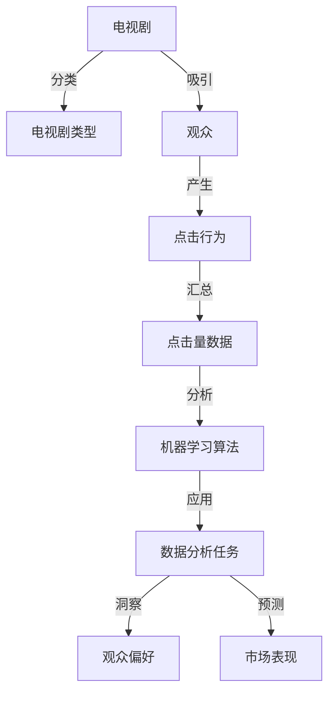

# 基于机器学习的电视剧类型点击量数据分析研究

## 1. 背景介绍

### 1.1 研究背景

在当今信息爆炸的时代,电视剧作为大众娱乐的重要组成部分,其点击量数据蕴含着巨大的商业价值。通过对电视剧类型点击量数据进行深入分析,可以洞察观众的偏好,预测电视剧的市场表现,为内容制作方、发行方提供决策依据。

### 1.2 研究意义

机器学习技术的发展为电视剧点击量数据分析提供了新的思路和方法。利用机器学习算法,可以从海量数据中挖掘出隐藏的模式和规律,实现电视剧类型的自动分类、点击量预测等任务。这不仅可以提高数据分析的效率和准确性,还可以发现传统方法难以察觉的关联和趋势。

### 1.3 研究目标

本文旨在探索如何将机器学习技术应用于电视剧类型点击量数据分析,构建一套完整的分析框架和模型,实现以下目标:

1. 电视剧类型的自动分类
2. 不同类型电视剧点击量的比较分析  
3. 电视剧点击量的影响因素分析
4. 电视剧点击量的预测模型构建

## 2. 核心概念与联系

### 2.1 电视剧类型

电视剧可以根据题材、风格、受众等多个维度进行分类。常见的电视剧类型包括:

- 古装剧
- 都市剧 
- 青春剧
- 悬疑剧
- 科幻剧
- 战争剧
- 历史剧
- 家庭剧
- 等等

不同类型的电视剧在题材、风格上各有特点,吸引不同的受众群体。

### 2.2 点击量

点击量是衡量电视剧受欢迎程度的重要指标,反映了观众对电视剧的关注度和观看意愿。点击量数据通常来自视频网站、电视台官网等渠道。

### 2.3 机器学习

机器学习是人工智能的一个分支,旨在让计算机系统从数据中自动学习和改进,无需显式编程。常见的机器学习任务包括分类、回归、聚类、异常检测等。

### 2.4 核心概念关系图



## 3. 核心算法原理具体操作步骤

### 3.1 数据预处理

- 数据清洗:处理缺失值、异常值、重复数据等。
- 数据集成:将来自不同渠道的数据进行合并。  
- 数据变换:对数据进行归一化、标准化等处理。
- 特征工程:提取、选择与任务相关的特征。

### 3.2 电视剧类型分类

- 特征表示:将电视剧的属性(如题材、演员、简介等)转化为数值特征向量。
- 分类模型训练:使用已标注类型的电视剧数据训练分类器,如决策树、支持向量机、神经网络等。
- 模型评估:使用交叉验证等方法评估分类器性能。
- 模型应用:使用训练好的分类器对新的电视剧进行类型预测。

### 3.3 点击量比较分析

- 数据聚合:按电视剧类型对点击量数据进行汇总统计。
- 可视化分析:使用条形图、饼图等方式直观展示不同类型电视剧点击量的差异。
- 统计检验:使用假设检验等方法分析类型间点击量差异的显著性。

### 3.4 影响因素分析

- 相关性分析:计算电视剧各属性与点击量之间的相关系数。
- 回归分析:构建多元线性回归模型,分析各属性对点击量的影响大小。
- 重要性排序:使用特征重要性评估方法(如信息增益、基尼指数)对影响因素进行排序。

### 3.5 点击量预测

- 时间序列建模:将点击量数据视为时间序列,使用ARIMA、Prophet等模型进行建模预测。  
- 回归预测:使用线性回归、决策树回归等模型,基于电视剧属性预测点击量。
- 模型集成:使用Bagging、Boosting等集成学习方法,提升预测性能。

## 4. 数学模型和公式详细讲解举例说明

### 4.1 分类模型-逻辑回归

逻辑回归是一种常用的二分类模型,通过逻辑函数将样本特征映射到0-1之间,表示样本属于正类的概率。

假设有$n$个电视剧样本,每个样本有$m$个特征,记为$x^{(i)}=(x_1^{(i)},x_2^{(i)},...,x_m^{(i)})$,对应的类型标签为$y^{(i)}\in\{0,1\}$。逻辑回归模型定义为:

$$
h_\theta(x)=\frac{1}{1+e^{-\theta^Tx}}
$$

其中$\theta=(\theta_0,\theta_1,...,\theta_m)$为模型参数。模型的优化目标是最小化交叉熵损失函数:

$$
J(\theta)=-\frac{1}{n}\sum_{i=1}^n[y^{(i)}\log h_\theta(x^{(i)})+(1-y^{(i)})\log(1-h_\theta(x^{(i)}))]
$$

通过梯度下降法求解损失函数的最小值,得到最优参数$\theta^*$。预测时,将新样本特征$x$代入模型,若$h_{\theta^*}(x)>0.5$则预测为正类,否则预测为负类。

### 4.2 时间序列模型-ARIMA

ARIMA(Autoregressive Integrated Moving Average)是一种经典的时间序列预测模型,由自回归(AR)、差分(I)、移动平均(MA)三部分组成。

假设时间序列为$\{y_t\}$,其中$t=1,2,...,T$。ARIMA(p,d,q)模型定义为:

$$
\Delta^d y_t=c+\sum_{i=1}^p\phi_i\Delta^d y_{t-i}+\sum_{j=1}^q\theta_j\varepsilon_{t-j}+\varepsilon_t
$$

其中$\Delta^d$表示$d$阶差分,$\phi_i$为自回归系数,$\theta_j$为移动平均系数,$\varepsilon_t$为白噪声。

模型的构建步骤如下:

1. 平稳性检验:使用ADF检验等方法判断时间序列是否平稳,若不平稳则进行差分处理。
2. 模型阶数确定:根据自相关图和偏自相关图等确定$p$和$q$的取值。
3. 参数估计:使用极大似然估计等方法估计模型参数。  
4. 模型诊断:对残差进行白噪声检验,判断模型是否合适。
5. 模型预测:使用训练好的模型对未来时间点进行预测。

## 5. 项目实践:代码实例和详细解释说明

下面以Python为例,演示如何使用Scikit-learn库实现电视剧类型分类和点击量预测。

### 5.1 电视剧类型分类

```python
from sklearn.feature_extraction.text import TfidfVectorizer
from sklearn.svm import SVC
from sklearn.model_selection import train_test_split
from sklearn.metrics import accuracy_score

# 读取数据
data = pd.read_csv('tv_data.csv')
X = data['description'] # 电视剧简介
y = data['type'] # 电视剧类型

# 文本特征提取
vectorizer = TfidfVectorizer()
X = vectorizer.fit_transform(X)

# 划分训练集和测试集
X_train, X_test, y_train, y_test = train_test_split(X, y, test_size=0.2, random_state=42)

# 训练SVM分类器
clf = SVC()
clf.fit(X_train, y_train)

# 评估模型
y_pred = clf.predict(X_test)
print('Accuracy:', accuracy_score(y_test, y_pred))

# 预测新电视剧的类型
new_desc = ['这是一部充满正能量的青春励志剧']
new_desc = vectorizer.transform(new_desc)
print('Predicted type:', clf.predict(new_desc))
```

代码说明:

1. 使用pandas读取电视剧数据,提取简介和类型两列。
2. 使用TfidfVectorizer对简介文本进行特征提取,转化为数值矩阵。
3. 划分训练集和测试集,比例为8:2。
4. 训练SVM分类器,并在测试集上评估准确率。
5. 对新的电视剧简介进行类型预测。

### 5.2 点击量预测

```python
from statsmodels.tsa.arima.model import ARIMA
from sklearn.metrics import mean_squared_error

# 读取点击量时间序列数据
data = pd.read_csv('click_data.csv', index_col='date', parse_dates=True)

# 划分训练集和测试集
train_data = data[:len(data)-30]
test_data = data[-30:]

# 构建ARIMA模型
model = ARIMA(train_data, order=(1,1,1))
result = model.fit()

# 预测未来30天的点击量
pred = result.forecast(30)

# 评估预测误差
mse = mean_squared_error(test_data, pred)
print('MSE:', mse)

# 预测未来7天的点击量
future_pred = result.forecast(7)
print('Future 7 days prediction:', future_pred)
```

代码说明:

1. 读取按日期索引的点击量时间序列数据。
2. 划分训练集和测试集,测试集为最后30天的数据。
3. 构建ARIMA(1,1,1)模型并训练。
4. 使用训练好的模型预测测试集数据,并计算均方误差(MSE)。
5. 预测未来7天的点击量数据。

## 6. 实际应用场景

电视剧类型点击量数据分析可应用于以下场景:

1. 内容策划:根据不同类型电视剧的点击量表现,指导后续电视剧的题材选择和制作方向。
2. 宣发策略:针对不同类型电视剧的目标受众,制定差异化的宣传和发行策略。
3. 广告投放:根据电视剧的受众画像和点击量预测,为广告主提供精准的广告投放建议。
4. 播出排档:根据电视剧的预测点击量,合理安排电视台的播出时段和频次。
5. 版权采购:根据电视剧的市场表现预测,为视频网站提供版权采购决策参考。

## 7. 工具和资源推荐

以下是一些用于电视剧数据分析的常用工具和资源:

- Python数据分析库:Pandas、NumPy、Matplotlib、Scikit-learn等。
- 时间序列分析工具:statsmodels、Prophet、TensorFlow等。
- 数据可视化工具:Tableau、PowerBI、Plotly等。
- 电视剧数据来源:视频网站API、爬虫工具、第三方数据平台等。
- 机器学习教程:Andrew Ng的机器学习课程、谷歌的机器学习速成课程等。
- 数据分析社区:Kaggle、KDnuggets、Medium等。

## 8. 总结:未来发展趋势与挑战

电视剧类型点击量数据分析是一个充满机遇和挑战的领域。未来的发展趋势包括:

1. 多模态数据融合:结合文本、图像、视频等多种数据源,实现更全面、准确的分析。
2. 个性化推荐:根据用户的观看历史和偏好,提供个性化的电视剧推荐。
3. 实时分析:利用流数据处理技术,实现电视剧点击量的实时监测和分析。
4. 因果推断:探索电视剧属性与点击量之间的因果关系,而非仅仅是相关性。
5. 跨平台分析:整合多个视频平台的数据,分析电视剧在不同平台上的表现差异。

同时,电视剧数据分析也面临着一些挑战:

1. 数据质量问题:电视剧数据可能存在噪声、缺失、不一致等问题,需要进行数