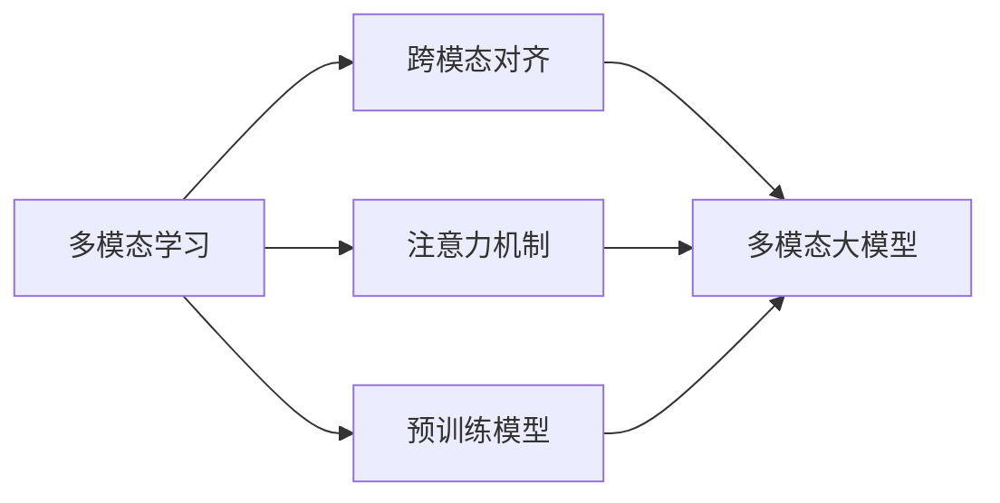

# 多模态大模型：技术原理与实战 国外多模态大模型介绍

## 1. 背景介绍

### 1.1 人工智能的发展历程
#### 1.1.1 早期人工智能
#### 1.1.2 机器学习时代  
#### 1.1.3 深度学习的崛起

### 1.2 大模型的兴起
#### 1.2.1 大模型的定义
#### 1.2.2 大模型的发展历程
#### 1.2.3 大模型的优势

### 1.3 多模态人工智能
#### 1.3.1 多模态的概念
#### 1.3.2 多模态AI的发展
#### 1.3.3 多模态大模型的兴起

## 2. 核心概念与联系

### 2.1 多模态学习
#### 2.1.1 多模态学习的定义
#### 2.1.2 多模态表示学习
#### 2.1.3 多模态融合

### 2.2 跨模态对齐
#### 2.2.1 跨模态对齐的概念
#### 2.2.2 视觉-语言对齐
#### 2.2.3 语音-文本对齐

### 2.3 注意力机制
#### 2.3.1 注意力机制的原理
#### 2.3.2 自注意力机制
#### 2.3.3 跨模态注意力

### 2.4 预训练模型
#### 2.4.1 预训练的概念
#### 2.4.2 语言预训练模型
#### 2.4.3 多模态预训练模型



## 3. 核心算法原理具体操作步骤

### 3.1 多模态Transformer
#### 3.1.1 Transformer结构
#### 3.1.2 多模态Transformer的改进
#### 3.1.3 多模态Transformer的训练

### 3.2 对比语言-图像预训练(CLIP)
#### 3.2.1 CLIP的原理
#### 3.2.2 图像编码器
#### 3.2.3 文本编码器
#### 3.2.4 对比学习目标

### 3.3 视觉-语言预训练(VLP)
#### 3.3.1 VLP的动机
#### 3.3.2 掩码语言建模
#### 3.3.3 图像-文本匹配
#### 3.3.4 VLP的训练策略

### 3.4 视觉-语言导航(VLN)
#### 3.4.1 VLN任务定义
#### 3.4.2 VLN的建模方法
#### 3.4.3 VLN中的注意力机制

## 4. 数学模型和公式详细讲解举例说明

### 4.1 多模态表示学习
#### 4.1.1 canonical correlation analysis (CCA)
$$\max_{\mathbf{w}_x,\mathbf{w}_y} \frac{\mathbf{w}_x^T\mathbf{X}^T\mathbf{Y}\mathbf{w}_y}{\sqrt{\mathbf{w}_x^T\mathbf{X}^T\mathbf{X}\mathbf{w}_x}\sqrt{\mathbf{w}_y^T\mathbf{Y}^T\mathbf{Y}\mathbf{w}_y}}$$
其中$\mathbf{X},\mathbf{Y}$分别表示两个模态的数据矩阵，$\mathbf{w}_x,\mathbf{w}_y$为投影向量。

#### 4.1.2 多模态自编码器
$$\mathcal{L}(\theta_e,\theta_d)=\sum_{i=1}^{n}\sum_{j=1}^{m}\|\mathbf{x}_i^{(j)}-\mathbf{\hat{x}}_i^{(j)}\|_2^2$$

其中$\theta_e,\theta_d$分别表示编码器和解码器的参数，$\mathbf{x}_i^{(j)}$表示第$i$个样本第$j$种模态的特征，$\mathbf{\hat{x}}_i^{(j)}$表示重构后的特征。

### 4.2 注意力机制
#### 4.2.1 Scaled Dot-Product Attention
$$\text{Attention}(Q,K,V)=\text{softmax}(\frac{QK^T}{\sqrt{d_k}})V$$

其中$Q,K,V$分别表示查询、键、值矩阵，$d_k$为键向量的维度。

#### 4.2.2 Multi-Head Attention
$$\text{MultiHead}(Q,K,V)=\text{Concat}(\text{head}_1,\ldots,\text{head}_h)W^O$$
$$\text{head}_i=\text{Attention}(QW_i^Q,KW_i^K,VW_i^V)$$

其中$W_i^Q,W_i^K,W_i^V$为线性投影矩阵，$W^O$为输出层的权重矩阵。

### 4.3 对比学习
#### 4.3.1 InfoNCE Loss
$$\mathcal{L}_{\text{InfoNCE}}=-\mathbb{E}_{(x,y)\sim p_{\text{data}}}\left[\log\frac{e^{f(x,y)/\tau}}{\sum_{y'\in\mathcal{Y}}e^{f(x,y')/\tau}}\right]$$

其中$f(x,y)$表示对比模型，$\tau$为温度参数，$\mathcal{Y}$为负样本集合。

#### 4.3.2 对比语言-图像预训练目标
$$\mathcal{L}_{\text{CLIP}}=\mathcal{L}_{\text{InfoNCE}}(I,T)+\mathcal{L}_{\text{InfoNCE}}(T,I)$$

其中$I,T$分别表示图像和文本的特征表示。

## 5. 项目实践：代码实例和详细解释说明

### 5.1 CLIP的PyTorch实现
```python
import torch
import torch.nn as nn

class CLIP(nn.Module):
    def __init__(self, image_encoder, text_encoder, dim):
        super().__init__()
        self.image_encoder = image_encoder
        self.text_encoder = text_encoder
        self.logit_scale = nn.Parameter(torch.ones([]) * 10.0)
        self.dim = dim
        
    def forward(self, image, text):
        image_features = self.image_encoder(image)
        text_features = self.text_encoder(text)
        
        image_features = image_features / image_features.norm(dim=-1, keepdim=True)
        text_features = text_features / text_features.norm(dim=-1, keepdim=True)
        
        logits = self.logit_scale * image_features @ text_features.t()
        return logits
```

这段代码定义了CLIP模型的PyTorch实现。主要包括以下几个部分：

1. `__init__`方法初始化了图像编码器`image_encoder`、文本编码器`text_encoder`以及对比学习的温度参数`logit_scale`。

2. `forward`方法接收图像和文本输入，分别通过图像编码器和文本编码器得到特征表示。

3. 对图像和文本特征进行L2归一化，使其成为单位向量。

4. 计算图像特征和文本特征的点积，并乘以温度参数`logit_scale`得到最终的对比学习logits。

### 5.2 多模态Transformer的训练
```python
import torch
import torch.nn as nn
from transformers import AdamW

model = MultimodalTransformer(...)
criterion = nn.CrossEntropyLoss()
optimizer = AdamW(model.parameters(), lr=1e-4)

for epoch in range(num_epochs):
    for batch in dataloader:
        image, text, label = batch
        
        output = model(image, text)
        loss = criterion(output, label)
        
        optimizer.zero_grad()
        loss.backward()
        optimizer.step()
```

这段代码展示了如何使用PyTorch训练多模态Transformer模型：

1. 定义多模态Transformer模型`model`，交叉熵损失函数`criterion`以及AdamW优化器`optimizer`。

2. 在每个epoch中，遍历数据加载器`dataloader`获取一个batch的数据，包括图像、文本和标签。

3. 将图像和文本输入到模型中，得到输出`output`。

4. 计算输出与标签之间的交叉熵损失`loss`。

5. 清空优化器梯度，反向传播损失，并更新模型参数。

通过多个epoch的训练，模型可以学习到图像和文本之间的跨模态对齐和融合。

## 6. 实际应用场景

### 6.1 图像-文本检索
多模态大模型可以用于图像-文本检索任务，给定一张图像，检索与其语义相关的文本，或给定一段文本，检索与其语义相关的图像。这在搜索引擎、推荐系统等领域有广泛应用。

### 6.2 视觉问答
视觉问答任务要求模型根据给定的图像和问题，生成相应的答案。多模态大模型可以学习图像和文本之间的对齐关系，从而更好地理解问题并生成准确的答案。

### 6.3 图像字幕生成
图像字幕生成任务需要模型根据给定的图像，生成描述图像内容的自然语言句子。多模态大模型可以捕捉图像中的视觉信息，并将其转化为流畅、语义丰富的文本描述。

### 6.4 视频理解与描述
多模态大模型还可以扩展到视频领域，通过学习视频帧序列与文本之间的对齐，实现视频内容的理解与描述。这在视频摘要、视频问答等任务中有重要应用。

## 7. 工具和资源推荐

### 7.1 数据集
- COCO：大规模图像字幕数据集
- Flickr30K：图像描述数据集
- VQA：视觉问答数据集
- CLEVR：合成视觉推理数据集

### 7.2 开源工具包
- PyTorch：深度学习框架
- Hugging Face Transformers：预训练语言模型库
- OpenAI CLIP：对比语言-图像预训练模型
- MMF：多模态框架，支持多种任务

### 7.3 预训练模型
- CLIP：对比语言-图像预训练模型
- LXMERT：视觉-语言预训练模型
- ViLBERT：视觉-语言BERT模型
- UNITER：UNiversal Image-TExt Representation

## 8. 总结：未来发展趋势与挑战

### 8.1 更大规模的多模态预训练
未来多模态大模型的发展趋势之一是进一步扩大预训练数据的规模和模型的参数量，从而学习到更加通用和鲁棒的跨模态表示。

### 8.2 更多模态的融合
除了图像和文本，未来的多模态大模型还可能融合语音、视频、3D等更多模态的信息，实现更全面的感知和理解。

### 8.3 更广泛的下游任务适配
多模态大模型的另一个发展方向是适配更广泛的下游任务，如多模态对话、多模态推理、多模态创作等，拓展其应用领域。

### 8.4 可解释性和公平性
多模态大模型面临的挑战包括如何提高其决策过程的可解释性，以及如何确保模型在不同人群和场景中的公平性。

### 8.5 低资源和零样本学习
如何在低资源或零样本的情况下，利用多模态大模型进行有效的学习和泛化，是一个值得探索的研究方向。

## 9. 附录：常见问题与解答

### 9.1 多模态大模型与单模态模型的区别是什么？
多模态大模型可以同时处理和融合来自多个模态（如图像、文本）的信息，学习不同模态之间的对齐和交互关系。而单模态模型只专注于单一模态的建模。

### 9.2 多模态大模型的预训练方法有哪些？
常见的多模态预训练方法包括对比学习（如CLIP）、掩码语言建模（如ViLBERT）、图像-文本匹配（如UNITER）等，通过设计合适的预训练任务来学习跨模态表示。

### 9.3 多模态大模型在实际应用中需要注意哪些问题？
在实际应用多模态大模型时，需要注意模型的计算效率、推理速度、内存占用等问题，以及模型在不同场景和数据分布下的泛化能力和鲁棒性。

### 9.4 多模态大模型的评估指标有哪些？
多模态大模型的评估指标取决于具体任务，常见的指标包括准确率、召回率、F1值（用于图像-文本检索）、BLEU、METEOR（用于图像字幕生成）、VQA准确率（用于视觉问答）等。

### 9.5 如何选择适合的多模态大模型？
选择多模态大模型需要考虑