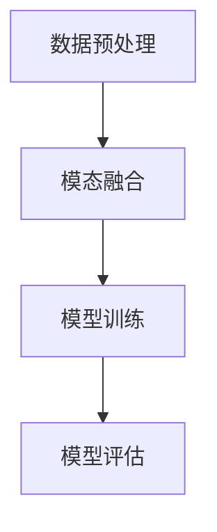

# 多模态大模型：技术原理与实战 智能客服

## 1.背景介绍

在人工智能领域，多模态大模型（Multimodal Large Models, MLMs）正逐渐成为研究和应用的热点。多模态大模型通过整合不同类型的数据（如文本、图像、音频等），实现了更为智能和全面的理解与生成能力。智能客服系统作为人工智能的重要应用场景之一，借助多模态大模型，能够提供更加精准和人性化的服务。

## 2.核心概念与联系

### 2.1 多模态大模型的定义

多模态大模型是指能够处理和理解多种类型数据的机器学习模型。与传统单模态模型不同，多模态大模型能够同时处理文本、图像、音频等多种数据类型，从而实现更为复杂和智能的任务。

### 2.2 智能客服的定义

智能客服系统是利用人工智能技术，自动化处理客户服务请求的系统。它能够通过自然语言处理（NLP）、语音识别、图像识别等技术，提供高效、准确的客户服务。

### 2.3 多模态大模型与智能客服的联系

多模态大模型在智能客服中的应用，能够显著提升客服系统的理解和响应能力。例如，通过整合文本和语音数据，智能客服系统可以更准确地理解用户意图，并提供更为个性化的服务。

## 3.核心算法原理具体操作步骤

### 3.1 数据预处理

数据预处理是多模态大模型训练的第一步。不同类型的数据需要进行不同的预处理操作，如文本数据的分词、图像数据的归一化、音频数据的特征提取等。

### 3.2 模态融合

模态融合是多模态大模型的核心步骤之一。常见的模态融合方法包括早期融合、晚期融合和中期融合。早期融合是指在模型输入层进行模态融合，晚期融合是指在模型输出层进行模态融合，中期融合是指在模型中间层进行模态融合。

### 3.3 模型训练

模型训练是多模态大模型构建的关键步骤。常见的训练方法包括监督学习、无监督学习和半监督学习。监督学习需要标注数据，无监督学习不需要标注数据，半监督学习则结合了监督学习和无监督学习的优点。

### 3.4 模型评估

模型评估是多模态大模型训练的最后一步。常见的评估指标包括准确率、召回率、F1值等。通过模型评估，可以判断模型的性能，并进行相应的优化。



## 4.数学模型和公式详细讲解举例说明

### 4.1 多模态数据表示

多模态数据表示是多模态大模型的基础。假设有文本数据 $T$、图像数据 $I$ 和音频数据 $A$，则多模态数据可以表示为：

$$
X = \{T, I, A\}
$$

### 4.2 模态融合公式

模态融合的目标是将不同模态的数据融合成一个统一的表示。假设 $f_T$、$f_I$ 和 $f_A$ 分别表示文本、图像和音频的特征提取函数，则模态融合可以表示为：

$$
F = f_T(T) \oplus f_I(I) \oplus f_A(A)
$$

其中，$\oplus$ 表示特征融合操作。

### 4.3 模型训练公式

模型训练的目标是最小化损失函数。假设 $y$ 表示真实标签，$\hat{y}$ 表示模型预测值，$L$ 表示损失函数，则模型训练可以表示为：

$$
\min L(y, \hat{y})
$$

常见的损失函数包括交叉熵损失、均方误差等。

### 4.4 模型评估公式

模型评估的目标是衡量模型的性能。假设 $TP$ 表示真正例，$FP$ 表示假正例，$FN$ 表示假反例，则准确率、召回率和 F1 值可以分别表示为：

$$
\text{准确率} = \frac{TP}{TP + FP}
$$

$$
\text{召回率} = \frac{TP}{TP + FN}
$$

$$
F1 = \frac{2 \cdot \text{准确率} \cdot \text{召回率}}{\text{准确率} + \text{召回率}}
$$

## 5.项目实践：代码实例和详细解释说明

### 5.1 数据预处理代码示例

```python
import numpy as np
import pandas as pd
from sklearn.preprocessing import StandardScaler

# 文本数据预处理
def preprocess_text(text):
    # 分词、去停用词等操作
    return processed_text

# 图像数据预处理
def preprocess_image(image):
    # 归一化等操作
    return processed_image

# 音频数据预处理
def preprocess_audio(audio):
    # 特征提取等操作
    return processed_audio

# 示例数据
text_data = "这是一个示例文本"
image_data = np.random.rand(224, 224, 3)
audio_data = np.random.rand(16000)

# 预处理
processed_text = preprocess_text(text_data)
processed_image = preprocess_image(image_data)
processed_audio = preprocess_audio(audio_data)
```

### 5.2 模态融合代码示例

```python
import torch
import torch.nn as nn

class MultimodalFusion(nn.Module):
    def __init__(self):
        super(MultimodalFusion, self).__init__()
        self.text_fc = nn.Linear(300, 128)
        self.image_fc = nn.Linear(2048, 128)
        self.audio_fc = nn.Linear(512, 128)
        self.fusion_fc = nn.Linear(384, 128)
    
    def forward(self, text, image, audio):
        text_features = self.text_fc(text)
        image_features = self.image_fc(image)
        audio_features = self.audio_fc(audio)
        fusion_features = torch.cat((text_features, image_features, audio_features), dim=1)
        output = self.fusion_fc(fusion_features)
        return output

# 示例输入
text_input = torch.randn(1, 300)
image_input = torch.randn(1, 2048)
audio_input = torch.randn(1, 512)

# 模态融合
model = MultimodalFusion()
output = model(text_input, image_input, audio_input)
```

### 5.3 模型训练代码示例

```python
import torch.optim as optim

# 损失函数和优化器
criterion = nn.CrossEntropyLoss()
optimizer = optim.Adam(model.parameters(), lr=0.001)

# 训练循环
for epoch in range(num_epochs):
    model.train()
    optimizer.zero_grad()
    outputs = model(text_input, image_input, audio_input)
    loss = criterion(outputs, labels)
    loss.backward()
    optimizer.step()
    print(f'Epoch {epoch+1}/{num_epochs}, Loss: {loss.item()}')
```

### 5.4 模型评估代码示例

```python
from sklearn.metrics import accuracy_score, recall_score, f1_score

# 模型评估
model.eval()
with torch.no_grad():
    outputs = model(text_input, image_input, audio_input)
    _, predicted = torch.max(outputs, 1)
    accuracy = accuracy_score(labels, predicted)
    recall = recall_score(labels, predicted, average='macro')
    f1 = f1_score(labels, predicted, average='macro')
    print(f'Accuracy: {accuracy}, Recall: {recall}, F1 Score: {f1}')
```

## 6.实际应用场景

### 6.1 客户服务

多模态大模型在客户服务中的应用，可以通过整合文本、语音和图像数据，提供更加智能和个性化的服务。例如，客户可以通过语音描述问题，客服系统通过语音识别和自然语言处理技术，理解客户意图并提供解决方案。

### 6.2 医疗诊断

在医疗诊断中，多模态大模型可以整合患者的病历文本、医学影像和语音记录，提供更加全面和准确的诊断结果。例如，通过分析患者的病历文本和医学影像，医生可以更准确地判断病情。

### 6.3 教育辅导

在教育辅导中，多模态大模型可以整合学生的学习文本、视频和语音数据，提供个性化的学习建议和辅导。例如，通过分析学生的学习文本和视频，系统可以发现学生的学习问题，并提供相应的辅导建议。

## 7.工具和资源推荐

### 7.1 工具推荐

- **TensorFlow**：一个开源的机器学习框架，支持多模态大模型的构建和训练。
- **PyTorch**：另一个流行的开源机器学习框架，具有灵活性和易用性，适合多模态大模型的研究和应用。
- **Hugging Face Transformers**：一个开源的自然语言处理库，支持多模态大模型的预训练和微调。

### 7.2 资源推荐

- **论文**：阅读相关领域的最新研究论文，如《Attention is All You Need》、《BERT: Pre-training of Deep Bidirectional Transformers for Language Understanding》等。
- **书籍**：推荐阅读《深度学习》、《模式识别与机器学习》等经典书籍，深入理解多模态大模型的理论和应用。
- **在线课程**：参加相关的在线课程，如Coursera、edX上的机器学习和深度学习课程，提升自己的技术水平。

## 8.总结：未来发展趋势与挑战

### 8.1 未来发展趋势

多模态大模型在未来的发展中，将会越来越多地应用于各个领域。随着数据量的增加和计算能力的提升，多模态大模型的性能将会不断提高。同时，多模态大模型的研究也将会更加深入，探索更多的模态融合方法和应用场景。

### 8.2 挑战

尽管多模态大模型具有广阔的应用前景，但也面临一些挑战。首先，多模态数据的获取和标注成本较高，需要大量的资源和时间。其次，多模态大模型的训练和推理需要较高的计算资源，对硬件设备要求较高。最后，多模态大模型的解释性和可控性仍然是一个难题，需要进一步的研究和探索。

## 9.附录：常见问题与解答

### 9.1 多模态大模型的优势是什么？

多模态大模型的优势在于能够整合不同类型的数据，提供更加全面和智能的服务。通过整合文本、图像、音频等多种数据类型，多模态大模型能够更准确地理解用户意图，并提供个性化的解决方案。

### 9.2 多模态大模型的应用场景有哪些？

多模态大模型的应用场景包括客户服务、医疗诊断、教育辅导等。在这些场景中，多模态大模型能够通过整合不同类型的数据，提供更加智能和个性化的服务。

### 9.3 多模态大模型的训练和推理需要哪些资源？

多模态大模型的训练和推理需要较高的计算资源，包括高性能的GPU和大量的存储空间。同时，多模态数据的获取和标注也需要大量的资源和时间。

### 9.4 如何提高多模态大模型的性能？

提高多模态大模型的性能可以从以下几个方面入手：首先，增加数据量和数据质量，提供更多的训练数据。其次，优化模型结构和训练方法，采用更先进的模态融合方法和训练算法。最后，利用迁移学习和预训练模型，提升模型的泛化能力。

### 9.5 多模态大模型的未来发展趋势是什么？

多模态大模型的未来发展趋势包括更多的应用场景、更高的性能和更好的解释性。随着数据量的增加和计算能力的提升，多模态大模型的性能将会不断提高。同时，多模态大模型的研究也将会更加深入，探索更多的模态融合方法和应用场景。

---

作者：禅与计算机程序设计艺术 / Zen and the Art of Computer Programming