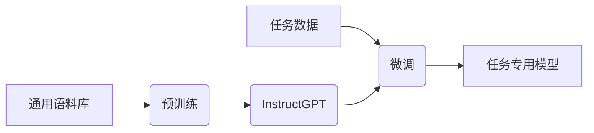

# 大语言模型原理与工程实践：InstructGPT

## 1. 背景介绍

随着人工智能技术的不断发展,大型语言模型(Large Language Model, LLM)已经成为当前最具影响力的技术之一。作为自然语言处理(Natural Language Processing, NLP)领域的关键突破,LLM展现出了令人惊叹的语言理解和生成能力,在多个领域产生了深远影响。

在这些LLM中,InstructGPT无疑是最具代表性的一种。它是一种基于Transformer架构的大型语言模型,由OpenAI公司开发。InstructGPT的独特之处在于,它被设计用于接受和理解自然语言指令,并生成相应的响应。这使得InstructGPT能够执行各种复杂的语言任务,如问答、文本生成、代码生成等,极大地扩展了人工智能的应用范围。

## 2. 核心概念与联系

### 2.1 Transformer架构

InstructGPT的核心架构是基于Transformer的,这是一种革命性的序列到序列(Sequence-to-Sequence)模型。Transformer架构主要由编码器(Encoder)和解码器(Decoder)两部分组成,使用自注意力(Self-Attention)机制来捕捉输入序列中元素之间的依赖关系。


### 2.2 自注意力机制

自注意力机制是Transformer架构的核心,它允许模型在计算目标元素的表示时,直接关注整个输入序列中的所有其他元素。这种机制有效地捕捉了长距离依赖关系,克服了传统RNN模型的局限性。


### 2.3 预训练与微调

InstructGPT是通过在大规模文本语料库上进行预训练得到的。预训练过程中,模型学习到了丰富的语言知识和上下文理解能力。之后,可以通过在特定任务数据上进行微调(Fine-tuning),使模型专门化于该任务。



## 3. 核心算法原理具体操作步骤

### 3.1 Transformer编码器

1. 将输入序列嵌入为向量表示
2. 添加位置编码,赋予每个元素位置信息
3. 通过多层自注意力和前馈神经网络,计算每个元素的上下文表示
4. 编码器输出是输入序列的上下文表示

### 3.2 Transformer解码器

1. 将目标序列嵌入为向量表示
2. 添加位置编码
3. 通过掩码自注意力,计算每个元素的自注意力表示
4. 通过编码器-解码器注意力,关注输入序列的上下文表示
5. 通过前馈神经网络,计算每个元素的输出表示
6. 解码器输出是目标序列的预测

### 3.3 预训练

1. 采用自监督学习范式,设计预训练目标
2. 常用目标包括掩码语言模型(Masked Language Modeling)和下一句预测(Next Sentence Prediction)
3. 在大规模语料库上最小化预训练目标的损失函数
4. 使用梯度下降等优化算法更新模型参数

### 3.4 微调

1. 在目标任务数据上初始化模型参数为预训练得到的参数
2. 设计任务相关的输入和输出表示
3. 构建任务损失函数,如交叉熵损失
4. 在任务数据上最小化损失函数,更新模型参数
5. 得到针对特定任务优化的模型

## 4. 数学模型和公式详细讲解举例说明

### 4.1 自注意力计算

自注意力机制的核心是计算查询(Query)与键(Key)的相似性,并根据相似性分配值(Value)的权重。具体计算过程如下:

$$
\begin{aligned}
\text{Attention}(Q, K, V) &= \text{softmax}\left(\frac{QK^T}{\sqrt{d_k}}\right)V \\
\text{head}_i &= \text{Attention}\left(QW_i^Q, KW_i^K, VW_i^V\right) \\
\text{MultiHead}(Q, K, V) &= \text{Concat}(\text{head}_1, \ldots, \text{head}_h)W^O
\end{aligned}
$$

其中:
- $Q$、$K$、$V$分别是查询、键和值的矩阵表示
- $d_k$是缩放因子,用于防止点积过大导致梯度消失
- $W_i^Q$、$W_i^K$、$W_i^V$、$W^O$是可学习的线性变换矩阵
- 多头注意力(MultiHead Attention)通过并行计算多个注意力头,捕捉不同子空间的依赖关系

### 4.2 掩码语言模型目标

掩码语言模型是InstructGPT预训练的一个重要目标。其基本思想是在输入序列中随机掩码一部分词元,然后让模型基于上下文预测被掩码的词元。

假设输入序列为$X = (x_1, x_2, \ldots, x_n)$,其中$x_k$被掩码为特殊标记[MASK]。模型的目标是最大化被掩码词元的条件概率:

$$
\max_\theta \sum_{k=1}^n \mathbb{1}(x_k = \text{[MASK]}) \log P(x_k | X_{\backslash k}; \theta)
$$

其中$\theta$是模型参数,$X_{\backslash k}$表示除去$x_k$的其他词元。通过最小化该目标的负对数似然损失,模型可以学习到有效的上下文表示。

## 5. 项目实践:代码实例和详细解释说明

以下是一个使用PyTorch实现的简化版InstructGPT模型示例,包括Transformer编码器、解码器和预训练目标的实现。

```python
import torch
import torch.nn as nn

# 定义模型参数
max_len = 512  # 最大序列长度
d_model = 512  # 模型维度
n_layers = 6   # Transformer编码器/解码器层数
n_heads = 8    # 多头注意力头数
ffn_dim = 2048 # 前馈网络隐藏层维度

# Transformer编码器
class TransformerEncoder(nn.Module):
    def __init__(self):
        super().__init__()
        self.embed = nn.Embedding(vocab_size, d_model)
        self.pos_enc = PositionalEncoding(d_model, max_len)
        encoder_layer = nn.TransformerEncoderLayer(d_model, n_heads, ffn_dim)
        self.layers = nn.TransformerEncoder(encoder_layer, num_layers=n_layers)

    def forward(self, x):
        x = self.embed(x)
        x = self.pos_enc(x)
        x = self.layers(x)
        return x

# Transformer解码器
class TransformerDecoder(nn.Module):
    def __init__(self):
        super().__init__()
        self.embed = nn.Embedding(vocab_size, d_model)
        self.pos_enc = PositionalEncoding(d_model, max_len)
        decoder_layer = nn.TransformerDecoderLayer(d_model, n_heads, ffn_dim)
        self.layers = nn.TransformerDecoder(decoder_layer, num_layers=n_layers)
        self.output = nn.Linear(d_model, vocab_size)

    def forward(self, x, enc_output):
        x = self.embed(x)
        x = self.pos_enc(x)
        x = self.layers(x, enc_output)
        x = self.output(x)
        return x

# InstructGPT模型
class InstructGPT(nn.Module):
    def __init__(self):
        super().__init__()
        self.encoder = TransformerEncoder()
        self.decoder = TransformerDecoder()

    def forward(self, input_ids, target_ids):
        enc_output = self.encoder(input_ids)
        output = self.decoder(target_ids, enc_output)
        return output

# 掩码语言模型预训练目标
def mlm_loss(input_ids, output, mask):
    masked_output = torch.masked_select(output, mask.unsqueeze(-1))
    masked_labels = torch.masked_select(input_ids, mask)
    loss = nn.CrossEntropyLoss()(masked_output.view(-1, vocab_size), masked_labels.view(-1))
    return loss
```

在上述示例中:

1. `TransformerEncoder`和`TransformerDecoder`分别实现了Transformer的编码器和解码器模块,包括词嵌入、位置编码、多头自注意力和前馈网络。
2. `InstructGPT`模型将编码器和解码器组合在一起,接受输入序列`input_ids`和目标序列`target_ids`,输出目标序列的预测结果。
3. `mlm_loss`函数实现了掩码语言模型的预训练目标,计算被掩码词元的交叉熵损失。

在实际项目中,您可以根据需求对模型进行扩展和修改,如添加更多预训练目标、调整模型超参数等。同时,还需要实现数据预处理、模型训练、推理等相关功能。

## 6. 实际应用场景

InstructGPT作为一种通用的大型语言模型,其应用场景非常广泛,包括但不限于:

1. **自然语言理解与生成**: InstructGPT可以用于各种自然语言处理任务,如问答系统、文本摘要、机器翻译、对话系统等。
2. **代码生成与解释**: InstructGPT能够根据自然语言描述生成对应的代码,并解释代码的功能和作用,极大地提高了编程效率。
3. **知识提取与推理**: InstructGPT可以从大量文本中提取关键信息和知识,并进行推理和推断,为知识图谱构建、事实检查等任务提供支持。
4. **创作辅助**: InstructGPT可以根据提示生成各种形式的文本内容,如新闻报道、小说故事、广告文案等,为创作者提供灵感和辅助。
5. **教育和培训**: InstructGPT可以作为智能教学助手,回答学生的各种问题,提供个性化的学习资源和反馈。
6. **客户服务**: InstructGPT可以模拟人类客服,回答用户的各种咨询和投诉,提供高效的在线客户服务。

总的来说,InstructGPT的强大语言理解和生成能力,使其在各个领域都有广阔的应用前景。

## 7. 工具和资源推荐

在开发和使用InstructGPT模型时,以下工具和资源可能会非常有用:

1. **PyTorch**: 一个流行的深度学习框架,提供了高效的张量计算和自动微分功能,适合构建和训练InstructGPT等大型神经网络模型。
2. **Hugging Face Transformers**: 一个集成了多种预训练语言模型的开源库,提供了方便的模型加载、微调和推理接口,可以极大地简化InstructGPT的开发和部署过程。
3. **NVIDIA Apex**: 一个用于PyTorch的混合精度训练工具集,可以加速大型模型的训练过程,节省GPU内存占用。
4. **OpenWebText语料库**: 一个包含800多万个网页的大型语料库,可用于InstructGPT的预训练。
5. **自然指令(Natural Instructions)数据集**: 一个包含数十万个自然语言指令的数据集,可用于InstructGPT的微调和评估。
6. **AWS SageMaker**: 一个云端机器学习平台,提供了GPU实例和分布式训练功能,适合训练大型语言模型。
7. **HuggingFace Model Hub**: 一个开源的模型库,包含了众多预训练的语言模型,可以直接下载使用或进行微调。
8. **GPT-3 Playground**: 一个在线的GPT-3模型体验平台,可以尝试输入各种提示,观察模型的输出和表现。

利用这些工具和资源,您可以更高效地开发、训练和部署InstructGPT模型,加速相关应用的落地。

## 8. 总结:未来发展趋势与挑战

InstructGPT作为大型语言模型的代表,标志着人工智能在自然语言处理领域取得了里程碑式的进展。然而,它也面临着一些挑战和局限性,需要在未来的发展中加以解决:

1. **可解释性和可控性**: 虽然InstructGPT展现出了惊人的语言能力,但其内部工作机制仍然是一个黑箱,缺乏可