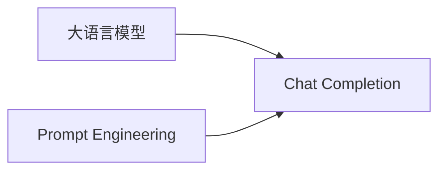

# 大语言模型应用指南：Chat Completion交互格式

## 1. 背景介绍

### 1.1 大语言模型的兴起

近年来,自然语言处理(NLP)领域取得了巨大的进步,尤其是随着Transformer架构的出现和预训练语言模型的广泛应用,大语言模型(Large Language Models, LLMs)逐渐成为NLP领域的研究热点。这些模型在各种NLP任务上取得了令人瞩目的性能,展现出了强大的语言理解和生成能力。

### 1.2 Chat Completion的应用前景

大语言模型在实际应用中有着广阔的前景,其中一个重要的应用方向就是构建对话系统。通过Chat Completion交互格式,我们可以利用大语言模型的能力,实现更加智能、自然的人机对话。这种交互方式不仅可以应用于客服、智能助手等场景,还可以扩展到教育、医疗、金融等多个领域。

### 1.3 本文的目的和结构

本文旨在为开发者和研究者提供一份全面的指南,介绍如何利用大语言模型构建基于Chat Completion交互格式的对话系统。我们将从核心概念出发,详细阐述Chat Completion的算法原理和实现步骤,并通过数学模型和代码实例进行深入讲解。同时,我们还将探讨Chat Completion在实际应用中的场景和挑战,为读者提供实用的见解和资源推荐。

## 2. 核心概念与联系

### 2.1 大语言模型

大语言模型是指在海量文本数据上预训练得到的神经网络模型,通过自监督学习的方式学习语言的统计规律和语义表示。这些模型通常采用Transformer架构,并使用如Masked Language Modeling(MLM)、Next Sentence Prediction(NSP)等预训练任务来学习语言的上下文信息。

### 2.2 Chat Completion

Chat Completion是一种基于大语言模型的对话生成方式。给定一段对话历史,模型能够根据上下文生成合适的回复。与传统的对话系统不同,Chat Completion不需要预先定义对话流程和语料,而是通过大语言模型自身的语言理解和生成能力来完成对话。

### 2.3 Prompt Engineering

Prompt Engineering是指设计合适的输入提示(Prompt)来引导大语言模型生成期望的输出。在Chat Completion中,我们需要精心设计对话历史和用户输入的格式,以便模型能够准确理解对话上下文并生成高质量的回复。

### 2.4 核心概念之间的联系

下图展示了大语言模型、Chat Completion和Prompt Engineering之间的关系:



大语言模型是Chat Completion的基础,提供了强大的语言理解和生成能力。而Prompt Engineering则是实现Chat Completion的关键,通过设计合适的输入提示来引导模型生成期望的输出。

## 3. 核心算法原理具体操作步骤

### 3.1 大语言模型的预训练

大语言模型的预训练通常采用自监督学习的方式,利用无标注的海量文本数据来学习语言的统计规律和语义表示。常见的预训练任务包括:

1. Masked Language Modeling(MLM):随机遮挡输入序列中的部分token,让模型预测被遮挡的token。
2. Next Sentence Prediction(NSP):给定两个句子,让模型预测它们是否为连续的句子对。
3. Permutation Language Modeling(PLM):随机打乱输入序列的顺序,让模型预测原始序列。

通过这些预训练任务,模型能够学习到语言的上下文信息和语义表示。

### 3.2 Fine-tuning模型用于Chat Completion

预训练得到的大语言模型可以通过Fine-tuning的方式适应特定的下游任务。对于Chat Completion,我们需要将模型Fine-tune到对话生成任务上。具体步骤如下:

1. 准备对话数据集,每个样本包含对话历史和对应的回复。
2. 将对话历史和回复拼接成一个输入序列,中间用特殊的分隔符隔开。
3. 使用对话数据集Fine-tune预训练好的大语言模型,优化模型在对话生成任务上的性能。
4. Fine-tuning完成后,模型就可以用于Chat Completion任务了。

### 3.3 生成回复的过程

给定一段对话历史,Chat Completion模型通过以下步骤生成回复:

1. 将对话历史拼接成一个输入序列,作为模型的输入。
2. 模型根据输入序列,通过自回归的方式生成回复序列。
3. 使用解码策略(如Beam Search、Top-k Sampling等)从生成的序列中选择最优的回复。
4. 将生成的回复返回给用户,完成一轮对话。

通过不断地进行多轮对话,Chat Completion模型可以与用户进行连贯、自然的交互。

## 4. 数学模型和公式详细讲解举例说明

### 4.1 Transformer架构

大语言模型通常采用Transformer架构,其核心是自注意力机制(Self-Attention)和前馈神经网络(Feed-Forward Network)。

对于输入序列 $X=(x_1,x_2,...,x_n)$,自注意力机制首先计算查询(Query)、键(Key)和值(Value)矩阵:

$$
Q = XW^Q, K = XW^K, V = XW^V
$$

其中 $W^Q, W^K, W^V$ 是可学习的参数矩阵。然后计算注意力权重:

$$
A = \text{softmax}(\frac{QK^T}{\sqrt{d_k}})
$$

其中 $d_k$ 是键向量的维度。最后,注意力输出为:

$$
\text{Attention}(Q,K,V) = AV
$$

前馈神经网络则对注意力输出进行非线性变换:

$$
\text{FFN}(x) = \max(0, xW_1 + b_1)W_2 + b_2
$$

通过堆叠多个自注意力层和前馈神经网络层,Transformer能够捕捉输入序列中的长距离依赖关系。

### 4.2 语言模型

大语言模型的目标是估计序列 $X=(x_1,x_2,...,x_n)$ 的概率分布 $P(X)$。根据链式法则,我们有:

$$
P(X) = \prod_{i=1}^n P(x_i|x_1,x_2,...,x_{i-1})
$$

语言模型通过最大化似然估计来学习每个条件概率 $P(x_i|x_1,x_2,...,x_{i-1})$。

在生成回复时,我们希望找到概率最大的回复序列 $Y=(y_1,y_2,...,y_m)$:

$$
Y = \arg\max_Y P(Y|X)
$$

这可以通过Beam Search等解码策略来近似求解。

## 5. 项目实践：代码实例和详细解释说明

下面是一个使用PyTorch和Hugging Face Transformers库实现Chat Completion的简单示例:

```python
from transformers import AutoTokenizer, AutoModelForCausalLM

# 加载预训练的tokenizer和模型
tokenizer = AutoTokenizer.from_pretrained("microsoft/DialoGPT-medium")
model = AutoModelForCausalLM.from_pretrained("microsoft/DialoGPT-medium")

# 进行多轮对话
chat_history = []
while True:
    user_input = input("User: ")
    chat_history.append(user_input)
    
    # 将对话历史拼接成输入序列
    input_ids = tokenizer.encode(' '.join(chat_history[-5:]), return_tensors='pt')
    
    # 生成回复
    output = model.generate(input_ids, max_length=1000, pad_token_id=tokenizer.eos_token_id)
    
    # 解码生成的回复
    response = tokenizer.decode(output[:, input_ids.shape[-1]:][0], skip_special_tokens=True)
    
    chat_history.append(response)
    print(f"Assistant: {response}")
```

这个示例使用了微软的DialoGPT模型,它是一个基于GPT-2架构的对话生成模型。我们首先加载预训练的tokenizer和模型,然后进入一个循环,不断接收用户输入并生成回复。

在每次生成回复时,我们将最近的5轮对话历史拼接成输入序列,并使用`generate()`函数生成回复。生成的回复会被解码并打印出来,同时被添加到对话历史中,以便下一轮对话使用。

通过这种方式,我们可以利用预训练的大语言模型实现一个简单的Chat Completion系统。当然,在实际应用中,我们还需要考虑更多的因素,如模型的选择、Prompt Engineering、多轮对话管理等。

## 6. 实际应用场景

Chat Completion可以应用于多个领域,例如:

1. 客服系统:利用Chat Completion构建智能客服系统,自动回答用户的常见问题,提高客服效率。
2. 智能助手:开发个人助理、任务规划等智能助手应用,通过自然语言交互为用户提供服务。
3. 教育领域:开发智能教学系统,根据学生的提问和反馈生成个性化的解释和指导。
4. 医疗领域:构建医疗问答系统,为患者提供初步的诊断和建议,辅助医生的工作。
5. 金融领域:开发智能投资顾问,根据用户的需求和风险偏好提供个性化的投资建议。

在实际应用中,我们需要根据具体的场景和需求,选择合适的大语言模型,并进行必要的Fine-tuning和调优。同时,还需要考虑数据隐私、伦理道德等问题,确保系统的安全性和合规性。

## 7. 工具和资源推荐

以下是一些常用的工具和资源,可以帮助您入门Chat Completion:

1. Hugging Face Transformers:一个流行的NLP库,提供了多种预训练的大语言模型和Fine-tuning工具。
2. OpenAI GPT-3:OpenAI提供的大规模语言模型,可以通过API接口进行调用。
3. Google BERT:Google提出的预训练语言模型,在多个NLP任务上取得了优异的性能。
4. Microsoft DialoGPT:微软开源的对话生成模型,基于GPT-2架构。
5. ParlAI:Facebook开源的对话AI研究平台,提供了多种对话数据集和模型。
6. Rasa:一个开源的对话AI框架,支持Intent Recognition、Dialogue Management等功能。

除了这些工具和资源,还有许多其他优秀的选择。建议根据自己的需求和偏好,选择合适的工具和资源进行学习和实践。

## 8. 总结：未来发展趋势与挑战

Chat Completion是大语言模型应用的一个重要方向,展现出了广阔的应用前景。未来,我们可以期待以下发展趋势:

1. 模型的不断进步:随着计算能力的提升和训练数据的增加,大语言模型将变得更加强大,能够处理更加复杂的对话任务。
2. 个性化和上下文理解:通过引入用户画像、对话历史等信息,Chat Completion系统将能够提供更加个性化和上下文相关的回复。
3. 多模态交互:将语音、图像等其他模态的信息融入对话系统,实现更加自然和丰富的人机交互。
4. 知识增强:将知识图谱、领域知识等外部知识源与大语言模型相结合,提高对话系统的专业性和准确性。

同时,Chat Completion也面临着一些挑战:

1. 数据隐私和安全:如何在利用用户数据训练模型的同时,保护用户的隐私和数据安全。
2. 伦理道德问题:如何避免模型生成有害、偏见或不道德的内容,确保系统的合规性。
3. 可解释性和可控性:如何提高模型生成过程的可解释性,并对生成的内容进行有效控制。
4. 多轮对话管理:如何实现更加连贯、自然的多轮对话,维护对话的上下文和状态。

未来,随着研究的不断深入和技术的进步,我们有望克服这些挑战,实现更加智能、自然、安全的Chat Completion系统。

## 9. 附录：常见问题与解答

1. Q: Chat Completion和传统的对话系统有什么区别?
   A: 传统的对话系统通常需要预先定义对话流程和语料,而Chat Completion利用大语言模型的语言理解和生成能力,无需预定义对话流程,可以根据上下文动态