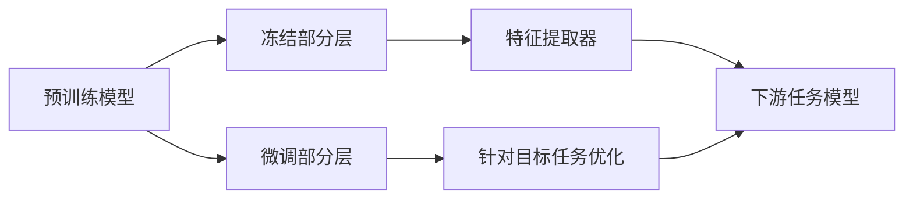

# 微调 (Fine-tuning)

## 1. 背景介绍

### 1.1 深度学习模型的训练挑战

深度学习模型在各个领域取得了巨大的成功,如计算机视觉、自然语言处理等。然而,训练一个高性能的深度学习模型通常需要大量的标注数据和计算资源,这对于许多实际应用场景来说是一个挑战。

### 1.2 迁移学习的兴起

为了解决上述问题,迁移学习(Transfer Learning)应运而生。其核心思想是利用在源任务上学习到的知识,来帮助目标任务的学习。通过迁移学习,我们可以在目标任务数据较少的情况下,训练出性能优秀的模型。

### 1.3 微调的重要性

微调(Fine-tuning)是迁移学习的一种常用技术。通过在预训练模型的基础上进行微调,我们可以快速适应新的任务,达到较高的性能,同时大大减少所需的训练数据和计算资源。

## 2. 核心概念与联系

### 2.1 预训练模型(Pre-trained Model)

预训练模型是在大规模数据集上训练的通用模型,如在ImageNet上预训练的ResNet、在大规模语料库上预训练的BERT等。这些模型学习到了丰富的特征表示,可以作为下游任务的良好初始化。

### 2.2 微调(Fine-tuning)

微调是在预训练模型的基础上,利用目标任务的少量标注数据,通过进一步训练来优化模型在特定任务上的性能。微调过程中,我们通常会更新预训练模型的部分或全部参数。

### 2.3 特征提取器(Feature Extractor)

预训练模型可以看作是一个特征提取器,它将输入数据映射到一个语义丰富的特征空间。在微调过程中,我们可以选择冻结部分预训练模型参数,仅更新后面的几层,将预训练模型当作特征提取器使用。

### 2.4 微调的可视化



## 3. 核心算法原理具体操作步骤

### 3.1 选择合适的预训练模型

根据目标任务的特点,选择合适的预训练模型。例如,对于计算机视觉任务,可以选择在ImageNet上预训练的ResNet、VGG等;对于自然语言处理任务,可以选择BERT、GPT等。

### 3.2 准备目标任务数据

将目标任务的数据划分为训练集、验证集和测试集。注意要保证数据的质量和多样性,以避免过拟合。

### 3.3 设计微调模型结构

在预训练模型的基础上,根据目标任务的需求设计微调模型的结构。通常会在预训练模型的顶部添加一些任务特定的层,如分类层、回归层等。

### 3.4 选择微调策略

决定在微调过程中,哪些层的参数需要更新,哪些层的参数保持不变。一般来说,离输出层越近的层,越需要针对目标任务进行微调;而离输入层越近的层,学习到的特征越通用,可以考虑冻结这部分参数。

### 3.5 设置训练超参数

选择合适的优化器(如Adam、SGD等),设置学习率、批量大小、训练轮数等超参数。微调时的学习率通常会比预训练时的学习率要小,以避免破坏预训练模型学习到的特征。

### 3.6 开始微调训练

利用目标任务的训练数据,开始微调预训练模型。在训练过程中,要监控模型在验证集上的性能,以判断是否出现过拟合。

### 3.7 评估微调后的模型性能

在目标任务的测试集上评估微调后的模型性能,与baseline方法进行比较,分析微调的效果。

## 4. 数学模型和公式详细讲解举例说明

### 4.1 微调的目标函数

假设预训练模型的参数为$\theta_p$,微调模型的参数为$\theta_f$,微调的目标是最小化如下损失函数:

$$\mathcal{L}(\theta_f) = \frac{1}{N} \sum_{i=1}^N \ell(f(x_i; \theta_f), y_i)$$

其中,$\{(x_i, y_i)\}_{i=1}^N$为目标任务的训练数据,$f(\cdot; \theta_f)$为微调模型,$\ell(\cdot, \cdot)$为损失函数(如交叉熵损失)。

### 4.2 参数更新公式

在微调过程中,我们通过梯度下降法来更新模型参数:

$$\theta_f \leftarrow \theta_f - \eta \nabla_{\theta_f} \mathcal{L}(\theta_f)$$

其中,$\eta$为学习率。对于冻结的层,其参数在微调过程中保持不变。

### 4.3 微调的正则化

为了防止微调过程中出现过拟合,我们可以在损失函数中加入正则化项:

$$\mathcal{L}(\theta_f) = \frac{1}{N} \sum_{i=1}^N \ell(f(x_i; \theta_f), y_i) + \lambda \Omega(\theta_f)$$

其中,$\Omega(\theta_f)$为正则化项(如L2正则化),$\lambda$为正则化系数。

## 5. 项目实践：代码实例和详细解释说明

下面以PyTorch为例,展示如何进行微调:

```python
import torch
import torch.nn as nn
import torchvision.models as models

# 加载预训练的ResNet-18模型
pretrained_model = models.resnet18(pretrained=True)

# 冻结预训练模型的部分参数
for param in pretrained_model.parameters():
    param.requires_grad = False

# 替换最后的全连接层
num_features = pretrained_model.fc.in_features
pretrained_model.fc = nn.Linear(num_features, num_classes)

# 定义损失函数和优化器
criterion = nn.CrossEntropyLoss()
optimizer = torch.optim.Adam(pretrained_model.fc.parameters(), lr=1e-3)

# 微调训练
for epoch in range(num_epochs):
    for images, labels in train_loader:
        outputs = pretrained_model(images)
        loss = criterion(outputs, labels)
        
        optimizer.zero_grad()
        loss.backward()
        optimizer.step()
```

在这个例子中,我们首先加载了在ImageNet上预训练的ResNet-18模型。然后,我们冻结了预训练模型的所有参数,只对最后的全连接层进行微调。在训练过程中,我们使用交叉熵损失函数和Adam优化器,对全连接层的参数进行更新。

## 6. 实际应用场景

微调技术在许多实际应用中得到了广泛使用,例如:

### 6.1 医学图像分类

利用在大规模自然图像数据集上预训练的模型,如ResNet、DenseNet等,通过微调来适应医学图像分类任务,如肿瘤分类、病变检测等。

### 6.2 情感分析

利用在大规模文本语料库上预训练的模型,如BERT、RoBERTa等,通过微调来适应情感分析任务,如判断评论的情感倾向(积极、消极、中性)。

### 6.3 语音识别

利用在大规模语音数据上预训练的模型,如Wav2Vec、HuBERT等,通过微调来适应特定场景下的语音识别任务,如会议记录、客服对话等。

## 7. 工具和资源推荐

以下是一些常用的微调工具和资源:

- PyTorch官方教程:[TRANSFER LEARNING FOR COMPUTER VISION TUTORIAL](https://pytorch.org/tutorials/beginner/transfer_learning_tutorial.html)
- Hugging Face Transformers库:[Fine-tuning a pretrained model](https://huggingface.co/transformers/training.html)
- 预训练模型库:[TensorFlow Hub](https://tfhub.dev/),[PyTorch Hub](https://pytorch.org/hub/)
- 微调相关论文:[awesome-transfer-learning](https://github.com/artix41/awesome-transfer-learning)

## 8. 总结：未来发展趋势与挑战

### 8.1 未来发展趋势

- 更大规模、更多样化的预训练模型不断涌现,如GPT-3、CLIP等,为下游任务提供更强大的特征表示能力。
- 半监督微调、无监督微调等技术的发展,进一步降低微调所需的标注数据。
- 跨模态微调的探索,如利用视觉-语言预训练模型进行跨模态迁移学习。

### 8.2 面临的挑战

- 如何选择最适合目标任务的预训练模型和微调策略,仍需要大量的经验和实验。
- 预训练模型的偏差问题,如性别歧视、种族歧视等,可能会在微调后的模型中继续存在。
- 微调过程中的过拟合问题,需要合理设置正则化策略和早停机制。

## 9. 附录：常见问题与解答

### 9.1 什么情况下需要微调?

- 当目标任务的数据量较小,从头训练模型容易过拟合时。
- 当目标任务与预训练模型的源任务存在一定相似性时。
- 当预训练模型的性能已经很高,希望在此基础上进一步提升时。

### 9.2 微调需要多少数据?

微调所需的数据量取决于多个因素,如目标任务的复杂度、预训练模型与目标任务的相关性等。一般来说,微调所需的数据量要远小于从头训练模型所需的数据量。

### 9.3 微调时需要注意哪些超参数?

- 学习率:微调时的学习率通常要比预训练时的学习率小,如1e-5~1e-3。
- Batch size:微调时的batch size通常要比预训练时的batch size小,如16~64。
- 正则化系数:合理设置正则化系数,以避免过拟合。
- 训练轮数:根据验证集性能,合理设置训练轮数,避免过拟合。

作者：禅与计算机程序设计艺术 / Zen and the Art of Computer Programming