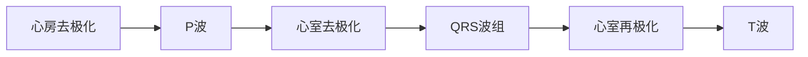

# 心电图数据研究原理与方法

## 1.背景介绍

心电图(Electrocardiogram, ECG)是一种非侵入性的诊断工具,广泛应用于临床医学中。它通过在人体皮肤表面放置电极,记录心脏每一次收缩和舒张时产生的微弱电信号,从而反映心脏的电活动状态。心电图数据可以揭示心律失常、心肌缺血、心肌梗塞等多种心脏疾病的存在,是评估心脏健康状况的重要依据。

随着医疗信息化的发展,心电图数据的采集、存储和分析已经进入数字化时代。通过计算机辅助诊断技术的应用,医生可以更加高效、准确地解读心电图数据,从而提高诊断的质量和效率。同时,大量的心电图数据为机器学习和人工智能等先进技术在医疗领域的应用奠定了基础。

## 2.核心概念与联系

### 2.1 心电图波形

心电图波形由P波、QRS波组和T波组成,每一个波形都反映了心脏不同部分的电活动。

- P波:表示心房的去极化过程。
- QRS波组:表示心室的去极化过程。
- T波:表示心室的再极化过程。



### 2.2 心电图导联

为了全面反映心脏的电活动,心电图采集需要在人体不同部位放置多个电极,形成不同的导联。常见的导联包括:

- 肢体导联(I、II、III、aVR、aVL、aVF)
- 胸壁导联(V1、V2、V3、V4、V5、V6)

不同导联可以提供不同角度的心电图信息,有助于全面评估心脏状况。

## 3.核心算法原理具体操作步骤

### 3.1 心电图数字化

要对心电图数据进行分析,首先需要将模拟信号转换为数字信号。常用的数字化方法包括:

1. 采样(Sampling):以一定的采样频率对模拟信号进行离散采样,得到一系列离散数据点。
2. 量化(Quantization):将每个采样点的幅值量化为有限的数字级别。

$$
x[n] = x(nT_s)
$$

其中,$ x[n] $表示第n个采样点的数字量化值,$ x(t) $表示原始模拟信号,$ T_s $表示采样周期。

### 3.2 基线漂移校正

由于各种原因(如呼吸、电极接触不良等),心电图信号中常常存在基线漂移的问题。基线漂移会影响波形的准确性,因此需要进行校正。常用的校正方法包括:

1. 高通滤波
2. 移动平均滤波
3. 小波变换去基线漂移

### 3.3 去噪

心电图信号在采集过程中不可避免地会受到各种噪声的影响,如肌电噪声、交流噪声等。去噪是心电图数据预处理的重要步骤,常用的去噪方法包括:

1. 小波变换去噪
2. 自适应滤波
3. 独立分量分析(ICA)

### 3.4 QRS波检测

QRS波组是心电图波形中最显著的特征,准确检测QRS波组对于后续的心率计算、波形分割等分析步骤至关重要。常用的QRS波检测算法包括:

1. 小波变换
2. 小波变换与自适应阈值相结合
3. 小波变换与人工神经网络相结合
4. 小波变换与支持向量机相结合

### 3.5 波形分割与特征提取

在检测到QRS波组后,需要对心电图波形进行分割,将P波、QRS波组和T波分开。然后,从每个波形中提取相关的特征参数,如波幅、波宽、波面积等,为后续的分类和诊断提供依据。

### 3.6 心电图分类与诊断

根据提取的特征参数,可以利用机器学习算法对心电图进行分类和诊断,识别出是否存在心律失常、心肌缺血、心肌梗塞等异常情况。常用的分类算法包括:

1. 支持向量机(SVM)
2. 人工神经网络(ANN)
3. 决策树
4. 随机森林
5. K-近邻(KNN)

## 4.数学模型和公式详细讲解举例说明

### 4.1 小波变换

小波变换是心电图数据分析中常用的数学工具,它可以在时间域和频率域同时对信号进行局部分析。小波变换的基本思想是将信号投影到一组小波基函数上,得到对应的小波系数。

连续小波变换(Continuous Wavelet Transform, CWT)定义为:

$$
CWT(a,b) = \frac{1}{\sqrt{a}}\int_{-\infty}^{\infty}f(t)\psi^*\left(\frac{t-b}{a}\right)dt
$$

其中,$ f(t) $是原始信号,$ \psi(t) $是小波基函数,$ a $是尺度参数,$ b $是平移参数,$ * $表示复数共轭。

离散小波变换(Discrete Wavelet Transform, DWT)定义为:

$$
DWT(j,k) = \frac{1}{\sqrt{a_0^j}}\int_{-\infty}^{\infty}f(t)\psi^*\left(\frac{t-kb_0a_0^j}{a_0^j}\right)dt
$$

其中,$ a_0 $和$ b_0 $是固定的尺度和平移参数。

小波变换可以有效地去除心电图信号中的基线漂移和噪声,同时保留QRS波组等重要特征,因此广泛应用于心电图数据的预处理和特征提取。

### 4.2 独立分量分析

独立分量分析(Independent Component Analysis, ICA)是一种盲源分离技术,它可以将混合信号分解为多个统计独立的成分。在心电图去噪中,ICA可以将心电信号与噪声信号分离开来。

设$ \mathbf{x} = [x_1, x_2, \dots, x_n]^T $是$ n $个混合观测信号,$ \mathbf{s} = [s_1, s_2, \dots, s_n]^T $是$ n $个独立源信号,则它们之间的关系可以表示为:

$$
\mathbf{x} = \mathbf{As}
$$

其中,$ \mathbf{A} $是未知的混合矩阵。ICA的目标是根据观测信号$ \mathbf{x} $估计出源信号$ \mathbf{s} $和混合矩阵$ \mathbf{A} $。

常用的ICA算法包括FastICA、Infomax ICA等。ICA在心电图去噪中的应用步骤如下:

1. 将心电图观测信号输入ICA算法,得到独立分量$ \mathbf{s} $。
2. 识别出代表心电信号的独立分量。
3. 利用这些独立分量重构出去噪后的心电图信号。

## 5.项目实践:代码实例和详细解释说明

以下是使用Python和PyWavelets库对心电图数据进行小波变换去噪的代码示例:

```python
import pywt
import numpy as np
import matplotlib.pyplot as plt

# 加载心电图数据
ecg_data = np.loadtxt('ecg_data.txt')

# 小波变换去噪
wavelet = 'db4'  # 选择小波基函数
level = 5  # 分解层数
coeffs = pywt.wavedec(ecg_data, wavelet, level=level)

# 阈值去噪
thresh = 0.6  # 阈值
new_coeffs = pywt.threshold(coeffs, value=thresh, mode='soft')

# 重构信号
denoised_ecg = pywt.waverec(new_coeffs, wavelet)

# 绘制原始信号和去噪后的信号
plt.figure(figsize=(12, 6))
plt.subplot(2, 1, 1)
plt.plot(ecg_data)
plt.title('Original ECG Signal')
plt.subplot(2, 1, 2)
plt.plot(denoised_ecg)
plt.title('Denoised ECG Signal')
plt.tight_layout()
plt.show()
```

在这个示例中,我们首先加载心电图数据文件`ecg_data.txt`。然后,使用PyWavelets库进行小波变换去噪。

1. 选择小波基函数`db4`(Daubechies小波)和分解层数`level=5`。
2. 使用`pywt.wavedec()`函数对心电图数据进行小波分解,得到小波系数`coeffs`。
3. 使用`pywt.threshold()`函数对小波系数进行阈值去噪,阈值设置为`thresh=0.6`,去噪模式为`soft`(软阈值)。
4. 使用`pywt.waverec()`函数重构去噪后的心电图信号`denoised_ecg`。
5. 使用Matplotlib库绘制原始心电图信号和去噪后的信号,以便进行对比和分析。

这只是一个简单的示例,在实际应用中,您可能需要调整小波基函数、分解层数和阈值参数,以获得最佳的去噪效果。此外,还可以尝试其他去噪方法,如小波变换与自适应阈值相结合、独立分量分析等。

## 6.实际应用场景

心电图数据分析在医疗领域有广泛的应用,包括但不限于以下几个方面:

1. **心脏病诊断**:通过分析心电图波形,可以诊断出心律失常、心肌缺血、心肌梗塞等多种心脏疾病。
2. **远程监测**:利用可穿戴设备采集心电图数据,实现对患者的远程监测,及时发现异常情况。
3. **药物评估**:评估不同药物对心脏电活动的影响,为临床用药提供参考。
4. **运动员健康监测**:监测运动员在训练和比赛过程中的心电图变化,评估其心脏健康状况。
5. **睡眠研究**:分析睡眠期间的心电图数据,探究睡眠与心脏活动之间的关系。

除了医疗领域,心电图数据分析也可以应用于生物识别、人机交互等其他领域。随着人工智能技术的不断发展,心电图数据分析的应用前景将更加广阔。

## 7.工具和资源推荐

在进行心电图数据分析时,可以使用以下工具和资源:

1. **Python生态系统**:Python语言及其丰富的科学计算库(如NumPy、SciPy、Pandas、Matplotlib等)为心电图数据分析提供了强大的支持。
2. **PyWavelets库**:一个用于小波变换的Python库,可以方便地进行小波分解、重构和阈值去噪等操作。
3. **PhysioNet**:由麻省理工学院和波士顿大学联合开发的免费在线资源,提供了大量的生理信号数据(包括心电图数据)和相关工具。
4. **心电图数据集**:多个开源心电图数据集,如MIT-BIH心电图数据库、St.Petersburg INCART 12-lead Arrhythmia Database等,可用于模型训练和测试。
5. **机器学习框架**:如TensorFlow、PyTorch、Scikit-learn等,可用于构建心电图分类和诊断模型。
6. **在线课程和教程**:如Coursera、edX等平台上的相关课程,以及各种博客和技术文章,可以帮助学习心电图数据分析的理论和实践。

利用这些工具和资源,研究人员和开发人员可以更高效地进行心电图数据分析,推动相关技术的发展和应用。

## 8.总结:未来发展趋势与挑战

心电图数据分析是一个充满活力和机遇的领域,未来将有以下几个发展趋势和挑战:

1. **人工智能技术的深入应用**:深度学习、强化学习等人工智能技术将在心电图数据分析中发挥越来越重要的作用,提高诊断的准确性和效率。
2. **大数据和云计算**:随着可穿戴设备和远程监测系统的普及,将产生大量的心电图数据。如何高效存储、处理和分析这些海量数据,将是一个巨大的挑战。
3. **个性化医疗**:利用机器学习算法,可以根据个人的心电图数据和其他生理数据,提供个性化的诊断和