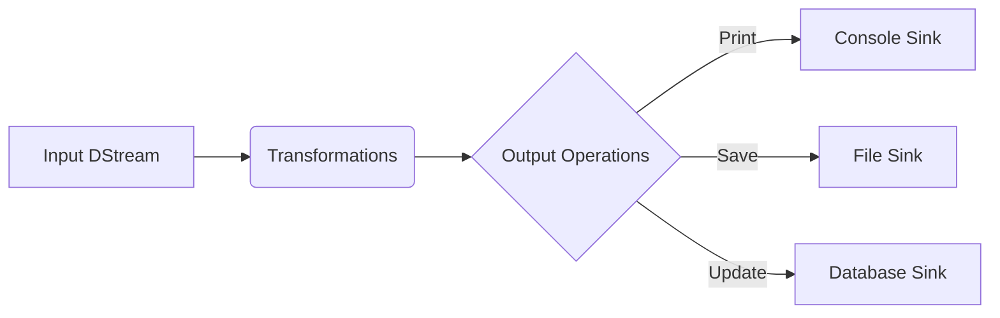

# 监控和调优Spark Streaming应用程序

## 1. 背景介绍
### 1.1 Spark Streaming简介
Spark Streaming是Apache Spark生态系统的重要组成部分，它是一个可扩展、高吞吐、高容错的分布式实时流数据处理框架。Spark Streaming支持从多种数据源(如Kafka、Flume、Kinesis等)获取实时流数据，并以类似批处理的方式处理数据，最终将结果推送到文件系统、数据库或实时仪表盘等。

### 1.2 监控和调优的重要性
对于任何生产级别的Spark Streaming应用程序，监控和调优都是非常关键的。没有适当的监控，我们无法洞察系统的运行状况，也难以发现潜在的性能瓶颈和问题。而缺乏调优，应用程序的资源利用率就会低下，无法发挥集群的最大性能。因此，深入理解如何监控和调优Spark Streaming应用程序至关重要。

## 2. 核心概念与联系
### 2.1 Spark Streaming的数据抽象
- DStream(Discretized Stream)：Spark Streaming的基本抽象，代表连续的数据流。它是一系列的RDD(弹性分布式数据集)，每个RDD包含一个时间间隔内的数据。 
- InputDStream：代表输入的数据流
- TransformedDStream：代表经过转换操作后的数据流
- ForEachDStream：代表输出的数据流

### 2.2 Spark Streaming的执行模型
Spark Streaming的应用程序在驱动器程序(Driver Program)中定义，并提交到集群管理器(Cluster Manager)上运行。在运行过程中，接收器(Receiver)不断接收实时数据流，并将其保存为RDD。Spark引擎会定期处理这些RDD，每个处理时间间隔称为一个批次间隔(Batch Interval)。

### 2.3 监控指标
- 处理时间：每个批次数据处理耗费的时间
- 调度延迟：批次实际处理时间与预期处理时间的差值  
- 接收数据速率：每秒接收到的记录数
- 处理数据速率：每秒处理的记录数
- 批次间隔：每个批次的时间间隔

### 2.4 调优方向
- 并行度调优：设置合适的并行任务数
- 批次间隔调优：设置合理的批次处理间隔
- 内存调优：设置恰当的执行器内存和广播变量
- 数据本地性调优：最小化数据跨节点传输
- 垃圾回收调优：控制垃圾回收对系统的影响

## 3. 核心算法原理与操作步骤
### 3.1 数据摄入
1. 创建输入DStream，指定数据源
2. 设置接收器(Receiver)并行度
3. 对输入数据进行必要的转换操作

### 3.2 窗口操作
1. 定义窗口的长度和滑动间隔
2. 在DStream上应用窗口操作
3. 对窗口数据进行转换和处理

### 3.3 有状态计算
1. 定义状态更新函数
2. 在DStream上应用updateStateByKey或mapWithState
3. 处理更新后的状态数据

### 3.4 输出操作
1. 定义输出操作逻辑
2. 在DStream上应用输出操作
3. 将结果数据保存到外部系统

## 4. 数学模型和公式详解
### 4.1 滑动窗口模型
给定一个DStream $DS$，窗口长度 $L$，滑动间隔 $I$，在时间 $t$ 的窗口可以表示为：

$$W_t = DS[t-L+1, t]$$

其中，$DS[start, end]$ 表示从时间 $start$ 到 $end$ 的所有RDD的集合。

### 4.2 指数加权移动平均(EWMA)
EWMA可用于平滑波动的指标数据。给定时间序列 $x_t$，EWMA值 $s_t$ 的计算公式为：

$$s_t = \begin{cases} 
x_0 & t = 0 \\
\alpha \cdot x_t + (1 - \alpha) \cdot s_{t-1} & t > 0
\end{cases}$$

其中，$\alpha \in (0, 1)$ 为平滑因子，值越小平滑程度越高。

## 5. 项目实践：代码实例和详解
### 5.1 Kafka到Console的字数统计

```scala
val conf = new SparkConf().setAppName("NetworkWordCount")
val ssc = new StreamingContext(conf, Seconds(1))

val kafkaParams = Map[String, Object](
  "bootstrap.servers" -> "localhost:9092",
  "key.deserializer" -> classOf[StringDeserializer],
  "value.deserializer" -> classOf[StringDeserializer],
  "group.id" -> "use_a_separate_group_id_for_each_stream",
  "auto.offset.reset" -> "latest"
)

val topics = Array("networkWordCount")
val stream = KafkaUtils.createDirectStream[String, String](
  ssc,
  LocationStrategies.PreferConsistent,
  ConsumerStrategies.Subscribe[String, String](topics, kafkaParams)
)

val words = stream.map(record => (record.value, 1))
val wordCounts = words.reduceByKey(_ + _)

wordCounts.print()

ssc.start()
ssc.awaitTermination()
```

这个例子从Kafka读取数据，对每个批次的数据进行单词计数，并将结果打印到控制台。其中：
- 创建了一个1秒批次间隔的StreamingContext
- 配置了Kafka消费者参数
- 使用KafkaUtils.createDirectStream创建输入流
- 对输入数据进行了切分、映射和规约操作
- 输出结果并启动流计算

### 5.2 窗口热门话题统计

```scala
val windowDuration = Seconds(300) 
val slideDuration = Seconds(10)  

val topics = Array("tweets")
val stream = KafkaUtils.createDirectStream[String, String](
  ssc,
  LocationStrategies.PreferConsistent,
  ConsumerStrategies.Subscribe[String, String](topics, kafkaParams)
)

val hashTags = stream
  .flatMap(_.split(" "))
  .filter(_.startsWith("#"))
  
val topCounts = hashTags
  .map((_, 1))
  .reduceByKeyAndWindow(_ + _, _ - _, windowDuration, slideDuration)
  .map{case (topic, count) => (count, topic)}
  .transform(_.sortByKey(false))

topCounts.foreachRDD(rdd => {
  val topList = rdd.take(10)
  println("\nPopular topics in last 5 minutes (%s total):".format(rdd.count()))
  topList.foreach{case (count, tag) => println("%s (%s tweets)".format(tag, count))}
})

ssc.start()
ssc.awaitTermination()
```

这个例子统计过去5分钟内的热门话题标签。其中：
- 定义了5分钟的窗口，每10秒滑动一次  
- 对输入的推文进行切分、过滤出话题标签
- 在滑动窗口内对标签进行计数
- 对窗口结果按照计数降序排列
- 取排名前10的热门标签输出

## 6. 实际应用场景
- 实时用户行为分析：统计网站的实时PV、UV等指标，分析用户的点击、浏览、购买等行为。
- 实时异常检测：通过机器学习模型，对实时数据进行异常检测和告警，如交易反欺诈、设备故障检测等。  
- 实时个性化推荐：根据用户的实时浏览、点击、评分等行为，实时更新用户画像，动态调整推荐策略。
- 实时舆情监控：对社交网络、新闻媒体等渠道的实时信息进行抓取、处理，分析热点话题和情感倾向。

## 7. 工具和资源推荐
- 监控工具
  - Spark UI：Spark自带的监控界面，可查看应用程序的运行状态、资源使用情况等
  - Ganglia：分布式系统监控平台，可收集Spark集群的系统指标
  - Grafana：配合Graphite或InfluxDB使用，以丰富的仪表盘实现Spark指标的可视化
- 调优工具
  - Spark Streaming Listener：Spark提供的监听器接口，可收集Streaming运行时的各种事件和指标
  - Spark Streaming Kafka Integration：Spark Streaming与Kafka集成的调优参数
- 学习资源
  - Spark官方文档：https://spark.apache.org/docs/latest/streaming-programming-guide.html
  - Databricks博客：https://databricks.com/blog
  - Spark Summit大会：https://spark-summit.org/

## 8. 总结：未来发展趋势与挑战
### 8.1 发展趋势
- 流批一体化：流处理与批处理的融合，统一流批处理的API和引擎，简化开发和运维。
- 端到端exactly-once语义：在整个流处理管道实现端到端的exactly-once，确保数据处理的准确性。
- 流处理SQL：提供高级的SQL语义，降低流处理的门槛，提高开发效率。
- 深度学习集成：在流处理中无缝集成深度学习框架，实现实时的机器学习和预测分析。

### 8.2 挑战
- 大状态管理：如何高效管理和容错流处理中的大状态，需要新的状态管理机制。
- 低延迟优化：如何进一步降低流处理的端到端延迟，实现毫秒级的实时处理。
- 数据质量和一致性：如何保证流数据的质量和一致性，需要数据治理和数据血缘等技术。
- 动态资源调度：如何根据流数据的特征和负载动态调整资源分配，提高资源利用率。

## 9. 附录：常见问题与解答
### 9.1 Spark Streaming与Storm的区别？
- Spark Streaming基于微批次处理模型，而Storm是纯实时处理
- Spark Streaming基于Spark生态，能与Spark Core、SQL等无缝集成；Storm是独立的流处理框架
- Spark Streaming通常延迟在秒级，Storm可以实现毫秒级延迟
- Spark Streaming更擅长复杂的流批统一处理，Storm更适合低延迟的流处理

### 9.2 Spark Streaming的容错机制是什么？
Spark Streaming的容错机制主要有：
- 数据重放：接收到的数据会复制到多个Executor，失败时可以从副本中恢复
- 检查点：定期将DStream的元数据存储到可靠存储，失败时可从检查点恢复
- Write Ahead Log：将接收到的数据写入预写日志，失败时可以从日志重放数据

### 9.3 Spark Streaming如何保证数据一致性？
- 幂等性：多次处理同一数据，得到的结果是一致的
- 事务性：使用支持事务的输出操作，如幂等写入或事务更新
- 检查点：定期将状态存储到检查点，失败恢复时可以从检查点恢复状态
- Spark Streaming 1.3引入了Write Ahead Log，可以实现端到端的exactly-once语义

### 9.4 Spark Streaming的背压机制是什么？
背压是指当下游系统无法快速处理数据时，给上游施加反馈压力，让其降低发送速率的机制。Spark Streaming的背压机制包括：
- Receiver Maxrate：限制每个接收器每秒接收的最大记录数
- Spark Fair Scheduler Pool：给接收器分配单独的调度池，避免与其他任务抢占资源
- Kafka Backpressure：当Kafka消费者追不上生产者速度时，自动降低拉取速率

### 9.5 Spark Streaming的调优要点有哪些？
- 并行度：设置合理的接收器数量、DStream分区数、任务数，充分利用集群资源
- 批次间隔：过小会增加调度开销，过大会增加延迟，需要根据数据量和处理时间设置
- 内存：设置合理的执行器内存，避免频繁GC；使用广播变量减少数据传输
- 数据本地性：使用基于HDFS的数据本地性调度，最小化数据跨节点传输
- 反压：监控接收速率和处理速率，启用背压机制，动态平衡上下游速率
- GC：监控GC情况，调整垃圾回收器参数，控制GC对吞吐和延迟的影响

作者：禅与计算机程序设计艺术 / Zen and the Art of Computer Programming

