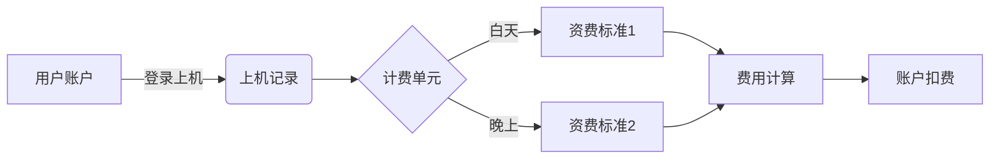

# 网吧计费系统详细设计与具体代码实现

## 1. 背景介绍
网吧作为一种提供上网服务的商业模式,在过去二十年中得到了飞速的发展。随着网吧数量的增多和规模的扩大,传统的人工计费方式已经无法满足日益增长的业务需求。因此,开发一套高效、可靠、易用的网吧计费系统势在必行。

本文将详细阐述网吧计费系统的设计思路和具体实现方案。通过对需求分析、系统架构设计、数据库设计、核心算法、代码实现等方面的深入探讨,为读者提供一个全面的网吧计费系统开发指南。

## 2. 核心概念与联系
要设计一个完善的网吧计费系统,首先需要理解以下几个核心概念:

### 2.1 计费单元
计费单元是指网吧计费的最小时间单位,通常为1分钟或0.5小时。系统需要根据用户的上机时长,按照预设的计费单元进行费用计算。

### 2.2 资费标准
资费标准定义了不同时段的上网费用。比如白天和晚上的费率可能不同,节假日的收费标准也可能有所调整。灵活的资费配置能够帮助网吧实现差异化经营。

### 2.3 用户账户
每个上网用户都需要一个唯一的账户标识。账户信息包括用户名、密码、剩余时长、累计消费等。用户可以通过账户登录上机,系统根据账户的信息进行认证和计费。

### 2.4 上机记录
上机记录是指用户每一次上机的详细信息,包括上机时间、下机时间、消费金额、使用的机器等。详细的上机记录可以帮助网吧进行经营分析和统计。

这些概念之间的关系如下图所示:



## 3. 核心算法原理和具体操作步骤
网吧计费的核心算法是根据用户的上机时长和资费标准,计算出本次上机的费用。具体步骤如下:

1. 记录用户的上机时间T1
2. 用户下机时,记录下机时间T2
3. 计算上机时长 Δt = T2 - T1
4. 根据上机时间T1判断适用的资费标准S(白天/晚上) 
5. 根据资费标准S和时长Δt,计算费用 F = S × ⌈Δt/u⌉ (u为计费单元,向上取整)
6. 从用户账户中扣除费用F,并更新剩余时长

## 4. 数学模型和公式详细讲解举例说明
上一节中的计费公式 $F = S × ⌈Δt/u⌉$ 可以这样理解:

假设白天资费标准为 $S_1=0.5元/小时$,晚上为 $S_2=1元/小时$,计费单元 $u=1分钟=1/60小时$。某用户从晚上10点上机,到次日凌晨1点下机,共计3小时(Δt=3)。

则费用计算过程为:
$$
\begin{aligned}
F &= S_2 × ⌈Δt/u⌉ \\
&= 1 × ⌈3/(1/60)⌉ \\
&= 1 × ⌈3×60⌉ \\
&= 1 × 180 \\
&= 180 元
\end{aligned}
$$

可见,计费单元的设置会影响计费的精度和总额。网吧可以根据自身情况,选择合适的计费单元。

## 5. 项目实践：代码实例和详细解释说明
下面我们使用Python语言,实现一个简单的网吧计费系统。

```python
import time
import math

class User:
    def __init__(self, username, password, balance):
        self.username = username
        self.password = password
        self.balance = balance
        self.login_time = 0
        self.logout_time = 0
    
    def login(self):
        self.login_time = time.time()
        print(f"用户{self.username}登录成功,当前余额为{self.balance}元")
    
    def logout(self):
        self.logout_time = time.time()
        duration = (self.logout_time - self.login_time) / 3600  # 小时
        cost = calculate_cost(self.login_time, duration)
        self.balance -= cost
        print(f"用户{self.username}退出登录,本次费用为{cost}元,余额为{self.balance}元")

def is_daytime(timestamp):
    struct_time = time.localtime(timestamp)
    return 8 <= struct_time.tm_hour < 22

def calculate_cost(start_time, duration):
    unit = 1 / 60  # 计费单元为1分钟
    price = 0.5 if is_daytime(start_time) else 1
    return price * math.ceil(duration / unit)

user = User("zhangsan", "123456", 1000)
user.login()
time.sleep(10)  # 模拟上机10秒
user.logout()
```

代码说明:
- User类封装了用户的账户信息和登录登出操作
- is_daytime函数根据时间戳判断是否为白天
- calculate_cost函数根据登录时间和上机时长计算费用
- 用户登录后,记录登录时间;登出时计算时长和费用,并从余额中扣除

这个简单的Demo展示了网吧计费系统的基本逻辑。在实际开发中,还需要考虑更多因素,如并发登录、数据持久化、界面设计等。

## 6. 实际应用场景
网吧计费系统可以应用于各类网吧、电竞酒店等场所。它具有以下优势:
1. 提高计费效率,减少人工成本
2. 灵活定制资费,满足不同时段的营销需求
3. 详细的消费记录,便于统计分析
4. 自助充值、结账,提升用户体验

除了传统的网吧,这套系统也可以扩展应用到其他计时收费的服务场景,如自习室、棋牌室、洗浴中心等。

## 7. 工具和资源推荐
在开发网吧计费系统时,推荐使用以下工具和资源:
1. Python: 简单高效的编程语言,适合快速开发
2. PyQt: 基于Qt的Python GUI框架,可以快速构建漂亮的用户界面
3. MySQL: 开源免费的关系型数据库,用于存储用户信息和计费记录
4. Redis: 高性能的内存数据库,可用于缓存和分布式锁
5. Nginx: 高并发的Web服务器,用于处理HTTP请求和负载均衡
6. GitHub: 全球最大的代码托管平台,可以找到许多开源的计费系统项目进行参考和学习

## 8. 总结：未来发展趋势与挑战
随着移动支付的普及和云计算技术的发展,网吧计费系统也面临着新的机遇和挑战。

未来的发展趋势可能包括:
1. 移动端管理:通过手机APP实现用户自助上机、充值、查询等操作
2. 云端对接:将计费系统迁移到云平台,实现多店统一管理和数据共享
3. 大数据分析:利用海量的计费数据,进行用户画像和营销策略优化
4. 人脸识别:通过人脸识别技术实现无感登录和计费,提高用户体验

同时,网吧计费系统也面临一些挑战:
1. 网络安全:如何防范恶意攻击和数据泄露,保障系统和用户的安全
2. 计费规则多样化:如何灵活配置和组合各种计费规则,满足复杂多变的市场需求
3. 系统性能:如何提高系统的并发处理能力,应对高峰期的用户登录和计费
4. 与其他系统集成:如何与会员系统、支付系统、游戏平台等第三方系统进行无缝对接和数据交互

## 9. 附录：常见问题与解答
Q: 网吧计费系统适合哪些语言开发?
A: 理论上任何语言都可以开发网吧计费系统。但考虑到开发效率、系统性能、跨平台等因素,建议选择Python、Java、C++、Go等主流语言。

Q: 网吧计费系统需要哪些外部依赖和条件?
A: 除了服务器硬件设施外,网吧计费系统通常需要依赖数据库(如MySQL)、缓存(如Redis)、Web服务器(如Nginx)等基础组件。同时,还需要网吧前台的客户端程序(可基于Web或桌面GUI)。

Q: 如何保证网吧计费系统的可靠性?
A: 可靠性是计费系统的关键要求。需要从多方面保障:
1. 代码层面,进行充分的单元测试和集成测试,尽可能覆盖各种异常场景;
2. 架构层面,引入缓存、消息队列等组件,实现系统解耦和数据一致性;
3. 部署层面,采用主从备份、多机房容灾等方案,提高系统的高可用性;
4. 运维层面,配置实时监控和告警,及时发现和处理故障。

Q: 网吧计费系统如何与其他系统集成?
A: 可以采用API接口的方式与其他系统对接。比如,提供HTTP RESTful接口,供会员系统、支付系统调用;或者提供SDK包,让游戏平台调用计费功能。需要注意接口的安全性、稳定性和扩展性。

作者：禅与计算机程序设计艺术 / Zen and the Art of Computer Programming