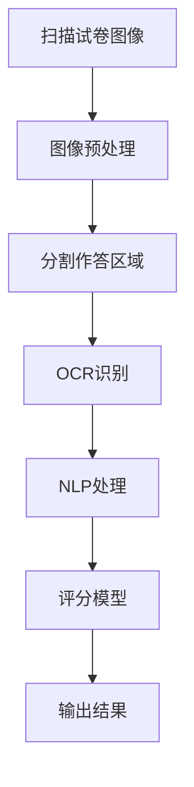

# 考试分析评价系统详细设计与具体代码实现

## 1.背景介绍

随着教育信息化的不断推进,考试分析评价系统在教育领域发挥着越来越重要的作用。传统的人工评阅考试成绩不仅耗时耗力,而且难免存在主观性和不公平性。因此,构建一个高效、准确、公正的考试分析评价系统,对于提高教育教学质量、优化教学管理具有重要意义。

本文将详细介绍一种基于计算机视觉和自然语言处理技术的考试分析评价系统的设计与实现,该系统可自动识别扫描的试卷图像、分析作答内容并给出评分结果。系统的核心技术包括:

1. 图像预处理和扫描试卷图像分割
2. 光学字符识别(OCR)提取试卷作答内容
3. 自然语言处理分析作答内容语义
4. 评分模型自动评分

该系统可广泛应用于中小学、高校以及各类考试的阅卷评分工作,大幅提高评阅效率,减轻从业人员工作强度,并确保评分结果的客观公正性。

## 2.核心概念与联系

考试分析评价系统涉及多个计算机领域的核心概念,包括:

1. **计算机视觉(Computer Vision)**:用于扫描试卷图像预处理、分割等图像处理任务。
2. **光学字符识别(OCR)**:将试卷图像上的文字转换为机器可读的文本内容。
3. **自然语言处理(NLP)**:分析作答内容的语义,理解其含义和关键信息。
4. **机器学习(ML)**:训练评分模型,根据试卷内容自动给出分数评价。

这些概念相互关联,构成了考试分析评价系统的技术基础。计算机视觉负责获取试卷图像并进行预处理;OCR将图像转化为文本;NLP分析文本语义;机器学习训练评分模型,给出最终的分数评价。

## 3.核心算法原理具体操作步骤 

考试分析评价系统的核心算法包括以下步骤:

### 3.1 图像预处理

1. 扫描获取试卷图像
2. 图像去噪、二值化等预处理
3. 使用边缘检测等算法定位并分割出试卷作答区域

### 3.2 OCR识别

1. 对分割出的作答区域图像使用OCR引擎
2. 提取识别出的文本内容

### 3.3 自然语言处理

1. 分词、词性标注等基本NLP处理
2. 命名实体识别挖掘关键信息
3. 句法分析和语义理解

### 3.4 评分模型预测

1. 基于标注语料训练序列标注、文本分类等模型
2. 将作答内容语义映射为分数评价

### 3.5 结果输出

1. 将分数结果与试卷图像一并输出
2. 可选: 输出关键句子/观点的证据支持



## 4.数学模型和公式详细讲解举例说明

### 4.1 图像预处理模型

图像预处理常用的数学模型包括:

1. **均值滤波**: 用邻域像素的均值替代中心像素,去除噪声。

$$
g(x,y) = \frac{1}{mn}\sum_{(i,j)\in W}f(x+i,y+j)
$$

其中$f(x,y)$为原始图像,$(x,y)$为像素坐标,$W$为以$(x,y)$为中心的$m\times n$邻域,$g(x,y)$为滤波后的像素值。

2. **中值滤波**: 用邻域像素的中值替代中心像素,去除椒盐噪声。

3. **直方图均衡化**: 增强图像对比度,使像素值分布均匀。

### 4.2 OCR模型

OCR常用的模型包括:

1. **基于字典的模板匹配**: 将图像与预先设计的字符模板库进行匹配。
2. **基于统计模型**: 将字符识别问题建模为分类问题,使用隐马尔可夫模型(HMM)、支持向量机(SVM)等统计模型进行字符识别。
3. **基于深度学习的端到端模型**: 使用卷积神经网络(CNN)、循环神经网络(RNN)等深度学习模型直接从图像像素学习到字符序列。

### 4.3 NLP模型

NLP常用的模型包括:

1. **词向量**: 如Word2Vec、GloVe等,将词映射为低维稠密向量。
2. **序列标注模型**: 如HMM、LSTM-CRF等,用于命名实体识别等序列标注任务。
3. **文本分类模型**: 如TextCNN、BERT等,将文本分类为不同类别。
4. **语义匹配模型**: 如DSSM、ESIM等,计算两段文本的语义相似度。

### 4.4 评分模型

评分模型可以建立在序列标注模型和文本分类模型的基础之上。例如可以将评分任务看作一个序列标注问题,预测每个词对应的分数标签。也可以将评分任务看作一个分类问题,将作答映射为不同的分数等级。

此外,也可以使用语义匹配模型,将作答内容与标准答案的语义相似度作为评分依据。

## 5.项目实践:代码实例和详细解释说明

我们以Python语言为例,使用主流的计算机视觉、OCR和NLP开源库,展示考试分析评价系统的具体实现。

### 5.1 图像预处理

```python
import cv2
import numpy as np

# 读取图像
img = cv2.imread('exam_paper.jpg')

# 灰度化
gray = cv2.cvtColor(img, cv2.COLOR_BGR2GRAY)

# 高斯滤波去噪
blur = cv2.GaussianBlur(gray, (5,5), 0)  

# 自适应阈值二值化
thresh = cv2.adaptiveThreshold(blur, 255, cv2.ADAPTIVE_THRESH_GAUSSIAN_C, cv2.THRESH_BINARY_INV, 11, 2)

# 寻找最大轮廓(作答区域)
cnts = cv2.findContours(thresh, cv2.RETR_EXTERNAL, cv2.CHAIN_APPROX_SIMPLE)[-2]
c = max(cnts, key=cv2.contourArea)

# 分割出作答区域
x,y,w,h = cv2.boundingRect(c)
roi = img[y:y+h, x:x+w]
cv2.imwrite('answer_area.jpg', roi)
```

上述代码首先读取试卷图像,进行灰度化、高斯滤波去噪和自适应阈值二值化等预处理。然后使用OpenCV的轮廓检测算法寻找最大轮廓(作答区域),并将其分割出来保存为新图像。

### 5.2 OCR识别

```python
import pytesseract
from PIL import Image

# 读取分割出的作答区域图像
answer_img = Image.open('answer_area.jpg')

# OCR识别
answer_text = pytesseract.image_to_string(answer_img, lang='chi_sim')

# 保存识别结果
with open('answer.txt', 'w', encoding='utf-8') as f:
    f.write(answer_text)
```

我们使用pytesseract库调用Google的Tesseract-OCR引擎,对分割出的作答区域图像进行OCR识别,得到作答内容的文本,并将其保存在文本文件中。

### 5.3 自然语言处理

```python
import jieba
import jieba.posseg as pseg

# 读取作答文本
with open('answer.txt', 'r', encoding='utf-8') as f:
    answer_text = f.read()

# 分词和词性标注    
words = pseg.cut(answer_text)

# 命名实体识别
import nltk
from nltk import ne_chunk

# 构建NLTK标注器
sentences = nltk.sent_tokenize(answer_text)
tokenized_sentences = [nltk.word_tokenize(sent) for sent in sentences]
tagged_sentences = [nltk.pos_tag(sent) for sent in tokenized_sentences]

# 命名实体识别
chunked_sentences = nltk.ne_chunk_sents(tagged_sentences, binary=True)

# 提取实体
entities = []
for tree in chunked_sentences:
    tree.draw()
    entity_names = [' '.join([node for node in t]) 
                    for t in tree.subtrees()
                    if t.label() == 'NE']
    for n in entity_names:
        entities.append(n)

print(entities)
```

上述代码使用jieba分词和词性标注工具对作答文本进行基本的NLP处理。然后使用NLTK工具包进行命名实体识别,提取出作答中的关键实体名词,如人名、地名、机构名等。这些实体可作为评分的重要依据。

此外,我们还可以使用句法分析、指代消解、语义角色标注等NLP技术,进一步挖掘和理解作答内容的语义信息。

### 5.4 评分模型

评分模型的训练和使用可以基于序列标注或文本分类等机器学习任务。这里我们以序列标注为例,使用Bi-LSTM+CRF模型:

```python
import tensorflow as tf
from tensorflow.keras.models import Model
from tensorflow.keras.layers import Input, Embedding, Bidirectional, LSTM, Dense, TimeDistributed

# 构建Bi-LSTM+CRF模型
inputs = Input(shape=(max_len,))
mask = Input(shape=(max_len,))
x = Embedding(vocab_size, embed_dim)(inputs)
x = Bidirectional(LSTM(units, return_sequences=True))(x)
outputs = TimeDistributed(Dense(num_tags, activation='relu'))(x)
model = Model(inputs=[inputs, mask], outputs=outputs)

# 训练模型
model.compile('adam', loss='sparse_categorical_crossentropy', metrics=['acc'])
model.fit(X_train, y_train, ...)

# 预测
y_pred = model.predict(X_test)
```

我们构建了一个双向LSTM+CRF的序列标注模型,输入是作答文本的词序列,输出是每个词对应的分数标签序列。在训练阶段,我们使用标注好的语料训练模型。预测时,将作答文本输入模型,得到预测的分数标签序列,再将其解码为最终的分数。

此外,我们还可以尝试基于BERT等预训练语言模型的方法,提高模型的泛化性能。

## 6.实际应用场景

考试分析评价系统可以广泛应用于以下场景:

1. **中小学考试阅卷**: 自动批阅中小学生的期中、期末试卷,减轻教师的阅卷工作量。

2. **高考、研究生入学考试阅卷**: 高效、准确地评阅大规模考试的作文、申论等主观题,确保评分公平公正。

3. **在线教育自动批改作业**: 在线教育平台可集成该系统,自动批改学生提交的作业,及时反馈成绩和评语。

4. **企业招聘笔试评估**: 企业在校园招聘时,可使用该系统高效评估应聘者的笔试答卷。

5. **语言能力测试评分**: 可用于评分托福、雅思等语言能力测试的作文部分。

总之,该系统可以显著提高各类考试评阅工作的效率,并确保评分结果的客观性和公平性,在教育、招聘等领域具有广阔的应用前景。

## 7.工具和资源推荐

在实现考试分析评价系统时,我们可以利用以下优秀的开源工具和资源:

1. **计算机视觉**:OpenCV、scikit-image等图像处理库
2. **OCR**:Tesseract OCR、EasyOCR、PaddleOCR等OCR引擎
3. **自然语言处理**:NLTK、jieba、HanLP、Stanford CoreNLP等NLP工具包
4. **机器学习**:PyTorch、TensorFlow、Scikit-Learn等深度学习框架和机器学习库
5. **语料和预训练模型**:中文维基百科语料、百度百科语料、BERT等预训练语言模型

此外,我们也可以使用云计算平台提供的一些成熟的AI服务,如:

- 阿里云机器学习PAI
- 腾讯云自然语言处理服务
- 百度云OCR识别

利用这些优秀的开源工具和云服务,可以极大地提高系统的开发效率。

## 8.总结:未来发展趋势与挑战

考试分析评价系统是一个交叉应用领域,融合了计算机视