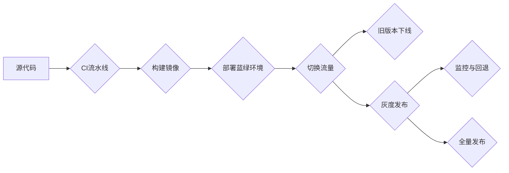

# 蓝绿部署与金丝雀发布原理与代码实战案例讲解

## 1. 背景介绍

在当今快速迭代的软件开发过程中,持续集成与持续交付(CI/CD)已成为行业标准。而在 CI/CD 流程中,如何在不影响用户体验的情况下平滑地发布新版本,成为了一个重要课题。蓝绿部署(Blue-Green Deployment)和金丝雀发布(Canary Release)作为两种流行的软件发布策略,为解决这一难题提供了可行的思路。

### 1.1 持续交付的挑战

#### 1.1.1 服务停机时间
#### 1.1.2 版本回退困难
#### 1.1.3 用户体验不一致

### 1.2 蓝绿部署和金丝雀发布的优势

#### 1.2.1 零停机时间
#### 1.2.2 快速回退
#### 1.2.3 灰度测试

## 2. 核心概念与联系

### 2.1 蓝绿部署

蓝绿部署是一种无需停机即可实现新旧版本平滑过渡的部署方式。其核心思想是准备两套完全相同的生产环境(称为蓝色环境和绿色环境),在部署新版本时,先将流量切到一个环境,待验证通过后,再将流量全部切换到新环境。

#### 2.1.1 蓝绿环境
#### 2.1.2 流量切换
#### 2.1.3 数据同步

### 2.2 金丝雀发布

金丝雀发布源自矿工用金丝雀对矿井进行空气测试的做法。在软件领域,金丝雀发布指先让一小部分用户体验新版本,待验证稳定后再逐步扩大范围,最终达到全量发布的一种灰度发布方式。

#### 2.2.1 用户分组
#### 2.2.2 灰度控制  
#### 2.2.3 监控与评估

### 2.3 两种策略的异同

#### 2.3.1 部署粒度
#### 2.3.2 风险控制
#### 2.3.3 发布速度

## 3. 核心算法原理具体操作步骤

### 3.1 蓝绿部署步骤

#### 3.1.1 准备蓝绿环境
#### 3.1.2 部署新版本
#### 3.1.3 切换流量
#### 3.1.4 旧版本下线

### 3.2 金丝雀发布步骤  

#### 3.2.1 划分用户分组
#### 3.2.2 部署新版本
#### 3.2.3 灰度发布
#### 3.2.4 监控与回退
#### 3.2.5 全量发布

## 4. 数学模型和公式详细讲解举例说明

### 4.1 金丝雀发布的数学模型

假设我们将用户分为 $n$ 个分组,每组用户数占比为 $p_i$,满足:

$$
\sum_{i=1}^{n} p_i = 1
$$

在金丝雀发布过程中,我们逐步将流量切换到新版本,切换比例为 $q_j$。则第 $j$ 次发布时,新版本承担的流量比例为:

$$
\text{traffic_new}_j = \sum_{i=1}^{j} p_i \cdot q_j
$$

而旧版本承担的流量比例为:

$$
\text{traffic_old}_j = 1 - \text{traffic_new}_j
$$

### 4.2 案例分析

假设我们将用户分为5组,每组占比分别为10%、20%、20%、25%、25%。我们计划分3次完成金丝雀发布,每次切换的流量比例分别为20%、50%、100%。

则第一次发布时,新版本流量占比为:

$$
\text{traffic_new}_1 = 10\% \cdot 20\% + 20\% \cdot 20\% = 6\%
$$

第二次发布时,新版本流量占比为:  

$$
\text{traffic_new}_2 = 10\% \cdot 50\% + 20\% \cdot 50\% + 20\% \cdot 50\% = 25\%  
$$

第三次发布时,新版本流量占比为100%,实现全量发布。

## 5. 项目实践：代码实例和详细解释说明

下面我们以一个简单的 Node.js 应用为例,演示如何通过 Nginx 实现蓝绿部署和金丝雀发布。

### 5.1 蓝绿部署示例

#### 5.1.1 应用代码

```javascript
const express = require('express');
const app = express();

app.get('/', (req, res) => {  
  res.send('Hello, version 1!');
});

const port = process.env.PORT || 3000;
app.listen(port, () => {
  console.log(`App listening at port ${port}`); 
});
```

#### 5.1.2 Dockerfile

```dockerfile
FROM node:14
WORKDIR /app
COPY package*.json ./
RUN npm install
COPY . .  
EXPOSE 3000
CMD ["node", "app.js"]
```

#### 5.1.3 Nginx 配置

```nginx
upstream blue {
  server 127.0.0.1:3000;  
}

upstream green {
  server 127.0.0.1:3001;
}

server {
  listen 80;

  location / {
    proxy_pass http://blue;  
  }
}
```

在蓝绿部署过程中,我们可以通过修改 Nginx 配置中的 `proxy_pass` 指令,将流量从蓝色环境切换到绿色环境。

### 5.2 金丝雀发布示例

#### 5.2.1 Nginx 配置

```nginx
upstream v1 {
  server 127.0.0.1:3000;
}

upstream v2 {  
  server 127.0.0.1:3001;
}

split_clients "${remote_addr}AAA" $variant {
  20% v2;
  * v1;
}

server {  
  listen 80;

  location / {
    proxy_pass http://$variant;
  }  
}
```

在这个例子中,我们使用 Nginx 的 `split_clients` 模块将用户分为两组,其中20%的用户流量会被导向新版本,其余80%流量仍然访问旧版本。通过调整 `split_clients` 中的比例,我们可以灵活控制新版本的灰度范围。

## 6. 实际应用场景

### 6.1 电商平台的促销活动发布

### 6.2 社交 App 的新功能灰度测试

### 6.3 金融系统的版本升级

## 7. 工具和资源推荐

### 7.1 持续交付平台

- Jenkins
- GitLab CI
- GitHub Actions

### 7.2 容器编排工具

- Kubernetes
- Docker Swarm

### 7.3 服务网格

- Istio
- Linkerd 

## 8. 总结：未来发展趋势与挑战

### 8.1 蓝绿部署和金丝雀发布的普及

### 8.2 与云原生技术的结合

### 8.3 发布策略的智能化

## 9. 附录：常见问题与解答

### 9.1 蓝绿部署如何处理数据库变更？

### 9.2 金丝雀发布如何选择受众群体?

### 9.3 如何平衡发布频率和风险控制?

蓝绿部署和金丝雀发布作为两种成熟的发布策略,在保障业务连续性和用户体验方面发挥着重要作用。随着云原生时代的到来,这两种发布模式必将与容器、微服务、服务网格等新兴技术深度结合,进一步提升软件交付的效率与质量。展望未来,智能化、自动化的发布策略有望成为新的发展方向。



作者：禅与计算机程序设计艺术 / Zen and the Art of Computer Programming