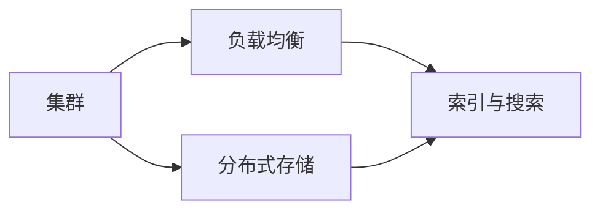

# 集群搭建：构建高可用搜索平台

## 1.背景介绍

在当今大数据时代，企业需要处理海量的数据并提供高效、准确的搜索服务。单台服务器已经无法满足日益增长的数据存储和检索需求。因此，构建一个高可用、可扩展的搜索平台成为了企业的迫切需求。本文将介绍如何通过集群搭建来构建一个高可用的搜索平台，满足企业的搜索需求。

### 1.1 搜索平台的重要性
#### 1.1.1 提高用户体验
#### 1.1.2 促进业务增长
#### 1.1.3 提升数据价值

### 1.2 高可用性的必要性  
#### 1.2.1 保障服务连续性
#### 1.2.2 提高系统稳定性
#### 1.2.3 降低单点故障风险

### 1.3 集群搭建的优势
#### 1.3.1 负载均衡
#### 1.3.2 容错与故障转移
#### 1.3.3 横向扩展能力

## 2.核心概念与联系

在搭建高可用搜索平台的过程中，需要了解以下几个核心概念：

### 2.1 集群
集群是由多台服务器组成的一个逻辑单元，它们协同工作，对外提供统一的服务。集群可以提高系统的可用性、可扩展性和性能。

### 2.2 负载均衡
负载均衡是将请求分发到多个服务器上，以提高系统的处理能力和响应速度。常见的负载均衡算法包括轮询、最少连接数和IP哈希等。

### 2.3 分布式存储
分布式存储是将数据分散存储在多个节点上，以提高数据的可靠性和可用性。常见的分布式存储系统包括HDFS、Ceph和GlusterFS等。

### 2.4 索引与搜索
索引是对数据进行预处理，提取关键信息并建立索引结构，以加快搜索速度。搜索是根据用户的查询条件，在索引中快速定位并返回相关结果。

下图展示了这些核心概念之间的联系：



## 3.核心算法原理具体操作步骤

在构建高可用搜索平台时，需要用到一些核心算法，下面介绍其原理和具体操作步骤。

### 3.1 倒排索引
倒排索引是搜索引擎的核心数据结构，它将文档中的词语映射到包含它的文档列表。

#### 3.1.1 建立倒排索引
1. 对文档进行分词，提取关键词
2. 对关键词进行规范化处理，如大小写转换、同义词合并等
3. 为每个关键词建立倒排列表，记录包含该词的文档ID
4. 对倒排列表进行排序和压缩，以优化存储和查询效率

#### 3.1.2 使用倒排索引进行搜索
1. 对用户查询进行分词和规范化处理
2. 在倒排索引中查找每个查询词对应的倒排列表
3. 对多个倒排列表进行合并和排序，得到最终的搜索结果
4. 根据相关性算法对搜索结果进行排序

### 3.2 一致性哈希
一致性哈希是一种分布式哈希算法，它可以将数据均匀地分布到多个节点上，并最小化节点增减时的数据迁移。

#### 3.2.1 构建一致性哈希环
1. 将节点的IP或主机名进行哈希，映射到一个0到2^32-1的整数环上
2. 将数据的键进行哈希，也映射到同一个整数环上
3. 顺时针找到第一个大于等于数据哈希值的节点，将数据存储到该节点上

#### 3.2.2 节点的增减
1. 新增节点时，只需将该节点映射到哈希环上，并将其顺时针的第一个节点上的部分数据迁移过来
2. 删除节点时，将该节点上的数据迁移到顺时针的下一个节点上
3. 通过虚拟节点的方式可以更均匀地分布数据

## 4.数学模型和公式详细讲解举例说明

在搜索引擎中，常用的相关性算法包括TF-IDF和BM25等。下面以TF-IDF为例，详细讲解其数学模型和公式。

### 4.1 TF-IDF
TF-IDF（Term Frequency-Inverse Document Frequency）是一种用于评估词语在文档中重要性的统计方法。它由两部分组成：

- TF（词频）：词语在文档中出现的频率，反映了词语在文档中的重要性。
- IDF（逆文档频率）：词语在整个文档集合中的稀缺程度，反映了词语的区分度。

#### 4.1.1 TF计算公式
$$
TF(t,d) = \frac{f_{t,d}}{\sum_{t'\in d} f_{t',d}}
$$

其中，$f_{t,d}$表示词语$t$在文档$d$中出现的次数，$\sum_{t'\in d} f_{t',d}$表示文档$d$中所有词语出现的总次数。

#### 4.1.2 IDF计算公式
$$
IDF(t,D) = \log \frac{|D|}{|\{d\in D: t\in d\}|}
$$

其中，$|D|$表示文档集合$D$中的文档总数，$|\{d\in D: t\in d\}|$表示包含词语$t$的文档数。

#### 4.1.3 TF-IDF计算公式
$$
TFIDF(t,d,D) = TF(t,d) \times IDF(t,D)
$$

TF-IDF的值越高，表示词语$t$在文档$d$中的重要性越高，同时在整个文档集合$D$中的区分度也越高。

举例说明：假设有两个文档：

- 文档1："搜索引擎 是 互联网 的 重要 工具"
- 文档2："搜索引擎 帮助 用户 快速 找到 所需 信息"

计算词语"搜索引擎"在文档1中的TF-IDF值：

- $TF("搜索引擎",文档1) = \frac{1}{6} = 0.167$
- $IDF("搜索引擎",D) = \log \frac{2}{2} = 0$
- $TFIDF("搜索引擎",文档1,D) = 0.167 \times 0 = 0$

可以看出，虽然"搜索引擎"在文档1中出现了，但由于它在所有文档中都出现，因此区分度很低，TF-IDF值为0。

## 5.项目实践：代码实例和详细解释说明

下面以Python为例，演示如何使用Elasticsearch和Flask构建一个简单的搜索引擎。

### 5.1 安装依赖库

```bash
pip install elasticsearch flask
```

### 5.2 创建Elasticsearch索引

```python
from elasticsearch import Elasticsearch

es = Elasticsearch()

# 创建索引
index_name = "my_index"
if not es.indices.exists(index=index_name):
    es.indices.create(index=index_name)
```

### 5.3 添加文档

```python
doc1 = {
    "title": "搜索引擎的原理与实现",
    "content": "搜索引擎是互联网的重要工具，它帮助用户快速找到所需信息。"
}

doc2 = {
    "title": "如何提高网站的搜索排名",
    "content": "为了提高网站的搜索排名，需要注意网站结构、关键词优化、外链建设等因素。"
}

es.index(index=index_name, body=doc1)
es.index(index=index_name, body=doc2)
```

### 5.4 搜索文档

```python
from flask import Flask, request, jsonify

app = Flask(__name__)

@app.route("/search")
def search():
    keyword = request.args.get("keyword")
    
    query = {
        "query": {
            "multi_match": {
                "query": keyword,
                "fields": ["title", "content"]
            }
        }
    }
    
    res = es.search(index=index_name, body=query)
    hits = res["hits"]["hits"]
    
    results = []
    for hit in hits:
        results.append(hit["_source"])
    
    return jsonify(results)

if __name__ == "__main__":
    app.run()
```

在上面的代码中：

1. 首先创建了一个Elasticsearch的索引`my_index`。
2. 然后添加了两个文档到索引中，每个文档包含`title`和`content`两个字段。
3. 接着定义了一个Flask路由`/search`，接收一个`keyword`参数作为查询关键词。
4. 在搜索函数中，构造了一个多字段匹配的查询`multi_match`，在`title`和`content`字段中搜索关键词。
5. 将搜索结果中的`_source`部分提取出来，返回给客户端。

启动Flask应用后，可以通过`http://localhost:5000/search?keyword=搜索引擎`来测试搜索功能。

## 6.实际应用场景

高可用搜索平台在许多实际场景中都有广泛应用，下面列举几个典型的应用场景。

### 6.1 电商搜索
在电商网站中，商品搜索是一个非常重要的功能。用户通过输入关键词，快速找到自己想要的商品。电商搜索对查询性能和结果相关性要求很高，需要使用高可用的搜索平台来支撑。

### 6.2 企业知识库搜索
大型企业通常拥有海量的文档、报告、知识库等信息资源。员工需要通过搜索快速找到所需的信息。构建一个高效、准确的企业知识库搜索平台，可以显著提高员工的工作效率。

### 6.3 日志搜索与分析
在互联网应用中，会产生大量的日志数据，如访问日志、错误日志等。通过搜索和分析这些日志，可以发现系统问题、优化性能、分析用户行为等。搭建一个高可用的日志搜索平台，对于保障系统稳定运行和数据分析非常重要。

### 6.4 舆情监控
政府、企业等机构需要实时监控互联网上的舆情信息，如新闻报道、社交媒体评论等。通过搜索和分析这些信息，可以及时发现负面舆情、危机事件，并采取应对措施。高可用的搜索平台可以帮助实现实时、准确的舆情监控。

## 7.工具和资源推荐

在搭建高可用搜索平台时，可以使用以下一些开源工具和资源：

### 7.1 Elasticsearch
Elasticsearch是一个基于Lucene的开源分布式搜索引擎，提供了强大的全文搜索和分析能力。它支持集群部署，可以实现高可用和水平扩展。

官网：https://www.elastic.co/elasticsearch/

### 7.2 Solr
Solr也是一个基于Lucene的开源搜索服务器，提供了全文搜索、高亮显示、分面搜索等功能。它支持分布式部署，可以构建高可用的搜索集群。

官网：https://solr.apache.org/

### 7.3 Lucene
Lucene是一个高性能、全文搜索的开源Java库，是Elasticsearch和Solr的基础。如果需要深入理解搜索引擎的原理，可以学习Lucene的源码。

官网：https://lucene.apache.org/

### 7.4 Kibana
Kibana是Elasticsearch的配套数据可视化工具，提供了丰富的图表和仪表盘功能，可以实现数据的探索和分析。

官网：https://www.elastic.co/kibana/

### 7.5 Logstash
Logstash是一个开源的数据收集和处理管道，可以将不同来源的数据进行转换和规范化，并导入到Elasticsearch中进行搜索和分析。

官网：https://www.elastic.co/logstash/

## 8.总结：未来发展趋势与挑战

高可用搜索平台是支撑现代互联网应用的重要基础设施，未来还将不断发展和演进。

### 8.1 智能化搜索
随着人工智能技术的发展，搜索引擎将变得更加智能化。通过机器学习和自然语言处理，搜索引擎可以更好地理解用户意图，提供个性化的搜索结果。知识图谱、语义搜索等技术将得到更广泛的应用。

### 8.2 实时搜索
在许