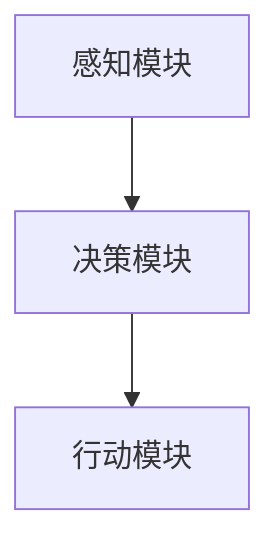

# AI Agent: AI的下一个风口 从软件到硬件的进化

## 1.背景介绍

人工智能（AI）已经成为当今科技领域的核心驱动力之一。从早期的规则系统到如今的深度学习，AI技术在过去几十年中取得了飞速的发展。随着计算能力的提升和数据量的爆炸性增长，AI的应用范围也在不断扩大。然而，AI的进化并未止步于软件层面，硬件的进化同样至关重要。本文将探讨AI Agent的概念及其从软件到硬件的进化过程。

## 2.核心概念与联系

### 2.1 AI Agent的定义

AI Agent是指能够自主感知环境、做出决策并执行行动的智能系统。它们通常具备以下几个核心特征：

- **感知**：通过传感器或数据输入获取环境信息。
- **决策**：基于感知信息和内置算法进行分析和决策。
- **行动**：执行决策并影响环境。

### 2.2 软件与硬件的联系

在AI系统中，软件和硬件是密不可分的。软件提供了算法和逻辑，而硬件则提供了计算能力和执行平台。两者的协同进化是AI系统性能提升的关键。

### 2.3 从软件到硬件的进化

AI的进化不仅仅体现在算法的改进上，还包括硬件架构的优化。随着AI应用的复杂性增加，传统的通用计算架构已经无法满足需求，专用硬件（如GPU、TPU、FPGA等）应运而生。

## 3.核心算法原理具体操作步骤

### 3.1 感知模块

感知模块是AI Agent的基础，它负责从环境中获取数据。常见的感知技术包括图像识别、语音识别和传感器数据处理。

### 3.2 决策模块

决策模块是AI Agent的核心，它基于感知数据和预设的算法进行分析和决策。常见的决策算法包括：

- **机器学习**：通过训练模型进行预测和分类。
- **深度学习**：利用神经网络进行复杂模式识别。
- **强化学习**：通过与环境的交互不断优化决策策略。

### 3.3 行动模块

行动模块负责执行决策并影响环境。它通常包括机械控制、信号发送等功能。



## 4.数学模型和公式详细讲解举例说明

### 4.1 机器学习模型

机器学习模型通常通过优化目标函数来进行训练。以线性回归为例，其目标函数为：

$$
J(\theta) = \frac{1}{2m} \sum_{i=1}^{m} (h_\theta(x^{(i)}) - y^{(i)})^2
$$

其中，$h_\theta(x)$ 是预测值，$y$ 是实际值，$m$ 是样本数量。

### 4.2 深度学习模型

深度学习模型通常使用神经网络进行训练。以单层神经网络为例，其输出为：

$$
y = \sigma(Wx + b)
$$

其中，$W$ 是权重矩阵，$x$ 是输入向量，$b$ 是偏置，$\sigma$ 是激活函数。

### 4.3 强化学习模型

强化学习模型通过优化累积奖励来进行训练。其目标函数为：

$$
G_t = \sum_{k=0}^{\infty} \gamma^k R_{t+k+1}
$$

其中，$G_t$ 是时间步$t$的回报，$\gamma$ 是折扣因子，$R$ 是奖励。

## 5.项目实践：代码实例和详细解释说明

### 5.1 感知模块代码实例

以下是一个简单的图像识别代码示例，使用TensorFlow进行实现：

```python
import tensorflow as tf
from tensorflow.keras import layers, models

# 加载数据集
(train_images, train_labels), (test_images, test_labels) = tf.keras.datasets.cifar10.load_data()

# 数据预处理
train_images, test_images = train_images / 255.0, test_images / 255.0

# 构建模型
model = models.Sequential([
    layers.Conv2D(32, (3, 3), activation='relu', input_shape=(32, 32, 3)),
    layers.MaxPooling2D((2, 2)),
    layers.Conv2D(64, (3, 3), activation='relu'),
    layers.MaxPooling2D((2, 2)),
    layers.Conv2D(64, (3, 3), activation='relu'),
    layers.Flatten(),
    layers.Dense(64, activation='relu'),
    layers.Dense(10)
])

# 编译模型
model.compile(optimizer='adam',
              loss=tf.keras.losses.SparseCategoricalCrossentropy(from_logits=True),
              metrics=['accuracy'])

# 训练模型
model.fit(train_images, train_labels, epochs=10, 
          validation_data=(test_images, test_labels))
```

### 5.2 决策模块代码实例

以下是一个简单的强化学习代码示例，使用OpenAI Gym和TensorFlow进行实现：

```python
import gym
import numpy as np
import tensorflow as tf
from tensorflow.keras import layers

# 创建环境
env = gym.make('CartPole-v1')

# 构建模型
model = tf.keras.Sequential([
    layers.Dense(24, activation='relu', input_shape=(4,)),
    layers.Dense(24, activation='relu'),
    layers.Dense(2, activation='linear')
])

# 编译模型
model.compile(optimizer=tf.keras.optimizers.Adam(learning_rate=0.001),
              loss='mse')

# 训练模型
for episode in range(1000):
    state = env.reset()
    state = np.reshape(state, [1, 4])
    for time in range(500):
        action = np.argmax(model.predict(state))
        next_state, reward, done, _ = env.step(action)
        next_state = np.reshape(next_state, [1, 4])
        target = reward
        if not done:
            target = reward + 0.95 * np.amax(model.predict(next_state))
        target_f = model.predict(state)
        target_f[0][action] = target
        model.fit(state, target_f, epochs=1, verbose=0)
        state = next_state
        if done:
            print(f"Episode: {episode}/{1000}, Score: {time}")
            break
```

### 5.3 行动模块代码实例

以下是一个简单的机械控制代码示例，使用Arduino进行实现：

```cpp
#include <Servo.h>

Servo myservo;

void setup() {
  myservo.attach(9);
}

void loop() {
  for (int pos = 0; pos <= 180; pos += 1) {
    myservo.write(pos);
    delay(15);
  }
  for (int pos = 180; pos >= 0; pos -= 1) {
    myservo.write(pos);
    delay(15);
  }
}
```

## 6.实际应用场景

### 6.1 自动驾驶

自动驾驶汽车是AI Agent的典型应用之一。它们通过摄像头、雷达和激光雷达等传感器感知环境，使用深度学习和强化学习算法进行决策，并通过机械控制系统执行驾驶操作。

### 6.2 智能家居

智能家居系统通过传感器感知环境变化，使用机器学习算法进行决策，并通过各种家电设备执行相应的操作，如调节温度、控制灯光等。

### 6.3 工业自动化

在工业自动化中，AI Agent可以通过传感器监控生产线状态，使用预测维护算法进行决策，并通过机械臂等设备执行维护操作。

## 7.工具和资源推荐

### 7.1 开发工具

- **TensorFlow**：一个开源的机器学习框架，适用于深度学习和强化学习。
- **PyTorch**：另一个流行的深度学习框架，具有动态计算图的特点。
- **OpenAI Gym**：一个用于开发和比较强化学习算法的工具包。

### 7.2 硬件资源

- **NVIDIA GPU**：适用于深度学习训练的高性能计算硬件。
- **Google TPU**：专为深度学习优化的硬件加速器。
- **FPGA**：适用于定制化AI加速的可编程硬件。

### 7.3 学习资源

- **Coursera**：提供各种AI和机器学习课程。
- **edX**：另一个提供高质量AI课程的平台。
- **ArXiv**：一个开放获取的学术论文预印本平台，包含大量AI相关研究。

## 8.总结：未来发展趋势与挑战

### 8.1 未来发展趋势

- **边缘计算**：随着物联网的发展，AI Agent将更多地部署在边缘设备上，以减少延迟和带宽需求。
- **自适应系统**：未来的AI Agent将更加自适应，能够根据环境变化自动调整算法和策略。
- **人机协作**：AI Agent将更多地与人类协作，共同完成复杂任务。

### 8.2 挑战

- **数据隐私**：随着AI Agent的广泛应用，数据隐私问题将变得更加突出。
- **计算资源**：AI算法的复杂性和数据量的增加对计算资源提出了更高的要求。
- **伦理问题**：AI Agent的决策可能涉及伦理问题，需要制定相应的规范和标准。

## 9.附录：常见问题与解答

### 9.1 什么是AI Agent？

AI Agent是指能够自主感知环境、做出决策并执行行动的智能系统。

### 9.2 AI Agent的核心组成部分有哪些？

AI Agent通常包括感知模块、决策模块和行动模块。

### 9.3 AI Agent的实际应用有哪些？

AI Agent的实际应用包括自动驾驶、智能家居和工业自动化等。

### 9.4 如何选择合适的硬件资源？

选择硬件资源时需要考虑计算能力、功耗和成本等因素。常见的硬件资源包括GPU、TPU和FPGA。

### 9.5 AI Agent的未来发展趋势是什么？

未来AI Agent将更多地部署在边缘设备上，变得更加自适应，并与人类协作完成复杂任务。

---

作者：禅与计算机程序设计艺术 / Zen and the Art of Computer Programming