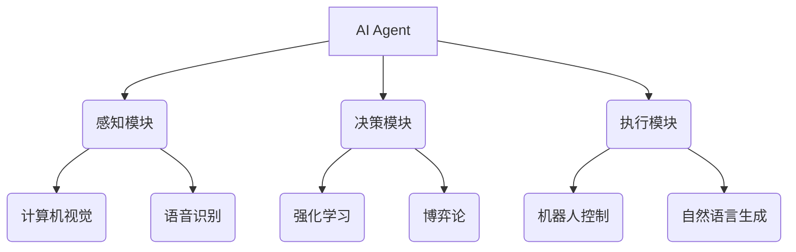

# AI Agent: AI的下一个风口 智能体的五种超能力

## 1. 背景介绍
### 1.1 人工智能的发展历程
#### 1.1.1 早期的人工智能
#### 1.1.2 机器学习的兴起  
#### 1.1.3 深度学习的突破

### 1.2 AI Agent的概念
#### 1.2.1 AI Agent的定义
#### 1.2.2 AI Agent与传统AI的区别
#### 1.2.3 AI Agent的发展现状

## 2. 核心概念与联系
### 2.1 AI Agent的组成要素  
#### 2.1.1 感知模块
#### 2.1.2 决策模块
#### 2.1.3 执行模块

### 2.2 AI Agent的关键特性
#### 2.2.1 自主性
#### 2.2.2 交互性
#### 2.2.3 适应性
#### 2.2.4 目标导向  

### 2.3 AI Agent与其他AI技术的关系
#### 2.3.1 AI Agent与机器学习
#### 2.3.2 AI Agent与知识图谱
#### 2.3.3 AI Agent与自然语言处理



## 3. 核心算法原理具体操作步骤
### 3.1 强化学习算法
#### 3.1.1 Q-Learning
#### 3.1.2 SARSA 
#### 3.1.3 DQN
#### 3.1.4 DDPG

### 3.2 多智能体算法 
#### 3.2.1 博弈论基础
#### 3.2.2 纳什均衡
#### 3.2.3 无悔学习
#### 3.2.4 对抗搜索

### 3.3 分层强化学习
#### 3.3.1 选项框架
#### 3.3.2 feudal network
#### 3.3.3 MaxQ算法

## 4. 数学模型和公式详细讲解举例说明
### 4.1 马尔可夫决策过程(MDP)
一个MDP由一个五元组 $<S,A,P,R,\gamma>$ 组成:

- $S$ 是有限的状态集合
- $A$ 是有限的动作集合  
- $P$ 是状态转移概率矩阵, $P_{ss'}^a=P[S_{t+1}=s'|S_t=s,A_t=a]$
- $R$ 是回报函数, $R_s^a=E[R_{t+1}|S_t=s,A_t=a]$  
- $\gamma$ 是折扣因子, $\gamma \in [0,1]$

在MDP中,策略 $\pi(a|s)=P[A_t=a|S_t=s]$ 定义了在每个状态下智能体选择动作的概率。一个策略的状态值函数为:

$$V^\pi(s)=E_\pi[\sum_{k=0}^\infty \gamma^k R_{t+k+1}|S_t=s]$$

一个策略的动作值函数为:  

$$Q^\pi(s,a)=E_\pi[\sum_{k=0}^\infty \gamma^k R_{t+k+1}|S_t=s,A_t=a]$$

最优值函数满足Bellman最优方程:

$$V^*(s)=\max_a \sum_{s'} P_{ss'}^a [R_s^a+\gamma V^*(s')]$$  

$$Q^*(s,a)=\sum_{s'} P_{ss'}^a [R_s^a+\gamma \max_{a'} Q^*(s',a')]$$

### 4.2 Q-Learning算法
Q-Learning是一种无模型的异策略时序差分学习算法,其更新公式为:

$$Q(S_t,A_t) \leftarrow Q(S_t,A_t)+\alpha[R_{t+1}+\gamma \max_a Q(S_{t+1},a)-Q(S_t,A_t)]$$

其中 $\alpha$ 是学习率。Q-Learning的收敛性可以得到理论保证。

### 4.3 对抗搜索算法
Minimax搜索是双人零和博弈中的经典算法。Minimax值函数定义为:

$$V_{minimax}(s)=
\begin{cases}
Utility(s) & \text{if } Terminal(s)\\
\max_{a \in Actions(s)} V_{minimax}(Result(s,a)) & \text{if } Player(s)=agent\\  
\min_{a \in Actions(s)} V_{minimax}(Result(s,a)) & \text{if } Player(s)=opponent
\end{cases}$$

其中 $Utility(s)$ 是终止状态的效用值, $Actions(s)$ 是状态 $s$ 下的合法动作集合, $Result(s,a)$ 是在状态 $s$ 下采取动作 $a$ 后到达的新状态。

Alpha-Beta剪枝可以大幅减少Minimax搜索的节点数。Alpha-Beta剪枝的伪代码如下:

$$AlphaBeta(s,\alpha,\beta)=
\begin{cases}
Utility(s) & \text{if } Terminal(s)\\
\max_{a \in Actions(s)} AlphaBeta(Result(s,a),\alpha,\beta) & \text{if } Player(s)=agent\\
\min_{a \in Actions(s)} AlphaBeta(Result(s,a),\alpha,\beta) & \text{if } Player(s)=opponent  
\end{cases}$$

其中 $\alpha$ 和 $\beta$ 分别是搜索树中的下界和上界。

## 5. 项目实践:代码实例和详细解释说明
下面我们通过一个简单的例子来说明如何用Python实现Q-Learning算法。考虑一个格子世界环境,智能体的目标是尽快到达终点。

```python
import numpy as np

# 定义环境参数
num_states = 25 # 5x5的格子世界
num_actions = 4 # 上下左右四个动作
max_steps = 20 # 每个episode的最大步数

# 定义奖励矩阵
rewards = np.full((num_states,num_actions), -1)
rewards[4,1] = rewards[21,2] = 0
rewards[24,:] = 0

# 定义状态转移矩阵
P = np.zeros((num_states,num_actions,num_states))
for s in range(num_states):
    if s%5 != 0: 
        P[s,0,s-1] = 1 # 左
    if (s+1)%5 != 0:
        P[s,1,s+1] = 1 # 右
    if s >= 5:  
        P[s,2,s-5] = 1 # 上
    if s < 20:
        P[s,3,s+5] = 1 # 下
        
# 定义Q-Learning算法参数  
gamma = 0.9
alpha = 0.1
epsilon = 0.1
num_episodes = 500

# 初始化Q表
Q = np.zeros((num_states,num_actions))

# 开始训练
for i in range(num_episodes):
    s = 0 # 初始状态
    for j in range(max_steps): 
        # epsilon-greedy策略选择动作
        if np.random.uniform() < epsilon:
            a = np.random.randint(0,num_actions)
        else:
            a = np.argmax(Q[s,:])
        # 执行动作,观察下一状态和奖励
        next_s = np.random.choice(num_states, p=P[s,a,:])
        r = rewards[s,a]
        # 更新Q表 
        Q[s,a] += alpha*(r + gamma*np.max(Q[next_s,:]) - Q[s,a])
        s = next_s
        if s == num_states-1: # 到达终止状态 
            break
            
print(Q) # 输出最终的Q表
```

上述代码首先定义了格子世界环境的参数,包括状态数、动作数、奖励矩阵和状态转移矩阵。然后定义了Q-Learning算法的超参数。接着初始化Q表,开始训练循环。在每个episode中,智能体从初始状态出发,根据epsilon-greedy策略选择动作,执行动作后观察下一状态和奖励,并根据Q-Learning的更新公式更新Q表。当智能体到达终止状态或者达到最大步数时,当前episode结束。训练完成后,输出收敛后的Q表。

通过以上简单的例子,我们可以看到Q-Learning算法的实现并不复杂。但是在实际应用中,我们往往需要处理更加复杂的环境和任务,因此也需要更加高效和稳定的算法,例如DQN、DDPG等。

## 6. 实际应用场景
### 6.1 智能客服
AI Agent可以作为智能客服,通过自然语言交互为用户提供咨询服务。相比传统的人工客服,智能客服可以7x24小时不间断工作,响应速度更快,而且可以同时服务大量用户。同时,通过机器学习不断优化对话策略,智能客服的服务质量也可以不断提升。

### 6.2 自动驾驶
自动驾驶是AI Agent的一个重要应用场景。自动驾驶系统可以看作一个AI Agent,它通过各种传感器感知道路环境,通过决策算法规划行驶路径和控制策略,再通过执行器控制车辆的速度和方向。自动驾驶系统综合运用了计算机视觉、传感器融合、规划决策、控制执行等多项AI技术,堪称AI Agent的集大成者。

### 6.3 智能推荐  
在电商、媒体、社交等领域,AI Agent被广泛用于智能推荐。通过对用户的历史行为数据进行挖掘分析,AI Agent可以学习用户的偏好特征,从海量的信息中为用户精准推荐感兴趣的商品、文章、视频等。典型的算法包括协同过滤、基于内容的推荐等。智能推荐可以显著提升用户的互动率和转化率。

### 6.4 智能助理
智能音箱、智能手表等终端载体上的语音助手都可以看作AI Agent,例如苹果的Siri、亚马逊的Alexa、微软的Cortana等。用户通过语音与助手交互,助手可以帮助用户完成查询天气、设置闹钟、播放音乐等日常任务。随着语音识别、自然语言理解、知识问答等技术的发展,智能助理的功能越来越丰富,交互越来越自然。

### 6.5 金融投资
在量化交易、智能投顾等金融领域,AI Agent也得到广泛应用。通过机器学习算法建模,AI Agent可以学习市场规律、预测资产价格走势、制定投资组合策略,其决策往往可以超越人类交易员。著名的AI Agent案例包括Renaissance Technologies的Medallion基金。在智能投顾方面,AI Agent可以根据客户的风险偏好、投资目标,提供个性化的投资组合配置。

## 7. 工具和资源推荐
### 7.1 开源框架
- [OpenAI Gym](https://gym.openai.com/): 强化学习环境模拟器,包含大量游戏、控制、机器人等环境。
- [DeepMind Lab](https://github.com/deepmind/lab): 基于Quake III Arena的3D学习环境。 
- [Unity ML-Agents](https://github.com/Unity-Technologies/ml-agents): 集成Unity引擎的强化学习框架。
- [Ray](https://ray.io/): 分布式计算框架,支持大规模强化学习和多智能体学习。
- [TensorFlow Agents](https://github.com/tensorflow/agents): 基于TensorFlow的强化学习库。

### 7.2 在线课程
- [CS234: Reinforcement Learning](http://web.stanford.edu/class/cs234/index.html) - 斯坦福大学
- [CS285: Deep Reinforcement Learning](http://rail.eecs.berkeley.edu/deeprlcourse/) - 加州大学伯克利分校
- [Reinforcement Learning Specialization](https://www.coursera.org/specializations/reinforcement-learning) - Coursera,由University of Alberta提供
- [Practical Reinforcement Learning](https://www.coursera.org/learn/practical-rl) - Coursera,由高等经济学院提供

### 7.3 教材书籍
- [Reinforcement Learning: An Introduction](http://incompleteideas.net/book/the-book-2nd.html) - Richard S. Sutton,Andrew G. Barto 
- [Algorithms for Reinforcement Learning](https://sites.ualberta.ca/~szepesva/papers/RLAlgsInMDPs.pdf) - Csaba Szepesvári
- [Deep Reinforcement Learning Hands-On](https://www.packtpub.com/product/deep-reinforcement-learning-hands-on/9781838826994) - Maxim Lapan

## 8. 总结:未来发展趋势与挑战
### 8.1 AI Agent的发展趋势
#### 8.1.1 多模态感知与决策
未来的AI Agent将具备多模态感知能力,可以融合视觉、语音、触觉等多种感知信息,形成