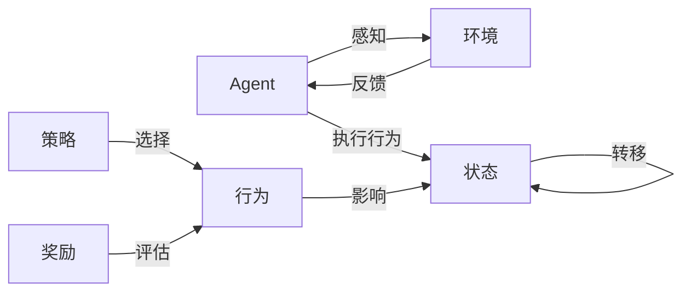
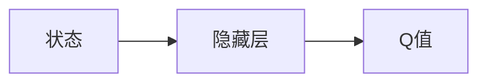
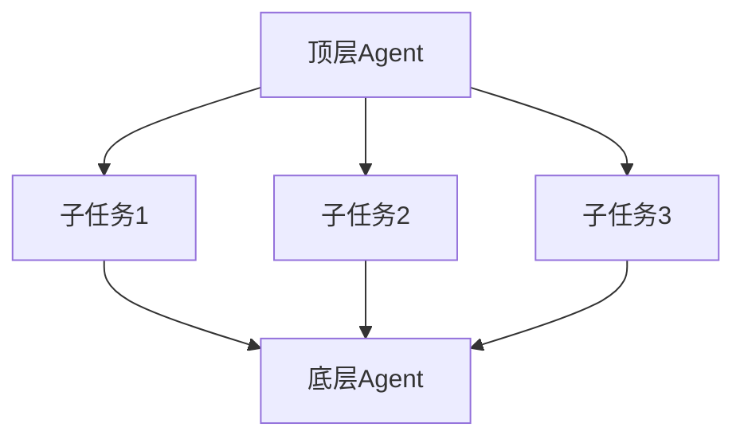

# AI人工智能代理工作流AI Agent WorkFlow：AI代理在视频游戏中的自适应机制

## 1.背景介绍

近年来，随着人工智能技术的快速发展，AI在游戏领域的应用越来越广泛。特别是在视频游戏中，AI代理扮演着越来越重要的角色。AI代理能够模拟人类玩家的行为，为游戏提供更加智能化、个性化的体验。

为了让AI代理能够在复杂多变的游戏环境中自如应对，需要设计出一套高效、灵活的AI Agent工作流。本文将重点探讨AI代理在视频游戏中的自适应机制，介绍主流的AI Agent架构与算法，并给出具体的实现案例。

### 1.1 AI在游戏中的应用现状

### 1.2 AI代理面临的挑战

### 1.3 自适应AI的重要性

## 2.核心概念与联系

要理解AI代理的工作原理，首先需要了解几个核心概念：

- **Agent**：能感知环境并采取行动的自主实体，游戏中的NPC就是典型的Agent。
- **环境**：Agent所处的游戏世界，提供Agent可以感知和交互的对象与信息。
- **状态**：环境在某一时刻的完整描述，常用向量或矩阵表示。
- **行为**：Agent能够执行的动作，如移动、攻击等。
- **策略**：Agent根据当前状态选择行为的映射函数。
- **奖励**：量化评估Agent行为的指标，引导策略学习的方向。

下图展示了这些概念之间的关系：



Agent通过感知环境获得状态信息，根据策略选择行为，行为执行后环境状态发生变化，同时Agent获得相应的奖励反馈，用于评估策略的优劣。这是一个循环往复的过程。

### 2.1 Markov决策过程

### 2.2 自适应的定义与度量

## 3.核心算法原理具体操作步骤

实现游戏AI的自适应性，需要用到多种机器学习算法，其中最主要的是强化学习。

### 3.1 强化学习

强化学习通过Agent与环境的交互，不断尝试、学习、优化策略，以获得最大化的累积奖励。其基本流程如下：

1. 初始化Q值函数（状态-行为值函数）
2. 重复以下步骤直到收敛：
   1) Agent根据当前状态选择一个行为a
   2) 执行行为a，观察环境反馈的下一状态s'和奖励r
   3) 根据观察结果更新Q值：
$$Q(s,a) \leftarrow Q(s,a)+\alpha [r+\gamma \max _{a'} Q(s',a')-Q(s,a)]$$
   4) 更新当前状态：$s \leftarrow s'$
3. 策略确定为$\pi(s)=\arg \max _{a} Q(s,a)$

其中$\alpha$是学习率，$\gamma$是折扣因子。这个算法称为Q-learning，是强化学习的代表方法之一。

### 3.2 深度强化学习

传统强化学习在状态与行为空间很大时，会遇到维度灾难问题。深度强化学习使用深度神经网络来逼近Q值函数，可以处理高维输入。

以DQN为例，其神经网络结构如下图所示：



状态特征经过若干隐藏层，输出每个行为的Q值。网络权重通过最小化时序差分误差进行训练：

$$L(\theta)=\mathbb{E}[(r+\gamma \max _{a'} Q(s',a';\theta ^{-})-Q(s,a;\theta))^2]$$

其中$\theta ^{-}$表示目标网络的参数，用于计算TD目标。

DQN在Atari游戏、Dota2等复杂游戏中取得了不错的效果。

### 3.3 分层强化学习

为了提高泛化能力，可以将复杂任务分解成多个子任务，每个子任务对应一个子Agent，形成分层结构。

如下图所示，顶层Agent负责选择要执行的子任务，底层Agent负责执行具体的原子行为。



这种层次化的设计使得学习更加模块化，不同任务间可以共享知识，从而加速学习进程。

## 4.数学模型和公式详细讲解举例说明

前面提到的几个强化学习算法都涉及一些数学概念和公式，这里做进一步讲解。

### 4.1 Markov性质

Markov性质是指未来的状态只取决于当前状态，与过去的状态无关。形式化地，对任意状态序列$s_1,\dots,s_t,s_{t+1}$：

$$P(s_{t+1}|s_t,\dots,s_1) = P(s_{t+1}|s_t)$$

Markov决策过程就是同时满足Markov性质和最优子结构性质的序贯决策问题。

### 4.2 Bellman方程

Bellman方程刻画了最优策略下状态值函数之间的递归关系：

$$V^*(s) = \max_a \sum_{s',r} p(s',r|s,a)[r+\gamma V^*(s')]$$

其中$p(s',r|s,a)$表示在状态$s$下选择行为$a$，转移到状态$s'$并获得奖励$r$的概率。

类似地，最优行为值函数满足：

$$Q^*(s,a) = \sum_{s',r} p(s',r|s,a)[r+\gamma \max_{a'} Q^*(s',a')]$$

Bellman方程是值迭代、策略迭代等动态规划算法的理论基础。

### 4.3 时序差分学习

时序差分学习通过Bootstrap的思想来更新值函数，利用了Bellman方程的性质。以Q-learning为例：

$$Q(s,a) \leftarrow Q(s,a)+\alpha [r+\gamma \max _{a'} Q(s',a')-Q(s,a)]$$

等号右边的第二项称为TD误差，刻画了当前估计值与真实值之间的差距。TD学习通过不断缩小这个差距来逼近最优值函数。

## 5.项目实践：代码实例和详细解释说明

下面以一个简单的格子世界游戏为例，演示如何用Python实现Q-learning算法。

游戏环境如下图所示，Agent需要从S走到G，其中F表示陷阱，R表示奖励。

```
+---+---+---+---+
| S |   |   |   |
+---+---+---+---+
|   | F |   |   |
+---+---+---+---+
|   |   | F |   |
+---+---+---+---+
|   |   | R | G |
+---+---+---+---+
```

首先定义环境类`GridWorld`：

```python
class GridWorld:
    def __init__(self):
        self.grid = [
            [0, 0, 0, 0],
            [0, -1, 0, 0],
            [0, 0, -1, 0],
            [0, 0, 1, 0]
        ]
        self.state = (0, 0)
        
    def step(self, action):
        i, j = self.state
        if action == 0:  # 上
            next_state = (max(i - 1, 0), j)
        elif action == 1:  # 下
            next_state = (min(i + 1, 3), j)
        elif action == 2:  # 左
            next_state = (i, max(j - 1, 0))
        else:  # 右
            next_state = (i, min(j + 1, 3))
        
        reward = self.grid[next_state[0]][next_state[1]]
        self.state = next_state
        is_done = (next_state == (3, 3))
        return next_state, reward, is_done
        
    def reset(self):
        self.state = (0, 0)
        return self.state
```

`GridWorld`类实现了`step`方法用于执行行为并返回下一状态和奖励，以及`reset`方法用于重置环境。

接下来定义Agent类`QLearningAgent`：

```python
import numpy as np

class QLearningAgent:
    def __init__(self):
        self.q_table = np.zeros((4, 4, 4))  # 初始化Q表
        
    def choose_action(self, state, epsilon):
        if np.random.uniform() < epsilon:
            action = np.random.choice(4)  # 随机探索
        else:
            action = np.argmax(self.q_table[state])  # 贪心选择
        return action
        
    def update(self, state, action, next_state, reward, alpha, gamma):
        td_error = reward + gamma * np.max(self.q_table[next_state]) - self.q_table[state][action]
        self.q_table[state][action] += alpha * td_error
```

`QLearningAgent`类维护一个Q值表，实现了`choose_action`方法用于选择行为（兼顾探索和利用），以及`update`方法用于更新Q值。

最后，我们编写训练循环：

```python
env = GridWorld()
agent = QLearningAgent()

num_episodes = 1000
epsilon = 0.1
alpha = 0.5
gamma = 0.9

for episode in range(num_episodes):
    state = env.reset()
    is_done = False
    
    while not is_done:
        action = agent.choose_action(state, epsilon)
        next_state, reward, is_done = env.step(action)
        agent.update(state, action, next_state, reward, alpha, gamma)
        state = next_state
        
    if (episode + 1) % 100 == 0:
        print(f"Episode {episode + 1}: Q table")
        print(np.max(agent.q_table, axis=2))
```

训练过程中，每个Episode都让Agent与环境交互直到到达终止状态，并在交互过程中不断更新Q表。每隔100个Episode打印一次Q表，可以看到值函数是如何收敛的。

以上就是一个简单的Q-learning算法实现，通过与环境不断交互，Agent逐渐学会了在格子世界中寻找最优路径。

## 6.实际应用场景

游戏AI的自适应机制在多个领域有广泛应用，下面列举几个典型场景：

### 6.1 游戏测试

利用自适应AI代替人工测试，可以大幅提高测试效率和覆盖率。AI通过自主探索发现游戏漏洞、崩溃等问题，并根据测试目标动态调整策略。

### 6.2 游戏平衡

对战类游戏需要保证各方实力平衡，避免出现一边倒的情况。传统的数值配置难以应对日益复杂的游戏系统。通过AI自我对弈、不断迭代，可以自动寻找平衡点，辅助游戏设计师调优参数。

### 6.3 程序化内容生成

利用AI根据玩家反馈动态生成关卡、任务、装备等游戏内容，可极大丰富游戏性。通过在线学习玩家行为偏好，实现内容的个性化定制，提升游戏体验。

### 6.4 游戏直播与解说

AI观察高水平玩家的对局，学习其操作和决策模式，再面向普通玩家进行实时解说。比如提示当前局势、分析可能的策略、预判下一步行动等，让观众更好地理解比赛内容。

## 7.工具和资源推荐

### 7.1 游戏引擎

- Unity ML-Agents：方便在Unity中集成强化学习算法，实现游戏AI的训练与部署。
- Unreal Engine：虚幻引擎内置了行为树、状态机等常见的游戏AI架构，也支持接入第三方机器学习库。

### 7.2 算法库

- OpenAI Gym：包含大量标准化环境，涵盖Atari、棋牌、机器人等领域，方便测试强化学习算法。
- Stable Baselines：基于PyTorch和TensorFlow的强化学习算法集合，提供统一的接口，易于使用。
- RLlib：分布式强化学习库，支持多种架构和训练策略，可实现大规模并行化学习。

### 7.3 学习资源

- 《Reinforcement Learning: An Introduction》：由Richard Sutton和Andrew Barto所著，强化学习领域的经典教材。
- David Silver的强化学习课程：DeepMind首席科学家的公开课，对强化学习的基本概