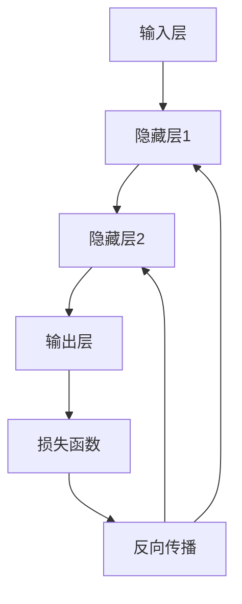

# AI人工智能深度学习算法：构建高效深度学习模型的基础

## 1.背景介绍

### 1.1 深度学习的兴起

深度学习（Deep Learning）作为人工智能（AI）领域的一个重要分支，近年来取得了显著的进展。其核心思想是通过多层神经网络模拟人脑的工作方式，从而实现对复杂数据的自动学习和特征提取。深度学习的兴起得益于计算能力的提升、大数据的普及以及算法的不断优化。

### 1.2 深度学习的应用领域

深度学习在多个领域展现了强大的应用潜力，包括但不限于图像识别、自然语言处理、语音识别、自动驾驶、医疗诊断等。其广泛的应用前景使得深度学习成为当前最为热门的研究方向之一。

### 1.3 本文的目的

本文旨在深入探讨深度学习算法的核心概念、原理、数学模型及其实际应用。通过详细的代码实例和解释，帮助读者构建高效的深度学习模型，并提供实用的工具和资源推荐。

## 2.核心概念与联系

### 2.1 神经网络基础

神经网络是深度学习的基础，其基本单元是神经元。一个典型的神经网络由输入层、隐藏层和输出层组成。每一层的神经元通过权重和偏置连接，形成一个复杂的网络结构。

### 2.2 深度学习与机器学习的区别

深度学习是机器学习的一个子集。与传统的机器学习方法相比，深度学习能够自动提取数据的特征，而不需要人为设计特征。这使得深度学习在处理复杂数据时具有显著的优势。

### 2.3 监督学习与无监督学习

深度学习算法可以分为监督学习和无监督学习。监督学习需要标注数据进行训练，而无监督学习则不需要标注数据，主要用于数据的聚类和降维。

### 2.4 反向传播算法

反向传播算法是训练神经网络的核心算法。其基本思想是通过计算损失函数的梯度，逐层更新网络的权重和偏置，从而最小化损失函数。



## 3.核心算法原理具体操作步骤

### 3.1 数据预处理

数据预处理是深度学习的第一步。包括数据清洗、归一化、分割训练集和测试集等步骤。数据的质量直接影响模型的性能。

### 3.2 构建神经网络

构建神经网络包括选择网络的层数、每层的神经元数量、激活函数等。常用的激活函数有ReLU、Sigmoid、Tanh等。

### 3.3 前向传播

前向传播是指将输入数据通过网络层层传递，最终得到输出结果。前向传播的结果用于计算损失函数。

### 3.4 计算损失函数

损失函数用于衡量模型的预测结果与真实值之间的差距。常用的损失函数有均方误差（MSE）、交叉熵损失等。

### 3.5 反向传播与权重更新

反向传播算法通过计算损失函数的梯度，逐层更新网络的权重和偏置。常用的优化算法有梯度下降、Adam等。

### 3.6 模型评估与调优

模型评估包括计算准确率、召回率、F1分数等指标。通过调整网络结构、优化算法、超参数等，进一步提升模型性能。

## 4.数学模型和公式详细讲解举例说明

### 4.1 神经元的数学模型

一个神经元的输出可以表示为：

$$
y = f(\sum_{i=1}^{n} w_i x_i + b)
$$

其中，$w_i$ 是权重，$x_i$ 是输入，$b$ 是偏置，$f$ 是激活函数。

### 4.2 损失函数

以均方误差（MSE）为例，其公式为：

$$
L = \frac{1}{2m} \sum_{i=1}^{m} (y_i - \hat{y}_i)^2
$$

其中，$m$ 是样本数量，$y_i$ 是真实值，$\hat{y}_i$ 是预测值。

### 4.3 反向传播算法

反向传播算法的核心是计算损失函数对权重的梯度。以梯度下降法为例，其更新公式为：

$$
w_i = w_i - \eta \frac{\partial L}{\partial w_i}
$$

其中，$\eta$ 是学习率。

## 5.项目实践：代码实例和详细解释说明

### 5.1 数据预处理

```python
import numpy as np
from sklearn.model_selection import train_test_split
from sklearn.preprocessing import StandardScaler

# 生成示例数据
X, y = np.random.rand(1000, 10), np.random.randint(0, 2, 1000)

# 数据归一化
scaler = StandardScaler()
X = scaler.fit_transform(X)

# 分割训练集和测试集
X_train, X_test, y_train, y_test = train_test_split(X, y, test_size=0.2, random_state=42)
```

### 5.2 构建神经网络

```python
import tensorflow as tf
from tensorflow.keras.models import Sequential
from tensorflow.keras.layers import Dense

# 构建神经网络
model = Sequential([
    Dense(64, activation='relu', input_shape=(10,)),
    Dense(32, activation='relu'),
    Dense(1, activation='sigmoid')
])

# 编译模型
model.compile(optimizer='adam', loss='binary_crossentropy', metrics=['accuracy'])
```

### 5.3 训练模型

```python
# 训练模型
history = model.fit(X_train, y_train, epochs=50, batch_size=32, validation_split=0.2)
```

### 5.4 模型评估

```python
# 评估模型
loss, accuracy = model.evaluate(X_test, y_test)
print(f'Loss: {loss}, Accuracy: {accuracy}')
```

## 6.实际应用场景

### 6.1 图像识别

深度学习在图像识别领域取得了显著的成果。通过卷积神经网络（CNN），可以实现对图像的自动特征提取和分类。

### 6.2 自然语言处理

在自然语言处理（NLP）领域，深度学习算法如循环神经网络（RNN）和变换器（Transformer）被广泛应用于机器翻译、文本生成、情感分析等任务。

### 6.3 语音识别

深度学习在语音识别中的应用包括语音转文字、语音合成等。通过长短期记忆网络（LSTM）和注意力机制，可以实现高精度的语音识别。

### 6.4 自动驾驶

自动驾驶技术依赖于深度学习算法对环境的感知和决策。通过多传感器融合和深度神经网络，可以实现对道路、车辆、行人的实时检测和识别。

## 7.工具和资源推荐

### 7.1 深度学习框架

- TensorFlow：谷歌开发的开源深度学习框架，支持多种平台和设备。
- PyTorch：Facebook开发的开源深度学习框架，具有灵活的动态计算图和强大的社区支持。

### 7.2 数据集

- ImageNet：一个大规模的图像数据集，广泛用于图像识别任务。
- COCO：一个用于图像分割和物体检测的数据集。
- MNIST：一个手写数字识别数据集，常用于深度学习入门。

### 7.3 在线课程和书籍

- Coursera上的深度学习课程：由Andrew Ng教授讲授，涵盖深度学习的基础知识和实践。
- 《深度学习》：Ian Goodfellow等人编写的经典教材，详细介绍了深度学习的理论和应用。

## 8.总结：未来发展趋势与挑战

### 8.1 未来发展趋势

深度学习在未来将继续发展，主要趋势包括：

- 更深层次的网络结构：通过增加网络的深度，提升模型的表达能力。
- 自监督学习：通过无标注数据进行训练，减少对标注数据的依赖。
- 多模态学习：融合多种数据类型（如图像、文本、语音），提升模型的综合能力。

### 8.2 挑战

尽管深度学习取得了显著的进展，但仍面临一些挑战：

- 数据依赖：深度学习模型需要大量的标注数据进行训练，获取高质量数据成本较高。
- 计算资源：训练深度学习模型需要大量的计算资源，尤其是对于大规模数据和复杂网络结构。
- 可解释性：深度学习模型的黑箱特性使得其决策过程难以解释，限制了其在某些领域的应用。

## 9.附录：常见问题与解答

### 9.1 深度学习与传统机器学习的主要区别是什么？

深度学习能够自动提取数据的特征，而传统机器学习方法通常需要人为设计特征。深度学习在处理复杂数据时具有显著的优势。

### 9.2 如何选择合适的深度学习框架？

选择深度学习框架时，可以考虑以下因素：框架的性能、社区支持、易用性和适用场景。TensorFlow和PyTorch是目前最为流行的深度学习框架。

### 9.3 如何提升深度学习模型的性能？

提升深度学习模型性能的方法包括：增加网络的深度和宽度、使用更好的优化算法、进行数据增强、调整超参数等。

### 9.4 深度学习模型的训练时间过长怎么办？

可以通过以下方法缩短训练时间：使用更高效的硬件（如GPU、TPU）、减少模型的复杂度、使用分布式训练、进行模型剪枝和量化等。

### 9.5 如何解决深度学习模型的过拟合问题？

解决过拟合问题的方法包括：增加训练数据、使用正则化技术（如L2正则化、Dropout）、进行数据增强、使用早停法等。

---

作者：禅与计算机程序设计艺术 / Zen and the Art of Computer Programming