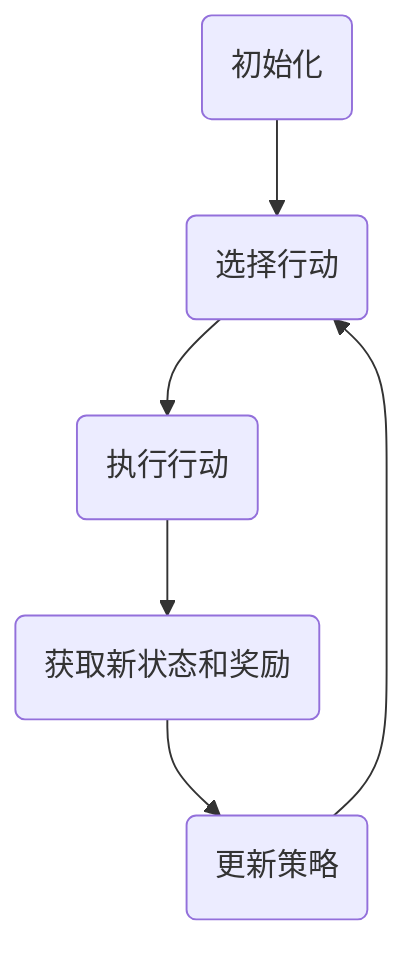

## 1.背景介绍

在人工智能的世界中，深度学习算法已经成为了一个重要的研究领域。对于很多任务，深度学习模型已经超越了传统的机器学习模型，提供了更高的精度和更强的泛化能力。然而，深度学习模型的训练通常需要大量的标注数据，这使得它们在一些领域的应用受到了限制。为了解决这个问题，研究人员提出了深度强化学习（Deep Reinforcement Learning，DRL）策略，通过让模型在环境中进行探索和试验，学习到最优的策略。

## 2.核心概念与联系

深度强化学习是结合了深度学习和强化学习的一种新型算法。深度学习是一种基于神经网络的机器学习方法，它可以从大量的数据中学习到复杂的模式和规律。而强化学习则是一种通过与环境交互，通过试错学习的方式来学习最优策略的方法。

在深度强化学习中，我们将深度学习模型作为代理（Agent），让它在环境中进行探索和试验，通过不断的交互和学习，找到最优的策略。这个过程可以被看作是一个序列决策问题，我们的目标是找到一个策略，使得代理在长期内获得的奖励最大。

## 3.核心算法原理具体操作步骤

深度强化学习的核心算法原理主要包括以下几个步骤：

1. 初始化：首先，我们需要初始化代理的状态和环境。

2. 选择行动：在每一个时间步，代理需要根据当前的状态和策略选择一个行动。

3. 执行行动：代理执行选择的行动，然后环境会返回一个新的状态和奖励。

4. 学习：代理根据新的状态和奖励，更新自己的策略。

5. 重复：代理重复上述步骤，直到达到终止条件。

这个过程可以用以下的Mermaid流程图来表示：



## 4.数学模型和公式详细讲解举例说明

在深度强化学习中，我们通常使用Q-Learning算法来进行学习。Q-Learning算法的目标是学习一个动作值函数$Q(s, a)$，表示在状态$s$下执行动作$a$的长期回报。我们可以使用以下的更新公式来进行学习：

$$
Q(s, a) \leftarrow Q(s, a) + \alpha [r + \gamma \max_{a'} Q(s', a') - Q(s, a)]
$$

其中，$s'$是新的状态，$r$是奖励，$\alpha$是学习率，$\gamma$是折扣因子。

在深度强化学习中，我们通常使用深度神经网络来表示$Q$函数，然后使用梯度下降法来进行学习。

## 5.项目实践：代码实例和详细解释说明

下面我们来看一个使用深度强化学习来解决CartPole问题的例子。

首先，我们需要导入必要的库：

```python
import gym
import tensorflow as tf
from tensorflow.keras.models import Sequential
from tensorflow.keras.layers import Dense
from tensorflow.keras.optimizers import Adam
```

然后，我们需要定义我们的代理：

```python
class DQNAgent:
    def __init__(self, state_size, action_size):
        self.state_size = state_size
        self.action_size = action_size
        self.memory = deque(maxlen=2000)
        self.gamma = 0.95  # discount rate
        self.epsilon = 1.0  # exploration rate
        self.epsilon_min = 0.01
        self.epsilon_decay = 0.995
        self.learning_rate = 0.001
        self.model = self._build_model()

    def _build_model(self):
        # Neural Net for Deep-Q learning Model
        model = Sequential()
        model.add(Dense(24, input_dim=self.state_size, activation='relu'))
        model.add(Dense(24, activation='relu'))
        model.add(Dense(self.action_size, activation='linear'))
        model.compile(loss='mse',
                      optimizer=Adam(lr=self.learning_rate))
        return model
```

接下来，我们需要定义代理的行动选择和学习方法：

```python
def act(self, state):
    if np.random.rand() <= self.epsilon:
        return random.randrange(self.action_size)
    act_values = self.model.predict(state)
    return np.argmax(act_values[0])  # returns action

def replay(self, batch_size):
    minibatch = random.sample(self.memory, batch_size)
    for state, action, reward, next_state, done in minibatch:
        target = reward
        if not done:
            target = (reward + self.gamma *
                      np.amax(self.model.predict(next_state)[0]))
        target_f = self.model.predict(state)
        target_f[0][action] = target
        self.model.fit(state, target_f, epochs=1, verbose=0)
    if self.epsilon > self.epsilon_min:
        self.epsilon *= self.epsilon_decay
```

最后，我们可以开始训练我们的代理：

```python
env = gym.make('CartPole-v1')
agent = DQNAgent(state_size=4, action_size=2)
for e in range(EPISODES):
    state = env.reset()
    state = np.reshape(state, [1, state_size])
    for time in range(500):
        action = agent.act(state)
        next_state, reward, done, _ = env.step(action)
        reward = reward if not done else -10
        next_state = np.reshape(next_state, [1, state_size])
        agent.remember(state, action, reward, next_state, done)
        state = next_state
        if done:
            print("episode: {}/{}, score: {}, e: {:.2}"
                  .format(e, EPISODES, time, agent.epsilon))
            break
        if len(agent.memory) > batch_size:
            agent.replay(batch_size)
```

## 6.实际应用场景

深度强化学习在许多领域都有广泛的应用，包括但不限于：

- 游戏：DeepMind的AlphaGo就是使用深度强化学习算法打败了世界围棋冠军。
- 自动驾驶：深度强化学习可以用于训练自动驾驶汽车在复杂环境中做出决策。
- 机器人：深度强化学习可以用于训练机器人完成各种任务，如抓取、行走等。

## 7.工具和资源推荐

如果你对深度强化学习感兴趣，下面的工具和资源可能会对你有所帮助：

- OpenAI Gym：一个用于开发和比较强化学习算法的工具包。
- TensorFlow：一个用于数值计算的强大的开源软件库，特别适用于大规模的机器学习。
- Keras：一个高级的神经网络API，可以运行在TensorFlow之上，易于使用且高度模块化。

## 8.总结：未来发展趋势与挑战

深度强化学习是一个非常有前景的研究领域，但也面临着一些挑战。例如，如何更有效地利用数据，如何处理高维度的状态和动作空间，如何保证学习的稳定性和鲁棒性等。未来，我们期待看到更多的研究和应用来解决这些问题。

## 9.附录：常见问题与解答

1. 问：深度强化学习和传统的强化学习有什么区别？
答：深度强化学习和传统的强化学习的主要区别在于，深度强化学习使用深度学习模型来表示和学习策略或值函数，这使得它能够处理高维度和连续的状态和动作空间。

2. 问：深度强化学习的训练需要多久？
答：这取决于许多因素，包括任务的复杂性，模型的复杂性，计算资源等。一般来说，深度强化学习的训练可能需要几小时到几天甚至几周的时间。

3. 问：深度强化学习可以用于哪些任务？
答：深度强化学习可以用于许多任务，包括游戏，自动驾驶，机器人，资源管理，推荐系统等。

作者：禅与计算机程序设计艺术 / Zen and the Art of Computer Programming