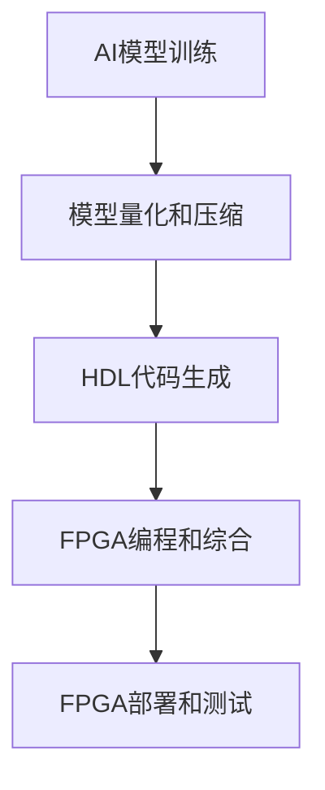

# AI模型部署到FPGA原理与代码实战案例讲解

## 1.背景介绍

随着人工智能(AI)和机器学习(ML)技术的快速发展,越来越多的AI模型被应用于各种领域,如计算机视觉、自然语言处理、推荐系统等。然而,传统的CPU和GPU在处理这些AI模型时,存在着计算能力、能源效率和延迟等方面的瓶颈。现代现场可编程门阵列(FPGA)作为一种高度并行和可重构的硬件加速器,在AI模型加速部署方面展现出巨大的潜力。

## 2.核心概念与联系

### 2.1 FPGA简介

FPGA是一种可编程逻辑器件,由可编程逻辑块(CLB)、可编程互连资源和I/O块组成。与通用CPU和GPU不同,FPGA可以根据特定应用对硬件进行重构,从而实现高度并行化和定制化的计算。

### 2.2 AI模型部署到FPGA的优势

将AI模型部署到FPGA上可以带来以下优势:

1. **高性能计算**:FPGA可以实现大规模并行计算,加速AI模型的推理过程。
2. **高能效**:与CPU和GPU相比,FPGA具有更高的能源效率,适合于边缘设备和嵌入式系统。
3. **低延迟**:FPGA可以实现实时推理,满足低延迟要求。
4. **灵活性**:FPGA可重构的特性使其能够适应不同的AI模型和应用场景。
5. **安全性**:FPGA的硬件实现可以提供更好的安全性和隐私保护。

### 2.3 FPGA与AI模型部署的挑战

尽管FPGA在AI模型部署方面具有诸多优势,但也面临一些挑战:

1. **硬件描述语言(HDL)编程复杂性**:FPGA编程需要使用HDL(如Verilog或VHDL),这增加了开发难度。
2. **内存带宽限制**:FPGA的内存带宽可能会限制模型的规模和性能。
3. **量化和模型压缩**:为了在FPGA上实现高效部署,需要对AI模型进行量化和压缩。
4. **工具链和框架支持**:FPGA生态系统缺乏成熟的工具链和框架支持,导致开发和部署过程复杂。

## 3.核心算法原理具体操作步骤

### 3.1 AI模型部署到FPGA的典型流程

将AI模型部署到FPGA通常涉及以下几个关键步骤:



1. **AI模型训练**:使用标准深度学习框架(如TensorFlow、PyTorch等)训练AI模型。
2. **模型量化和压缩**:为了适应FPGA的资源限制,需要对训练好的AI模型进行量化(如浮点数转定点数)和压缩(如剪枝、知识蒸馏等)。
3. **HDL代码生成**:使用高级综合(HLS)工具或框架,将量化和压缩后的AI模型转换为HDL代码。
4. **FPGA编程和综合**:使用FPGA供应商提供的工具链,将HDL代码综合、映射和布局到FPGA器件上。
5. **FPGA部署和测试**:将编程好的FPGA器件集成到目标系统中,进行功能和性能测试。

### 3.2 HDL代码生成

HDL代码生成是将AI模型映射到FPGA硬件的关键步骤。常用的HDL代码生成方法包括:

1. **手动编码**:使用HDL直接编写AI模型的硬件实现,需要深入了解模型算法和FPGA架构。
2. **高级综合(HLS)**:使用HLS工具(如Xilinx Vitis HLS、Intel HLS Compiler等)从高级语言(如C/C++、OpenCL等)自动生成HDL代码。
3. **模型转换框架**:使用专门的AI模型转换框架(如Xilinx DNNDK、Intel OpenVINO等)将训练好的模型转换为HDL代码。

无论采用哪种方法,HDL代码生成都需要考虑FPGA资源利用、并行度、数据流水线、内存访问优化等因素,以实现高性能和高效率的实现。

## 4.数学模型和公式详细讲解举例说明

### 4.1 卷积神经网络(CNN)

卷积神经网络(CNN)是一种广泛应用于计算机视觉任务(如图像分类、目标检测等)的深度学习模型。CNN的核心操作包括卷积(Convolution)和池化(Pooling)。

卷积操作可以用下式表示:

$$
y_{i,j} = \sum_{m}\sum_{n}w_{m,n}x_{i+m,j+n}
$$

其中,$y_{i,j}$是输出特征图上的像素值,${w_{m,n}}$是卷积核的权重,${x_{i+m,j+n}}$是输入特征图上的像素值。

池化操作通常采用最大池化(Max Pooling)或平均池化(Average Pooling),用于降低特征图的空间维度,提取更加鲁棒的特征。最大池化可以用下式表示:

$$
y_{i,j} = \max_{(m,n)\in R}x_{i+m,j+n}
$$

其中,${R}$是池化窗口的大小,${y_{i,j}}$是输出特征图上的像素值,${x_{i+m,j+n}}$是输入特征图上的像素值。

在FPGA上实现CNN时,通常会采用流水线和并行化策略,以充分利用FPGA的硬件资源。例如,可以将卷积操作分解为多个并行的乘累加(MAC)运算,并使用流水线技术来提高吞吐量。

### 4.2 长短期记忆网络(LSTM)

长短期记忆网络(LSTM)是一种广泛应用于自然语言处理任务(如机器翻译、语音识别等)的递归神经网络(RNN)变体。LSTM通过引入门控机制,可以有效地解决传统RNN存在的梯度消失和梯度爆炸问题。

LSTM的核心公式如下:

$$
\begin{aligned}
f_t &= \sigma(W_f \cdot [h_{t-1}, x_t] + b_f) \\
i_t &= \sigma(W_i \cdot [h_{t-1}, x_t] + b_i) \\
\tilde{C}_t &= \tanh(W_C \cdot [h_{t-1}, x_t] + b_C) \\
C_t &= f_t \odot C_{t-1} + i_t \odot \tilde{C}_t \\
o_t &= \sigma(W_o \cdot [h_{t-1}, x_t] + b_o) \\
h_t &= o_t \odot \tanh(C_t)
\end{aligned}
$$

其中,${f_t}$、${i_t}$、${o_t}$分别表示遗忘门、输入门和输出门,${C_t}$是细胞状态,${h_t}$是隐藏状态。${\sigma}$是sigmoid激活函数,${tanh}$是双曲正切激活函数,${W}$和${b}$分别表示权重和偏置。

在FPGA上实现LSTM时,需要注意内存访问优化和并行化策略。由于LSTM存在时序依赖,因此需要采用流水线和数据重用技术来提高效率。同时,可以利用FPGA的硬件资源实现并行化计算,如并行执行LSTM的不同门控单元。

## 5.项目实践:代码实例和详细解释说明

在本节中,我们将提供一个基于Xilinx DNNDK框架将ResNet-50模型部署到FPGA的实践案例。ResNet-50是一种广泛应用于图像分类任务的卷积神经网络模型。

### 5.1 环境准备

1. 安装Xilinx Vitis AI开发环境,包括Vitis AI库、DNNDK工具链和Vitis HLS。
2.准备预训练的ResNet-50模型(如TensorFlow或PyTorch格式)。

### 5.2 模型量化和压缩

使用Vitis AI量化工具对ResNet-50模型进行量化和压缩:

```bash
vai_q_quantizer -c float32 --model /path/to/resnet50.pb --output_dir /path/to/quantized_model --output_node_names "dense_1/Relu" --input_fn input_fn.calib_input --calib_iter 100
```

这里使用了校准数据集进行量化,并将输出节点设置为"dense_1/Relu"。

### 5.3 HDL代码生成

使用DNNDK工具将量化后的模型转换为HDL代码:

```bash
dnndk-kernel-runner --model /path/to/quantized_model --kernel_name resnet50 --out_dir /path/to/hdl_code --mode hw
```

这将生成一个名为"resnet50"的内核,包含HDL代码和相关文件。

### 5.4 FPGA编程和综合

使用Vitis工具链将HDL代码综合并编程到FPGA器件上:

```bash
vitis_hls -f /path/to/hdl_code/resnet50.tcl
vitis -kernel /path/to/hdl_code/resnet50.xo -run=impl
```

这里首先使用Vitis HLS工具进行高级综合,然后使用Vitis工具进行逻辑综合、映射和布局。

### 5.5 FPGA部署和测试

将编程好的FPGA器件集成到目标系统中,并使用测试数据集进行功能和性能测试。可以使用Vitis AI库提供的API进行推理和评估。

```python
from vitis_ai import dpumodel

# 加载模型
model = dpumodel.DpuModel("/path/to/resnet50.xmodel")

# 执行推理
input_data = ... # 准备输入数据
output = model.run(input_data)

# 评估结果
...
```

通过上述步骤,我们成功地将ResNet-50模型部署到FPGA上,并验证了其功能和性能。在实际应用中,还需要根据具体需求进行进一步的优化和调试。

## 6.实际应用场景

将AI模型部署到FPGA可以应用于多个领域,包括但不限于:

1. **边缘计算**:在物联网(IoT)和边缘设备中,FPGA可以提供高性能、低功耗和低延迟的AI推理能力,如智能视频监控、无人驾驶等。
2. **数据中心加速**:在数据中心中,FPGA可以作为专用加速器,加速AI模型的推理过程,提高整体系统性能和能源效率。
3. **嵌入式系统**:在航空航天、工业自动化等嵌入式系统中,FPGA可以提供高可靠性和实时性的AI推理能力。
4. **科学计算**:在高能物理、天文学等科学计算领域,FPGA可以加速复杂的数值模拟和数据处理任务。

## 7.工具和资源推荐

在将AI模型部署到FPGA时,可以使用以下工具和资源:

1. **FPGA供应商工具链**:如Xilinx Vitis AI、Intel OpenVINO等,提供了从模型转换到FPGA部署的完整工具链。
2. **开源框架**:如Glow、FINN等,提供了开源的AI模型到FPGA部署框架。
3. **高级综合(HLS)工具**:如Xilinx Vitis HLS、Intel HLS Compiler等,可以从高级语言(如C/C++、OpenCL等)自动生成HDL代码。
4. **在线课程和教程**:如Coursera、edX等在线学习平台提供了相关的FPGA和AI课程,可以帮助快速入门。
5. **社区和论坛**:如FPGA论坛、Stack Overflow等,可以获取来自专家和同行的建议和支持。

## 8.总结:未来发展趋势与挑战

### 8.1 未来发展趋势

1. **FPGA与AI加速器融合**:未来,FPGA可能会与专用AI加速器(如TPU、VPU等)融合,形成更加强大的异构计算平台。
2. **FPGA云服务**:云服务提供商可能会提供基于FPGA的AI推理服务,降低用户的部署和维护成本。
3. **FPGA与边缘AI融合**:FPGA将在边缘AI领域发挥越来越重要的作用,提供高性能、低功耗和低延迟的AI推理能力。
4. **FPGA编程模型革新**:为了降低FPGA编程的复杂性,未来可能会出现