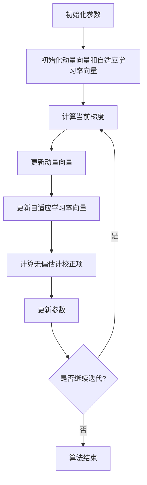

# Adam内部原理大揭秘:无偏估计与动量更新

## 1.背景介绍

在深度学习领域,优化算法在训练神经网络时扮演着至关重要的角色。传统的随机梯度下降(SGD)算法虽然简单有效,但存在一些缺陷,例如收敛速度慢、对参数初始化和学习率设置敏感等。为了解决这些问题,研究人员提出了各种自适应优化算法,其中Adam算法无疑是最受欢迎和广泛使用的一种。

Adam算法是在2014年由Diederik Kingma和Jimmy Ba提出的,它结合了自适应学习率和动量技术的优点,展现出卓越的性能。Adam算法不仅能够加快收敛速度,还能够处理梯度稀疏和非平稳的问题,从而使训练过程更加稳定和高效。

## 2.核心概念与联系

### 2.1 自适应学习率

传统的SGD算法使用固定的全局学习率,这可能会导致收敛速度较慢或者无法收敛。Adam算法采用了自适应学习率的方法,根据每个参数的梯度更新历史自动调整每个参数的学习率。这种方式可以加快收敛速度,并且避免了手动调整学习率的麻烦。

### 2.2 动量技术

动量技术是一种加速SGD算法收敛的方法,它通过累积过去的梯度来决定当前的更新方向和步长。Adam算法结合了动量技术,能够抑制振荡,加快收敛速度。

### 2.3 无偏估计

在Adam算法中,自适应学习率和动量项都是通过移动平均的方式计算得到的。但是,在初始阶段,这些移动平均值会存在偏差。Adam算法通过引入无偏估计校正项来解决这个问题,从而使得算法在初始阶段也能够保持良好的性能。

## 3.核心算法原理具体操作步骤

Adam算法的核心思想是维护每个参数的自适应学习率和动量项,并在每次迭代时根据这些值来更新参数。具体操作步骤如下:

1. 初始化参数 $\theta$,初始学习率 $\alpha$,指数衰减率 $\beta_1$ 和 $\beta_2$,以及一个很小的常数 $\epsilon$ 用于数值稳定性。
2. 初始化动量向量 $m_0=0$ 和自适应学习率向量 $v_0=0$。
3. 对于每次迭代 $t=1,2,\ldots$:
   a. 计算当前梯度 $g_t=\nabla_\theta J(\theta_{t-1})$。
   b. 更新动量向量:
      $$m_t=\beta_1 m_{t-1}+(1-\beta_1)g_t$$
   c. 更新自适应学习率向量:
      $$v_t=\beta_2 v_{t-1}+(1-\beta_2)g_t^2$$
   d. 计算无偏估计校正项:
      $$\hat{m}_t=\frac{m_t}{1-\beta_1^t}$$
      $$\hat{v}_t=\frac{v_t}{1-\beta_2^t}$$
   e. 更新参数:
      $$\theta_t=\theta_{t-1}-\alpha\frac{\hat{m}_t}{\sqrt{\hat{v}_t}+\epsilon}$$

其中,超参数 $\beta_1$ 和 $\beta_2$ 控制着动量和自适应学习率的衰减速度,通常取值为 $\beta_1=0.9$,$\beta_2=0.999$。无偏估计校正项 $\frac{1}{1-\beta_1^t}$ 和 $\frac{1}{1-\beta_2^t}$ 用于消除初始阶段的偏差。

下面是Adam算法的Mermaid流程图:



## 4.数学模型和公式详细讲解举例说明

在Adam算法中,动量向量 $m_t$ 和自适应学习率向量 $v_t$ 分别通过以下公式计算:

$$m_t=\beta_1 m_{t-1}+(1-\beta_1)g_t$$
$$v_t=\beta_2 v_{t-1}+(1-\beta_2)g_t^2$$

其中,$\beta_1$ 和 $\beta_2$ 是指数衰减率,控制着动量和自适应学习率的衰减速度。

在初始阶段,由于 $m_0=0$ 和 $v_0=0$,移动平均值 $m_t$ 和 $v_t$ 会存在偏差。为了解决这个问题,Adam算法引入了无偏估计校正项:

$$\hat{m}_t=\frac{m_t}{1-\beta_1^t}$$
$$\hat{v}_t=\frac{v_t}{1-\beta_2^t}$$

这样,在初始阶段,即使 $m_t$ 和 $v_t$ 存在偏差,经过校正后的 $\hat{m}_t$ 和 $\hat{v}_t$ 就能够较好地估计真实值。

最后,参数更新公式为:

$$\theta_t=\theta_{t-1}-\alpha\frac{\hat{m}_t}{\sqrt{\hat{v}_t}+\epsilon}$$

其中,$\alpha$ 是初始学习率,$\epsilon$ 是一个很小的常数,用于避免分母为零的情况。

让我们通过一个简单的例子来理解Adam算法的工作原理。假设我们有一个单变量函数 $f(x)=x^4$,目标是找到 $f(x)$ 的最小值。我们初始化 $x_0=4$,$\alpha=0.1$,$\beta_1=0.9$,$\beta_2=0.999$,$\epsilon=10^{-8}$。

在第一次迭代时,我们有:

$$g_1=\nabla_x f(x_0)=4^3=64$$
$$m_1=0.9\times 0+0.1\times 64=6.4$$
$$v_1=0.999\times 0+0.001\times 64^2=4096$$
$$\hat{m}_1=\frac{6.4}{1-0.9}=64$$
$$\hat{v}_1=\frac{4096}{1-0.999}=4096000$$
$$x_1=4-0.1\times\frac{64}{\sqrt{4096000}+10^{-8}}=3.9984$$

我们可以看到,在第一次迭代后,参数 $x$ 已经向最小值方向移动了一小步。随着迭代的进行,动量项和自适应学习率项会不断更新,参数也会逐步接近最小值。

通过这个例子,我们可以直观地理解Adam算法的工作原理,以及无偏估计校正项在初始阶段的重要作用。

## 5.项目实践:代码实例和详细解释说明

下面是一个使用PyTorch实现Adam算法的代码示例:

```python
import torch

# 定义Adam优化器
optimizer = torch.optim.Adam(model.parameters(), lr=0.001, betas=(0.9, 0.999), eps=1e-08, weight_decay=0, amsgrad=False)

# 训练循环
for epoch in range(num_epochs):
    for inputs, targets in train_loader:
        # 计算模型输出和损失
        outputs = model(inputs)
        loss = criterion(outputs, targets)

        # 反向传播和优化
        optimizer.zero_grad()
        loss.backward()
        optimizer.step()
```

在这个示例中,我们首先定义了一个Adam优化器实例。`lr`参数是初始学习率,$\alpha$在公式中。`betas`参数是一个元组,包含了 $\beta_1$ 和 $\beta_2$ 的值。`eps`参数就是公式中的 $\epsilon$,用于数值稳定性。`weight_decay`是L2正则化项的系数,`amsgrad`是一个布尔值,表示是否使用AMSGrad变体算法。

在训练循环中,我们首先计算模型的输出和损失。然后,我们调用`optimizer.zero_grad()`清除之前的梯度,`loss.backward()`计算当前梯度,最后调用`optimizer.step()`根据Adam算法更新模型参数。

PyTorch中的Adam优化器实现了Adam算法的所有核心步骤,包括动量更新、自适应学习率更新和无偏估计校正。它还提供了一些额外的功能,如L2正则化和AMSGrad变体算法。使用PyTorch的Adam优化器,我们可以非常方便地在深度学习模型的训练中应用Adam算法。

## 6.实际应用场景

Adam算法由于其优异的性能,在深度学习领域得到了广泛的应用。以下是一些典型的应用场景:

1. **计算机视觉**:在图像分类、目标检测、语义分割等计算机视觉任务中,Adam算法被广泛用于训练卷积神经网络(CNN)模型,如VGGNet、ResNet、Faster R-CNN等。

2. **自然语言处理**:在机器翻译、文本生成、情感分析等自然语言处理任务中,Adam算法被用于训练循环神经网络(RNN)、长短期记忆网络(LSTM)、transformer等模型。

3. **强化学习**:在AlphaGo、AlphaZero等人工智能系统中,Adam算法被用于训练深度强化学习模型,实现了超人类水平的游戏表现。

4. **生成对抗网络(GAN)**:在图像生成、风格迁移等任务中,Adam算法被用于训练生成对抗网络,产生高质量的合成图像。

5. **推荐系统**:在个性化推荐、协同过滤等推荐系统任务中,Adam算法被用于训练深度神经网络模型,提高推荐的准确性和多样性。

6. **语音识别**:在自动语音识别系统中,Adam算法被用于训练深度神经网络模型,提高语音转录的准确率。

总的来说,Adam算法在深度学习的各个领域都有广泛的应用,它的优异性能使其成为训练神经网络模型的首选优化算法之一。

## 7.工具和资源推荐

如果你想进一步学习和使用Adam算法,以下是一些推荐的工具和资源:

1. **深度学习框架**:主流的深度学习框架如PyTorch、TensorFlow、Keras等都内置了Adam优化器的实现,你可以直接调用并使用。

2. **在线教程**:像Coursera、Udacity等在线学习平台提供了大量的深度学习课程,其中包括Adam算法的详细介绍和实践练习。

3. **书籍资料**:《Deep Learning》(Ian Goodfellow等著)、《Pattern Recognition and Machine Learning》(Christopher Bishop著)等经典书籍对Adam算法有深入的阐述。

4. **论文原文**:Adam算法的原始论文《Adam: A Method for Stochastic Optimization》(Diederik P. Kingma和Jimmy Ba著)是学习该算法的权威资料。

5. **开源实现**:GitHub上有许多Adam算法的开源实现,你可以参考并在此基础上进行修改和扩展。

6. **在线社区**:像StackOverflow、Reddit等技术社区有专门的深度学习版块,你可以在这里提问并与其他开发者交流。

7. **可视化工具**:一些在线工具如TensorFlow Playground、Neural Network Playground等可以帮助你直观地理解Adam算法的工作原理。

8. **云计算平台**:像Google Colab、AWS、Azure等云计算平台提供了免费或低成本的GPU资源,方便你进行深度学习模型的训练和实验。

通过利用这些工具和资源,你可以更好地掌握Adam算法的理论知识和实践技能,并将其应用到实际的深度学习项目中。

## 8.总结:未来发展趋势与挑战

Adam算法自提出以来,已经成为深度学习领域最流行和最广泛使用的优化算法之一。它结合了自适应学习率和动量技术的优点,展现出卓越的性能,在加快收敛速度、处理梯度稀疏和非平稳等方面都有显著的优势。

然而,Adam算法也面临一些挑战和局限性。例如,在某些情况下,它可能会过早收敛到次优解,或者在训练后期出现振荡。此外,Adam算法的超参数选择也需要一定的经验和调试。

为了解决这些问题,研究人员提出了一些Adam算法的改进版本和变体,如AMSGrad、