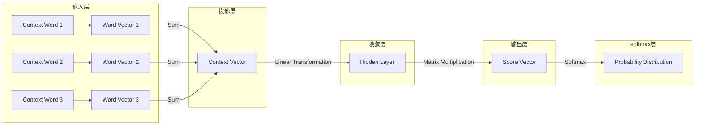

# CBOW模型的代码实现

## 1.背景介绍

在自然语言处理(NLP)领域中,Word Embedding是一种将单词映射到连续向量空间的技术,它能够有效地捕捉单词之间的语义和语法关系。Word Embedding的出现极大地推动了NLP任务的发展,例如机器翻译、情感分析、文本分类等。其中,CBOW(Continuous Bag-of-Words)模型是Word2Vec工具包中的一种高效的Word Embedding模型。

CBOW模型由Tomas Mikolov等人于2013年在论文"Efficient Estimation of Word Representations in Vector Space"中提出。与传统的词袋(Bag-of-Words)模型不同,CBOW模型考虑了单词在句子中的上下文信息,能够更好地表示单词的语义。

## 2.核心概念与联系

### 2.1 词向量(Word Vector)

词向量是指将单词映射到一个固定长度的密集向量,这个向量能够捕捉单词的语义和语法特征。在CBOW模型中,每个单词都被表示为一个固定长度的向量。

### 2.2 上下文(Context)

上下文指的是目标单词周围的单词序列。在CBOW模型中,我们使用目标单词周围的单词来预测目标单词本身。

### 2.3 目标函数(Objective Function)

CBOW模型的目标是最大化给定上下文时,正确预测目标单词的概率。这可以通过最小化目标函数(如交叉熵损失函数)来实现。

### 2.4 softmax函数

softmax函数用于将神经网络的输出转换为概率分布。在CBOW模型中,softmax函数用于计算给定上下文时,每个单词作为目标单词的概率。

## 3.核心算法原理具体操作步骤

CBOW模型的核心算法原理可以概括为以下步骤:

1. **输入层**: 将目标单词周围的上下文单词映射为one-hot向量,并通过查找嵌入矩阵获取对应的词向量。
2. **投影层**: 将上下文单词的词向量相加,得到上下文向量。
3. **隐藏层**: 上下文向量通过线性变换得到隐藏层向量。
4. **输出层**: 隐藏层向量与输出词向量矩阵相乘,得到未归一化的对数概率值。
5. **softmax层**: 使用softmax函数将未归一化的对数概率值转换为概率分布。
6. **损失函数**: 计算预测概率与实际目标单词之间的交叉熵损失。
7. **反向传播**: 根据损失函数的梯度,使用优化算法(如随机梯度下降)更新模型参数。

## 4.数学模型和公式详细讲解举例说明

### 4.1 CBOW模型结构

CBOW模型的基本结构如下所示:



在这个模型中,我们首先将上下文单词映射为对应的词向量。然后,将这些词向量相加得到上下文向量。接下来,上下文向量通过线性变换得到隐藏层向量。最后,隐藏层向量与输出词向量矩阵相乘,得到未归一化的对数概率值,并使用softmax函数将其转换为概率分布。

### 4.2 softmax函数

softmax函数用于将神经网络的输出转换为概率分布。对于一个长度为 $V$ 的向量 $z$,softmax函数定义如下:

$$\text{softmax}(z)_i = \frac{e^{z_i}}{\sum_{j=1}^{V}e^{z_j}}$$

其中,$ \text{softmax}(z)_i $ 表示第 $i$ 个元素的softmax值,即第 $i$ 个单词作为目标单词的概率。

### 4.3 目标函数

CBOW模型的目标是最大化给定上下文时,正确预测目标单词的概率。这可以通过最小化交叉熵损失函数来实现。

对于一个长度为 $V$ 的概率分布 $\hat{y}$ 和一个one-hot编码的目标单词 $y$,交叉熵损失函数定义如下:

$$J(\theta) = -\frac{1}{m}\sum_{i=1}^{m}\sum_{j=1}^{V}y_j^{(i)}\log\hat{y}_j^{(i)}$$

其中, $m$ 是训练样本的数量, $\theta$ 表示模型参数, $y_j^{(i)}$ 是第 $i$ 个训练样本的目标单词的one-hot编码, $\hat{y}_j^{(i)}$ 是模型预测的第 $j$ 个单词作为目标单词的概率。

我们的目标是最小化这个损失函数,从而使模型能够更好地预测目标单词。

### 4.4 实例说明

假设我们有一个句子 "The quick brown fox jumps over the lazy dog",我们希望预测中间单词 "fox"。在CBOW模型中,我们将使用单词 "The"、"quick"、"brown" 和 "jumps"、"over"、"the"、"lazy"、"dog" 作为上下文来预测单词 "fox"。

1. 首先,我们将上下文单词映射为对应的词向量,例如 $v_\text{The}$、$v_\text{quick}$、$v_\text{brown}$、$v_\text{jumps}$、$v_\text{over}$、$v_\text{the}$、$v_\text{lazy}$ 和 $v_\text{dog}$。
2. 然后,我们将这些词向量相加,得到上下文向量 $v_c = v_\text{The} + v_\text{quick} + v_\text{brown} + v_\text{jumps} + v_\text{over} + v_\text{the} + v_\text{lazy} + v_\text{dog}$。
3. 上下文向量 $v_c$ 通过线性变换得到隐藏层向量 $h = W^Tv_c + b$,其中 $W$ 和 $b$ 是模型参数。
4. 隐藏层向量 $h$ 与输出词向量矩阵 $U$ 相乘,得到未归一化的对数概率值 $z = Uh$。
5. 使用softmax函数将 $z$ 转换为概率分布 $\hat{y} = \text{softmax}(z)$。
6. 计算预测概率 $\hat{y}_\text{fox}$ 与实际目标单词 "fox" 的one-hot编码 $y_\text{fox}$ 之间的交叉熵损失。
7. 根据损失函数的梯度,使用优化算法更新模型参数 $W$、$b$ 和 $U$。

通过上述步骤,CBOW模型可以学习到能够捕捉单词语义和语法关系的词向量表示。

## 5.项目实践:代码实例和详细解释说明

以下是使用Python和PyTorch实现CBOW模型的代码示例:

```python
import torch
import torch.nn as nn
import torch.optim as optim

# 设置超参数
embedding_dim = 200  # 词向量维度
context_size = 2  # 上下文窗口大小
batch_size = 32
num_epochs = 10

# 加载数据
# 这里假设我们已经将数据处理为一个列表,每个元素是一个(上下文单词列表,目标单词)对
data = [...]

# 构建词汇表
vocab = set()
for context, target in data:
    vocab.update(context)
    vocab.add(target)
vocab_size = len(vocab)

# 定义模型
class CBOW(nn.Module):
    def __init__(self, vocab_size, embedding_dim, context_size):
        super(CBOW, self).__init__()
        self.embeddings = nn.Embedding(vocab_size, embedding_dim)
        self.linear1 = nn.Linear(2 * context_size * embedding_dim, embedding_dim)
        self.linear2 = nn.Linear(embedding_dim, vocab_size)

    def forward(self, contexts, targets):
        embeds = self.embeddings(contexts).view(-1, 2 * context_size * embedding_dim)
        hidden = torch.tanh(self.linear1(embeds))
        output = self.linear2(hidden)
        log_probs = nn.functional.log_softmax(output, dim=1)
        return log_probs

# 初始化模型
model = CBOW(vocab_size, embedding_dim, context_size)

# 定义损失函数和优化器
criterion = nn.NLLLoss()
optimizer = optim.SGD(model.parameters(), lr=0.001)

# 训练模型
for epoch in range(num_epochs):
    total_loss = 0
    for context, target in data:
        # 准备输入数据
        context_ids = [vocab[w] for w in context]
        context_tensor = torch.LongTensor(context_ids)
        target_id = vocab[target]
        target_tensor = torch.LongTensor([target_id])

        # 前向传播
        log_probs = model(context_tensor, target_tensor)
        loss = criterion(log_probs, target_tensor)

        # 反向传播
        optimizer.zero_grad()
        loss.backward()
        optimizer.step()

        total_loss += loss.item()

    print(f"Epoch {epoch+1}, Loss: {total_loss / len(data)}")

# 保存词向量
embeddings = model.embeddings.weight.data
torch.save(embeddings, "embeddings.pt")
```

代码解释:

1. 首先,我们定义了一些超参数,如词向量维度、上下文窗口大小、批量大小和训练轮数。
2. 然后,我们假设已经将数据处理为一个列表,每个元素是一个(上下文单词列表,目标单词)对。
3. 我们构建了一个词汇表,包含了所有出现的单词。
4. 接下来,我们定义了CBOW模型。这个模型包含三个主要部分:
   - `nn.Embedding`层用于将单词映射为词向量。
   - `nn.Linear`层用于将上下文向量投影到隐藏层。
   - `nn.Linear`层用于将隐藏层向量映射到输出层,并使用`nn.functional.log_softmax`函数计算对数概率。
5. 我们初始化模型,并定义了损失函数(负对数似然损失)和优化器(随机梯度下降)。
6. 在训练循环中,我们遍历每个(上下文,目标)对。首先,我们将上下文单词和目标单词转换为张量。然后,我们进行前向传播,计算损失,并进行反向传播更新模型参数。
7. 最后,我们保存了训练好的词向量,以供将来使用。

需要注意的是,这只是一个简单的CBOW模型实现,在实际应用中可能需要进行一些优化和调整,例如使用更复杂的神经网络结构、添加正则化等。

## 6.实际应用场景

CBOW模型及其生成的词向量可以应用于各种自然语言处理任务,例如:

1. **文本分类**: 将文本映射为词向量的加权和,然后使用分类器(如逻辑回归或神经网络)进行分类。
2. **情感分析**: 利用词向量捕捉情感词的语义,从而更好地进行情感分析。
3. **机器翻译**: 将源语言和目标语言的单词映射到同一个向量空间中,从而捕捉跨语言的语义关系,提高机器翻译质量。
4. **文本相似度计算**: 通过计算两个文本的词向量表示之间的余弦相似度,来衡量它们的语义相似程度。
5. **词性标注和命名实体识别**: 将词向量作为特征输入到序列标注模型中,提高这些任务的性能。

除了上述应用场景,词向量还可以用于文本聚类、关键词提取、文本生成等多个领域。总的来说,CBOW模型生成的高质量词向量为自然语言处理任务提供了有力的语义表示,是当前NLP领域不可或缺的基础技术之一。

## 7.工具和资源推荐

在实现和使用CBOW模型时,有一些流行的工具和资源可以提供帮助:

1. **Word2Vec工具包**: Google开源的Word2Vec工具包是实现CBOW模型和Skip-Gram模型的经典工具。它提供了C、Python和Java等多种语言的实现,并支持多线程训练和高效的词向量查询。
2.