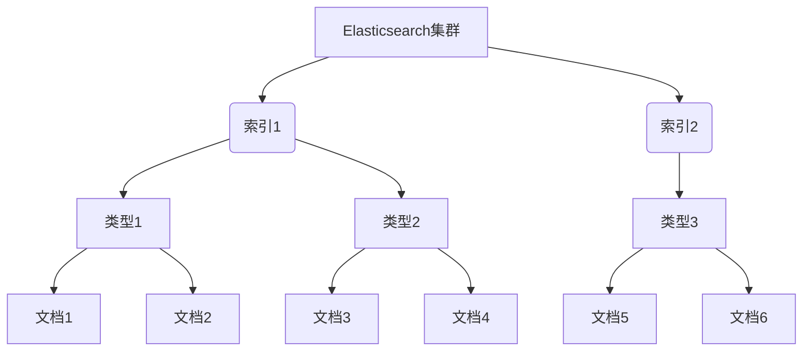

# ES聚合分析原理与代码实例讲解

## 1.背景介绍

在当今大数据时代，海量数据的存储和分析成为了一个巨大的挑战。Elasticsearch作为一个分布式、RESTful 风格的搜索和分析引擎,因其高效、实时和可扩展的特性,被广泛应用于各种场景中。其中,ES的聚合分析功能尤为强大,可以对海量数据进行多维度的分析和统计,为数据驱动型业务决策提供有力支持。

## 2.核心概念与联系

在开始探讨ES聚合分析之前,我们需要了解一些核心概念:

- **文档(Document)**: 是ES中最小的数据单元,用JSON格式表示。
- **索引(Index)**: 相当于传统数据库中的数据库,用于存储相关文档。
- **类型(Type)**: 索引中的逻辑分类,7.x版本后将被移除。
- **集群(Cluster)**: 一个或多个节点的集合,用于存储整个数据并提供联合索引和搜索功能。
- **分片(Shard)**: 索引的水平分片,用于分散数据和提高性能。
- **副本(Replica)**: 分片的副本,用于实现高可用和容错。

ES的聚合分析是基于这些核心概念之上构建的,它能够对索引中的文档数据进行多维度的分组、统计、排序等操作。



## 3.核心算法原理具体操作步骤

ES的聚合分析是通过一系列的聚合操作来实现的,每个聚合操作都会生成一个聚合桶(Bucket),用于存储聚合结果。这些聚合操作可以嵌套组合,形成复杂的聚合分析管道。

ES提供了多种聚合操作,包括:

1. **Bucket Aggregations**: 用于对数据进行分组,常见的有Terms、Range、Date Range等。
2. **Metric Aggregations**: 用于对数据进行统计,常见的有Sum、Avg、Max、Min等。
3. **Pipeline Aggregations**: 对其他聚合操作的输出进行进一步转换,如Bucket Sort、Bucket Script等。
4. **Matrix Aggregations**: 对多个字段进行操作,如矩阵统计。

以Terms Aggregation为例,其算法原理如下:

1. 从索引中获取所有符合查询条件的文档。
2. 对每个文档,提取聚合字段的值。
3. 对提取的值进行排序和去重。
4. 计算每个唯一值对应的文档数量。
5. 根据请求的大小和排序规则,返回最终的聚合结果。

具体操作步骤如下:

```javascript
GET /索引名/_search
{
  "size": 0, // 设置不返回hits
  "aggs": {
    "名称": {
      "terms": {
        "field": "字段名",
        "size": 10 // 返回前10个桶
      }
    }
  }
}
```

上述查询将返回一个聚合结果,包含前10个出现次数最多的字段值及其对应的文档计数。

## 4.数学模型和公式详细讲解举例说明

在ES的聚合分析中,一些统计指标的计算涉及到数学模型和公式,如均值、方差、百分位数等。以计算均值为例,其公式如下:

$$\overline{x} = \frac{\sum_{i=1}^{n}x_i}{n}$$

其中,$\overline{x}$表示均值,$x_i$表示第$i$个数据点的值,$n$表示数据点的总数。

在ES中,我们可以使用`Extended Stats`聚合来计算均值、方差等统计指标。例如:

```javascript
GET /索引名/_search
{
  "aggs": {
    "stats": {
      "extended_stats": {
        "field": "字段名"
      }
    }
  }
}
```

上述查询将返回一个包含count、min、max、avg、sum、sum_of_squares、variance和std_deviation等统计指标的聚合结果。

对于百分位数的计算,ES使用了TDigest算法,这是一种基于数据分布的近似算法。TDigest算法的核心思想是将数据划分为多个节点,每个节点包含一个权重和一个均值,用于近似表示数据分布。通过合并和压缩节点,TDigest可以高效地计算数据的分位数。

在ES中,我们可以使用`Percentiles`聚合来计算百分位数,例如:

```javascript
GET /索引名/_search
{
  "aggs": {
    "percentiles": {
      "percentiles": {
        "field": "字段名",
        "percents": [95, 99]
      }
    }
  }
}
```

上述查询将返回该字段值的95和99百分位数。

## 5.项目实践:代码实例和详细解释说明

接下来,我们将通过一个实际项目案例,来演示ES聚合分析的具体应用。假设我们有一个电商网站的订单数据,索引名为`orders`,包含以下字段:

- `order_id`: 订单ID
- `customer_id`: 客户ID
- `product_id`: 产品ID
- `price`: 产品价格
- `quantity`: 购买数量
- `order_date`: 下单日期

我们希望能够对订单数据进行多维度的分析,以了解销售情况、客户购买偏好等信息。

### 5.1 按产品分类统计销售额

首先,我们需要按产品对订单进行分组,并统计每个产品的总销售额。

```javascript
GET /orders/_search
{
  "size": 0,
  "aggs": {
    "product_sales": {
      "terms": {
        "field": "product_id",
        "size": 10
      },
      "aggs": {
        "total_sales": {
          "sum": {
            "field": "price"
          }
        }
      }
    }
  }
}
```

在上述查询中,我们使用了`terms`聚合对`product_id`字段进行分组,并设置返回前10个产品。对于每个产品分组,我们使用了嵌套的`sum`聚合来计算该产品的总销售额。

查询结果将包含前10个热销产品及其对应的总销售额,类似于:

```json
{
  "product_sales": [
    {
      "key": "product_1",
      "doc_count": 1000,
      "total_sales": {
        "value": 50000
      }
    },
    {
      "key": "product_2",
      "doc_count": 800,
      "total_sales": {
        "value": 32000
      }
    },
    ...
  ]
}
```

### 5.2 按客户分组统计订单数量和平均消费

接下来,我们希望了解每个客户的订单数量和平均消费金额,以评估客户价值。

```javascript
GET /orders/_search
{
  "size": 0,
  "aggs": {
    "customer_analysis": {
      "terms": {
        "field": "customer_id",
        "size": 10
      },
      "aggs": {
        "order_count": {
          "value_count": {
            "field": "order_id"
          }
        },
        "avg_spend": {
          "avg": {
            "field": "price"
          }
        }
      }
    }
  }
}
```

在这个查询中,我们使用`terms`聚合对`customer_id`进行分组,并设置返回前10个客户。对于每个客户分组,我们使用了嵌套的`value_count`聚合来统计该客户的订单数量,以及`avg`聚合来计算该客户的平均消费金额。

查询结果将包含前10个活跃客户及其对应的订单数量和平均消费金额,类似于:

```json
{
  "customer_analysis": [
    {
      "key": "customer_1",
      "doc_count": 100,
      "order_count": {
        "value": 50
      },
      "avg_spend": {
        "value": 80
      }
    },
    {
      "key": "customer_2",
      "doc_count": 80,
      "order_count": {
        "value": 60
      },
      "avg_spend": {
        "value": 100
      }
    },
    ...
  ]
}
```

### 5.3 按日期范围分组统计订单数量

最后,我们希望了解不同时间段的订单数量,以便评估营销活动的效果。

```javascript
GET /orders/_search
{
  "size": 0,
  "aggs": {
    "date_range": {
      "date_range": {
        "field": "order_date",
        "ranges": [
          { "from": "2023-01-01", "to": "2023-01-15" },
          { "from": "2023-01-16", "to": "2023-01-31" }
        ]
      },
      "aggs": {
        "order_count": {
          "value_count": {
            "field": "order_id"
          }
        }
      }
    }
  }
}
```

在这个查询中,我们使用`date_range`聚合对`order_date`字段进行日期范围分组,将一个月分为两个半月。对于每个日期范围分组,我们使用嵌套的`value_count`聚合来统计该时间段的订单数量。

查询结果将包含两个日期范围及其对应的订单数量,类似于:

```json
{
  "date_range": [
    {
      "key": "2023-01-01T00:00:00.000Z-2023-01-15T00:00:00.000Z",
      "doc_count": 1000,
      "order_count": {
        "value": 500
      }
    },
    {
      "key": "2023-01-16T00:00:00.000Z-2023-01-31T00:00:00.000Z",
      "doc_count": 800,
      "order_count": {
        "value": 400
      }
    }
  ]
}
```

通过上述实例,我们可以看到ES聚合分析的强大功能,能够对海量数据进行多维度的分析和统计,为数据驱动型业务决策提供有力支持。

## 6.实际应用场景

ES的聚合分析功能在实际应用中有着广泛的应用场景,包括但不限于:

1. **电商数据分析**: 分析产品销售情况、客户购买行为、营销活动效果等,为商家提供决策依据。
2. **日志分析**: 对系统日志进行聚合分析,发现异常模式、性能瓶颈等,提高系统稳定性和效率。
3. **网站分析**: 分析用户访问行为、流量来源、内容点击率等,优化网站设计和内容策略。
4. **安全分析**: 对安全事件进行聚合分析,发现攻击模式、威胁来源等,提高安全防护能力。
5. **物联网数据分析**: 对传感器采集的海量数据进行聚合分析,发现异常模式、预测故障等。
6. **社交媒体分析**: 分析用户行为、内容传播、舆情走向等,为营销策略和内容创作提供参考。

总的来说,ES的聚合分析功能适用于各种需要对海量数据进行多维度分析和统计的场景,为数据驱动型业务决策提供了有力支持。

## 7.工具和资源推荐

在使用ES进行聚合分析时,有一些工具和资源可以提高效率和便利性:

1. **Kibana**: ES官方提供的数据可视化工具,可以通过图形界面构建和执行聚合查询,并生成各种图表和报告。
2. **Elasticsearch Head**: 一款开源的ES集群管理和数据可视化工具,提供了方便的查询界面和聚合分析功能。
3. **Elasticsearch Python Client**: 官方提供的Python客户端库,方便在Python程序中与ES集群进行交互和聚合分析。
4. **Elasticsearch Java Client**: 官方提供的Java客户端库,适用于Java应用程序中的ES集成和聚合分析。
5. **Elasticsearch官方文档**: ES官方提供了详细的文档和示例,涵盖了聚合分析的各个方面,是学习和参考的重要资源。
6. **Elasticsearch Stack Overflow**: 一个活跃的在线社区,可以在这里提问、解答和分享ES相关的问题和经验。

利用这些工具和资源,可以更高效地进行ES聚合分析,提高开发和运维效率。

## 8.总结:未来发展趋势与挑战

ES的聚合分析功能已经非常强大,但随着数据量的不断增长和应用场景的不断扩展,它也面临着一些挑战和发展趋势:

1. **性能优化**: 随着数据量的增