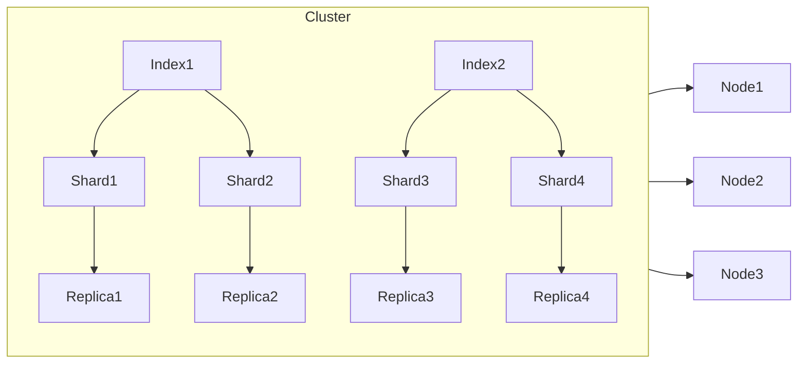

# ElasticSearch原理与代码实例讲解

## 1. 背景介绍

### 1.1 搜索引擎的重要性
在当今大数据时代,海量的数据正在以前所未有的速度增长。面对如此庞大的数据,传统的数据库系统已经无法满足实时搜索和分析的需求。搜索引擎技术应运而生,成为了处理海量数据、提供实时搜索和分析能力的利器。而ElasticSearch就是其中的佼佼者。

### 1.2 ElasticSearch简介
ElasticSearch是一个基于Lucene构建的开源、分布式、RESTful接口的全文搜索引擎。它能够实现实时搜索、支持分布式可扩展、同时还支持多种类型数据的搜索。ElasticSearch在搜索领域已经成为了事实上的标准,被广泛应用于日志搜索、数据分析、站内搜索等多个领域。

### 1.3 ElasticSearch的特点
- 分布式的实时文件存储,每个字段都被索引并可被搜索
- 分布式的实时分析搜索引擎
- 可扩展至上百台服务器,处理PB级结构化或非结构化数据
- 高可用、易扩展、易伸缩
- RESTful接口,可被多种语言调用

## 2. 核心概念与联系

### 2.1 Node与Cluster
- Node:运行单个ElasticSearch实例的服务器
- Cluster:由一个或多个节点组成,对外提供服务,每个Cluster有一个唯一名称

### 2.2 Index与Document
- Index:含有相同属性的Document的集合
- Document:Index里面单条的记录,是可以被索引的基本数据单位,使用JSON格式表示
- 关系类比:Cluster → Database,Index → Table,Document → Row

### 2.3 Shard与Replica
- Shard:Index的切片,每个Shard是一个Lucene实例,有完整的建立索引和处理请求的能力
- Replica:Shard的副本,可以是主Shard也可以是副本Shard,用于提高系统的容错性和承受读请求的能力
- 关系:Index → Shard → Replica

### 2.4 Mermaid图解


## 3. 核心算法原理具体操作步骤

### 3.1 倒排索引
ElasticSearch使用倒排索引来实现快速的全文搜索。倒排索引的核心思想是:通过单词来索引文档,而不是通过文档来索引单词。

具体步骤如下:
1. 将文档内容分词,过滤掉停用词,得到有意义的词
2. 将词映射到对应的文档ID列表,形成倒排表
3. 查询时,先对查询语句分词,然后在倒排表中查找文档ID,合并结果返回

### 3.2 相关度评分
ElasticSearch使用TF-IDF算法来评估文档与查询语句的相关度。

- TF(Term Frequency):词频,某个词在文档中出现的次数
- IDF(Inverse Document Frequency):逆文档频率,衡量词的重要程度。出现在越少文档中的词,IDF越高
- TF-IDF:TF * IDF,既考虑了词频,又考虑了词的重要程度

具体计算公式见第4节。

## 4. 数学模型和公式详细讲解举例说明

### 4.1 TF-IDF模型
TF-IDF用于评估一个词对文档的重要程度。一个词的TF-IDF值越高,说明它对文档的重要性越大。

TF的计算公式为:
$$
TF(t,d) = \frac{f_{t,d}}{\sum_{t'\in d} f_{t',d}}
$$
其中,$f_{t,d}$表示词$t$在文档$d$中出现的次数。分母是文档$d$中所有词出现的次数之和。

IDF的计算公式为:
$$
IDF(t,D) = \log \frac{N}{|\{d\in D:t\in d\}|}
$$
其中,$N$是语料库中文档总数,$|\{d\in D:t\in d\}|$表示包含词$t$的文档数。

TF-IDF的计算公式为:
$$
TFIDF(t,d,D) = TF(t,d) \times IDF(t,D)
$$

举例说明:
假设语料库有1000个文档,其中包含词"ElasticSearch"的文档有100个。某文档的总词数为200,其中"ElasticSearch"出现了5次。则:

$TF("ElasticSearch",d) = 5/200 = 0.025$

$IDF("ElasticSearch",D) = \log (1000/100) = 1$

$TFIDF("ElasticSearch",d,D) = 0.025 \times 1 = 0.025$

可见"ElasticSearch"这个词对该文档的重要程度为0.025。

## 5. 项目实践:代码实例和详细解释说明

### 5.1 创建索引
```java
// 创建Client对象
TransportClient client = new PreBuiltTransportClient(Settings.EMPTY)
  .addTransportAddress(new InetSocketTransportAddress(InetAddress.getByName("host1"), 9300))
  .addTransportAddress(new InetSocketTransportAddress(InetAddress.getByName("host2"), 9300));

// 创建索引
client.admin().indices().prepareCreate("index_name").get();
```
说明:
- 首先创建一个Client对象,指定ElasticSearch集群的节点地址
- 然后调用`admin().indices().prepareCreate("index_name").get()`创建一个名为"index_name"的索引

### 5.2 插入文档
```java
// 创建文档对象
XContentBuilder doc = XContentFactory.jsonBuilder()
  .startObject()
    .field("title", "ElasticSearch原理与实践")
    .field("content", "ElasticSearch是一个基于Lucene...")
    .field("author", "CSDNWriter")
  .endObject();

// 插入文档
IndexResponse response = client.prepareIndex("index_name", "doc_type", "1")
  .setSource(doc)
  .get();
```
说明:
- 首先用`XContentFactory.jsonBuilder()`创建一个文档对象,内容为JSON格式
- 然后调用`client.prepareIndex()`插入文档,指定索引名、文档类型、文档ID

### 5.3 搜索文档
```java
// 创建搜索请求
SearchResponse response = client.prepareSearch("index_name")
  .setTypes("doc_type") 
  .setQuery(QueryBuilders.matchQuery("title", "ElasticSearch原理"))                 
  .get();

// 遍历搜索结果
for (SearchHit hit : response.getHits().getHits()) {
  System.out.println(hit.getSourceAsString());
}
```
说明:
- 首先调用`client.prepareSearch()`创建一个搜索请求,指定索引名、文档类型
- 然后用`QueryBuilders.matchQuery()`指定查询条件,这里是查询标题中包含"ElasticSearch原理"的文档
- 最后遍历搜索结果,可以从`hit.getSourceAsString()`中获取文档内容

## 6. 实际应用场景

### 6.1 日志搜索
ElasticSearch可以用来实时采集和索引各种服务器、应用的日志,并提供实时搜索和分析的能力,如ELK日志分析系统。

### 6.2 站内搜索
利用ElasticSearch强大的搜索能力,可以实现电商网站、资讯网站、论坛等的站内实时搜索。

### 6.3 数据分析
ElasticSearch不仅支持全文搜索,还支持聚合分析。可以用来实现数据的多维度分析,如用户行为分析、销售数据分析等。

### 6.4 其他
- 地理位置搜索:ElasticSearch支持地理位置搜索,可以用于LBS应用
- 自动完成:利用ElasticSearch的前缀搜索能力,实现搜索框的自动完成功能

## 7. 工具和资源推荐

### 7.1 官方文档
ElasticSearch官方提供了非常详尽的文档,包括各API的使用说明、最佳实践等。

官网:https://www.elastic.co/guide/en/elasticsearch/reference/current/index.html

### 7.2 Kibana
Kibana是ElasticSearch的数据可视化工具,可以实现数据的各种图表展示,还可以操作ElasticSearch的索引。

官网:https://www.elastic.co/products/kibana

### 7.3 Logstash
Logstash是开源的服务器端数据处理管道,可以同时从多个来源采集数据,转换数据,然后将数据发送到ElasticSearch等。

官网:https://www.elastic.co/products/logstash

### 7.4 中文社区
- ElasticSearch中文社区:https://elasticsearch.cn/
- ElasticSearch技术交流群:165535050

## 8. 总结:未来发展趋势与挑战

### 8.1 发展趋势
- 云原生:随着云计算的发展,ElasticSearch将更多地与云平台结合,成为云原生的搜索和分析引擎
- 机器学习:ElasticSearch将集成更多的机器学习算法,提供智能数据分析的能力
- 图搜索:随着知识图谱的发展,ElasticSearch将提供图搜索的能力,支持更加智能的语义搜索

### 8.2 挑战
- 数据安全:ElasticSearch默认没有安全机制,在生产环境中需要重点关注数据的安全防护
- 运维复杂:ElasticSearch作为分布式系统,运维相对复杂,需要专业的团队来维护
- 学习成本:ElasticSearch涉及的概念和原理较多,学习曲线较为陡峭

## 9. 附录:常见问题与解答

### 9.1 ElasticSearch与Solr的区别?
二者都是基于Lucene的搜索引擎,主要区别在于:
- ElasticSearch基于JSON,Solr基于XML
- ElasticSearch实时性更好,Solr查询性能更好
- ElasticSearch扩展更灵活,Solr配置更丰富

具体如何选择需要根据实际场景权衡。

### 9.2 ElasticSearch如何实现分布式?
- 分片(Shard):Index被分成若干Shard,每个Shard是一个Lucene实例,可以分布在不同Node上
- 副本(Replica):每个Shard可以有多个Replica,保证数据的高可用
- 自动负载均衡:新加入的Node会自动分担一部分Shard,退出的Node的Shard会自动迁移到其他Node

### 9.3 ElasticSearch的性能优化?
- 使用SSD,不使用RAID
- 设置合理的Shard数,并保证Shard均匀分布
- 设置合理的Replica数,一般设置1个
- 确保充足的内存,避免频繁GC
- 使用Filter Context,缓存BitSet
- 禁用Swap,锁定内存
- 设置合理的Refresh Interval

更多性能优化的细节可以参考官方文档。

作者:禅与计算机程序设计艺术 / Zen and the Art of Computer Programming