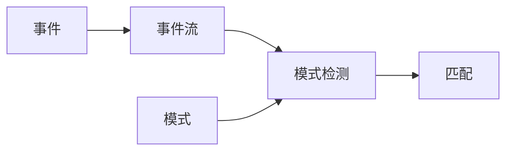

# Flink CEP原理与代码实例讲解

## 1. 背景介绍
### 1.1 什么是复杂事件处理(CEP)
复杂事件处理(Complex Event Processing, CEP)是一种技术，用于从多个事件源实时地分析数据流，以便识别有意义的事件或事件模式。CEP系统能够处理大量事件，检测复杂的事件模式，并在满足特定条件时触发相应的操作。

### 1.2 Flink CEP简介
Flink CEP是Apache Flink生态系统的一部分，提供了一套API和运行时，用于在Flink上进行复杂事件处理。Flink CEP允许用户定义事件模式，并在数据流中检测这些模式。当检测到匹配的事件序列时，Flink CEP可以触发预定义的操作。

### 1.3 Flink CEP的应用场景
Flink CEP可以应用于多种场景，例如：
- 实时欺诈检测：通过分析交易事件流来识别可疑的交易模式。
- 系统监控：通过分析日志事件流来检测系统异常或故障。
- 业务流程监控：通过分析业务事件流来跟踪和优化业务流程。

## 2. 核心概念与联系
### 2.1 事件(Event)
事件是CEP中的基本单位，代表发生的一个动作或状态更改。在Flink CEP中，事件通常表示为一个包含时间戳和属性的POJO(Plain Old Java Object)。

### 2.2 事件流(Event Stream)
事件流是一系列按时间顺序排列的事件。在Flink CEP中，事件流通常表示为一个DataStream，其中每个元素都是一个事件对象。

### 2.3 模式(Pattern)
模式定义了我们感兴趣的事件序列。在Flink CEP中，模式使用Pattern API来定义，包括事件的条件、顺序和时间约束等。

### 2.4 模式检测(Pattern Detection)
模式检测是在事件流中识别出匹配预定义模式的过程。Flink CEP使用非确定性有限自动机(NFA)算法来执行模式检测。

### 2.5 匹配(Match)
当事件序列满足模式定义的所有条件时，我们称之为一个匹配。Flink CEP会将每个匹配作为一个Map<String, List<Event>>输出，其中键是模式中定义的事件名称，值是匹配的事件列表。

### 2.6 核心概念关系图


## 3. 核心算法原理具体操作步骤
### 3.1 非确定性有限自动机(NFA)
Flink CEP使用非确定性有限自动机(Nondeterministic Finite Automaton, NFA)算法来执行事件模式检测。NFA由状态和转换组成，其中每个状态代表模式的一部分，转换表示事件之间的关系。

### 3.2 NFA构建
1. 为模式中的每个事件创建一个状态。
2. 根据事件之间的关系添加转换。
3. 标记模式的起始状态和最终状态。

### 3.3 事件处理
1. 对于每个到达的事件，从NFA的起始状态开始处理。
2. 检查事件是否满足当前状态的条件。如果满足，则沿着转换进入下一个状态；否则，丢弃该事件。
3. 如果到达最终状态，则输出一个匹配。
4. 继续处理下一个事件，直到事件流结束。

## 4. 数学模型和公式详细讲解举例说明
### 4.1 NFA形式化定义
一个非确定性有限自动机(NFA)可以表示为一个五元组：

$NFA = (Q, \Sigma, \delta, q_0, F)$

其中：
- $Q$是有限状态集合。
- $\Sigma$是有限输入字母表(在CEP中，即事件类型)。
- $\delta: Q \times \Sigma \rightarrow P(Q)$是转换函数，其中$P(Q)$表示$Q$的幂集。
- $q_0 \in Q$是初始状态。
- $F \subseteq Q$是最终状态集合。

### 4.2 状态转换示例
假设我们有一个模式："A事件后面跟着B事件"，可以表示为：

$\delta(q_0, A) = \{q_1\}$
$\delta(q_1, B) = \{q_2\}$

其中，$q_2$是最终状态。如果输入事件序列为"A, C, B"，则状态转换如下：

$q_0 \stackrel{A}{\rightarrow} q_1 \stackrel{C}{\rightarrow} q_1 \stackrel{B}{\rightarrow} q_2$

由于到达了最终状态$q_2$，因此输出一个匹配。

## 5. 项目实践：代码实例和详细解释说明
下面是一个使用Flink CEP检测"A事件后面跟着B事件"模式的代码示例：

```java
// 定义事件类
public static class Event {
    public String type;
    public long timestamp;
    ...
}

// 定义模式
Pattern<Event, ?> pattern = Pattern.<Event>begin("start")
    .where(new SimpleCondition<Event>() {
        @Override
        public boolean filter(Event event) {
            return event.type.equals("A");
        }
    })
    .next("end")
    .where(new SimpleCondition<Event>() {
        @Override
        public boolean filter(Event event) {
            return event.type.equals("B");
        }
    });

// 在数据流上应用模式
PatternStream<Event> patternStream = CEP.pattern(inputStream, pattern);

// 处理匹配结果
SingleOutputStreamOperator<String> result = patternStream.select(
    new PatternSelectFunction<Event, String>() {
        @Override
        public String select(Map<String, List<Event>> map) throws Exception {
            Event startEvent = map.get("start").get(0);
            Event endEvent = map.get("end").get(0);
            return "匹配到模式：" + startEvent + " -> " + endEvent;
        }
    }
);
```

代码解释：
1. 首先定义了事件类Event，包含事件类型和时间戳等属性。
2. 使用Pattern API定义了"A事件后面跟着B事件"的模式。
3. 在输入的DataStream上应用定义的模式，得到一个PatternStream。
4. 对PatternStream调用select方法，传入一个PatternSelectFunction，用于处理匹配到的事件序列，并将结果输出到结果流中。

## 6. 实际应用场景
Flink CEP可以应用于多种实际场景，例如：
### 6.1 实时欺诈检测
在金融领域，Flink CEP可以用于实时检测可疑的交易模式，如短时间内多次小额转账后进行一次大额转账，这可能意味着洗钱行为。通过定义相应的事件模式，Flink CEP可以实时识别这些可疑行为并触发警报。

### 6.2 系统监控
在IT运维中，Flink CEP可以用于实时监控系统日志，检测异常事件模式，如多个服务在短时间内频繁重启，可能意味着系统出现了故障。通过定义合适的事件模式，Flink CEP可以帮助运维人员及时发现并处理系统问题。

### 6.3 业务流程监控
在供应链管理中，Flink CEP可以用于实时监控订单履行过程，检测异常情况，如订单长时间未发货、货物运输过程中出现异常等。通过定义业务流程中的关键事件模式，Flink CEP可以帮助企业优化业务流程，提高效率。

## 7. 工具和资源推荐
### 7.1 官方文档
- Flink CEP官方文档：https://ci.apache.org/projects/flink/flink-docs-stable/dev/libs/cep.html
- Flink官方文档：https://flink.apache.org/docs/stable/

### 7.2 社区资源
- Flink官方社区：https://flink.apache.org/community.html
- Flink Meetup：https://www.meetup.com/topics/apache-flink/
- Flink Slack：https://flink.apache.org/community.html#slack

### 7.3 学习资源
- Flink CEP在线培训：https://training.ververica.com/
- Flink CEP视频教程：https://www.youtube.com/watch?v=eSXjdNpNDQs
- Flink CEP实战案例：https://github.com/streaming-with-flink/flink-cep-examples

## 8. 总结：未来发展趋势与挑战
### 8.1 未来发展趋势
- 与机器学习和人工智能技术结合，实现更智能的复杂事件处理。
- 支持更多的事件源和数据格式，如IoT设备数据、社交媒体数据等。
- 提供更友好的用户界面和可视化工具，降低使用门槛。

### 8.2 面临的挑战
- 事件模式的定义和优化仍然需要一定的专业知识和经验。
- 大规模事件流的实时处理对系统性能和稳定性提出了挑战。
- 隐私和安全问题需要得到重视和解决，特别是在处理敏感数据时。

## 9. 附录：常见问题与解答
### 9.1 Flink CEP与Flink SQL的区别是什么？
Flink CEP提供了一套专门用于复杂事件处理的API和运行时，侧重于事件模式的定义和检测。而Flink SQL是一种声明式的查询语言，用于处理流和批数据，侧重于数据的转换和聚合。两者可以结合使用，例如使用Flink SQL对CEP的输出结果进行进一步的分析。

### 9.2 Flink CEP支持哪些时间语义？
Flink CEP支持事件时间(Event Time)和处理时间(Processing Time)两种时间语义。事件时间指事件实际发生的时间，处理时间指事件被处理的时间。在定义事件模式时，可以根据需要选择合适的时间语义。

### 9.3 如何处理乱序事件？
在实际应用中，由于网络延迟等原因，事件到达的顺序可能与其发生的顺序不一致，这称为乱序事件。Flink CEP提供了几种策略来处理乱序事件，例如使用时间窗口(Time Window)来容忍一定程度的乱序，或者使用迟到事件(Late Event)处理机制来处理延迟到达的事件。

作者：禅与计算机程序设计艺术 / Zen and the Art of Computer Programming