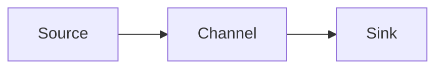

# Flume Channel原理与代码实例讲解

## 1. 背景介绍

### 1.1 大数据处理的挑战

在当今大数据时代,海量数据的实时采集、传输和处理是一个巨大的挑战。数据源的多样性、数据量的急剧增长以及对数据处理实时性的要求,都对传统的数据处理架构提出了新的挑战。

### 1.2 Flume的诞生

Apache Flume是一个分布式、可靠、高可用的海量日志采集、聚合和传输的系统。它可以将各种数据源(如日志、事件等)中的海量数据高效地收集并移动到集中的数据存储系统中,为后续的数据处理和分析提供了可靠的数据来源。

### 1.3 Flume的核心组件

Flume的核心是Agent,它是一个JVM进程,负责将数据从源头送至目的。一个Agent主要包含Source、Channel和Sink三个组件:

- Source:数据采集组件,负责从数据源采集数据,并将数据写入Channel
- Channel:中转储存组件,缓存Source写入的数据,供Sink消费
- Sink:数据传输组件,负责从Channel读取数据,并将数据写入到目标系统

其中,Channel作为连接Source和Sink的桥梁,在Flume的整个数据传输过程中扮演着至关重要的角色。

## 2. 核心概念与联系

### 2.1 Event

Event是Flume数据传输的基本单元。一个Event由可选的header和载有数据的byte array两部分组成。Event在Source、Channel、Sink中流转,贯穿整个数据传输过程。

### 2.2 Transaction

Flume的所有组件(Source、Channel、Sink)都必须在事务中进行Event的处理,来保证数据的完整可靠。Source负责开启事务并提交事务,而Sink负责在完成Event的处理后提交事务。

### 2.3 Source、Channel、Sink

Source、Channel和Sink是Flume的三大核心组件,它们协同工作,完成数据从源头到目的的可靠传输:



## 3. 核心算法原理具体操作步骤

### 3.1 Channel的工作原理

Channel是连接Source和Sink的数据缓冲区。Source将Event写入Channel,Sink从Channel读取Event。为保证数据传输的可靠性,Channel必须在事务中对Event进行处理。

Channel的主要工作流程如下:

1. Source开启事务,将Event写入Channel
2. Channel缓存Event,直到Sink消费
3. Sink开启事务,从Channel读取Event
4. Sink完成Event处理后,提交事务
5. Channel删除已被Sink消费的Event

### 3.2 常见的Channel实现

Flume提供了多种Channel实现,用于满足不同的数据传输需求:

- MemoryChannel:基于内存的Channel实现,速度快但可靠性较差
- FileChannel:基于磁盘文件的Channel实现,速度慢但可靠性高
- JDBC Channel:基于JDBC将Event存储在数据库中的Channel实现
- Spillable Memory Channel:带有内存和磁盘Overflow的Channel实现

## 4. 数学模型和公式详细讲解举例说明

### 4.1 Channel的吞吐量模型

我们可以用数学模型来描述Channel的吞吐量。假设单位时间内Source写入Event的速率为 $\lambda$,Sink消费Event的速率为 $\mu$,Channel的容量为 $N$。那么根据排队论,Channel的吞吐量 $T$ 可以表示为:

$$T = min(\lambda, \mu)$$

当 $\lambda < \mu$ 时,Channel的吞吐量由Source的写入速率决定;当 $\lambda > \mu$ 时,Channel的吞吐量由Sink的消费速率决定。

### 4.2 Channel的可靠性模型

我们用概率模型来描述Channel的可靠性。假设Channel的失败概率为 $p$,Source重传Event的概率为 $q$。根据概率论,Event被可靠传输的概率 $R$ 为:

$$R = 1 - p(1-q)$$

可见,增大Source的重传概率,可以提高Channel的传输可靠性。这也是Flume事务机制的重要作用。

## 5. 项目实践:代码实例和详细解释说明

下面我们通过一个简单的例子,演示如何使用Flume的MemoryChannel进行数据传输。

### 5.1 配置Flume Agent

首先,我们需要配置一个Flume Agent,指定Source、Channel和Sink:

```properties
# 定义Agent中的组件
a1.sources = s1
a1.channels = c1 
a1.sinks = k1

# 配置Source
a1.sources.s1.type = netcat
a1.sources.s1.bind = localhost
a1.sources.s1.port = 9999

# 配置Channel
a1.channels.c1.type = memory
a1.channels.c1.capacity = 1000
a1.channels.c1.transactionCapacity = 100

# 配置Sink
a1.sinks.k1.type = logger

# 连接组件
a1.sources.s1.channels = c1
a1.sinks.k1.channel = c1
```

这里我们使用了Netcat Source从指定端口读取数据,MemoryChannel作为数据缓冲区,Logger Sink将数据输出到控制台。

### 5.2 启动Flume Agent

使用以下命令启动Flume Agent:

```bash
$ bin/flume-ng agent -n a1 -c conf -f conf/example.conf -Dflume.root.logger=INFO,console
```

### 5.3 测试数据传输

启动Flume Agent后,我们就可以通过Telnet向指定端口发送数据,测试数据传输:

```bash
$ telnet localhost 9999
Trying 127.0.0.1...
Connected to localhost.
Escape character is '^]'.
Hello Flume!
OK
```

此时,我们可以在Flume Agent的控制台看到输出的Event内容:

```
Event: { headers:{} body: 48 65 6C 6C 6F 20 46 6C 75 6D 65 21 0D          Hello Flume!. }
```

这说明数据已经成功地通过MemoryChannel,从Source流向了Sink。

## 6. 实际应用场景

Flume广泛应用于海量数据的采集、聚合和传输,适用的场景包括但不限于:

- 日志收集:将分布式系统、Web服务器、应用服务器上的日志统一收集汇总
- 数据采集:采集各种传感器、监控系统的数据,为数据分析提供原始数据
- 数据搬运:将数据从一个存储系统高效地传输到另一个存储系统,如HDFS、HBase等

## 7. 工具和资源推荐

- [Flume User Guide](https://flume.apache.org/FlumeUserGuide.html):Flume官方用户指南,详细介绍了Flume的架构、配置和使用
- [Flume Docs](https://flume.apache.org/documentation.html):Flume官方文档,包括用户手册、开发者指南、Javadoc等
- [Flume Github Repository](https://github.com/apache/flume):Flume的Github仓库,可以了解Flume的源码实现
- [Flume Jira Issues](https://issues.apache.org/jira/projects/FLUME/):Flume的Jira问题跟踪,可以了解Flume的问题和改进

## 8. 总结:未来发展趋势与挑战

Flume作为一个成熟的分布式数据收集框架,已经在业界得到了广泛的应用。未来Flume将在以下方面持续发展和改进:

- 多样化的数据源支持:支持采集更多类型的数据源,如社交数据、IoT数据等
- 流式数据处理:与流式计算框架(如Spark Streaming)深度集成,支持数据的实时处理
- 智能化的Channel设计:根据数据特征和传输需求,自动选择和调整最优的Channel实现
- Cloud就绪:提供在云环境下的部署和管理方案,支持多租户和弹性伸缩

同时,Flume也面临着一些挑战:

- 全新的数据采集需求:如何适应5G、AI时代全新的数据采集需求
- 海量数据的可扩展性:如何设计新的架构,进一步提升Flume的可扩展性,支持更大规模的数据收集
- 数据安全与隐私保护:如何加强Flume的安全机制,保护敏感数据在传输过程中的安全和隐私

## 9. 附录:常见问题与解答

### 9.1 Flume如何保证Event在传输过程中不丢失?

Flume通过Channel和事务机制保证Event的可靠传输:

- Channel会持久化缓存Event,直到Sink完成对Event的处理
- Source和Sink在事务中处理Event,失败时事务回滚,Event重传

### 9.2 Flume的性能瓶颈在哪里?如何优化?

Flume的性能主要取决于Channel的实现和配置:

- 根据数据量和可靠性需求,选择合适的Channel实现(Memory/File/JDBC等)
- 调整Channel的参数,如batchSize、capacity等,充分利用系统资源
- 必要时可以引入多级Channel,或使用Spillable Memory Channel等机制进行优化

### 9.3 Flume如何实现断点续传?

Flume可以通过以下机制实现断点续传:

- Sink在处理Event后,将Event的位置或ID记录在外部存储(如HDFS、ZooKeeper等)
- Flume重启后,Sink可以从记录的位置继续消费Channel中的Event,从而恢复数据传输

### 9.4 Flume和Kafka有何区别?应该如何选择?

Flume和Kafka都可以用于数据的收集和传输,但有所侧重:

- Flume侧重于多样化的数据源采集,以及可靠的数据传输。适合日志收集、数据采集等场景
- Kafka侧重于高吞吐、低延迟的数据流处理。适合实时数据处理、数据集成等场景

可以根据数据源的类型、数据处理的实时性需求等因素,选择合适的组件。有时也可以将二者结合使用。

作者：禅与计算机程序设计艺术 / Zen and the Art of Computer Programming