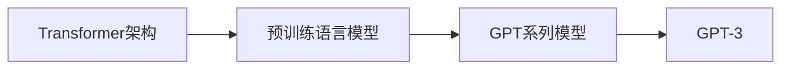

# GPT-3：AIGC领域的里程碑

## 1. 背景介绍
### 1.1 人工智能的发展历程
#### 1.1.1 早期人工智能的探索
#### 1.1.2 机器学习的兴起
#### 1.1.3 深度学习的突破

### 1.2 自然语言处理的演进
#### 1.2.1 基于规则的自然语言处理
#### 1.2.2 统计学习方法的应用
#### 1.2.3 神经网络在NLP中的应用

### 1.3 AIGC的概念与发展
#### 1.3.1 AIGC的定义与内涵
#### 1.3.2 AIGC的发展历程
#### 1.3.3 AIGC的应用前景

## 2. 核心概念与联系
### 2.1 Transformer架构
#### 2.1.1 Transformer的提出背景
#### 2.1.2 Transformer的核心思想
#### 2.1.3 Transformer的结构与原理

### 2.2 预训练语言模型
#### 2.2.1 预训练的概念与意义
#### 2.2.2 BERT模型的创新与影响
#### 2.2.3 预训练语言模型的发展趋势

### 2.3 GPT系列模型
#### 2.3.1 GPT模型的演进历程
#### 2.3.2 GPT-2的改进与提升
#### 2.3.3 GPT-3的规模与能力



## 3. 核心算法原理具体操作步骤
### 3.1 GPT-3的训练过程
#### 3.1.1 数据准备与预处理
#### 3.1.2 模型结构设计
#### 3.1.3 训练参数设置

### 3.2 GPT-3的生成过程
#### 3.2.1 输入编码与表示
#### 3.2.2 解码器的工作原理
#### 3.2.3 生成策略与控制

### 3.3 GPT-3的微调与应用
#### 3.3.1 微调的概念与方法
#### 3.3.2 GPT-3在不同任务上的应用
#### 3.3.3 GPT-3的局限性与改进方向

## 4. 数学模型和公式详细讲解举例说明
### 4.1 Transformer的数学原理
#### 4.1.1 自注意力机制的数学表达
$$Attention(Q,K,V) = softmax(\frac{QK^T}{\sqrt{d_k}})V$$
其中，$Q$、$K$、$V$ 分别表示查询、键、值向量，$d_k$ 为键向量的维度。
#### 4.1.2 多头注意力的数学表达
$$MultiHead(Q,K,V) = Concat(head_1,...,head_h)W^O$$
$$head_i = Attention(QW_i^Q, KW_i^K, VW_i^V)$$
其中，$W_i^Q$、$W_i^K$、$W_i^V$ 为第 $i$ 个注意力头的权重矩阵，$W^O$ 为输出的线性变换矩阵。
#### 4.1.3 位置编码的数学表达
$$PE_{(pos,2i)} = sin(pos/10000^{2i/d_{model}})$$
$$PE_{(pos,2i+1)} = cos(pos/10000^{2i/d_{model}})$$
其中，$pos$ 为位置索引，$i$ 为维度索引，$d_{model}$ 为模型的维度。

### 4.2 GPT-3的损失函数与优化
#### 4.2.1 语言模型的概率表达
$$P(w_1, ..., w_n) = \prod_{i=1}^n P(w_i|w_1, ..., w_{i-1})$$
其中，$w_1, ..., w_n$ 为一个长度为 $n$ 的单词序列。
#### 4.2.2 交叉熵损失函数
$$L = -\sum_{i=1}^n log P(w_i|w_1, ..., w_{i-1})$$
其中，$L$ 为交叉熵损失函数。
#### 4.2.3 AdamW优化算法
$$m_t = \beta_1 m_{t-1} + (1 - \beta_1) g_t$$
$$v_t = \beta_2 v_{t-1} + (1 - \beta_2) g_t^2$$
$$\hat{m}_t = \frac{m_t}{1 - \beta_1^t}$$
$$\hat{v}_t = \frac{v_t}{1 - \beta_2^t}$$
$$\theta_t = \theta_{t-1} - \frac{\eta}{\sqrt{\hat{v}_t} + \epsilon} (\hat{m}_t + \lambda \theta_{t-1})$$
其中，$m_t$、$v_t$ 分别为一阶矩估计和二阶矩估计，$\hat{m}_t$、$\hat{v}_t$ 为校正后的估计值，$\theta_t$ 为模型参数，$\eta$ 为学习率，$\beta_1$、$\beta_2$ 为衰减率，$\lambda$ 为权重衰减系数，$\epsilon$ 为平滑项。

## 5. 项目实践：代码实例和详细解释说明
### 5.1 使用GPT-3进行文本生成
```python
import openai

openai.api_key = "your_api_key"

prompt = "Once upon a time"

response = openai.Completion.create(
    engine="davinci",
    prompt=prompt,
    max_tokens=100,
    n=1,
    stop=None,
    temperature=0.7,
)

generated_text = response.choices[0].text.strip()
print(generated_text)
```
以上代码使用OpenAI的API接口，通过提供一个prompt（"Once upon a time"），利用GPT-3的davinci引擎生成后续的文本。其中，`max_tokens`参数控制生成文本的最大长度，`n`参数指定生成的文本数量，`temperature`参数控制生成文本的创造性和多样性。

### 5.2 使用GPT-3进行文本分类
```python
import openai

openai.api_key = "your_api_key"

prompt = "Classify the sentiment of the following text:\nI love this movie! The acting was great and the plot was engaging.\nSentiment:"

response = openai.Completion.create(
    engine="davinci",
    prompt=prompt,
    max_tokens=1,
    n=1,
    stop=None,
    temperature=0,
)

sentiment = response.choices[0].text.strip()
print(sentiment)
```
以上代码展示了如何使用GPT-3进行文本分类任务。通过构建一个包含文本和任务说明的prompt，GPT-3可以根据上下文理解任务要求，并给出相应的分类结果（正面情感或负面情感）。

### 5.3 使用GPT-3进行问答
```python
import openai

openai.api_key = "your_api_key"

context = "Albert Einstein was a German-born theoretical physicist who developed the theory of relativity, one of the two pillars of modern physics. His work is also known for its influence on the philosophy of science."

question = "What is Albert Einstein known for?"

prompt = f"Context: {context}\nQuestion: {question}\nAnswer:"

response = openai.Completion.create(
    engine="davinci",
    prompt=prompt,
    max_tokens=50,
    n=1,
    stop=None,
    temperature=0,
)

answer = response.choices[0].text.strip()
print(answer)
```
以上代码演示了如何使用GPT-3进行问答任务。通过提供一段背景信息（context）和一个问题（question），GPT-3可以根据上下文理解问题，并给出相应的答案。这展示了GPT-3强大的语言理解和知识提取能力。

## 6. 实际应用场景
### 6.1 智能写作助手
GPT-3可以作为一个智能写作助手，为用户提供写作建议、续写文章、改进文章风格等功能，提高写作效率和质量。

### 6.2 智能客服
GPT-3可以应用于智能客服系统，通过理解用户的问题并给出相应的回答，提供24小时不间断的客户服务，减轻人工客服的工作量。

### 6.3 个性化推荐
GPT-3可以根据用户的兴趣爱好、历史行为等信息，生成个性化的推荐内容，如新闻文章、电影、音乐等，提升用户的使用体验。

### 6.4 智能教育
GPT-3可以应用于智能教育领域，根据学生的学习进度和掌握程度，生成个性化的学习内容和练习题，提供智能化的教学辅导。

### 6.5 创意生成
GPT-3可以辅助创意工作者进行灵感生成、故事创作、广告文案撰写等任务，激发创意思维，提高创作效率。

## 7. 工具和资源推荐
### 7.1 OpenAI API
OpenAI提供了GPT-3的API接口，允许开发者在自己的应用中集成GPT-3的能力，实现各种智能化功能。

### 7.2 Hugging Face Transformers
Hugging Face的Transformers库提供了多种预训练语言模型，包括GPT系列模型，方便研究者和开发者进行fine-tuning和应用开发。

### 7.3 GPT-3 Playground
OpenAI提供了GPT-3 Playground，一个交互式的Web界面，允许用户通过提供prompt来探索GPT-3的能力，并观察生成的结果。

### 7.4 GPT-3 论文与博客
OpenAI发布的GPT-3论文《Language Models are Few-Shot Learners》详细介绍了GPT-3的原理和性能。同时，OpenAI的博客也提供了许多GPT-3的应用案例和思考。

## 8. 总结：未来发展趋势与挑战
### 8.1 模型规模的持续扩大
未来预训练语言模型的规模将持续扩大，更大规模的模型有望带来更强大的语言理解和生成能力，推动AIGC的发展。

### 8.2 多模态学习的融合
将语言模型与视觉、语音等其他模态的信息进行融合学习，有望实现更全面、更自然的人机交互和智能化应用。

### 8.3 数据和计算资源的挑战
训练大规模语言模型需要海量的数据和计算资源，如何高效、经济地获取和利用这些资源是一个重要挑战。

### 8.4 模型的可解释性和可控性
如何提高大规模语言模型的可解释性，让人们更好地理解其决策过程，以及如何实现对模型生成内容的精细控制，是亟待解决的问题。

### 8.5 伦理和安全问题
大规模语言模型可能被用于生成虚假信息、侵犯隐私等不当用途，需要研究相应的伦理和安全问题，建立规范和防范机制。

## 9. 附录：常见问题与解答
### 9.1 GPT-3与GPT-2相比有哪些改进？
GPT-3在模型规模、训练数据量、任务适应能力等方面都有显著提升。GPT-3拥有1750亿个参数，是GPT-2的100倍，能够在更广泛的任务上表现出色。

### 9.2 GPT-3能否理解语言的真正含义？
GPT-3通过海量数据训练，能够捕捉语言的统计模式和关联性，在一定程度上表现出对语言的理解能力。但它是否具有真正的语义理解，仍有待进一步研究。

### 9.3 GPT-3是否会替代人类的写作和创作？
GPT-3在文本生成方面表现出色，但它更多是一种辅助工具，而非替代人类创作。人类的创造力、情感、审美等方面是AI难以完全模拟的。

### 9.4 如何防止GPT-3被恶意使用？
可以从技术和政策两个层面入手，如研究内容过滤和识别技术，建立使用规范和惩罚机制，加强用户教育和伦理意识等，共同构建一个负责任、有益社会的AIGC生态。

作者：禅与计算机程序设计艺术 / Zen and the Art of Computer Programming