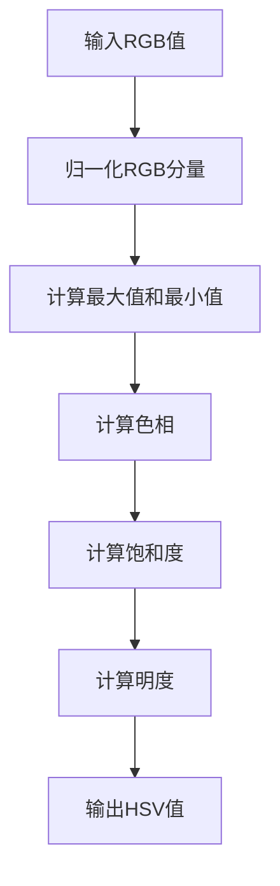
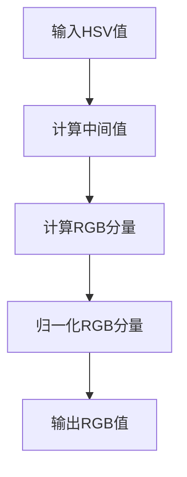

# Hue原理与代码实例讲解

## 1.背景介绍

在现代计算机视觉和图像处理领域，颜色空间的转换和管理是一个至关重要的课题。Hue（色相）作为颜色空间中的一个重要分量，广泛应用于图像处理、计算机视觉、数据可视化等领域。理解和掌握Hue的原理和应用，不仅有助于提升图像处理的效果，还能为开发者提供更多的技术手段来解决实际问题。

## 2.核心概念与联系

### 2.1 颜色空间

颜色空间是颜色的数学表示方法，常见的颜色空间包括RGB、HSV、HSL、Lab等。每种颜色空间都有其特定的应用场景和优缺点。

### 2.2 RGB颜色空间

RGB颜色空间是最常见的颜色表示方法，使用红（Red）、绿（Green）、蓝（Blue）三个分量来表示颜色。RGB颜色空间的优点是直观，但在某些应用中不够直观和灵活。

### 2.3 HSV颜色空间

HSV颜色空间使用色相（Hue）、饱和度（Saturation）和明度（Value）三个分量来表示颜色。HSV颜色空间更符合人类的视觉感知，特别适用于图像处理和计算机视觉。

### 2.4 Hue（色相）

Hue表示颜色的基本属性，即颜色的种类，如红色、绿色、蓝色等。Hue通常用角度表示，范围为0到360度。

### 2.5 颜色空间转换

颜色空间转换是将一种颜色空间的表示转换为另一种颜色空间的表示。常见的转换包括RGB到HSV、HSV到RGB等。

## 3.核心算法原理具体操作步骤

### 3.1 RGB到HSV转换

RGB到HSV的转换是一个常见的操作，具体步骤如下：

1. 归一化RGB分量，使其范围在0到1之间。
2. 计算最大值和最小值。
3. 计算色相（Hue）。
4. 计算饱和度（Saturation）。
5. 计算明度（Value）。

以下是RGB到HSV转换的伪代码：



### 3.2 HSV到RGB转换

HSV到RGB的转换步骤如下：

1. 根据色相（Hue）计算中间值。
2. 根据饱和度（Saturation）和明度（Value）计算RGB分量。
3. 归一化RGB分量，使其范围在0到255之间。

以下是HSV到RGB转换的伪代码：



## 4.数学模型和公式详细讲解举例说明

### 4.1 RGB到HSV转换公式

设 $R, G, B$ 为归一化后的RGB分量，$C_{max}$ 和 $C_{min}$ 分别为最大值和最小值，$V = C_{max}$，$C = C_{max} - C_{min}$。

- 色相（Hue）计算公式：
  $$
  H = \begin{cases} 
  0 & \text{if } C = 0 \\
  60 \times \left( \frac{G - B}{C} \mod 6 \right) & \text{if } C_{max} = R \\
  60 \times \left( \frac{B - R}{C} + 2 \right) & \text{if } C_{max} = G \\
  60 \times \left( \frac{R - G}{C} + 4 \right) & \text{if } C_{max} = B 
  \end{cases}
  $$

- 饱和度（Saturation）计算公式：
  $$
  S = \begin{cases} 
  0 & \text{if } V = 0 \\
  \frac{C}{V} & \text{if } V \neq 0 
  \end{cases}
  $$

- 明度（Value）计算公式：
  $$
  V = C_{max}
  $$

### 4.2 HSV到RGB转换公式

设 $H, S, V$ 为HSV分量，$C = V \times S$，$X = C \times (1 - |(H / 60) \mod 2 - 1|)$，$m = V - C$。

- RGB分量计算公式：
  $$
  (R', G', B') = \begin{cases} 
  (C, X, 0) & \text{if } 0 \leq H < 60 \\
  (X, C, 0) & \text{if } 60 \leq H < 120 \\
  (0, C, X) & \text{if } 120 \leq H < 180 \\
  (0, X, C) & \text{if } 180 \leq H < 240 \\
  (X, 0, C) & \text{if } 240 \leq H < 300 \\
  (C, 0, X) & \text{if } 300 \leq H < 360 
  \end{cases}
  $$

- 最终RGB分量：
  $$
  (R, G, B) = ((R' + m) \times 255, (G' + m) \times 255, (B' + m) \times 255)
  $$

## 5.项目实践：代码实例和详细解释说明

### 5.1 RGB到HSV转换代码实例

以下是Python实现的RGB到HSV转换代码：

```python
def rgb_to_hsv(r, g, b):
    r, g, b = r / 255.0, g / 255.0, b / 255.0
    cmax = max(r, g, b)
    cmin = min(r, g, b)
    delta = cmax - cmin

    if delta == 0:
        h = 0
    elif cmax == r:
        h = (60 * ((g - b) / delta) + 360) % 360
    elif cmax == g:
        h = (60 * ((b - r) / delta) + 120) % 360
    elif cmax == b:
        h = (60 * ((r - g) / delta) + 240) % 360

    s = 0 if cmax == 0 else (delta / cmax)
    v = cmax

    return h, s, v

# 示例
r, g, b = 255, 0, 0
h, s, v = rgb_to_hsv(r, g, b)
print(f"RGB({r}, {g}, {b}) -> HSV({h:.2f}, {s:.2f}, {v:.2f})")
```

### 5.2 HSV到RGB转换代码实例

以下是Python实现的HSV到RGB转换代码：

```python
def hsv_to_rgb(h, s, v):
    c = v * s
    x = c * (1 - abs((h / 60) % 2 - 1))
    m = v - c

    if 0 <= h < 60:
        r, g, b = c, x, 0
    elif 60 <= h < 120:
        r, g, b = x, c, 0
    elif 120 <= h < 180:
        r, g, b = 0, c, x
    elif 180 <= h < 240:
        r, g, b = 0, x, c
    elif 240 <= h < 300:
        r, g, b = x, 0, c
    elif 300 <= h < 360:
        r, g, b = c, 0, x

    r, g, b = (r + m) * 255, (g + m) * 255, (b + m) * 255
    return int(r), int(g), int(b)

# 示例
h, s, v = 0, 1, 1
r, g, b = hsv_to_rgb(h, s, v)
print(f"HSV({h}, {s}, {v}) -> RGB({r}, {g}, {b})")
```

## 6.实际应用场景

### 6.1 图像处理

在图像处理领域，Hue的应用非常广泛。例如，通过调整图像的Hue，可以实现图像的色调变换，从而达到特定的视觉效果。

### 6.2 计算机视觉

在计算机视觉中，Hue常用于目标检测和跟踪。例如，通过分析目标的Hue分量，可以实现对特定颜色目标的检测和跟踪。

### 6.3 数据可视化

在数据可视化中，Hue可以用来表示不同的数据类别。例如，在热力图中，不同的Hue可以表示不同的温度范围，从而使数据的可视化效果更加直观。

## 7.工具和资源推荐

### 7.1 图像处理库

- OpenCV：一个开源的计算机视觉库，支持多种颜色空间转换。
- PIL/Pillow：一个Python图像处理库，支持多种图像操作和颜色空间转换。

### 7.2 在线工具

- ColorHexa：一个在线颜色工具，支持颜色空间转换和颜色分析。
- Adobe Color：一个在线颜色设计工具，支持颜色空间转换和配色方案设计。

### 7.3 参考文献

- 《计算机视觉：算法与应用》：一本经典的计算机视觉教材，详细介绍了颜色空间和图像处理的相关知识。
- 《数字图像处理》：一本经典的图像处理教材，详细介绍了颜色空间转换和图像处理的相关算法。

## 8.总结：未来发展趋势与挑战

随着计算机视觉和图像处理技术的不断发展，Hue的应用将会越来越广泛。然而，如何在复杂场景中准确地提取和利用Hue信息，仍然是一个具有挑战性的问题。未来，随着深度学习和人工智能技术的不断进步，基于Hue的图像处理和计算机视觉技术将会有更广阔的发展前景。

## 9.附录：常见问题与解答

### 9.1 为什么要使用HSV颜色空间？

HSV颜色空间更符合人类的视觉感知，特别适用于图像处理和计算机视觉。

### 9.2 如何选择合适的颜色空间？

选择颜色空间取决于具体的应用场景。例如，在图像处理和计算机视觉中，HSV颜色空间通常比RGB颜色空间更适用。

### 9.3 如何提高颜色空间转换的效率？

可以通过优化算法和使用高效的计算库（如OpenCV）来提高颜色空间转换的效率。

### 9.4 颜色空间转换是否会导致颜色失真？

颜色空间转换可能会导致一定的颜色失真，特别是在极端情况下。因此，在实际应用中，需要根据具体情况选择合适的颜色空间和转换方法。

### 9.5 如何处理颜色空间转换中的边界情况？

在颜色空间转换中，需要特别注意边界情况的处理。例如，在RGB到HSV转换中，需要处理最大值和最小值相等的情况。

---

作者：禅与计算机程序设计艺术 / Zen and the Art of Computer Programming