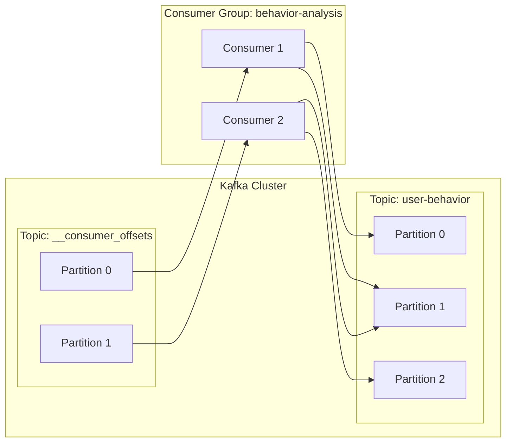

# Kafka Offset原理与代码实例讲解

## 1. 背景介绍

### 1.1 Kafka的发展历程
Kafka最初由LinkedIn公司开发,用作LinkedIn的活动流和运营数据处理管道的基础。2011年初,Kafka成为Apache孵化器项目。2012年10月,Kafka成为Apache顶级项目。目前Kafka已经成为大数据领域的标准消息中间件。

### 1.2 Kafka在大数据领域的应用
Kafka凭借其高吞吐、低延迟、高容错等特性,在大数据领域得到了广泛应用。主要应用场景包括:
- 日志收集:一个公司可以用Kafka收集各种服务的log,通过Kafka以统一接口服务的方式开放给各种consumer
- 消息系统:解耦生产者和消费者、缓存消息等
- 用户活动跟踪:Kafka经常被用来记录web用户或者app用户的各种活动
- 运营指标:Kafka也经常用来记录运营监控数据

### 1.3 Offset在Kafka中的重要性
在Kafka中,Offset是消息的唯一标识,它决定了消费者能够消费到哪些消息。理解并掌握Offset的原理和使用,对于开发高质量的Kafka应用至关重要。本文将深入探讨Kafka Offset的原理,并给出代码实例加以说明。

## 2. 核心概念与联系

### 2.1 Offset的定义
Offset是Kafka中表示消息位置的一个元数据。它是一个单调递增的整数,在一个Partition内唯一。消息在被追加到Partition时,会分配一个Offset值。

### 2.2 Offset、Consumer、Partition之间的关系
每个Consumer Group保存自己的Offset信息,这样不同的Consumer Group对同一个Topic的消费就可以相互独立,互不影响。Offset信息保存在一个特殊的Topic中(`__consumer_offsets`),并且每个Consumer Group在其中都有一个对应的Partition。

下面是Offset、Consumer、Partition之间关系的示意图:



### 2.3 Offset的类型
Kafka有两种Offset:
- Current Offset:当前消费到的位置,随着消息的消费而不断更新
- Committed Offset:Consumer消费后提交的位置,表示Consumer已经成功消费的消息位置

## 3. 核心算法原理具体操作步骤

### 3.1 Offset的存储
Kafka使用一个内部Topic(`__consumer_offsets`)来存储Consumer Group的Offset信息。这个Topic默认有50个Partition,每个Partition负责存储部分Consumer Group的Offset信息。

Kafka使用如下算法来决定一个Consumer Group的Offset信息存储在哪个Partition上:
```
partition = Math.abs(groupId.hashCode()) % numPartitions
```
其中,`groupId`是Consumer Group的唯一标识,`numPartitions`是`__consumer_offsets`的Partition数量。

### 3.2 Offset的提交
Consumer在消费消息后,需要定期地向Kafka提交自己的Offset。提交Offset有两种方式:
1. 自动提交:设置`enable.auto.commit=true`,Kafka会定期自动提交Offset
2. 手动提交:设置`enable.auto.commit=false`,应用代码中显式调用`commitSync()`或`commitAsync()`来提交Offset

### 3.3 Offset的获取
Consumer在启动时,需要先获取上次消费到的Offset,然后从这个位置开始继续消费。获取Offset的步骤如下:
1. 根据Consumer Group的`groupId`计算出Offset信息在`__consumer_offsets`的哪个Partition上
2. 从该Partition读取Offset信息
3. 如果没有Offset信息(比如新的Consumer Group),则根据`auto.offset.reset`的配置决定从何处开始消费

## 4. 数学模型和公式详细讲解举例说明

### 4.1 Offset的数学模型
我们可以用一个二元组 $(p, o)$ 来表示一个Offset,其中 $p$ 表示Partition的编号,$o$ 表示这个Partition上的Offset值。

例如,$(0, 100)$ 表示Partition 0上的Offset 100的位置。

### 4.2 Offset的计算公式
假设我们有一个Consumer Group,其`groupId`的哈希值为 $h$,`__consumer_offsets`有 $n$ 个Partition,则这个Consumer Group的Offset信息将存储在第 $p$ 个Partition上,计算公式为:

$$
p = |h| \bmod n
$$

其中,$|h|$ 表示 $h$ 的绝对值,$\bmod$ 表示取模运算。

例如,假设`groupId`的哈希值为 $-125$,`__consumer_offsets`有 $50$ 个Partition,则 $|-125| \bmod 50 = 25$,即这个Consumer Group的Offset信息将存储在第25个Partition上。

## 5. 项目实践:代码实例和详细解释说明

下面我们通过一个简单的Java代码实例来说明如何使用Kafka的Offset。

### 5.1 生产者代码
```java
public class KafkaProducerExample {
    public static void main(String[] args) {
        Properties props = new Properties();
        props.put("bootstrap.servers", "localhost:9092");
        props.put("key.serializer", "org.apache.kafka.common.serialization.StringSerializer");
        props.put("value.serializer", "org.apache.kafka.common.serialization.StringSerializer");
        
        Producer<String, String> producer = new KafkaProducer<>(props);
        
        for (int i = 0; i < 100; i++) {
            producer.send(new ProducerRecord<>("my-topic", Integer.toString(i), "Message: " + i));
        }
        
        producer.close();
    }
}
```
这段代码创建了一个Kafka生产者,并向名为"my-topic"的Topic发送了100条消息。

### 5.2 消费者代码
```java
public class KafkaConsumerExample {
    public static void main(String[] args) {
        Properties props = new Properties();
        props.put("bootstrap.servers", "localhost:9092");
        props.put("group.id", "test-group");
        props.put("enable.auto.commit", "true");
        props.put("auto.commit.interval.ms", "1000");
        props.put("key.deserializer", "org.apache.kafka.common.serialization.StringDeserializer");
        props.put("value.deserializer", "org.apache.kafka.common.serialization.StringDeserializer");
        
        KafkaConsumer<String, String> consumer = new KafkaConsumer<>(props);
        consumer.subscribe(Arrays.asList("my-topic"));
        
        while (true) {
            ConsumerRecords<String, String> records = consumer.poll(Duration.ofMillis(100));
            for (ConsumerRecord<String, String> record : records) {
                System.out.printf("Offset = %d, Key = %s, Value = %s%n", record.offset(), record.key(), record.value());
            }
        }
    }
}
```
这段代码创建了一个Kafka消费者,订阅了"my-topic"这个Topic。它设置了`enable.auto.commit=true`,这意味着Kafka将自动定期提交Offset。在消费消息时,我们打印出了每条消息的Offset、Key和Value。

## 6. 实际应用场景

Kafka的Offset在实际应用中有多种用途,下面列举几个常见的场景:

### 6.1 消息重复消费
在某些场景下,我们可能需要重复消费某些消息。这可以通过将Consumer的Offset重置到较早的位置来实现。例如,我们可以将Offset重置到0,这样Consumer就会从头开始消费所有的消息。

### 6.2 消费者负载均衡
在一个Consumer Group中,每个Consumer实例负责消费一部分Partition。当有新的Consumer实例加入或离开时,Kafka会自动进行负载均衡,调整每个Consumer实例负责的Partition。这个过程依赖于Offset,Kafka需要知道每个Consumer实例当前消费到了哪个位置,才能正确地进行分配。

### 6.3 消费进度监控
我们可以通过监控Consumer Group的Offset来了解消费的进度。如果Offset长时间没有更新,可能意味着消费出现了问题。我们可以开发监控工具,定期检查Offset的更新情况,及时发现和报警消费异常。

## 7. 工具和资源推荐

### 7.1 Kafka官方文档
Kafka官方文档提供了Kafka各个方面的详细说明,包括Offset的原理和使用。强烈建议仔细阅读官方文档。

官方文档链接:https://kafka.apache.org/documentation/

### 7.2 Kafka Tool
Kafka Tool是一个Kafka的GUI管理工具,提供了对Offset的查看和管理功能。通过Kafka Tool,我们可以方便地查看每个Consumer Group的Offset信息,也可以手动修改Offset。

Kafka Tool官网:https://www.kafkatool.com/

### 7.3 Kafka Offset Monitor
Kafka Offset Monitor是LinkedIn开源的一个Kafka监控工具,主要用于监控Consumer Group的Offset情况。它提供了Web界面,可以清晰地展示每个Consumer Group的消费进度。

Kafka Offset Monitor GitHub:https://github.com/quantifind/KafkaOffsetMonitor

## 8. 总结:未来发展趋势与挑战

### 8.1 精细化的Offset管理
目前Kafka的Offset管理还比较粗放,每个Consumer Group只能设置一个Offset。未来Kafka可能会提供更精细化的Offset管理,允许为每个Partition设置独立的Offset,这将给予用户更灵活的消费控制。

### 8.2 Offset的持久化
目前Kafka的Offset信息是存储在内部Topic中的,如果这个Topic出现问题,可能会导致Offset信息的丢失。未来Kafka可能会提供Offset的外部持久化机制,例如将Offset存储到外部的数据库中,以提高Offset的可靠性。

### 8.3 Offset的自动管理
目前用户需要自己管理Offset,包括何时提交Offset,从哪个Offset开始消费等。这对用户来说是一个负担,也容易出错。未来Kafka可能会提供更智能的Offset自动管理机制,根据消费速度、消息量等因素自动调整Offset,减轻用户的管理负担。

## 9. 附录:常见问题与解答

### 9.1 Offset是如何保存的?
Offset信息保存在一个特殊的Topic中(`__consumer_offsets`),每个Consumer Group在其中都有一个对应的Partition。

### 9.2 如何手动设置Offset?
可以通过Kafka提供的`seek()`方法来手动设置Offset。例如:
```java
consumer.seek(topicPartition, 1000);
```
这将Consumer的Offset设置到Partition的1000位置。

### 9.3 Offset丢失会有什么影响?
如果Offset信息丢失,Consumer将无法知道上次消费到哪里,这可能导致消息的重复消费或者跳过消费。因此保护Offset信息非常重要。

### 9.4 如何选择Offset的提交方式?
自动提交Offset简单方便,但可能会导致消息的重复消费。手动提交Offset可以精确控制提交时机,但需要更多的代码编写。需要根据具体的业务需求来选择适合的提交方式。

---
作者:禅与计算机程序设计艺术 / Zen and the Art of Computer Programming