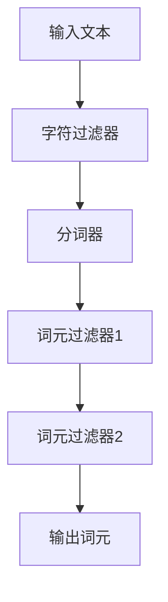

# Lucene高级特性：自定义分析器与过滤器

## 1.背景介绍

Apache Lucene 是一个高性能、全功能的文本搜索引擎库。它被广泛应用于各种搜索应用中，如企业搜索、网站搜索和大数据分析。Lucene 的核心功能之一是其强大的分析器和过滤器机制，这使得它能够处理和索引各种复杂的文本数据。然而，默认的分析器和过滤器并不能满足所有应用场景的需求，因此自定义分析器和过滤器成为了高级用户的重要工具。

## 2.核心概念与联系

### 2.1 分析器（Analyzer）

分析器是 Lucene 中用于将文本分解为词元（tokens）的组件。一个典型的分析器包括以下几个部分：

- **字符过滤器（CharFilter）**：用于预处理输入文本，例如去除 HTML 标签。
- **分词器（Tokenizer）**：将文本分解为基本的词元。
- **词元过滤器（TokenFilter）**：对分词器生成的词元进行进一步处理，如去除停用词、词干提取等。

### 2.2 过滤器（Filter）

过滤器是分析器的一部分，主要用于对词元进行进一步处理。常见的过滤器包括：

- **停用词过滤器（StopFilter）**：去除常见但无意义的词，如“的”、“是”等。
- **词干过滤器（StemFilter）**：将词元还原为词干形式，如将“running”还原为“run”。

### 2.3 分析器与过滤器的联系

分析器和过滤器是紧密联系的。分析器通过一系列的过滤器来处理文本数据，从而生成适合索引和搜索的词元。自定义分析器和过滤器可以帮助我们更好地处理特定领域的文本数据，提高搜索的准确性和效率。

## 3.核心算法原理具体操作步骤

### 3.1 自定义分析器的基本步骤

1. **定义字符过滤器**：如果需要预处理输入文本，可以定义自定义的字符过滤器。
2. **定义分词器**：选择合适的分词器，或者自定义分词器。
3. **定义词元过滤器**：根据需求定义一系列词元过滤器。
4. **组合分析器**：将字符过滤器、分词器和词元过滤器组合成一个完整的分析器。

### 3.2 自定义过滤器的基本步骤

1. **继承 TokenFilter 类**：创建一个新的过滤器类，继承自 TokenFilter。
2. **实现过滤逻辑**：在新类中实现具体的过滤逻辑。
3. **注册过滤器**：将自定义过滤器注册到分析器中。

### 3.3 Mermaid 流程图



## 4.数学模型和公式详细讲解举例说明

### 4.1 词频-逆文档频率（TF-IDF）

TF-IDF 是一种常用的文本特征提取方法，用于衡量一个词在文档中的重要性。其公式如下：

$$
\text{TF-IDF}(t, d) = \text{TF}(t, d) \times \text{IDF}(t)
$$

其中，$\text{TF}(t, d)$ 表示词 $t$ 在文档 $d$ 中出现的频率，$\text{IDF}(t)$ 表示词 $t$ 的逆文档频率，计算公式为：

$$
\text{IDF}(t) = \log \frac{N}{\text{DF}(t)}
$$

$N$ 表示文档总数，$\text{DF}(t)$ 表示包含词 $t$ 的文档数。

### 4.2 余弦相似度（Cosine Similarity）

余弦相似度用于衡量两个向量的相似度，其公式为：

$$
\text{cosine\_similarity}(A, B) = \frac{A \cdot B}{\|A\| \|B\|}
$$

其中，$A$ 和 $B$ 是两个向量，$\cdot$ 表示向量点积，$\|\|$ 表示向量的模。

### 4.3 举例说明

假设我们有两个文档 $d1$ 和 $d2$，它们的词频向量分别为 $A = [1, 2, 3]$ 和 $B = [4, 5, 6]$。我们可以计算它们的余弦相似度：

$$
A \cdot B = 1 \times 4 + 2 \times 5 + 3 \times 6 = 32
$$

$$
\|A\| = \sqrt{1^2 + 2^2 + 3^2} = \sqrt{14}
$$

$$
\|B\| = \sqrt{4^2 + 5^2 + 6^2} = \sqrt{77}
$$

$$
\text{cosine\_similarity}(A, B) = \frac{32}{\sqrt{14} \times \sqrt{77}} \approx 0.974
$$

## 5.项目实践：代码实例和详细解释说明

### 5.1 自定义分析器示例

以下是一个自定义分析器的示例代码：

```java
import org.apache.lucene.analysis.Analyzer;
import org.apache.lucene.analysis.TokenStream;
import org.apache.lucene.analysis.Tokenizer;
import org.apache.lucene.analysis.core.WhitespaceTokenizer;
import org.apache.lucene.analysis.core.LowerCaseFilter;
import org.apache.lucene.analysis.miscellaneous.LengthFilter;

public class CustomAnalyzer extends Analyzer {
    @Override
    protected TokenStreamComponents createComponents(String fieldName) {
        Tokenizer tokenizer = new WhitespaceTokenizer();
        TokenStream filter = new LowerCaseFilter(tokenizer);
        filter = new LengthFilter(filter, 3, 10);
        return new TokenStreamComponents(tokenizer, filter);
    }
}
```

### 5.2 自定义过滤器示例

以下是一个自定义过滤器的示例代码：

```java
import org.apache.lucene.analysis.TokenFilter;
import org.apache.lucene.analysis.TokenStream;
import org.apache.lucene.analysis.tokenattributes.CharTermAttribute;

import java.io.IOException;

public class CustomTokenFilter extends TokenFilter {
    private final CharTermAttribute charTermAttr = addAttribute(CharTermAttribute.class);

    protected CustomTokenFilter(TokenStream input) {
        super(input);
    }

    @Override
    public boolean incrementToken() throws IOException {
        if (input.incrementToken()) {
            String term = charTermAttr.toString();
            charTermAttr.setEmpty().append(term.toUpperCase());
            return true;
        } else {
            return false;
        }
    }
}
```

### 5.3 详细解释

在上述代码中，我们定义了一个自定义分析器 `CustomAnalyzer`，它使用了 `WhitespaceTokenizer` 进行分词，并通过 `LowerCaseFilter` 和 `LengthFilter` 进行词元过滤。我们还定义了一个自定义过滤器 `CustomTokenFilter`，它将所有词元转换为大写形式。

## 6.实际应用场景

### 6.1 企业搜索

在企业搜索中，自定义分析器和过滤器可以帮助我们更好地处理企业内部的文档数据。例如，我们可以定义一个自定义分析器来处理特定的企业术语和缩写，从而提高搜索的准确性。

### 6.2 网站搜索

在网站搜索中，自定义分析器和过滤器可以帮助我们更好地处理用户生成的内容。例如，我们可以定义一个自定义过滤器来去除常见的拼写错误和噪音词，从而提高搜索的质量。

### 6.3 大数据分析

在大数据分析中，自定义分析器和过滤器可以帮助我们更好地处理海量的文本数据。例如，我们可以定义一个自定义分析器来处理特定领域的文本数据，从而提高分析的效率和准确性。

## 7.工具和资源推荐

### 7.1 Lucene 官方文档

Lucene 官方文档是学习和使用 Lucene 的最佳资源。它提供了详细的 API 文档和使用指南，帮助我们更好地理解和使用 Lucene。

### 7.2 Lucene in Action

《Lucene in Action》是一本经典的 Lucene 教程书籍，详细介绍了 Lucene 的各种特性和使用方法。对于初学者和高级用户来说，这本书都是一个非常好的参考。

### 7.3 在线社区和论坛

参与 Lucene 的在线社区和论坛，如 Stack Overflow 和 Lucene 邮件列表，可以帮助我们解决在使用 Lucene 过程中遇到的问题，并与其他用户交流经验和心得。

## 8.总结：未来发展趋势与挑战

### 8.1 未来发展趋势

随着自然语言处理和机器学习技术的不断发展，Lucene 的分析器和过滤器也在不断进化。未来，我们可以期待更多智能化和自动化的分析器和过滤器出现，从而进一步提高文本处理的效率和准确性。

### 8.2 挑战

尽管自定义分析器和过滤器可以帮助我们更好地处理文本数据，但它们的设计和实现也面临一些挑战。例如，如何平衡处理效率和准确性，如何处理多语言和多领域的文本数据，都是需要深入研究和解决的问题。

## 9.附录：常见问题与解答

### 9.1 如何选择合适的分词器？

选择分词器时，需要根据具体的应用场景和文本数据的特点来选择。例如，对于英文文本，可以选择 `StandardTokenizer`；对于中文文本，可以选择 `SmartChineseTokenizer`。

### 9.2 如何调试自定义分析器和过滤器？

调试自定义分析器和过滤器时，可以使用 Lucene 提供的 `TokenStream` API 来查看每一步的处理结果，从而发现和解决问题。

### 9.3 如何提高自定义分析器和过滤器的性能？

提高自定义分析器和过滤器的性能，可以从以下几个方面入手：

- 优化过滤器的实现逻辑，减少不必要的计算。
- 使用高效的数据结构和算法。
- 合理配置分析器和过滤器的参数。

---

作者：禅与计算机程序设计艺术 / Zen and the Art of Computer Programming