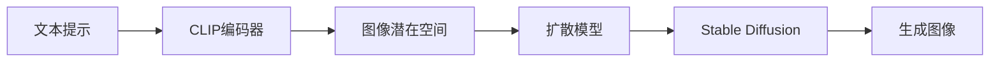

# Midjourney原理与代码实例讲解

## 1. 背景介绍

### 1.1 人工智能与计算机视觉的发展
#### 1.1.1 人工智能的兴起
#### 1.1.2 计算机视觉技术的突破
#### 1.1.3 AI生成艺术的崛起

### 1.2 Midjourney的诞生
#### 1.2.1 Midjourney的起源与发展
#### 1.2.2 Midjourney的创新之处
#### 1.2.3 Midjourney在AI艺术领域的地位

## 2. 核心概念与联系

### 2.1 扩散模型(Diffusion Model)
#### 2.1.1 扩散模型的定义与原理
#### 2.1.2 扩散模型在图像生成中的应用
#### 2.1.3 扩散模型与其他生成模型的比较

### 2.2 CLIP(Contrastive Language-Image Pre-training)
#### 2.2.1 CLIP的原理与架构
#### 2.2.2 CLIP在多模态学习中的优势
#### 2.2.3 CLIP在Midjourney中的应用

### 2.3 Stable Diffusion
#### 2.3.1 Stable Diffusion的原理与特点
#### 2.3.2 Stable Diffusion在Midjourney中的实现
#### 2.3.3 Stable Diffusion的优化与改进



## 3. 核心算法原理具体操作步骤

### 3.1 文本编码
#### 3.1.1 文本预处理
#### 3.1.2 CLIP编码器提取文本特征
#### 3.1.3 文本特征向量的生成

### 3.2 潜在空间映射
#### 3.2.1 随机采样潜在向量
#### 3.2.2 潜在向量与文本特征向量的融合
#### 3.2.3 潜在空间中的优化与调整

### 3.3 图像生成
#### 3.3.1 扩散模型的迭代过程
#### 3.3.2 Stable Diffusion的采样策略
#### 3.3.3 图像质量的优化与后处理

## 4. 数学模型和公式详细讲解举例说明

### 4.1 扩散模型的数学表示
#### 4.1.1 前向扩散过程
$$
q(x_t|x_{t-1}) = \mathcal{N}(x_t; \sqrt{1-\beta_t} x_{t-1}, \beta_t \mathbf{I})
$$
#### 4.1.2 反向去噪过程
$$
p_\theta(x_{t-1}|x_t) = \mathcal{N}(x_{t-1}; \mu_\theta(x_t, t), \Sigma_\theta(x_t, t))
$$
#### 4.1.3 损失函数与优化目标
$$
L_\text{diffusion} = \mathbb{E}_{t,x_0,\epsilon} \left[ \| \epsilon - \epsilon_\theta(x_t, t) \|^2 \right]
$$

### 4.2 CLIP的数学表示
#### 4.2.1 图像编码器
$$ 
\mathbf{v} = \text{ImageEncoder}(\mathbf{x})
$$
#### 4.2.2 文本编码器
$$
\mathbf{u} = \text{TextEncoder}(\mathbf{w})
$$  
#### 4.2.3 对比学习损失
$$
L_\text{CLIP} = -\frac{1}{N} \sum_{i=1}^N \log \frac{\exp(\text{sim}(\mathbf{v}_i, \mathbf{u}_i) / \tau)}{\sum_{j=1}^N \exp(\text{sim}(\mathbf{v}_i, \mathbf{u}_j) / \tau)}
$$

### 4.3 Stable Diffusion的数学表示
#### 4.3.1 条件扩散模型
$$
p_\theta(x_{t-1}|x_t, y) = \mathcal{N}(x_{t-1}; \mu_\theta(x_t, t, y), \Sigma_\theta(x_t, t, y))
$$
#### 4.3.2 引导采样过程
$$
\mathbf{z}_t = \mathbf{z}_{t-1} - \frac{\beta_t}{\sqrt{1-\bar{\alpha}_t}} \left( \frac{\mathbf{z}_{t-1}}{\sqrt{\bar{\alpha}_t}} + \frac{\beta_t}{\sqrt{1-\bar{\alpha}_t}} \nabla_{\mathbf{z}_{t-1}} \log p_\theta(\mathbf{z}_{t-1}|y) \right)
$$

## 5. 项目实践：代码实例和详细解释说明

### 5.1 环境配置与依赖安装
#### 5.1.1 Python环境搭建
#### 5.1.2 PyTorch安装
#### 5.1.3 其他依赖库的安装

### 5.2 数据准备与预处理
#### 5.2.1 图像数据集的下载与组织
#### 5.2.2 文本数据的清洗与标注
#### 5.2.3 数据增强与预处理技巧

### 5.3 模型训练与调优
#### 5.3.1 CLIP模型的训练
```python
# CLIP模型训练
clip_model = CLIP(image_encoder, text_encoder)
clip_optimizer = optim.Adam(clip_model.parameters(), lr=1e-4)

for epoch in range(num_epochs):
    for images, texts in dataloader:
        # 前向传播
        image_features = image_encoder(images)
        text_features = text_encoder(texts)
        
        # 计算对比学习损失
        clip_loss = clip_criterion(image_features, text_features)
        
        # 反向传播与优化
        clip_optimizer.zero_grad()
        clip_loss.backward()
        clip_optimizer.step()
```

#### 5.3.2 扩散模型的训练
```python
# 扩散模型训练
diffusion_model = DiffusionModel(num_timesteps)
diffusion_optimizer = optim.Adam(diffusion_model.parameters(), lr=1e-4)

for epoch in range(num_epochs):
    for images in dataloader:
        # 前向扩散过程
        noisy_images, noise = diffusion_model.forward_diffusion(images)
        
        # 预测噪声
        predicted_noise = diffusion_model(noisy_images, timesteps)
        
        # 计算扩散损失
        diffusion_loss = diffusion_criterion(noise, predicted_noise)
        
        # 反向传播与优化
        diffusion_optimizer.zero_grad()
        diffusion_loss.backward()  
        diffusion_optimizer.step()
```

#### 5.3.3 超参数调整与模型优化

### 5.4 图像生成与结果分析
#### 5.4.1 使用训练好的模型生成图像
```python
# 图像生成
def generate_image(prompt, num_inference_steps=50):
    # 对提示词进行编码
    text_features = clip_model.encode_text(prompt)
    
    # 随机采样潜在向量
    latents = torch.randn((1, latent_dim))
    
    # 迭代生成图像
    for t in range(num_inference_steps):
        # 潜在向量更新
        latents = diffusion_model.sample(latents, text_features, t)
    
    # 将潜在向量解码为图像
    generated_image = diffusion_model.decode(latents)
    
    return generated_image

# 生成图像示例
prompt = "A beautiful sunset over the ocean"
generated_image = generate_image(prompt)
```

#### 5.4.2 生成图像的质量评估
#### 5.4.3 不同提示词对生成结果的影响

## 6. 实际应用场景

### 6.1 创意设计与艺术创作
#### 6.1.1 概念艺术设计
#### 6.1.2 插画与绘本创作
#### 6.1.3 游戏与影视场景设计

### 6.2 广告与营销
#### 6.2.1 广告图片生成
#### 6.2.2 产品设计与可视化
#### 6.2.3 社交媒体营销素材制作

### 6.3 教育与科普
#### 6.3.1 教学辅助材料生成
#### 6.3.2 科普插图与解说图制作
#### 6.3.3 互动式学习内容创建

## 7. 工具和资源推荐

### 7.1 开源实现与代码库
#### 7.1.1 Stable Diffusion官方实现
#### 7.1.2 Hugging Face Diffusers库
#### 7.1.3 CompVis/stable-diffusion-v1-4

### 7.2 数据集与预训练模型
#### 7.2.1 LAION-5B数据集
#### 7.2.2 OpenAI CLIP预训练模型
#### 7.2.3 Stable Diffusion预训练模型

### 7.3 社区与学习资源
#### 7.3.1 Stable Diffusion官方社区
#### 7.3.2 AI艺术创作社区
#### 7.3.3 在线教程与学习资源

## 8. 总结：未来发展趋势与挑战

### 8.1 AI生成艺术的发展前景
#### 8.1.1 技术的不断进步与突破
#### 8.1.2 AI艺术的商业化应用
#### 8.1.3 AI艺术与人类创造力的协同

### 8.2 面临的挑战与问题
#### 8.2.1 版权与知识产权问题
#### 8.2.2 伦理与道德考量
#### 8.2.3 AI生成内容的可控性与安全性

### 8.3 未来研究方向与展望
#### 8.3.1 多模态交互与控制
#### 8.3.2 个性化与定制化生成
#### 8.3.3 AI艺术的评估与鉴赏标准

## 9. 附录：常见问题与解答

### 9.1 Midjourney与其他AI艺术生成工具的区别
### 9.2 如何提高Midjourney生成图像的质量与多样性
### 9.3 Midjourney生成的图像是否具有版权
### 9.4 如何在Midjourney中实现特定风格或主题的图像生成
### 9.5 Midjourney生成的图像是否可以用于商业用途

作者：禅与计算机程序设计艺术 / Zen and the Art of Computer Programming