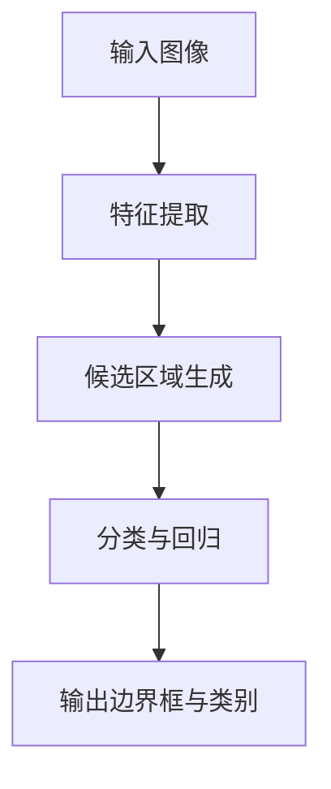

# Object Detection原理与代码实例讲解

## 1.背景介绍

物体检测（Object Detection）是计算机视觉领域中的一个重要任务，它不仅需要识别图像中的物体类别，还需要确定每个物体的具体位置。随着深度学习技术的发展，物体检测在自动驾驶、安防监控、医疗影像分析等领域得到了广泛应用。本文将深入探讨物体检测的核心概念、算法原理、数学模型，并通过代码实例进行详细解释，帮助读者全面理解这一技术。

## 2.核心概念与联系

### 2.1 物体检测与图像分类的区别

图像分类是指对整张图像进行分类，而物体检测不仅要分类，还要定位图像中的多个物体。物体检测的输出通常包括每个物体的类别和边界框（Bounding Box）。

### 2.2 物体检测与语义分割的区别

语义分割是对图像中的每个像素进行分类，而物体检测则是对图像中的物体进行分类和定位。物体检测的结果是离散的边界框，而语义分割的结果是连续的像素分类。

### 2.3 物体检测的主要任务

物体检测的主要任务包括：
- 分类：识别图像中物体的类别。
- 定位：确定物体在图像中的位置，通常用边界框表示。

## 3.核心算法原理具体操作步骤

### 3.1 传统方法

#### 3.1.1 滑动窗口法

滑动窗口法通过在图像上滑动一个固定大小的窗口，对每个窗口进行分类。这种方法计算量大，效率低。

#### 3.1.2 选择性搜索

选择性搜索通过生成候选区域来减少计算量。它首先对图像进行分割，然后合并相似的区域，生成候选区域。

### 3.2 深度学习方法

#### 3.2.1 R-CNN系列

##### 3.2.1.1 R-CNN

R-CNN（Region-based Convolutional Neural Networks）首先使用选择性搜索生成候选区域，然后对每个候选区域进行分类和回归。

##### 3.2.1.2 Fast R-CNN

Fast R-CNN改进了R-CNN的效率，通过共享卷积层减少计算量，并使用RoI Pooling层对候选区域进行处理。

##### 3.2.1.3 Faster R-CNN

Faster R-CNN进一步改进了Fast R-CNN，通过引入区域建议网络（RPN）生成候选区域，实现了端到端的训练。

#### 3.2.2 YOLO系列

YOLO（You Only Look Once）系列方法将物体检测视为一个回归问题，直接预测边界框和类别。YOLO的主要优点是速度快，但精度相对较低。

#### 3.2.3 SSD

SSD（Single Shot MultiBox Detector）通过在不同尺度的特征图上进行检测，实现了速度和精度的平衡。

### 3.3 核心算法流程图



## 4.数学模型和公式详细讲解举例说明

### 4.1 边界框回归

边界框回归的目标是预测物体的精确位置。假设预测的边界框为 $(x, y, w, h)$，真实的边界框为 $(x', y', w', h')$，回归目标可以表示为：

$$
t_x = \frac{x' - x}{w}, \quad t_y = \frac{y' - y}{h}, \quad t_w = \log\left(\frac{w'}{w}\right), \quad t_h = \log\left(\frac{h'}{h}\right)
$$

### 4.2 损失函数

物体检测的损失函数通常包括分类损失和回归损失。以Faster R-CNN为例，其损失函数可以表示为：

$$
L(p, u, t, v) = L_{cls}(p, u) + \lambda[u \geq 1]L_{reg}(t, v)
$$

其中，$L_{cls}$ 是分类损失，$L_{reg}$ 是回归损失，$p$ 是预测的类别概率，$u$ 是真实类别，$t$ 是预测的边界框参数，$v$ 是真实的边界框参数，$\lambda$ 是平衡系数。

### 4.3 非极大值抑制（NMS）

非极大值抑制用于去除重叠的边界框。其基本思想是：对于每个类别，首先选择得分最高的边界框，然后去除与其重叠度（IoU）超过阈值的其他边界框。IoU的计算公式为：

$$
IoU = \frac{A \cap B}{A \cup B}
$$

其中，$A$ 和 $B$ 是两个边界框。

## 5.项目实践：代码实例和详细解释说明

### 5.1 环境配置

首先，确保安装了必要的库：

```bash
pip install torch torchvision
```

### 5.2 数据准备

使用COCO数据集作为示例：

```python
from torchvision import datasets, transforms

transform = transforms.Compose([
    transforms.ToTensor(),
])

dataset = datasets.CocoDetection(root='path/to/coco', annFile='path/to/annotations', transform=transform)
```

### 5.3 模型定义

使用Faster R-CNN模型：

```python
import torchvision.models as models

model = models.detection.fasterrcnn_resnet50_fpn(pretrained=True)
model.eval()
```

### 5.4 推理与结果可视化

```python
import matplotlib.pyplot as plt
import numpy as np

def plot_image_with_boxes(image, boxes, labels):
    plt.imshow(image.permute(1, 2, 0).numpy())
    for box in boxes:
        x1, y1, x2, y2 = box
        plt.gca().add_patch(plt.Rectangle((x1, y1), x2-x1, y2-y1, fill=False, edgecolor='red', linewidth=2))
    plt.show()

image, _ = dataset[0]
with torch.no_grad():
    prediction = model([image])

plot_image_with_boxes(image, prediction[0]['boxes'], prediction[0]['labels'])
```

## 6.实际应用场景

### 6.1 自动驾驶

物体检测在自动驾驶中用于识别和定位道路上的车辆、行人、交通标志等，确保车辆能够安全行驶。

### 6.2 安防监控

在安防监控中，物体检测用于识别和跟踪监控视频中的可疑人物和物体，提高安全性。

### 6.3 医疗影像分析

物体检测在医疗影像分析中用于识别和定位病变区域，辅助医生进行诊断。

## 7.工具和资源推荐

### 7.1 开源框架

- **TensorFlow Object Detection API**：谷歌提供的物体检测框架，支持多种预训练模型。
- **Detectron2**：Facebook AI Research开发的物体检测库，支持多种先进的物体检测算法。

### 7.2 数据集

- **COCO**：常用的物体检测数据集，包含多种类别的物体。
- **PASCAL VOC**：经典的物体检测数据集，适用于初学者。

### 7.3 在线资源

- **Papers with Code**：提供最新的物体检测论文和代码实现。
- **Kaggle**：提供物体检测的竞赛和数据集，适合实践和学习。

## 8.总结：未来发展趋势与挑战

物体检测技术在过去几年取得了显著进展，但仍面临一些挑战，如小物体检测、实时性和鲁棒性等。未来的发展趋势包括：

- **多任务学习**：结合物体检测与其他任务（如语义分割、姿态估计）进行联合学习，提高模型的综合性能。
- **轻量级模型**：开发更高效的轻量级模型，适用于移动设备和嵌入式系统。
- **自监督学习**：利用大量未标注数据进行自监督学习，减少对标注数据的依赖。

## 9.附录：常见问题与解答

### 9.1 如何选择合适的物体检测算法？

选择物体检测算法时，需要考虑以下因素：
- **精度**：如果对精度要求较高，可以选择Faster R-CNN等精度较高的算法。
- **速度**：如果对实时性要求较高，可以选择YOLO、SSD等速度较快的算法。
- **应用场景**：根据具体应用场景选择合适的算法，如自动驾驶、安防监控等。

### 9.2 如何处理小物体检测问题？

小物体检测是一个难点，可以尝试以下方法：
- **多尺度特征融合**：通过融合不同尺度的特征，提高小物体的检测精度。
- **数据增强**：通过数据增强技术（如随机裁剪、缩放）增加小物体的样本数量。

### 9.3 如何提高模型的鲁棒性？

提高模型鲁棒性的方法包括：
- **数据多样性**：使用多样化的数据进行训练，提高模型的泛化能力。
- **正则化技术**：使用正则化技术（如Dropout、L2正则化）防止过拟合。

作者：禅与计算机程序设计艺术 / Zen and the Art of Computer Programming