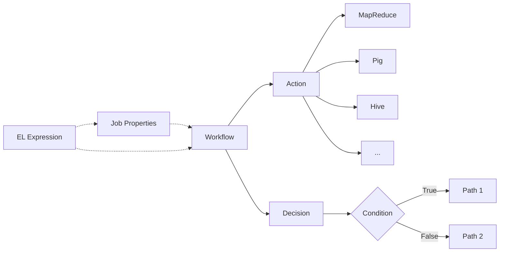

# Oozie工作流调度原理与代码实例讲解

## 1.背景介绍

在大数据处理领域,工作流调度系统扮演着至关重要的角色。Apache Oozie就是这样一个功能强大、可扩展性高的工作流调度系统。它允许用户定义由多个任务组成的有向无环图(DAG),并以可靠的方式按照指定的顺序执行这些任务。Oozie与Hadoop生态系统无缝集成,支持调度MapReduce、Pig、Hive等各种类型的大数据处理作业。本文将深入探讨Oozie的工作原理,并通过代码实例来演示如何使用Oozie进行工作流调度。

### 1.1 Oozie的产生背景
### 1.2 Oozie在大数据生态系统中的地位
### 1.3 Oozie的主要特性与优势

## 2.核心概念与联系

要理解Oozie的工作原理,首先需要了解几个核心概念:

### 2.1 工作流(Workflow)
工作流是由一系列动作(Action)和决策(Decision)节点组成的有向无环图。它定义了作业的执行顺序和逻辑。

### 2.2 动作(Action) 
动作是工作流中的基本执行单元,可以是各种类型的任务,如MapReduce、Pig、Hive、Spark、Shell等。

### 2.3 决策(Decision)
决策节点根据预定义的条件判断下一步执行的分支。

### 2.4 作业属性(Job Properties)
可以定义参数化的作业属性,在工作流的不同地方引用,提高灵活性和可复用性。

### 2.5 EL表达式
Oozie支持类似JSP的EL表达式,可以方便地引用上下文信息。

下图展示了这些核心概念之间的关系:



## 3.核心算法原理与具体操作步骤

### 3.1 有向无环图(DAG)
Oozie工作流本质上是一个有向无环图。DAG由节点和有向边组成,保证了任务执行的有序性和避免循环依赖。Oozie在解析工作流定义时,会构建DAG并进行拓扑排序,得到节点的执行顺序。

### 3.2 工作流定义
工作流定义是一个XML文件,描述了DAG的结构。其中定义了起始节点、结束节点、各种类型的动作节点、决策节点、以及节点之间的转移条件等。

一个简单的工作流定义示例:

```xml
<workflow-app name="sample-wf" xmlns="uri:oozie:workflow:0.5">
    <start to="mr-node"/>
    <action name="mr-node">
        <map-reduce>
            <job-tracker>${jobTracker}</job-tracker>
            <name-node>${nameNode}</name-node>
            <configuration>
                <property>
                    <name>mapred.mapper.class</name>
                    <value>org.apache.oozie.example.SampleMapper</value>
                </property>
                ...
            </configuration>
        </map-reduce>
        <ok to="end"/>
        <error to="fail"/>
    </action>
    <kill name="fail">
        <message>MapReduce failed</message>
    </kill>
    <end name="end"/>
</workflow-app>
```

### 3.3 任务执行过程
当工作流提交后,Oozie会解析工作流定义并构建DAG。然后根据DAG的拓扑顺序依次执行各个节点:

1. 从起始节点开始,根据节点间的转移条件选择下一个节点 
2. 如果是动作节点,提交对应类型的任务到集群运行
3. 如果是决策节点,根据EL表达式计算决策条件,选择对应的执行分支
4. 执行到结束节点,或者出错进入kill节点,工作流结束

整个过程中,Oozie会记录并持久化工作流的执行状态,如果出现故障,支持重试和从失败节点恢复执行。

## 4.数学模型和公式详细讲解举例说明

### 4.1 DAG模型
DAG数学模型可以表示为$G=(V,E)$,其中:  
- $V$表示节点的集合
- $E$表示有向边的集合,$E \subseteq V \times V$ 

DAG需要满足以下条件:
- 有向:若$(u,v) \in E$,则$(v,u) \notin E$
- 无环:不存在一个节点序列$v_1,v_2,...v_n$,使得$(v_i,v_{i+1}) \in E$且$v_1=v_n$

### 4.2 拓扑排序
对DAG进行拓扑排序,可以得到一个节点的线性序列,满足若$(u,v) \in E$,则$u$在序列中出现在$v$之前。一个典型的拓扑排序算法:

1. 找出所有入度为0的节点,加入序列
2. 将这些节点以及从它们出发的边从图中删除
3. 重复1-2,直到图为空

拓扑排序的时间复杂度为$O(|V|+|E|)$。

### 4.3 关键路径
DAG的关键路径是从起点到终点的最长路径,决定了工作流的最短完成时间。关键路径上任意节点的延迟都会影响整个工作流的完成时间。

假设边$(u,v)$的权重$w(u,v)$表示节点$u$完成到节点$v$开始之间的时间间隔,则关键路径可以用类似最长路径的动态规划算法求解:

$$
\begin{aligned}
d(v) &= 
\begin{cases}
0 & v \text{为起点} \\
\max_{(u,v) \in E} \{d(u) + w(u,v)\} & \text{其他}
\end{cases}
\end{aligned}
$$

关键路径的长度就是$d(v_{end})$。

## 5.项目实践：代码实例和详细解释说明

下面通过一个具体的例子,演示如何使用Oozie进行工作流调度。该工作流由以下几个步骤组成:

1. 从HDFS读取输入数据
2. 使用MapReduce进行数据处理 
3. 使用Pig进行数据分析
4. 将结果写回HDFS

### 5.1 工作流定义
首先创建一个workflow.xml文件定义工作流:

```xml
<workflow-app xmlns="uri:oozie:workflow:0.5" name="sample-workflow">
    <start to="input-node"/>
    
    <action name="input-node">
        <fs>
            <delete path="${nameNode}/user/input-data"/>
            <mkdir path="${nameNode}/user/input-data"/>
            <move source="${nameNode}/user/original-data" target="${nameNode}/user/input-data"/>
        </fs>
        <ok to="mr-node"/>
        <error to="fail"/>
    </action>
    
    <action name="mr-node">
        <map-reduce>
            <job-tracker>${jobTracker}</job-tracker>
            <name-node>${nameNode}</name-node>
            <configuration>
                <property>
                    <name>mapred.input.dir</name>
                    <value>/user/input-data</value>
                </property>
                <property>
                    <name>mapred.output.dir</name>
                    <value>/user/mr-output</value>
                </property>
                ...
            </configuration>
        </map-reduce>
        <ok to="pig-node"/>
        <error to="fail"/>
    </action>
    
    <action name="pig-node">
        <pig>
            <job-tracker>${jobTracker}</job-tracker>
            <name-node>${nameNode}</name-node>
            <script>script.pig</script>
            <param>INPUT=/user/mr-output</param>
            <param>OUTPUT=/user/pig-output</param>
        </pig>
        <ok to="output-node"/>
        <error to="fail"/>
    </action>
    
    <action name="output-node">
        <fs>
            <move source="${nameNode}/user/pig-output" target="${nameNode}/user/final-output"/>
        </fs>
        <ok to="end"/>
        <error to="fail"/>
    </action>
    
    <kill name="fail">
        <message>Workflow failed</message>
    </kill>
    <end name="end"/>
</workflow-app>
```

可以看到,这个工作流包含了4个action节点,分别完成输入数据准备、MapReduce处理、Pig分析、结果输出等任务,节点之间的依赖关系也清晰定义。

### 5.2 作业属性定义
除了工作流本身,还需要一个job.properties文件来定义作业的配置参数:

```properties
nameNode=hdfs://localhost:8020
jobTracker=localhost:8021
queueName=default
oozie.use.system.libpath=true
oozie.wf.application.path=${nameNode}/user/oozie/workflows/sample-workflow
```

这里定义了HDFS和MapReduce的访问地址,以及工作流在HDFS上的存储路径等信息。

### 5.3 提交与监控
准备好以上两个文件后,就可以通过Oozie的REST API或命令行工具提交并执行该工作流了。例如使用命令行:

```bash
oozie job -oozie http://localhost:11000/oozie -config job.properties -run
```

这条命令指定了Oozie服务的地址,作业配置文件,并发起运行。

提交后可以通过如下命令查看作业运行状态:

```bash
oozie job -oozie http://localhost:11000/oozie -info <job-id>
```

也可以在Oozie的Web UI界面上查看作业的执行进度和日志信息。

## 6.实际应用场景

Oozie在实际的大数据处理项目中有广泛的应用,特别适合一些复杂的数据处理流程。一些典型的使用场景包括:

### 6.1 数据仓库ETL
使用Oozie可以很方便地调度和管理数据仓库的ETL工作流。例如从各种数据源抽取数据、进行清洗转换、最后加载到目标数据库或表中。

### 6.2 机器学习训练
对于机器学习模型的训练,往往需要执行特征工程、模型训练、模型评估等一系列步骤。用Oozie可以将这些步骤串联成一个自动化的工作流。

### 6.3 数据分析管道
数据分析往往包括多个阶段,如数据采集、预处理、分析挖掘、可视化等。利用Oozie,可以将这些阶段的任务编排成一个分析管道,实现分析流程的自动化。

### 6.4 批处理作业调度
对于一些需要定期运行的批处理作业,如每日数据聚合、每月报表生成等,也可以使用Oozie来统一调度管理,替代Linux的Cron等工具。

## 7.工具和资源推荐

### 7.1 官方文档
- [Oozie官网](https://oozie.apache.org/)
- [Oozie官方文档](https://oozie.apache.org/docs/)

### 7.2 第三方工具
- [Hue](https://gethue.com/): 集成了Oozie的友好Web界面
- [Oozie Eclipse Plugin](https://oozie.apache.org/docs/3.3.2/DG_EclipsePlugin.html): 方便在Eclipse中开发调试Oozie工作流

### 7.3 学习资源
- [Oozie Cookbook](https://www.packtpub.com/product/apache-oozie-cookbook/9781783284863)
- [Oozie学习笔记](https://www.cnblogs.com/cenyuhai/p/3728886.html)
- [Oozie从入门到精通](https://blog.csdn.net/u011413061/article/details/51333266)

## 8.总结：未来发展趋势与挑战

Oozie作为大数据工作流调度系统的代表,经过多年发展已经相当成熟,特别是在Hadoop生态圈中得到广泛应用。未来Oozie还将不断完善,以适应不断发展的大数据处理需求:

### 8.1 更好地支持混合云环境
在混合云部署日益普及的趋势下,Oozie需要提供更灵活的调度能力,能够协调不同环境(本地、私有云、公有云)的任务。

### 8.2 深度集成新的计算框架
大数据处理领域新的计算框架层出不穷,如Spark、Flink等。Oozie需要及时跟进,以原生的方式集成这些新兴框架。

### 8.3 增强实时处理能力  
Oozie目前主要面向批处理场景,对实时计算的支持还不够好。未来需要在低延迟、高吞吐、快速恢复等方面加