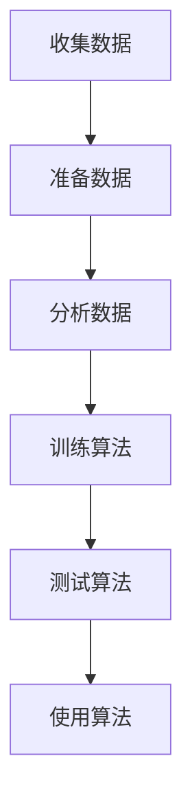

## 1.背景介绍

机器学习是人工智能领域的一个重要分支，它通过让计算机从数据中学习规律和模式，从而实现自主学习和预测。Python是一种广泛使用的编程语言，也是机器学习领域中最受欢迎的语言之一。Scikit-learn是Python中最流行的机器学习库之一，它提供了丰富的机器学习算法和工具，可以帮助开发者快速构建和部署机器学习模型。

本文将介绍Scikit-learn的核心概念、算法原理、数学模型和公式、项目实践、实际应用场景、工具和资源推荐、未来发展趋势和挑战以及常见问题与解答，帮助读者深入了解Scikit-learn的使用和应用。

## 2.核心概念与联系

Scikit-learn是一个基于Python的机器学习库，它提供了各种机器学习算法和工具，包括分类、回归、聚类、降维、模型选择和预处理等。Scikit-learn的核心概念包括：

- Estimator：估计器，是Scikit-learn中所有机器学习算法的基类，包括分类器、回归器、聚类器等。
- Transformer：转换器，是用于数据预处理和特征工程的工具，可以将原始数据转换为更适合机器学习算法处理的形式。
- Pipeline：管道，是将多个转换器和估计器组合在一起形成的工作流，可以方便地进行数据预处理和模型训练。
- GridSearchCV：网格搜索交叉验证，是一种超参数调优方法，可以通过穷举搜索所有可能的超参数组合来寻找最优的模型参数。

Scikit-learn中的各种算法和工具之间存在着紧密的联系和依赖关系，可以通过组合和调用不同的算法和工具来构建完整的机器学习流程。

## 3.核心算法原理具体操作步骤

Scikit-learn中包含了大量的机器学习算法和工具，这里只介绍其中几个常用的算法和工具的原理和操作步骤。

### 3.1 K近邻算法

K近邻算法是一种基于实例的学习方法，它通过计算样本之间的距离来进行分类或回归。K近邻算法的原理如下：

- 给定一个训练集和一个测试样本，计算测试样本与训练集中所有样本之间的距离。
- 选取距离测试样本最近的K个训练样本，根据这K个样本的标签进行分类或回归。
- 对于分类问题，采用投票的方式确定测试样本的类别；对于回归问题，采用平均值的方式确定测试样本的输出值。

K近邻算法的操作步骤如下：



### 3.2 决策树算法

决策树算法是一种基于树形结构的分类和回归方法，它通过构建一棵树来对数据进行分类或回归。决策树算法的原理如下：

- 选择一个最优的特征作为根节点，将数据集按照该特征的取值分成多个子集。
- 对于每个子集，重复上述步骤，选择一个最优的特征作为子节点，将子集按照该特征的取值分成多个子集。
- 直到所有的数据都被分到叶子节点上，每个叶子节点表示一个类别或一个输出值。

决策树算法的操作步骤如下：


### 3.3 支持向量机算法

支持向量机算法是一种基于间隔最大化的分类方法，它通过构建一个超平面来将数据分成两个类别。支持向量机算法的原理如下：

- 给定一个训练集，找到一个超平面，使得该超平面能够将不同类别的样本分开，并且使得超平面到最近的样本点的距离最大。
- 对于非线性可分的数据，可以通过核函数将数据映射到高维空间，从而使得数据在高维空间中线性可分。

支持向量机算法的操作步骤如下：


## 4.数学模型和公式详细讲解举例说明

Scikit-learn中的机器学习算法和工具都基于数学模型和公式，这里以K近邻算法为例，介绍其数学模型和公式。

K近邻算法的数学模型如下：

- 给定一个训练集$D={(x_1,y_1),(x_2,y_2),...,(x_n,y_n)}$，其中$x_i$为样本的特征向量，$y_i$为样本的类别标签。
- 给定一个测试样本$x$，计算它与训练集中所有样本的距离$d(x,x_i)$。
- 选取距离测试样本最近的K个训练样本，根据这K个样本的标签进行分类或回归。

K近邻算法的公式如下：

- 欧氏距离：$d(x,x_i)=\sqrt{\sum_{j=1}^m(x_j-x_{ij})^2}$
- 曼哈顿距离：$d(x,x_i)=\sum_{j=1}^m|x_j-x_{ij}|$
- 闵可夫斯基距离：$d(x,x_i)=(\sum_{j=1}^m|x_j-x_{ij}|^p)^{\frac{1}{p}}$
- 切比雪夫距离：$d(x,x_i)=\max_{j=1}^m|x_j-x_{ij}|$

## 5.项目实践：代码实例和详细解释说明

Scikit-learn提供了丰富的机器学习算法和工具，这里以K近邻算法为例，介绍如何使用Scikit-learn进行机器学习项目实践。

```python
from sklearn.datasets import load_iris
from sklearn.model_selection import train_test_split
from sklearn.neighbors import KNeighborsClassifier
from sklearn.metrics import accuracy_score

# 加载数据集
iris = load_iris()
X = iris.data
y = iris.target

# 划分训练集和测试集
X_train, X_test, y_train, y_test = train_test_split(X, y, test_size=0.3, random_state=42)

# 构建K近邻分类器
knn = KNeighborsClassifier(n_neighbors=3)

# 训练模型
knn.fit(X_train, y_train)

# 预测测试集
y_pred = knn.predict(X_test)

# 计算准确率
accuracy = accuracy_score(y_test, y_pred)
print("Accuracy:", accuracy)
```

上述代码实现了一个简单的K近邻分类器，包括数据集加载、训练集和测试集划分、模型构建、模型训练、测试集预测和准确率计算等步骤。通过这个例子，读者可以了解如何使用Scikit-learn进行机器学习项目实践。

## 6.实际应用场景

Scikit-learn可以应用于各种机器学习场景，包括分类、回归、聚类、降维、模型选择和预处理等。下面介绍几个实际应用场景。

### 6.1 图像分类

图像分类是机器学习中的一个重要应用场景，可以通过Scikit-learn中的分类算法和工具来实现。例如，可以使用K近邻算法对图像进行分类，或者使用支持向量机算法对图像进行二分类。

### 6.2 文本分类

文本分类是机器学习中的另一个重要应用场景，可以通过Scikit-learn中的分类算法和工具来实现。例如，可以使用朴素贝叶斯算法对文本进行分类，或者使用支持向量机算法对文本进行二分类。

### 6.3 数据挖掘

数据挖掘是机器学习中的一个重要应用场景，可以通过Scikit-learn中的聚类算法和工具来实现。例如，可以使用K均值算法对数据进行聚类，或者使用层次聚类算法对数据进行分层聚类。

## 7.工具和资源推荐

Scikit-learn是Python中最流行的机器学习库之一，它提供了丰富的机器学习算法和工具，可以帮助开发者快速构建和部署机器学习模型。除了Scikit-learn之外，还有很多其他的机器学习库和工具，例如TensorFlow、PyTorch、Keras等。

## 8.总结：未来发展趋势与挑战

随着人工智能技术的不断发展和应用，机器学习将成为未来的一个重要领域。Scikit-learn作为Python中最流行的机器学习库之一，将继续发挥重要作用。未来，机器学习将面临更多的挑战和机遇，例如数据隐私保护、模型解释性、自动化机器学习等。

## 9.附录：常见问题与解答

Q: Scikit-learn支持哪些机器学习算法？

A: Scikit-learn支持各种机器学习算法，包括分类、回归、聚类、降维、模型选择和预处理等。

Q: Scikit-learn如何进行数据预处理？

A: Scikit-learn提供了各种数据预处理工具，例如标准化、归一化、缺失值处理等。

Q: Scikit-learn如何进行模型选择和调优？

A: Scikit-learn提供了各种模型选择和调优工具，例如交叉验证、网格搜索等。

Q: Scikit-learn如何进行模型部署？

A: Scikit-learn提供了各种模型部署工具，例如pickle、joblib等。

作者：禅与计算机程序设计艺术 / Zen and the Art of Computer Programming