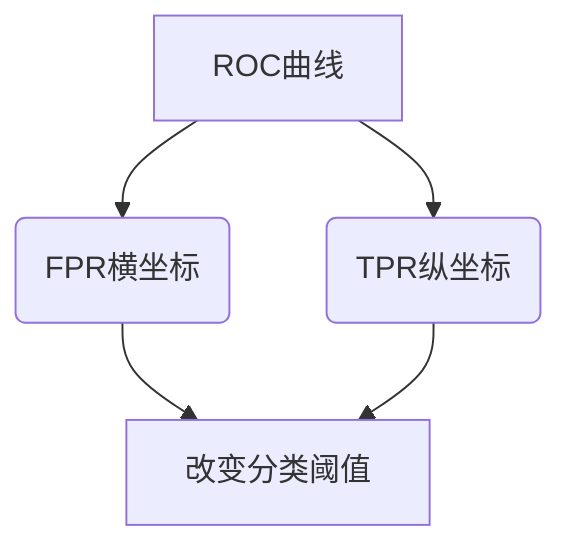

# ROC曲线常见问题解答：疑难解析

## 1.背景介绍

ROC曲线(Receiver Operating Characteristic Curve)是一种用于评估二分类模型性能的可视化工具。它绘制了模型在不同阈值下的真阳性率(TPR)和假阳性率(FPR)之间的关系。ROC曲线广泛应用于机器学习、数据挖掘、信号检测等领域,被认为是衡量分类模型性能的标准方法之一。

ROC曲线的主要优势在于:

1. **阈值无关性**:ROC曲线描绘了模型在所有可能的阈值下的性能,不依赖于任何特定的阈值。
2. **可视化效果好**:ROC曲线将模型的性能以直观的方式呈现,易于理解和解释。
3. **综合考虑精确度和召回率**:ROC曲线同时考虑了模型的精确度(Precision)和召回率(Recall),提供了全面的性能评估。

## 2.核心概念与联系

### 2.1 真阳性率(TPR)和假阳性率(FPR)

TPR(True Positive Rate)和FPR(False Positive Rate)是构建ROC曲线的两个核心指标:

- **真阳性率(TPR)** = TP / (TP + FN)
  - TP(True Positive):将正例正确预测为正例的数量
  - FN(False Negative):将正例错误预测为反例的数量

- **假阳性率(FPR)** = FP / (FP + TN)  
  - FP(False Positive):将反例错误预测为正例的数量
  - TN(True Negative):将反例正确预测为反例的数量

TPR和FPR的取值范围均为[0,1]。理想情况下,我们希望TPR尽可能接近1,FPR尽可能接近0。

### 2.2 ROC曲线的绘制

ROC曲线是在笛卡尔坐标系中,以FPR为横坐标,TPR为纵坐标绘制的曲线。通过改变分类阈值,可以得到一系列(FPR,TPR)数值对,并在坐标系中连接形成ROC曲线。



### 2.3 ROC曲线下面积(AUC)

ROC曲线下面积(Area Under the Curve, AUC)是评估二分类模型性能的重要指标。AUC的取值范围为[0,1],值越大,模型性能越好。

- AUC=1,表示模型完美分类
- AUC=0.5,表示模型是随机猜测
- AUC<0.5,表示模型性能极差,可以考虑对结果取反

## 3.核心算法原理具体操作步骤

### 3.1 ROC曲线绘制步骤

1. **获取模型的预测概率**:对于每个样本,模型会输出一个属于正例的概率值,范围在[0,1]之间。
2. **排序并计算TPR和FPR**:将所有样本按照预测概率从大到小排序,依次将每个样本作为阈值,计算相应的TPR和FPR。
3. **绘制ROC曲线**:以FPR为横坐标,TPR为纵坐标,将计算得到的(FPR,TPR)数值对连接起来,即得到ROC曲线。

### 3.2 ROC曲线下面积(AUC)计算

常见的AUC计算方法有:

1. **梯形法则**:将ROC曲线下的面积近似为一系列小梯形的面积之和。
2. **Mann-Whitney U统计量**:利用Mann-Whitney U检验统计量与AUC之间的关系进行计算。
3. **直方图方法**:基于直方图的近似计算方法。

以梯形法则为例,具体计算步骤如下:

```python
# 假设已经计算出一系列(FPR,TPR)数值对
fpr_list = [0.0, 0.1, 0.2, 0.4, 0.6, 0.8, 1.0] 
tpr_list = [0.0, 0.3, 0.5, 0.7, 0.8, 0.9, 1.0]

auc = 0
prev_x = 0
for i in range(1, len(fpr_list)):
    auc += (tpr_list[i] + tpr_list[i-1]) * (fpr_list[i] - fpr_list[i-1]) / 2

print(f"AUC: {auc:.3f}")  # 输出: AUC: 0.725
```

## 4.数学模型和公式详细讲解举例说明

ROC曲线和AUC的数学模型可以用概率论和统计学的理论进行解释。

### 4.1 ROC曲线的概率解释

设X和Y分别为正例和反例的随机变量,它们的概率密度函数分别为$f_X(x)$和$f_Y(y)$。

定义:

- $TPR = P(X > t) = \int_t^{+\infty} f_X(x) dx$
- $FPR = P(Y > t) = \int_t^{+\infty} f_Y(y) dy$

其中$t$为分类阈值。当$t$从$-\infty$增加到$+\infty$时,$(FPR, TPR)$就描绘出了ROC曲线。

### 4.2 AUC的概率解释

$$AUC = P(X > Y)$$

即AUC等于一个从总体X中随机抽取的样本的值大于一个从总体Y中随机抽取的样本值的概率。

### 4.3 AUC与Mann-Whitney U统计量的关系

Mann-Whitney U检验是一种非参数检验,用于检验两个总体分布位置是否相等。其统计量U与AUC之间有如下关系:

$$AUC = \frac{U}{mn}$$

其中$m$和$n$分别为正例和反例的样本数量。

### 4.4 AUC的期望

假设正例和反例的概率密度函数分别为$f_X(x)$和$f_Y(y)$,则AUC的期望为:

$$E[AUC] = \int_{-\infty}^{+\infty}\int_{-\infty}^{+\infty}H(x-y)f_X(x)f_Y(y)dxdy$$

其中$H(x)$为heaviside阶跃函数:

$$H(x) = \begin{cases}
1, & x \geq 0\\
0, & x < 0
\end{cases}$$

## 5.项目实践:代码实例和详细解释说明

这里提供一个使用Python和scikit-learn库绘制ROC曲线和计算AUC的示例:

```python
import numpy as np
from sklearn.datasets import make_classification
from sklearn.linear_model import LogisticRegression
from sklearn.metrics import roc_curve, roc_auc_score
import matplotlib.pyplot as plt

# 生成模拟二分类数据
X, y = make_classification(n_samples=10000, n_features=5, n_redundant=0, random_state=42)

# 训练逻辑回归模型
model = LogisticRegression()
model.fit(X, y)

# 计算预测概率
y_pred_proba = model.predict_proba(X)[:, 1]

# 计算ROC曲线和AUC
fpr, tpr, thresholds = roc_curve(y, y_pred_proba)
auc = roc_auc_score(y, y_pred_proba)

# 绘制ROC曲线
plt.figure(figsize=(8, 6))
plt.plot(fpr, tpr, label=f'AUC = {auc:.3f}')
plt.plot([0, 1], [0, 1], 'r--')
plt.xlim([-0.01, 1.01])
plt.ylim([-0.01, 1.01])
plt.xlabel('False Positive Rate')
plt.ylabel('True Positive Rate')
plt.title('Receiver Operating Characteristic (ROC) Curve')
plt.legend(loc='lower right')
plt.show()
```

代码解释:

1. 使用`make_classification`函数生成模拟的二分类数据。
2. 使用逻辑回归模型进行训练,并计算每个样本属于正例的预测概率。
3. 调用`roc_curve`函数计算ROC曲线上的(FPR,TPR)数值对和对应的阈值。
4. 调用`roc_auc_score`函数计算AUC。
5. 使用Matplotlib绘制ROC曲线,并在图中显示AUC值。

## 6.实际应用场景

ROC曲线和AUC在许多领域都有广泛的应用,包括但不限于:

1. **医学诊断**:评估疾病检测模型的性能,例如癌症筛查。
2. **信用风险评估**:评估贷款违约风险模型的性能。
3. **网络入侵检测**:评估网络攻击检测模型的性能。
4. **天气预报**:评估天气预报模型的性能。
5. **生物信息学**:评估基因表达分析模型的性能。
6. **自然语言处理**:评估文本分类、情感分析等模型的性能。

## 7.工具和资源推荐

- **scikit-learn**:Python机器学习库,提供了绘制ROC曲线和计算AUC的函数。
- **ROCR**:R语言中的ROC曲线可视化和性能评估包。
- **pROC**:R语言中另一个ROC曲线分析包。
- **MLxtend**:Python机器学习库,提供了绘制ROC曲线的功能。
- **Matplotlib**:Python数据可视化库,可用于绘制ROC曲线。

## 8.总结:未来发展趋势与挑战

ROC曲线和AUC是评估二分类模型性能的重要工具,在机器学习和数据挖掘领域得到了广泛应用。未来,随着深度学习等新技术的发展,ROC曲线和AUC在以下方面可能会有新的发展:

1. **多分类问题**:扩展ROC曲线和AUC来评估多分类模型的性能。
2. **结构化数据**:应用ROC曲线和AUC评估结构化数据(如图像、视频、序列数据等)的分类模型。
3. **解释性**:提高ROC曲线和AUC的可解释性,更好地理解模型的决策过程。
4. **在线学习**:研究ROC曲线和AUC在在线学习和流数据场景下的应用。
5. **成本敏感学习**:将ROC曲线和AUC应用于成本敏感学习,考虑不同类型错误的代价。

同时,也存在一些挑战需要解决,例如:

1. **高维数据**:在高维数据场景下,ROC曲线和AUC的计算和可视化会变得更加复杂。
2. **不平衡数据**:当正例和反例的比例严重失衡时,ROC曲线和AUC可能会失去参考意义。
3. **噪声数据**:噪声数据可能会影响ROC曲线和AUC的计算结果,需要进行适当的数据预处理。

## 9.附录:常见问题与解答

### 9.1 ROC曲线的理想形状是什么?

理想情况下,ROC曲线应该尽可能靠近左上角,即TPR=1且FPR=0的点。这表示模型能够完美地将正例和反例分开。

### 9.2 ROC曲线为对角线时,AUC的值是多少?

当ROC曲线为对角线时,AUC的值为0.5。这表示模型的性能与随机猜测相同,无法区分正例和反例。

### 9.3 AUC的取值范围是多少?

AUC的取值范围为[0,1]。AUC=1表示模型完美分类,AUC=0.5表示模型是随机猜测,AUC<0.5表示模型性能极差,可以考虑对结果取反。

### 9.4 如何选择最佳分类阈值?

虽然ROC曲线和AUC可以评估模型的整体性能,但在实际应用中,我们通常需要选择一个具体的分类阈值。可以根据具体的业务需求,在ROC曲线上选择一个平衡TPR和FPR的阈值。例如,在癌症筛查中,我们可能希望TPR尽可能高,以减少漏诊的风险。

### 9.5 ROC曲线和AUC是否适用于所有分类问题?

ROC曲线和AUC主要用于评估二分类模型的性能。对于多分类问题,可以采用其他评估指标,如准确率、F1分数等。不过,也有一些扩展方法将ROC曲线和AUC应用于多分类问题,如One-vs-Rest和One-vs-One策略。

### 9.6 ROC曲线和AUC是否适用于所有数据分布?