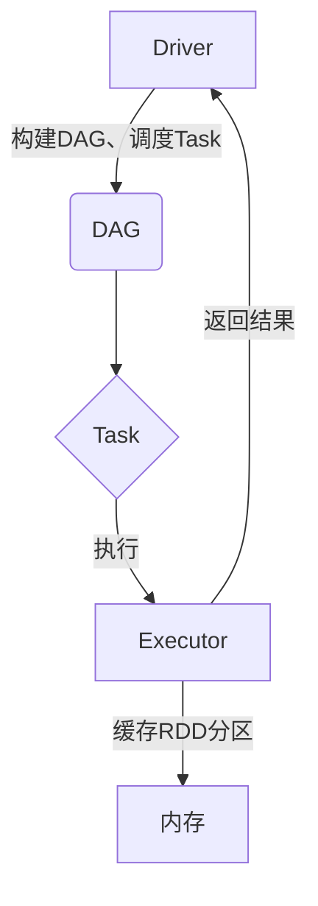

# Spark内存计算引擎原理与代码实例讲解

## 1.背景介绍

在当今大数据时代，数据处理和分析成为了许多企业和组织的核心需求。Apache Spark作为一种快速、通用的大数据处理引擎,凭借其内存计算优势和高度容错性,在各行各业中得到了广泛应用。Spark内存计算引擎是其核心组件之一,它通过高效利用集群内存资源,大幅提升了数据处理的性能和吞吐量。

## 2.核心概念与联系

### 2.1 RDD (Resilient Distributed Dataset)

RDD是Spark内存计算引擎的基础数据结构,代表一个不可变、分区的数据集合。它可以存储在内存或磁盘上,并支持并行操作。RDD提供了丰富的转换(transformation)和行动(action)操作,使得数据处理变得高效和灵活。

### 2.2 DAG (Directed Acyclic Graph)

DAG是Spark内存计算的执行模型。当用户触发一个行动操作时,Spark会根据RDD的血统关系构建一个DAG,描述了完成该操作所需的全部转换步骤。DAG的每个节点代表一个RDD分区,边表示转换操作。

### 2.3 Task

Task是Spark内存计算的基本执行单元。每个Task负责计算DAG中的一个分区,并生成相应的结果分区。Task由Executor在集群节点上执行。

### 2.4 Executor

Executor是Spark内存计算的执行器,运行在集群的工作节点上。它负责管理和执行分配给该节点的Task,并将结果返回给Driver。Executor还负责缓存RDD分区,以支持内存计算。

### 2.5 Driver

Driver是Spark内存计算的驱动器,运行在集群的主节点上。它负责构建DAG、调度Task、收集结果和与外部系统交互。Driver还负责管理Executor的生命周期。



## 3.核心算法原理具体操作步骤

Spark内存计算引擎的核心算法原理可以概括为以下几个步骤:

1. **创建RDD**

   用户可以从外部数据源(如HDFS、Hive等)创建初始RDD,或通过对现有RDD进行转换操作生成新的RDD。

2. **构建DAG**

   当用户触发一个行动操作时,Spark会根据RDD的血统关系构建一个DAG,描述了完成该操作所需的全部转换步骤。

3. **Task分配**

   Spark的DAGScheduler将DAG分解为多个Stage,每个Stage包含一组并行Task。这些Task将被分配给不同的Executor执行。

4. **Task执行**

   Executor上的Task运行时,会从内存或磁盘读取所需的RDD分区,执行相应的计算逻辑,并生成新的RDD分区。如果内存资源充足,新生成的RDD分区将被缓存在Executor的内存中,以支持后续计算。

5. **结果收集**

   所有Task执行完毕后,Driver将从不同的Executor收集最终结果,并返回给用户或写入外部数据源。

6. **容错机制**

   如果某个Task失败,Spark会根据RDD的血统关系重新计算丢失的RDD分区。如果某个Executor失败,Spark会在其他工作节点上重新启动Executor并重新分配Task。

通过以上步骤,Spark内存计算引擎可以高效地利用集群内存资源,实现快速的数据处理和分析。

## 4.数学模型和公式详细讲解举例说明

在Spark内存计算引擎中,有一些重要的数学模型和公式用于优化性能和资源利用。

### 4.1 数据分区策略

Spark采用基于范围或基于哈希的数据分区策略,以实现数据的均匀分布和高效并行计算。

对于基于范围的分区,我们可以使用以下公式计算分区边界:

$$
boundary_i = min + (max - min) \times \frac{i}{numPartitions}
$$

其中,`min`和`max`分别表示数据的最小值和最大值,`i`是分区索引(从0开始),`numPartitions`是分区数量。

对于基于哈希的分区,我们可以使用以下公式计算数据的分区索引:

$$
partitionId = hashFunction(key) \bmod numPartitions
$$

其中,`hashFunction`是一个哈希函数(如murmur3),`key`是数据的键值,`numPartitions`是分区数量。

### 4.2 内存管理

Spark采用统一的内存管理策略,将Executor的内存分为三个区域:执行内存、存储内存和保留内存。执行内存用于运行Task和存储中间结果,存储内存用于缓存RDD分区,保留内存作为内存不足时的安全区域。

我们可以使用以下公式计算每个区域的内存大小:

$$
executionMemory = memoryFraction \times executorMemory \\
storageMemory = storageMemoryFraction \times executorMemory \\
reservedMemory = reservedMemoryFraction \times executorMemory
$$

其中,`memoryFraction`、`storageMemoryFraction`和`reservedMemoryFraction`是用户可配置的比例参数,`executorMemory`是Executor的总内存大小。

### 4.3 数据局部性

Spark内存计算引擎通过数据局部性原则来减少数据传输,提高计算效率。我们可以使用以下公式计算数据局部性得分:

$$
localityScore = \sum_{i=0}^{n} \frac{data_i}{totalData} \times weight_i
$$

其中,`n`是数据位置级别的数量(如PROCESS_LOCAL、NODE_LOCAL等),`data_i`是第`i`级别的数据大小,`totalData`是总数据大小,`weight_i`是第`i`级别的权重。

通过最大化数据局部性得分,Spark可以尽可能将Task调度到存储所需数据的节点上,减少数据传输开销。

以上是Spark内存计算引擎中一些重要的数学模型和公式,它们为提高计算效率和资源利用率提供了理论基础。

## 5.项目实践:代码实例和详细解释说明

为了更好地理解Spark内存计算引擎的原理,我们将通过一个实际项目案例来演示其核心功能和API使用。在这个案例中,我们将使用Spark对一组日志文件进行处理和分析。

### 5.1 创建SparkContext

首先,我们需要创建一个`SparkContext`对象,作为与Spark集群交互的入口点。

```scala
import org.apache.spark.SparkContext
import org.apache.spark.SparkConf

val conf = new SparkConf().setAppName("LogAnalysis")
val sc = new SparkContext(conf)
```

### 5.2 加载数据

接下来,我们从HDFS上加载日志文件,创建一个初始RDD。

```scala
val logData = sc.textFile("hdfs://namenode:8020/logs/access.log")
```

### 5.3 数据转换

我们可以对初始RDD进行一系列转换操作,以提取所需的信息。

```scala
val parsedLogData = logData.map(parseLog)
val ipStats = parsedLogData.map(log => (log.ip, 1)).reduceByKey(_ + _)
val topIPs = ipStats.top(10)(Ordering.by(_._2))
```

在上面的代码中,我们首先使用`map`操作将每一行日志解析为一个`LogEntry`对象。然后,我们统计每个IP地址出现的次数,并使用`reduceByKey`操作进行聚合。最后,我们使用`top`操作获取出现次数最多的前10个IP地址。

### 5.4 行动操作和结果收集

最后,我们触发一个行动操作,将结果收集到Driver端并打印出来。

```scala
topIPs.foreach(println)
```

输出结果可能如下所示:

```
(192.168.1.100,5678)
(192.168.1.101,4321)
(192.168.1.102,3456)
...
```

### 5.5 代码解释

在上面的示例代码中,我们使用了Spark RDD的几个核心API:

- `textFile`: 从HDFS或其他存储系统创建初始RDD。
- `map`: 对RDD中的每个元素应用一个函数,生成新的RDD。
- `reduceByKey`: 对具有相同键的值进行聚合操作。
- `top`: 获取RDD中前N个最大/最小值。
- `foreach`: 对RDD中的每个元素执行一个操作,通常用于触发行动操作和结果收集。

这些API展示了Spark内存计算引擎的灵活性和易用性,使得开发者可以轻松地进行各种数据处理和分析任务。

## 6.实际应用场景

Spark内存计算引擎凭借其高性能和通用性,在各个领域都有广泛的应用场景。

### 6.1 大数据处理

Spark可以高效地处理来自不同数据源(如HDFS、Hive、Kafka等)的海量数据,支持批处理和流处理两种模式。它常被用于日志分析、网络爬虫、推荐系统等大数据应用。

### 6.2 机器学习

Spark提供了MLlib库,集成了多种机器学习算法,如分类、聚类、协同过滤等。开发者可以利用Spark的内存计算能力,快速训练和评估机器学习模型。

### 6.3 图计算

GraphX是Spark中用于图计算的组件,支持图并行化和图算法的内存计算。它可以应用于社交网络分析、网页排名、交通路线规划等场景。

### 6.4 流式计算

Spark Streaming可以实时处理来自Kafka、Flume等数据源的流式数据,支持窗口操作、状态维护等高级功能。它适用于实时日志监控、网络安全等领域。

### 6.5 交互式分析

Spark SQL提供了一个基于Spark的分布式SQL查询引擎,支持结构化和半结构化数据的查询和分析。它可以与BI工具集成,用于交互式数据探索和可视化。

## 7.工具和资源推荐

为了更好地学习和使用Spark内存计算引擎,以下是一些推荐的工具和资源:

### 7.1 Apache Spark官方网站

Apache Spark官方网站(https://spark.apache.org/)提供了丰富的文档资源,包括入门指南、编程指南、API参考等。这是学习Spark的权威资料来源。

### 7.2 Spark编程指南

《Spark编程指南》(Learning Spark)是一本优秀的Spark入门书籍,全面介绍了Spark的核心概念、API使用和实践案例。

### 7.3 Databricks Community Edition

Databricks Community Edition是一个基于云的Spark学习和实验环境,提供了交互式笔记本和集群资源。它非常适合初学者快速上手Spark。

### 7.4 Spark Summit

Spark Summit是Apache Spark社区每年举办的大会,汇集了来自世界各地的Spark专家和爱好者。会议视频和幻灯片是宝贵的学习资源。

### 7.5 Spark用户邮件列表

加入Spark用户邮件列表(user@spark.apache.org)可以与Spark社区保持密切联系,获取最新动态和解决方案。

### 7.6 开源项目

GitHub上有许多优秀的开源Spark项目,如Spark MLlib、Spark Streaming等。研究这些项目的源代码,是深入理解Spark内部原理的好方法。

## 8.总结:未来发展趋势与挑战

Spark内存计算引擎为大数据处理和分析带来了革命性的变化,但它仍然面临一些挑战和发展方向。

### 8.1 内存管理优化

虽然Spark已经提供了统一的内存管理策略,但在处理超大数据集时,内存利用率和垃圾回收仍然是需要优化的领域。未来可能会引入更智能的内存管理机制,提高资源利用效率。

### 8.2 AI和机器学习集成

随着人工智能和机器学习技术的快速发展,Spark需要进一步加强对这些领域的支持。未来可能会看到Spark与深度学习框架(如TensorFlow、PyTorch)的更紧密集成。

### 8.3 流式处理优化

虽然Spark Streaming已经提供了强大的流式处理能力,但在低延迟和高吞吐量方面仍有改进空间。未来可能会采用新的流式处理模型和算法,以满足实时数据处理的